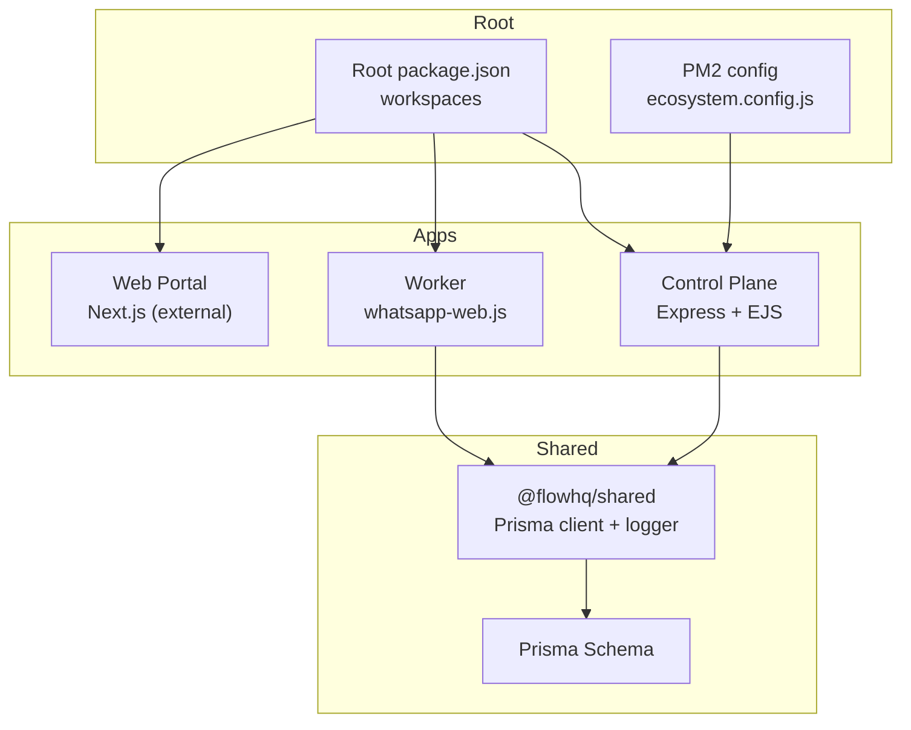
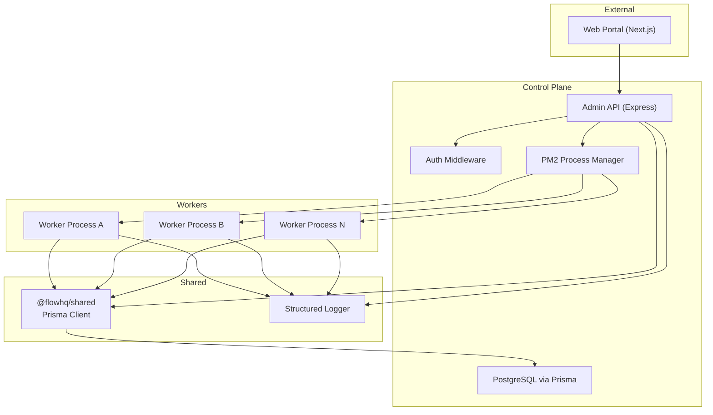
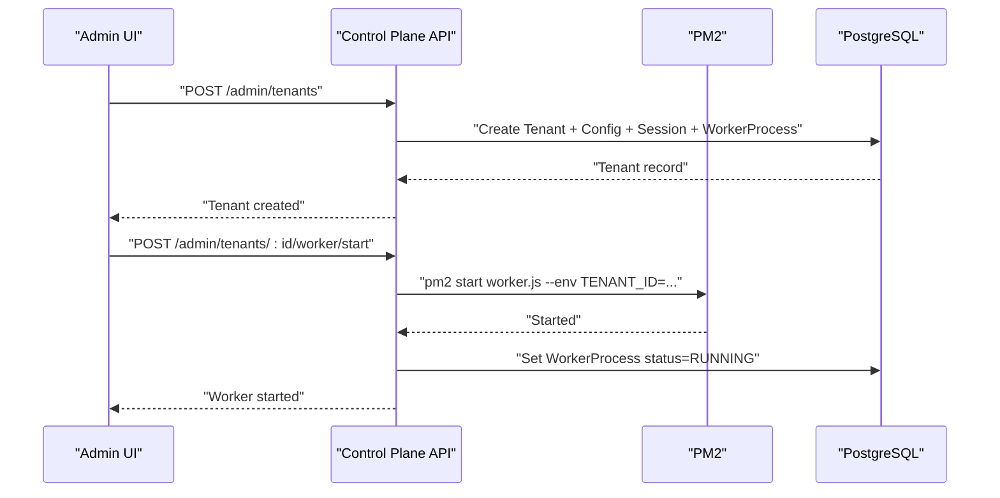
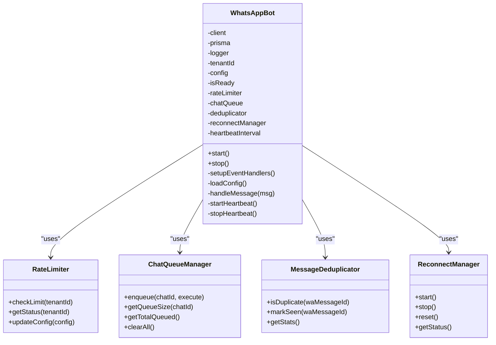
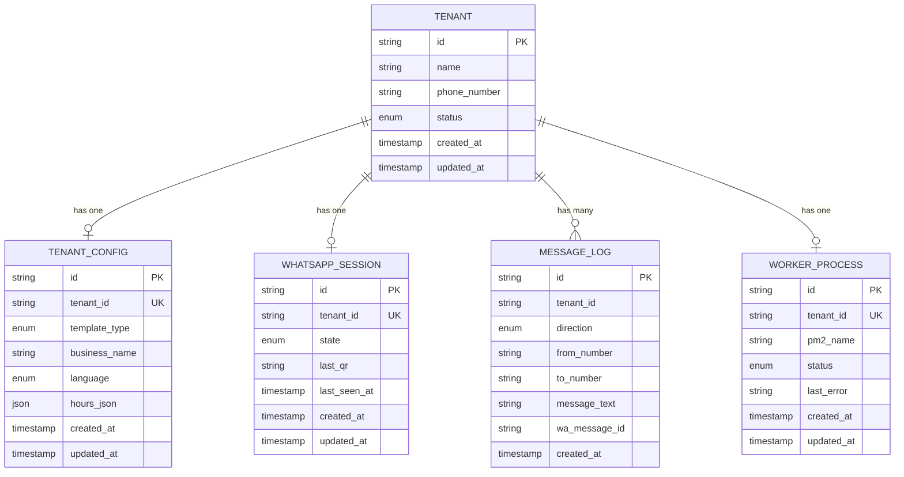
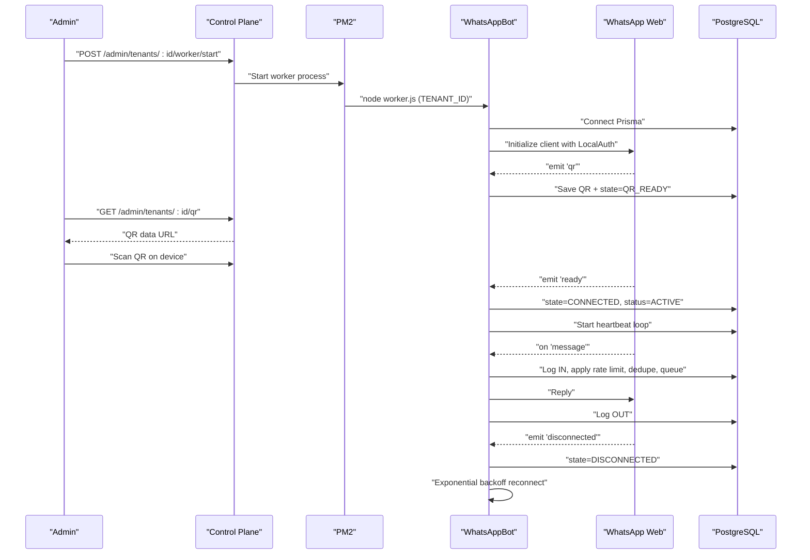
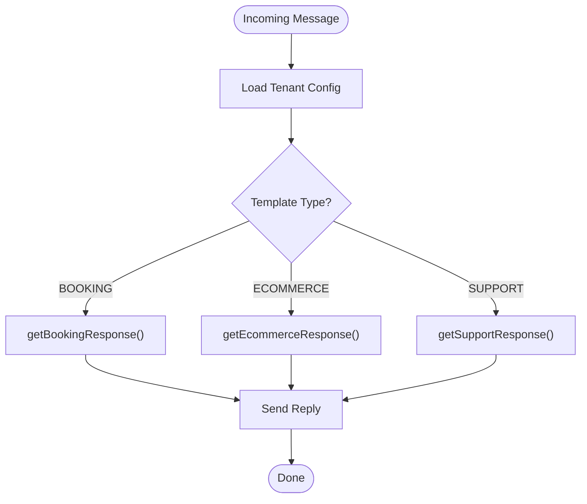
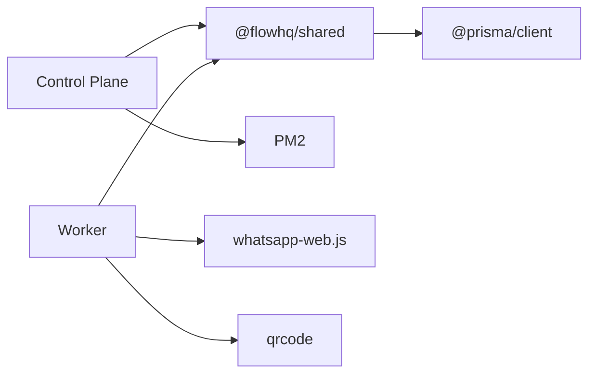

# System Architecture

<cite>
**Referenced Files in This Document**
- [package.json](file://package.json)
- [ecosystem.config.js](file://ecosystem.config.js)
- [README.md](file://README.md)
- [apps/control-plane/src/server.ts](file://apps/control-plane/src/server.ts)
- [apps/control-plane/src/routes/admin.ts](file://apps/control-plane/src/routes/admin.ts)
- [apps/control-plane/src/middleware/auth.ts](file://apps/control-plane/src/middleware/auth.ts)
- [apps/worker/src/worker.ts](file://apps/worker/src/worker.ts)
- [apps/worker/src/bot.ts](file://apps/worker/src/bot.ts)
- [apps/worker/src/templates/index.ts](file://apps/worker/src/templates/index.ts)
- [apps/worker/src/templates/booking.ts](file://apps/worker/src/templates/booking.ts)
- [apps/worker/src/utils/rate-limiter.ts](file://apps/worker/src/utils/rate-limiter.ts)
- [apps/worker/src/utils/chat-queue.ts](file://apps/worker/src/utils/chat-queue.ts)
- [apps/worker/src/utils/dedup.ts](file://apps/worker/src/utils/dedup.ts)
- [apps/worker/src/utils/reconnect.ts](file://apps/worker/src/utils/reconnect.ts)
- [packages/shared/src/index.ts](file://packages/shared/src/index.ts)
- [packages/shared/src/prisma/schema.prisma](file://packages/shared/src/prisma/schema.prisma)
- [packages/shared/src/utils/logger.ts](file://packages/shared/src/utils/logger.ts)
</cite>

## Table of Contents
1. [Introduction](#introduction)
2. [Project Structure](#project-structure)
3. [Core Components](#core-components)
4. [Architecture Overview](#architecture-overview)
5. [Detailed Component Analysis](#detailed-component-analysis)
6. [Dependency Analysis](#dependency-analysis)
7. [Performance Considerations](#performance-considerations)
8. [Troubleshooting Guide](#troubleshooting-guide)
9. [Conclusion](#conclusion)
10. [Appendices](#appendices)

## Introduction
This document describes the Flow HQ system architecture, a multi-tenant WhatsApp chatbot platform. The system consists of three main components:
- Control Plane: Admin API and dashboard (Express + EJS)
- Worker: Per-tenant WhatsApp automation powered by whatsapp-web.js
- Shared: Common utilities, Prisma client, and type definitions

It explains how tenant creation triggers per-tenant worker processes, how WhatsApp Web integration works, and how multi-tenant isolation is enforced. It also covers infrastructure requirements, scalability considerations, deployment topology, and cross-cutting concerns such as security, monitoring, and maintenance.

## Project Structure
The repository follows a monorepo workspace layout with three applications and a shared package:
- apps/control-plane: Admin API and dashboard
- apps/worker: Per-tenant WhatsApp automation
- apps/web: Next.js portal (not part of the core system described here)
- packages/shared: Prisma schema, client, and shared utilities

**Diagram sources**
- [package.json](file://package.json#L5-L8)
- [ecosystem.config.js](file://ecosystem.config.js#L1-L19)
- [apps/control-plane/src/server.ts](file://apps/control-plane/src/server.ts#L1-L15)
- [apps/worker/src/worker.ts](file://apps/worker/src/worker.ts#L1-L10)
- [packages/shared/src/index.ts](file://packages/shared/src/index.ts#L1-L4)
- [packages/shared/src/prisma/schema.prisma](file://packages/shared/src/prisma/schema.prisma#L1-L20)

**Section sources**
- [package.json](file://package.json#L5-L8)
- [README.md](file://README.md#L116-L129)

## Core Components
- Control Plane
  - Exposes admin endpoints for tenant lifecycle and worker management
  - Validates environment and database connectivity
  - Starts periodic stale worker checks
  - Uses PM2 to spawn per-tenant worker processes
- Worker
  - Runs whatsapp-web.js with LocalAuth per tenant
  - Implements rate limiting, per-chat queuing, deduplication, and reconnect logic
  - Sends periodic heartbeats to keep tenant status healthy
- Shared
  - Provides Prisma client and generated types
  - Supplies a structured logger with tenant-scoped log files

Key responsibilities:
- Multi-tenant isolation via separate worker processes and session directories
- Stable WhatsApp Web integration with exponential backoff and heartbeat monitoring
- Centralized admin controls for provisioning, monitoring, and remediation

**Section sources**
- [apps/control-plane/src/server.ts](file://apps/control-plane/src/server.ts#L16-L39)
- [apps/control-plane/src/routes/admin.ts](file://apps/control-plane/src/routes/admin.ts#L174-L230)
- [apps/worker/src/bot.ts](file://apps/worker/src/bot.ts#L27-L75)
- [packages/shared/src/index.ts](file://packages/shared/src/index.ts#L1-L4)

## Architecture Overview
High-level system context:
- Web Portal (Next.js) interacts with the Control Plane via authenticated APIs
- Control Plane manages tenants, worker lifecycle, and exposes admin dashboards
- Workers run per tenant, connecting to WhatsApp Web and processing messages
- Shared package provides Prisma client and logging utilities
- Database stores tenant metadata, configs, session states, message logs, and worker process records

**Diagram sources**
- [apps/control-plane/src/server.ts](file://apps/control-plane/src/server.ts#L1-L15)
- [apps/control-plane/src/middleware/auth.ts](file://apps/control-plane/src/middleware/auth.ts#L1-L29)
- [apps/control-plane/src/routes/admin.ts](file://apps/control-plane/src/routes/admin.ts#L174-L230)
- [apps/worker/src/worker.ts](file://apps/worker/src/worker.ts#L1-L10)
- [packages/shared/src/index.ts](file://packages/shared/src/index.ts#L1-L4)
- [packages/shared/src/prisma/schema.prisma](file://packages/shared/src/prisma/schema.prisma#L60-L131)

## Detailed Component Analysis

### Control Plane: Admin API and Dashboard
Responsibilities:
- Tenant management: create, list, detail
- Worker lifecycle: start, stop, restart, force-restart
- QR retrieval and message logs
- Stale worker detection and remediation
- Authentication via admin password (Basic Auth or query parameter)

Security and operational highlights:
- Admin password validation via middleware
- PM2 process orchestration for per-tenant workers
- Heartbeat-driven stale worker detection

**Diagram sources**
- [apps/control-plane/src/routes/admin.ts](file://apps/control-plane/src/routes/admin.ts#L104-L140)
- [apps/control-plane/src/routes/admin.ts](file://apps/control-plane/src/routes/admin.ts#L174-L230)

**Section sources**
- [apps/control-plane/src/server.ts](file://apps/control-plane/src/server.ts#L54-L63)
- [apps/control-plane/src/middleware/auth.ts](file://apps/control-plane/src/middleware/auth.ts#L1-L29)
- [apps/control-plane/src/routes/admin.ts](file://apps/control-plane/src/routes/admin.ts#L174-L230)

### Worker: Per-Tenant WhatsApp Automation
Responsibilities:
- Initialize whatsapp-web.js with LocalAuth per tenant
- Handle QR generation, connection, disconnection, and auth failures
- Process messages with rate limiting, per-chat queuing, deduplication, and reconnect logic
- Emit heartbeats to maintain tenant status
- Persist logs and session state

**Diagram sources**
- [apps/worker/src/bot.ts](file://apps/worker/src/bot.ts#L12-L75)
- [apps/worker/src/utils/rate-limiter.ts](file://apps/worker/src/utils/rate-limiter.ts#L17-L26)
- [apps/worker/src/utils/chat-queue.ts](file://apps/worker/src/utils/chat-queue.ts#L21-L29)
- [apps/worker/src/utils/dedup.ts](file://apps/worker/src/utils/dedup.ts#L11-L19)
- [apps/worker/src/utils/reconnect.ts](file://apps/worker/src/utils/reconnect.ts#L14-L39)

**Section sources**
- [apps/worker/src/worker.ts](file://apps/worker/src/worker.ts#L1-L46)
- [apps/worker/src/bot.ts](file://apps/worker/src/bot.ts#L77-L210)
- [apps/worker/src/utils/rate-limiter.ts](file://apps/worker/src/utils/rate-limiter.ts#L32-L73)
- [apps/worker/src/utils/chat-queue.ts](file://apps/worker/src/utils/chat-queue.ts#L35-L68)
- [apps/worker/src/utils/dedup.ts](file://apps/worker/src/utils/dedup.ts#L28-L46)
- [apps/worker/src/utils/reconnect.ts](file://apps/worker/src/utils/reconnect.ts#L44-L52)

### Data Model and Multi-Tenant Isolation
The Prisma schema defines core entities and their relationships. Multi-tenant isolation is achieved by:
- Unique per-tenant worker process records
- Per-tenant WhatsApp session state and logs
- Separate session directories per tenant
- Per-tenant rate limiting and chat queues in-memory

**Diagram sources**
- [packages/shared/src/prisma/schema.prisma](file://packages/shared/src/prisma/schema.prisma#L60-L131)

**Section sources**
- [packages/shared/src/prisma/schema.prisma](file://packages/shared/src/prisma/schema.prisma#L10-L50)
- [packages/shared/src/prisma/schema.prisma](file://packages/shared/src/prisma/schema.prisma#L105-L131)

### WhatsApp Web Integration Flow
End-to-end flow from tenant creation to active messaging:
- Tenant created with default status and associated records
- Admin starts worker via Control Plane
- Worker initializes whatsapp-web.js with LocalAuth in tenant-specific session path
- QR code emitted and stored; UI displays QR to admin
- After scanning, client connects; status transitions to ACTIVE
- Heartbeat keeps last_seen_at updated; worker logs messages
- Disconnections trigger reconnect with exponential backoff

**Diagram sources**
- [apps/control-plane/src/routes/admin.ts](file://apps/control-plane/src/routes/admin.ts#L174-L230)
- [apps/worker/src/bot.ts](file://apps/worker/src/bot.ts#L77-L210)
- [apps/worker/src/bot.ts](file://apps/worker/src/bot.ts#L317-L343)

**Section sources**
- [apps/control-plane/src/routes/admin.ts](file://apps/control-plane/src/routes/admin.ts#L30-L80)
- [apps/worker/src/bot.ts](file://apps/worker/src/bot.ts#L77-L210)

### Template-Based Messaging
The worker selects a response template based on tenant configuration:
- BOOKING: booking intent detection with language-aware replies
- ECOMMERCE: product/service queries with language-aware replies
- SUPPORT: issue/help queries with language-aware replies

**Diagram sources**
- [apps/worker/src/bot.ts](file://apps/worker/src/bot.ts#L232-L295)
- [apps/worker/src/templates/index.ts](file://apps/worker/src/templates/index.ts#L9-L23)
- [apps/worker/src/templates/booking.ts](file://apps/worker/src/templates/booking.ts#L1-L22)

**Section sources**
- [apps/worker/src/templates/index.ts](file://apps/worker/src/templates/index.ts#L1-L70)
- [apps/worker/src/templates/booking.ts](file://apps/worker/src/templates/booking.ts#L1-L22)

## Dependency Analysis
Internal dependencies:
- Control Plane depends on @flowhq/shared for Prisma client and logger
- Worker depends on @flowhq/shared for Prisma client and logger
- Shared depends on @prisma/client and supplies logger factory
- Control Plane uses PM2 to spawn worker processes
- Worker uses whatsapp-web.js and QR code generation

**Diagram sources**
- [apps/control-plane/package.json](file://apps/control-plane/package.json#L9-L16)
- [apps/worker/package.json](file://apps/worker/package.json#L9-L14)
- [packages/shared/package.json](file://packages/shared/package.json#L12-L16)

**Section sources**
- [apps/control-plane/package.json](file://apps/control-plane/package.json#L9-L16)
- [apps/worker/package.json](file://apps/worker/package.json#L9-L14)
- [packages/shared/package.json](file://packages/shared/package.json#L12-L16)

## Performance Considerations
- Per-tenant worker processes scale horizontally; each tenant’s workload is isolated
- Heartbeat intervals and stale thresholds prevent resource drift
- Rate limiting prevents API throttling and reduces downstream load
- Per-chat queues serialize processing to avoid race conditions
- Deduplication avoids redundant processing under high concurrency
- Reconnect with exponential backoff reduces repeated failures

Scalability notes:
- Add more worker processes as tenants grow
- Tune rate limits and queue sizes per tenant needs
- Monitor database indexes and query patterns for message logs
- Consider horizontal scaling of Control Plane behind a reverse proxy

[No sources needed since this section provides general guidance]

## Troubleshooting Guide
Common issues and resolutions:
- QR code not appearing
  - Verify worker started and PM2 status
  - Check worker logs for the tenant ID
- Session not persisting
  - Ensure sessions directory exists and is writable
  - Confirm SESSIONS_PATH environment variable is set
- Database connection errors
  - Verify PostgreSQL is running and reachable
  - Check DATABASE_URL format
- WhatsApp Web errors
  - Ensure Chromium/Chrome is installed and PUPPETEER_EXECUTABLE_PATH is set
- Stale workers
  - Dashboard marks workers as STALE if no heartbeat for threshold minutes
  - Use Force Restart to recover

Operational commands:
- View logs: control plane logs via PM2, per-tenant logs in logs directory
- Check PM2 status and restart workers
- Database health checks via psql

**Section sources**
- [README.md](file://README.md#L185-L208)
- [README.md](file://README.md#L404-L441)
- [README.md](file://README.md#L452-L474)

## Conclusion
Flow HQ implements a robust, multi-tenant architecture with clear separation of concerns:
- Control Plane centrally orchestrates tenant lifecycle and worker management
- Workers isolate per tenant with whatsapp-web.js, ensuring resilience and stability
- Shared utilities provide consistent logging and database access
- Operational safeguards like rate limiting, deduplication, and reconnects improve reliability
- PM2 enables scalable, observable per-tenant process management

[No sources needed since this section summarizes without analyzing specific files]

## Appendices

### Infrastructure Requirements
- Node.js 18+, PostgreSQL 14+, PM2, Chromium/Chrome for whatsapp-web.js
- Reverse proxy (Nginx) recommended for production deployments
- Environment variables for database, admin password, logging, and runtime tuning

**Section sources**
- [README.md](file://README.md#L11-L16)
- [README.md](file://README.md#L260-L380)

### Deployment Topology
- Single Control Plane instance managed by PM2
- Multiple Worker processes, one per tenant
- Shared PostgreSQL database
- Optional reverse proxy and SSL termination

**Section sources**
- [ecosystem.config.js](file://ecosystem.config.js#L1-L19)
- [README.md](file://README.md#L340-L380)

### Security and Monitoring
- Admin authentication via password (Basic Auth or query parameter)
- Structured logging with tenant-scoped files
- Heartbeat and stale worker detection for health visibility
- Maintenance procedures for restarts, backups, and updates

**Section sources**
- [apps/control-plane/src/middleware/auth.ts](file://apps/control-plane/src/middleware/auth.ts#L1-L29)
- [packages/shared/src/utils/logger.ts](file://packages/shared/src/utils/logger.ts#L5-L30)
- [apps/control-plane/src/server.ts](file://apps/control-plane/src/server.ts#L54-L63)
- [README.md](file://README.md#L404-L441)