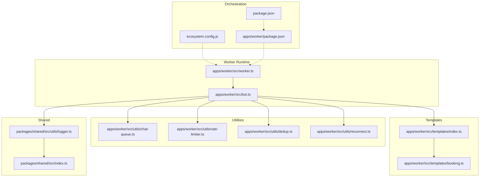
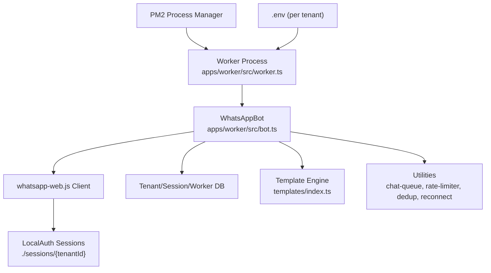
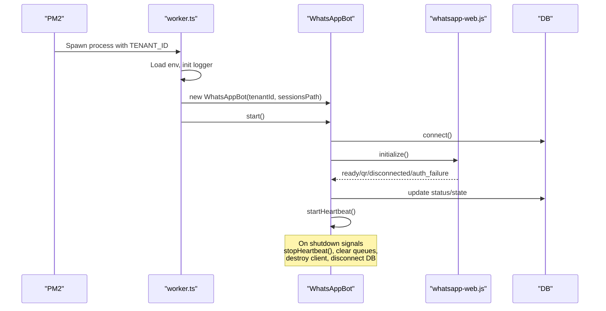
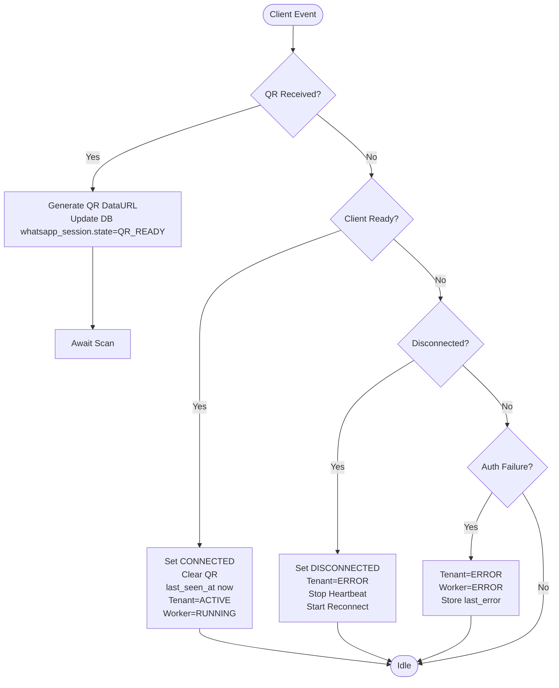
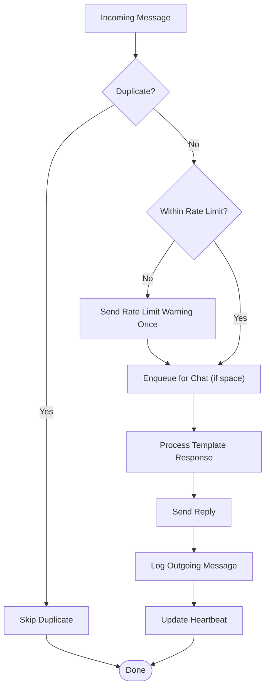
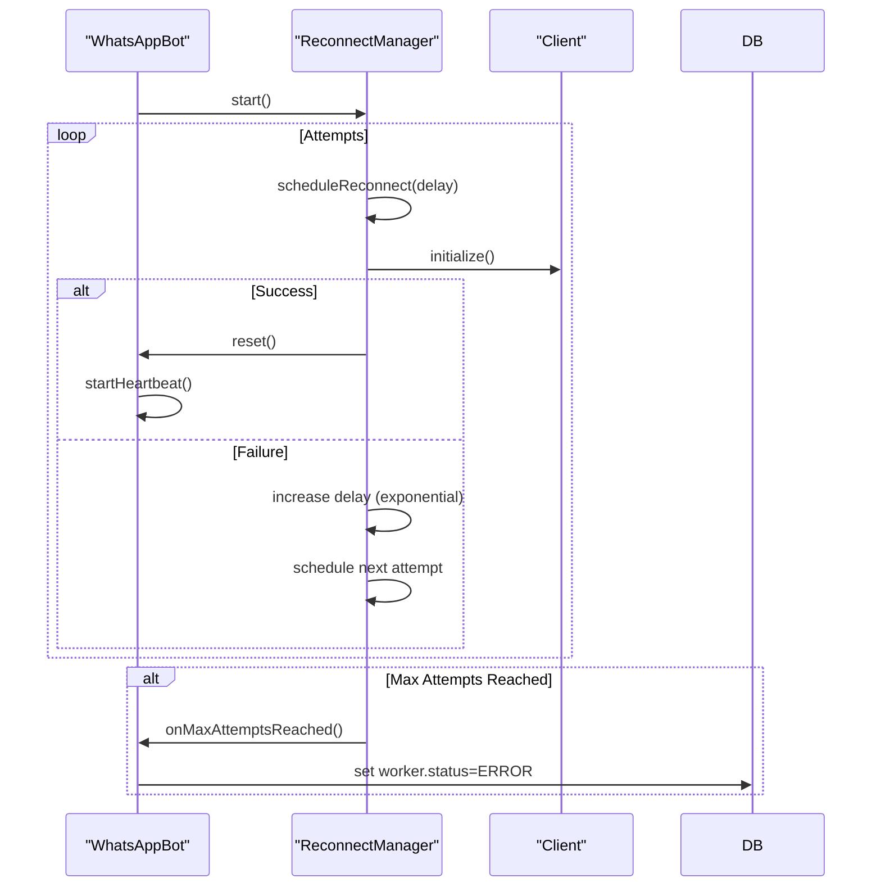
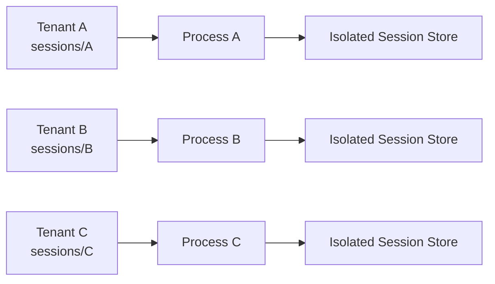
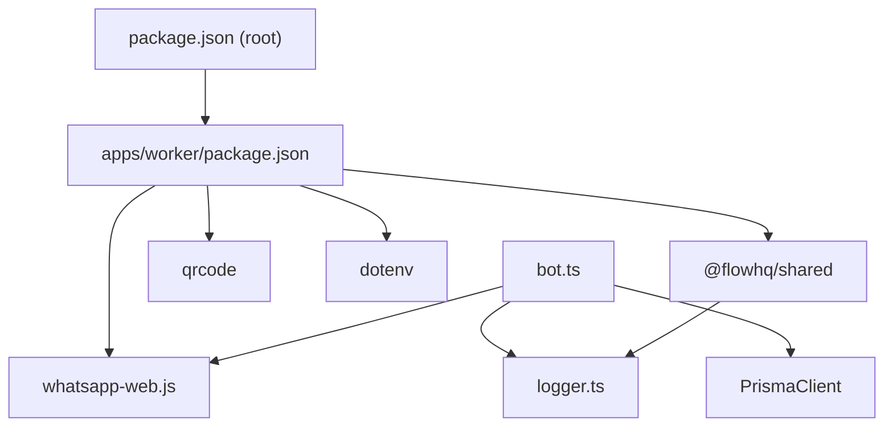

# Worker Process Architecture

<cite>
**Referenced Files in This Document**
- [worker.ts](file://apps/worker/src/worker.ts)
- [bot.ts](file://apps/worker/src/bot.ts)
- [chat-queue.ts](file://apps/worker/src/utils/chat-queue.ts)
- [rate-limiter.ts](file://apps/worker/src/utils/rate-limiter.ts)
- [dedup.ts](file://apps/worker/src/utils/dedup.ts)
- [reconnect.ts](file://apps/worker/src/utils/reconnect.ts)
- [index.ts](file://apps/worker/src/templates/index.ts)
- [booking.ts](file://apps/worker/src/templates/booking.ts)
- [ecosystem.config.js](file://ecosystem.config.js)
- [package.json](file://apps/worker/package.json)
- [logger.ts](file://packages/shared/src/utils/logger.ts)
- [shared-index.ts](file://packages/shared/src/index.ts)
- [package.json](file://package.json)
</cite>

## Table of Contents
1. [Introduction](#introduction)
2. [Project Structure](#project-structure)
3. [Core Components](#core-components)
4. [Architecture Overview](#architecture-overview)
5. [Detailed Component Analysis](#detailed-component-analysis)
6. [Dependency Analysis](#dependency-analysis)
7. [Performance Considerations](#performance-considerations)
8. [Troubleshooting Guide](#troubleshooting-guide)
9. [Conclusion](#conclusion)
10. [Appendices](#appendices)

## Introduction
This document describes the Worker Process system responsible for managing per-tenant WhatsApp automation using whatsapp-web.js. It covers process orchestration via PM2, worker lifecycle from initialization to graceful shutdown, session and QR code authentication, message processing with chat queuing, rate limiting, deduplication, heartbeat monitoring, and auto-recovery mechanisms. It also explains tenant isolation, resource allocation, and operational best practices.

## Project Structure
The worker is implemented as a TypeScript application under apps/worker. The runtime entry point initializes a per-tenant WhatsAppBot, which manages the WhatsApp client, event handlers, and auxiliary systems for reliability and performance.

**Diagram sources**
- [worker.ts](file://apps/worker/src/worker.ts#L1-L46)
- [bot.ts](file://apps/worker/src/bot.ts#L1-L411)
- [chat-queue.ts](file://apps/worker/src/utils/chat-queue.ts#L1-L140)
- [rate-limiter.ts](file://apps/worker/src/utils/rate-limiter.ts#L1-L110)
- [dedup.ts](file://apps/worker/src/utils/dedup.ts#L1-L93)
- [reconnect.ts](file://apps/worker/src/utils/reconnect.ts#L1-L117)
- [index.ts](file://apps/worker/src/templates/index.ts#L1-L70)
- [booking.ts](file://apps/worker/src/templates/booking.ts#L1-L22)
- [logger.ts](file://packages/shared/src/utils/logger.ts#L1-L33)
- [shared-index.ts](file://packages/shared/src/index.ts#L1-L4)
- [ecosystem.config.js](file://ecosystem.config.js#L1-L19)
- [package.json](file://apps/worker/package.json#L1-L22)
- [package.json](file://package.json#L1-L21)

**Section sources**
- [worker.ts](file://apps/worker/src/worker.ts#L1-L46)
- [package.json](file://apps/worker/package.json#L1-L22)
- [ecosystem.config.js](file://ecosystem.config.js#L1-L19)
- [package.json](file://package.json#L1-L21)

## Core Components
- Per-tenant worker entrypoint: Initializes logging, validates tenant context, constructs WhatsAppBot, starts it, and registers signal handlers for graceful shutdown and error capture.
- WhatsAppBot: Orchestrates the WhatsApp client lifecycle, event handling, session persistence, template-driven responses, rate limiting, chat queuing, deduplication, reconnection, and heartbeat monitoring.
- ChatQueueManager: Ensures sequential processing per chat to avoid race conditions and concurrency issues.
- RateLimiter: Enforces per-tenant reply rate limits with configurable windows.
- MessageDeduplicator: Prevents processing duplicate messages using message IDs.
- ReconnectManager: Implements exponential backoff for automatic reconnection with max attempts.
- Templates: Selects and generates responses based on tenant configuration (booking, ecommerce, support).
- Shared Logger: Provides structured logging with optional per-tenant log files.

**Section sources**
- [worker.ts](file://apps/worker/src/worker.ts#L1-L46)
- [bot.ts](file://apps/worker/src/bot.ts#L1-L411)
- [chat-queue.ts](file://apps/worker/src/utils/chat-queue.ts#L1-L140)
- [rate-limiter.ts](file://apps/worker/src/utils/rate-limiter.ts#L1-L110)
- [dedup.ts](file://apps/worker/src/utils/dedup.ts#L1-L93)
- [reconnect.ts](file://apps/worker/src/utils/reconnect.ts#L1-L117)
- [index.ts](file://apps/worker/src/templates/index.ts#L1-L70)
- [logger.ts](file://packages/shared/src/utils/logger.ts#L1-L33)

## Architecture Overview
The system runs one worker process per tenant. PM2 manages process instances, environment variables, and restart policies. Each worker loads tenant-specific configuration, persists sessions locally, and communicates with a central database to report status and log events.

**Diagram sources**
- [worker.ts](file://apps/worker/src/worker.ts#L1-L46)
- [bot.ts](file://apps/worker/src/bot.ts#L1-L411)
- [ecosystem.config.js](file://ecosystem.config.js#L1-L19)

## Detailed Component Analysis

### Worker Lifecycle and Orchestration
- Initialization: Loads environment, validates TENANT_ID, creates tenant-scoped logger, instantiates WhatsAppBot, and calls start().
- Startup: Connects to database, loads tenant config, initializes the WhatsApp client with LocalAuth and headless browser options.
- Event-driven operation: Listens for QR, ready, message, disconnected, and auth_failure events; updates DB state accordingly; starts heartbeat.
- Graceful shutdown: On SIGTERM/SIGINT, stops heartbeat, cancels reconnect, clears queues, destroys client, disconnects DB.
- Error boundaries: Catches uncaught exceptions and unhandled rejections; logs and exits to trigger PM2 restart.

**Diagram sources**
- [worker.ts](file://apps/worker/src/worker.ts#L1-L46)
- [bot.ts](file://apps/worker/src/bot.ts#L369-L409)

**Section sources**
- [worker.ts](file://apps/worker/src/worker.ts#L1-L46)
- [bot.ts](file://apps/worker/src/bot.ts#L369-L409)

### Session Management and QR Authentication
- Session persistence: Uses LocalAuth with a tenant-specific dataPath under sessions/{tenantId}.
- QR generation: On receiving a QR event, converts QR string to data URL and stores it in the database for retrieval by the control plane.
- Ready state: On client ready, resets reconnect state, sets CONNECTED, clears QR, records last_seen_at, marks tenant ACTIVE, and updates worker status RUNNING.
- Disconnected: On disconnection, sets DISCONNECTED, marks tenant ERROR, stops heartbeat, and starts reconnect manager.
- Auth failure: Marks tenant and worker ERROR with a descriptive message.

**Diagram sources**
- [bot.ts](file://apps/worker/src/bot.ts#L77-L226)

**Section sources**
- [bot.ts](file://apps/worker/src/bot.ts#L58-L75)
- [bot.ts](file://apps/worker/src/bot.ts#L77-L226)

### Message Processing Pipeline
- Duplicate detection: Uses MessageDeduplicator to skip repeated message IDs.
- Rate limiting: Enforces per-tenant replies per minute; warns once per window and suppresses further replies until the next window.
- Chat queue: Sequentially processes messages per chat to ensure ordering and prevent race conditions; enforces a maximum queue size per chat.
- Template-driven responses: Selects response based on tenant template type and language.
- Logging: Logs incoming and outgoing messages to the database for audit and analytics.
- Heartbeat: Periodically updates last_seen_at and worker status for health monitoring.

**Diagram sources**
- [bot.ts](file://apps/worker/src/bot.ts#L153-L331)
- [rate-limiter.ts](file://apps/worker/src/utils/rate-limiter.ts#L32-L73)
- [chat-queue.ts](file://apps/worker/src/utils/chat-queue.ts#L35-L68)
- [dedup.ts](file://apps/worker/src/utils/dedup.ts#L28-L46)

**Section sources**
- [bot.ts](file://apps/worker/src/bot.ts#L153-L331)
- [rate-limiter.ts](file://apps/worker/src/utils/rate-limiter.ts#L1-L110)
- [chat-queue.ts](file://apps/worker/src/utils/chat-queue.ts#L1-L140)
- [dedup.ts](file://apps/worker/src/utils/dedup.ts#L1-L93)

### Auto-Recovery and Resilience
- ReconnectManager: Schedules exponential backoff attempts with configurable max attempts and delays; invokes a callback to reinitialize the client; on reaching max attempts, updates worker status to ERROR and persists the reason.
- Heartbeat: Periodic updates keep the worker alive and observable; stops on disconnect and resumes on ready.
- Graceful shutdown: Stops all subsystems and ensures resources are released.

**Diagram sources**
- [bot.ts](file://apps/worker/src/bot.ts#L37-L56)
- [reconnect.ts](file://apps/worker/src/utils/reconnect.ts#L44-L115)

**Section sources**
- [bot.ts](file://apps/worker/src/bot.ts#L37-L56)
- [reconnect.ts](file://apps/worker/src/utils/reconnect.ts#L1-L117)

### Tenant Isolation and Resource Allocation
- Per-tenant process: Each tenant runs in its own worker process with distinct environment variables and session storage.
- Session isolation: LocalAuth dataPath is scoped to sessions/{tenantId}, preventing cross-tenant session leakage.
- Memory management: Chat queues are cleaned up on shutdown; deduplicator periodically evicts stale entries; heartbeat intervals are configurable.
- Auto-recovery: PM2 restarts failed workers; reconnect manager retries connectivity; database state reflects current health.

**Diagram sources**
- [bot.ts](file://apps/worker/src/bot.ts#L58-L62)
- [worker.ts](file://apps/worker/src/worker.ts#L7-L8)

**Section sources**
- [bot.ts](file://apps/worker/src/bot.ts#L58-L62)
- [worker.ts](file://apps/worker/src/worker.ts#L7-L8)

## Dependency Analysis
The worker depends on whatsapp-web.js for client operations, qrcode for QR rendering, dotenv for environment loading, and @flowhq/shared for logging and Prisma client. PM2 orchestrates process lifecycle and logging.

**Diagram sources**
- [package.json](file://apps/worker/package.json#L1-L22)
- [package.json](file://package.json#L1-L21)
- [bot.ts](file://apps/worker/src/bot.ts#L1-L11)
- [logger.ts](file://packages/shared/src/utils/logger.ts#L1-L33)

**Section sources**
- [package.json](file://apps/worker/package.json#L1-L22)
- [package.json](file://package.json#L1-L21)
- [bot.ts](file://apps/worker/src/bot.ts#L1-L11)
- [logger.ts](file://packages/shared/src/utils/logger.ts#L1-L33)

## Performance Considerations
- Concurrency control: ChatQueueManager serializes processing per chat to prevent race conditions and reduce contention.
- Rate limiting: Built-in sliding-window limiter prevents API throttling and reduces downstream penalties.
- Memory hygiene: Deduplicator maintains bounded memory with TTL and eviction; queues are cleared on shutdown.
- Browser headless mode: Headless Chromium reduces overhead; sandbox arguments improve stability.
- Heartbeat cadence: Configurable interval balances health reporting frequency with CPU usage.

[No sources needed since this section provides general guidance]

## Troubleshooting Guide
- QR not appearing: Verify QR event handler updates the database and that the control plane retrieves the latest QR image URL.
- Frequent disconnects: Check reconnect manager logs; confirm exponential backoff is functioning and that max attempts are not exhausted.
- Rate limit warnings: Adjust RATE_LIMIT_MAX_PER_MINUTE; ensure warning suppression behavior is desired.
- Queue full errors: Increase per-chat queue capacity or reduce message volume; consider upstream throttling.
- Heartbeat failures: Confirm database connectivity and environment variables; verify interval configuration.
- Session not persisting: Ensure sessionsPath exists and is writable; verify LocalAuth dataPath correctness.

**Section sources**
- [bot.ts](file://apps/worker/src/bot.ts#L77-L226)
- [reconnect.ts](file://apps/worker/src/utils/reconnect.ts#L87-L115)
- [rate-limiter.ts](file://apps/worker/src/utils/rate-limiter.ts#L32-L73)
- [chat-queue.ts](file://apps/worker/src/utils/chat-queue.ts#L38-L42)
- [logger.ts](file://packages/shared/src/utils/logger.ts#L1-L33)

## Conclusion
The Worker Process system provides a robust, per-tenant automation layer for WhatsApp. It combines whatsapp-web.js with PM2 orchestration, comprehensive reliability features (reconnect, heartbeat, deduplication), and operational controls (rate limiting, chat queuing, logging) to deliver scalable and resilient messaging automation across tenants.

[No sources needed since this section summarizes without analyzing specific files]

## Appendices

### Environment Variables and Configuration
- TENANT_ID: Required identifier for the tenant.
- SESSIONS_PATH: Directory for LocalAuth session storage (default: ./sessions).
- RATE_LIMIT_MAX_PER_MINUTE: Maximum replies per minute per tenant (default: 10).
- HEARTBEAT_INTERVAL_MS: Heartbeat interval in milliseconds (default: 30000).
- LOG_LEVEL: Logging verbosity (default: info).
- Additional PM2 configuration: instances, autorestart, max_memory_restart, log files.

**Section sources**
- [worker.ts](file://apps/worker/src/worker.ts#L7-L8)
- [bot.ts](file://apps/worker/src/bot.ts#L33-L34)
- [bot.ts](file://apps/worker/src/bot.ts#L333-L359)
- [logger.ts](file://packages/shared/src/utils/logger.ts#L26-L29)
- [ecosystem.config.js](file://ecosystem.config.js#L1-L19)