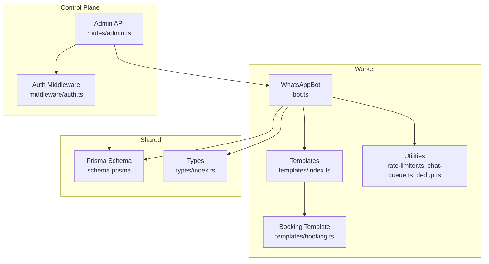
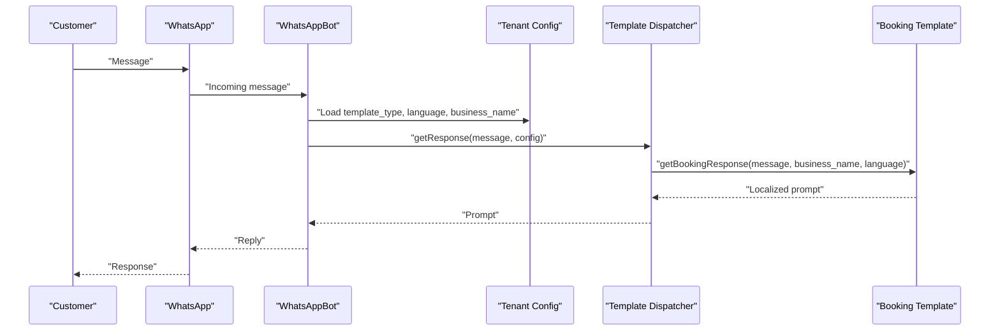
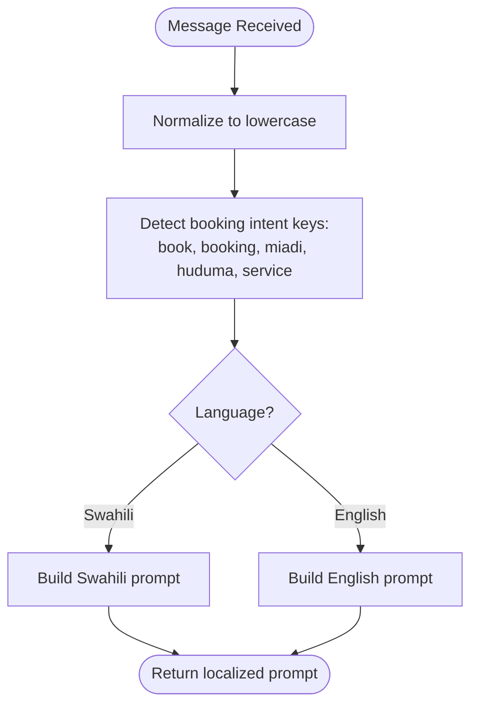
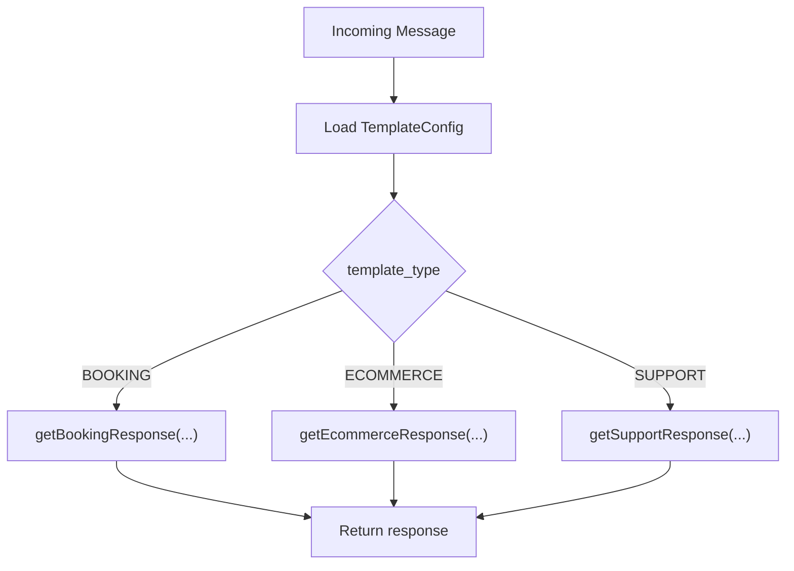
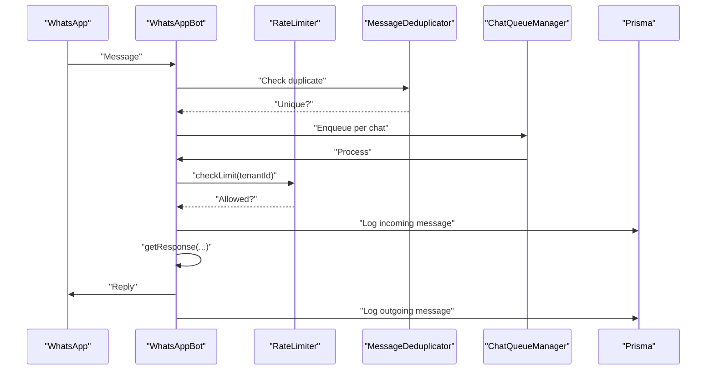
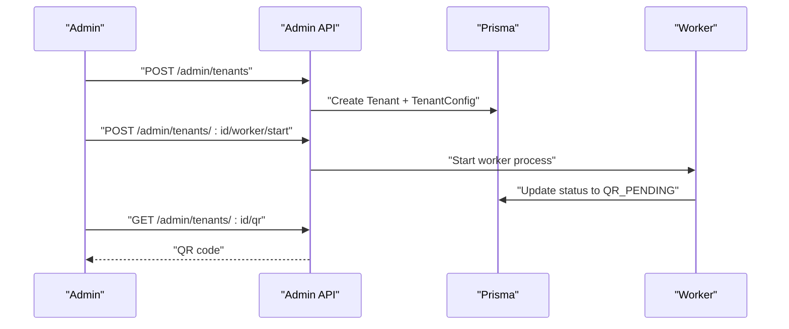
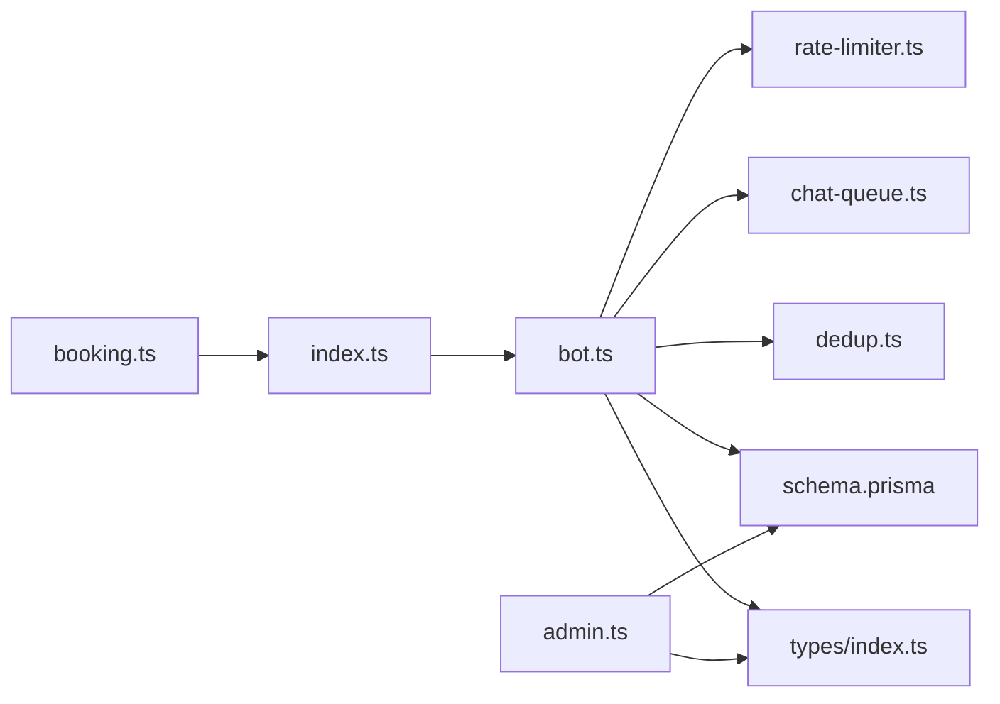

# Booking Template

<cite>
**Referenced Files in This Document**
- [booking.ts](file://apps/worker/src/templates/booking.ts)
- [index.ts](file://apps/worker/src/templates/index.ts)
- [bot.ts](file://apps/worker/src/bot.ts)
- [worker.ts](file://apps/worker/src/worker.ts)
- [schema.prisma](file://packages/shared/src/prisma/schema.prisma)
- [types/index.ts](file://packages/shared/src/types/index.ts)
- [admin.ts](file://apps/control-plane/src/routes/admin.ts)
- [auth.ts](file://apps/control-plane/src/middleware/auth.ts)
- [README.md](file://README.md)
- [rate-limiter.ts](file://apps/worker/src/utils/rate-limiter.ts)
- [chat-queue.ts](file://apps/worker/src/utils/chat-queue.ts)
- [dedup.ts](file://apps/worker/src/utils/dedup.ts)
</cite>

## Table of Contents
1. [Introduction](#introduction)
2. [Project Structure](#project-structure)
3. [Core Components](#core-components)
4. [Architecture Overview](#architecture-overview)
5. [Detailed Component Analysis](#detailed-component-analysis)
6. [Dependency Analysis](#dependency-analysis)
7. [Performance Considerations](#performance-considerations)
8. [Troubleshooting Guide](#troubleshooting-guide)
9. [Conclusion](#conclusion)
10. [Appendices](#appendices)

## Introduction
This document explains the Booking template implementation for the multi-tenant WhatsApp chatbot platform. It focuses on how the system parses customer messages to detect booking intents, generates localized automated responses in Swahili and English, and integrates with the broader system for tenant configuration, message routing, and operational safeguards. It also outlines practical booking-related message patterns, multilingual support, and customization options for different business types.

## Project Structure
The Booking template resides in the worker application and is orchestrated by the control plane’s tenant configuration and admin APIs. The worker loads tenant-specific configuration and responds to incoming messages accordingly.

**Diagram sources**
- [admin.ts](file://apps/control-plane/src/routes/admin.ts#L104-L140)
- [auth.ts](file://apps/control-plane/src/middleware/auth.ts#L1-L40)
- [bot.ts](file://apps/worker/src/bot.ts#L1-L411)
- [index.ts](file://apps/worker/src/templates/index.ts#L1-L70)
- [booking.ts](file://apps/worker/src/templates/booking.ts#L1-L22)
- [schema.prisma](file://packages/shared/src/prisma/schema.prisma#L60-L90)
- [types/index.ts](file://packages/shared/src/types/index.ts#L1-L41)

**Section sources**
- [README.md](file://README.md#L116-L129)
- [admin.ts](file://apps/control-plane/src/routes/admin.ts#L104-L140)
- [bot.ts](file://apps/worker/src/bot.ts#L1-L411)
- [index.ts](file://apps/worker/src/templates/index.ts#L1-L70)
- [booking.ts](file://apps/worker/src/templates/booking.ts#L1-L22)
- [schema.prisma](file://packages/shared/src/prisma/schema.prisma#L60-L90)
- [types/index.ts](file://packages/shared/src/types/index.ts#L1-L41)

## Core Components
- Booking template response generator: Detects booking intent and returns localized prompts for service and date input.
- Template dispatcher: Routes messages to the appropriate template based on tenant configuration.
- WhatsApp bot: Loads tenant config, processes messages, applies rate limiting, de-duplicates, and queues per chat.
- Control plane: Manages tenant creation, worker lifecycle, and exposes QR and logs.

Key responsibilities:
- Booking intent detection and multilingual prompts
- Tenant configuration-driven routing
- Operational safeguards (rate limiting, queueing, de-duplication)
- Persistence and observability via Prisma and logs

**Section sources**
- [booking.ts](file://apps/worker/src/templates/booking.ts#L1-L22)
- [index.ts](file://apps/worker/src/templates/index.ts#L9-L23)
- [bot.ts](file://apps/worker/src/bot.ts#L248-L331)
- [admin.ts](file://apps/control-plane/src/routes/admin.ts#L104-L140)

## Architecture Overview
The Booking template participates in a multi-tenant architecture where each tenant has isolated sessions, configuration, and logs. The control plane creates tenants and starts workers; the worker loads configuration and responds to messages.

**Diagram sources**
- [bot.ts](file://apps/worker/src/bot.ts#L248-L331)
- [index.ts](file://apps/worker/src/templates/index.ts#L9-L23)
- [booking.ts](file://apps/worker/src/templates/booking.ts#L1-L22)
- [schema.prisma](file://packages/shared/src/prisma/schema.prisma#L78-L90)

## Detailed Component Analysis

### Booking Template Response Logic
The booking template detects booking intent by scanning for keywords in Swahili and English and returns a prompt to provide service and date. It supports two languages with distinct prompts.

**Diagram sources**
- [booking.ts](file://apps/worker/src/templates/booking.ts#L6-L21)

**Section sources**
- [booking.ts](file://apps/worker/src/templates/booking.ts#L1-L22)

### Template Dispatcher and Routing
The dispatcher selects the template based on tenant configuration and delegates to the appropriate handler.

**Diagram sources**
- [index.ts](file://apps/worker/src/templates/index.ts#L9-L23)

**Section sources**
- [index.ts](file://apps/worker/src/templates/index.ts#L1-L70)

### WhatsApp Bot Message Processing Pipeline
The bot orchestrates message handling with rate limiting, de-duplication, per-chat queuing, and persistence.

**Diagram sources**
- [bot.ts](file://apps/worker/src/bot.ts#L153-L331)
- [rate-limiter.ts](file://apps/worker/src/utils/rate-limiter.ts#L32-L73)
- [chat-queue.ts](file://apps/worker/src/utils/chat-queue.ts#L35-L68)
- [dedup.ts](file://apps/worker/src/utils/dedup.ts#L28-L46)

**Section sources**
- [bot.ts](file://apps/worker/src/bot.ts#L153-L331)
- [rate-limiter.ts](file://apps/worker/src/utils/rate-limiter.ts#L1-L110)
- [chat-queue.ts](file://apps/worker/src/utils/chat-queue.ts#L1-L140)
- [dedup.ts](file://apps/worker/src/utils/dedup.ts#L1-L93)

### Tenant Configuration and Control Plane Integration
Tenants are created with template type, display name, and language. The control plane manages worker lifecycle and exposes QR and logs.

**Diagram sources**
- [admin.ts](file://apps/control-plane/src/routes/admin.ts#L104-L140)
- [admin.ts](file://apps/control-plane/src/routes/admin.ts#L174-L230)
- [admin.ts](file://apps/control-plane/src/routes/admin.ts#L334-L352)
- [schema.prisma](file://packages/shared/src/prisma/schema.prisma#L60-L90)

**Section sources**
- [admin.ts](file://apps/control-plane/src/routes/admin.ts#L104-L140)
- [admin.ts](file://apps/control-plane/src/routes/admin.ts#L174-L230)
- [admin.ts](file://apps/control-plane/src/routes/admin.ts#L334-L352)
- [schema.prisma](file://packages/shared/src/prisma/schema.prisma#L60-L90)

## Dependency Analysis
- Template dispatcher depends on the booking template module.
- WhatsApp bot depends on template dispatcher and utilities.
- Control plane depends on Prisma schema and worker lifecycle.
- Shared types and schema define tenant configuration and enums.

**Diagram sources**
- [booking.ts](file://apps/worker/src/templates/booking.ts#L1-L22)
- [index.ts](file://apps/worker/src/templates/index.ts#L1-L70)
- [bot.ts](file://apps/worker/src/bot.ts#L1-L411)
- [rate-limiter.ts](file://apps/worker/src/utils/rate-limiter.ts#L1-L110)
- [chat-queue.ts](file://apps/worker/src/utils/chat-queue.ts#L1-L140)
- [dedup.ts](file://apps/worker/src/utils/dedup.ts#L1-L93)
- [schema.prisma](file://packages/shared/src/prisma/schema.prisma#L60-L90)
- [types/index.ts](file://packages/shared/src/types/index.ts#L1-L41)
- [admin.ts](file://apps/control-plane/src/routes/admin.ts#L104-L140)

**Section sources**
- [booking.ts](file://apps/worker/src/templates/booking.ts#L1-L22)
- [index.ts](file://apps/worker/src/templates/index.ts#L1-L70)
- [bot.ts](file://apps/worker/src/bot.ts#L1-L411)
- [rate-limiter.ts](file://apps/worker/src/utils/rate-limiter.ts#L1-L110)
- [chat-queue.ts](file://apps/worker/src/utils/chat-queue.ts#L1-L140)
- [dedup.ts](file://apps/worker/src/utils/dedup.ts#L1-L93)
- [schema.prisma](file://packages/shared/src/prisma/schema.prisma#L60-L90)
- [types/index.ts](file://packages/shared/src/types/index.ts#L1-L41)
- [admin.ts](file://apps/control-plane/src/routes/admin.ts#L104-L140)

## Performance Considerations
- Rate limiting: Defaults to 10 replies per minute per tenant to prevent spam and protect upstream services.
- Per-chat queue: Ensures sequential processing to avoid race conditions and inconsistent state.
- De-duplication: Prevents repeated processing of identical messages, reducing redundant replies.
- Heartbeat monitoring: Worker health is tracked; stale workers are auto-marked to maintain system reliability.

[No sources needed since this section provides general guidance]

## Troubleshooting Guide
Common issues and resolutions:
- QR code not appearing: Verify worker started, check PM2 status, and review worker logs.
- Session not persisting: Ensure sessions directory exists and is writable; confirm SESSIONS_PATH environment variable.
- Database connection errors: Verify PostgreSQL is running and DATABASE_URL format is correct.
- WhatsApp Web errors: Install Chromium/Chrome as required by whatsapp-web.js.
- Rate limit exceeded: The system warns and suppresses replies when exceeding configured limits.
- Stale workers: Auto-marked as ERROR after threshold; use Force Restart to recover.

**Section sources**
- [README.md](file://README.md#L185-L208)
- [README.md](file://README.md#L452-L474)
- [rate-limiter.ts](file://apps/worker/src/utils/rate-limiter.ts#L32-L73)

## Conclusion
The Booking template provides a robust, multilingual foundation for appointment scheduling on WhatsApp. It integrates seamlessly with tenant configuration, operational safeguards, and the control plane, enabling businesses to offer localized booking experiences with minimal setup. Extending the template to handle service selection, time slot availability, and confirmation generation would complete the end-to-end workflow.

[No sources needed since this section summarizes without analyzing specific files]

## Appendices

### Practical Booking Message Patterns
- Swahili booking intent:
  - Messages: "booking", "miadi", "huduma"
  - Prompt: Ask for service and date (e.g., "Facial, 26 Feb")
- English booking intent:
  - Messages: "book", "booking", "service"
  - Prompt: Ask for service and date (e.g., "Facial, Feb 26")

**Section sources**
- [booking.ts](file://apps/worker/src/templates/booking.ts#L6-L21)
- [README.md](file://README.md#L98-L103)

### Multilingual Support
- Language selection is driven by tenant configuration (SW or EN).
- Responses are localized for both greeting and menu prompts.

**Section sources**
- [index.ts](file://apps/worker/src/templates/index.ts#L3-L7)
- [booking.ts](file://apps/worker/src/templates/booking.ts#L9-L21)

### Customization Options for Different Business Types
- Template type: Choose BOOKING, ECOMMERCE, or SUPPORT when creating a tenant.
- Business name: Displayed in prompts to personalize the experience.
- Language: Select SW or EN for all prompts.

**Section sources**
- [admin.ts](file://apps/control-plane/src/routes/admin.ts#L104-L140)
- [schema.prisma](file://packages/shared/src/prisma/schema.prisma#L78-L88)

### Integration with Business-Specific Booking Systems
- Current implementation: Localized prompts and logging.
- Extension points:
  - Parse service and date from customer messages.
  - Integrate with external calendar or booking APIs.
  - Generate confirmation messages with booking details.

[No sources needed since this section provides conceptual guidance]