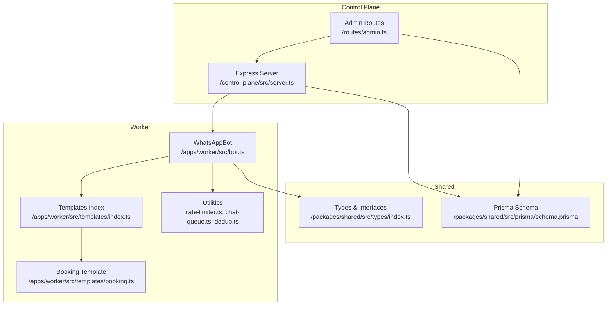
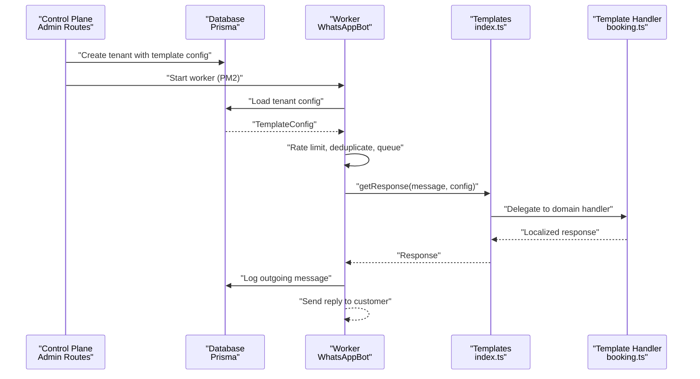
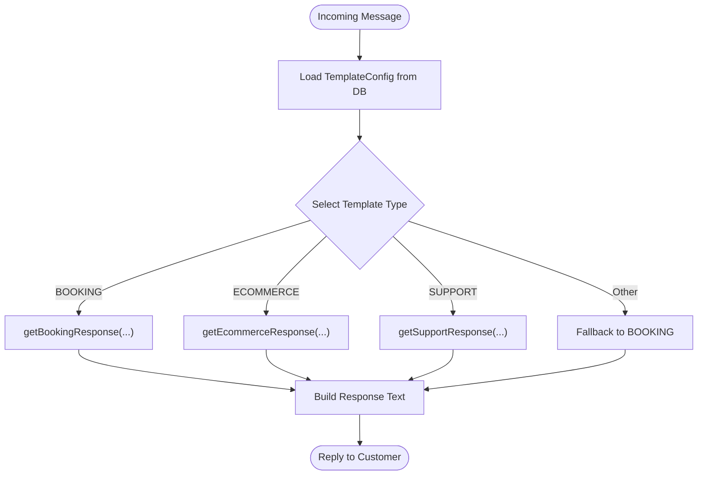
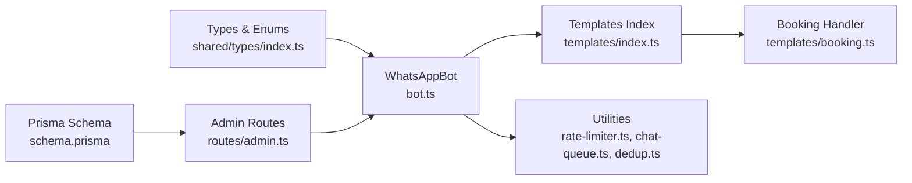
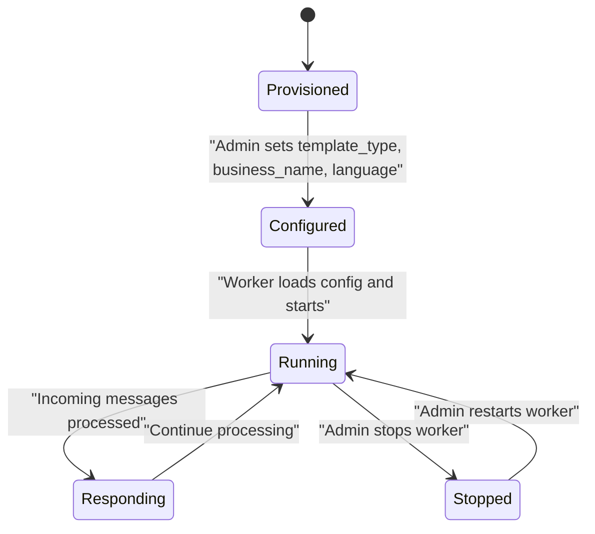

# Custom Template Development

<cite>
**Referenced Files in This Document**
- [apps/worker/src/templates/index.ts](file://apps/worker/src/templates/index.ts)
- [apps/worker/src/templates/booking.ts](file://apps/worker/src/templates/booking.ts)
- [apps/worker/src/bot.ts](file://apps/worker/src/bot.ts)
- [apps/worker/src/worker.ts](file://apps/worker/src/worker.ts)
- [packages/shared/src/types/index.ts](file://packages/shared/src/types/index.ts)
- [packages/shared/src/prisma/schema.prisma](file://packages/shared/src/prisma/schema.prisma)
- [apps/control-plane/src/routes/admin.ts](file://apps/control-plane/src/routes/admin.ts)
- [apps/control-plane/src/server.ts](file://apps/control-plane/src/server.ts)
- [apps/worker/src/utils/rate-limiter.ts](file://apps/worker/src/utils/rate-limiter.ts)
- [apps/worker/src/utils/chat-queue.ts](file://apps/worker/src/utils/chat-queue.ts)
- [apps/worker/src/utils/dedup.ts](file://apps/worker/src/utils/dedup.ts)
</cite>

## Table of Contents
1. [Introduction](#introduction)
2. [Project Structure](#project-structure)
3. [Core Components](#core-components)
4. [Architecture Overview](#architecture-overview)
5. [Detailed Component Analysis](#detailed-component-analysis)
6. [Dependency Analysis](#dependency-analysis)
7. [Performance Considerations](#performance-considerations)
8. [Troubleshooting Guide](#troubleshooting-guide)
9. [Conclusion](#conclusion)
10. [Appendices](#appendices)

## Introduction
This document explains how to develop custom template types for the messaging automation system. It covers the template extension mechanism, interface requirements for new template implementations, and integration patterns with the existing template system. You will learn how templates are registered, configured, and invoked, along with response generation patterns. Step-by-step guides show how to add new template types, implement business-specific logic, integrate with external systems, and manage multilingual support. We also address template versioning, backward compatibility, and deployment considerations.

## Project Structure
The template system spans three main areas:
- Control plane: Admin UI and APIs to configure tenants and start workers.
- Worker: The runtime that loads tenant configuration, processes incoming messages, and generates responses via templates.
- Shared: Types and Prisma schema that define the configuration contract and persistence model.

**Diagram sources**
- [apps/control-plane/src/routes/admin.ts](file://apps/control-plane/src/routes/admin.ts#L1-L528)
- [apps/control-plane/src/server.ts](file://apps/control-plane/src/server.ts#L1-L89)
- [apps/worker/src/bot.ts](file://apps/worker/src/bot.ts#L1-L411)
- [apps/worker/src/templates/index.ts](file://apps/worker/src/templates/index.ts#L1-L70)
- [apps/worker/src/templates/booking.ts](file://apps/worker/src/templates/booking.ts#L1-L22)
- [packages/shared/src/types/index.ts](file://packages/shared/src/types/index.ts#L1-L41)
- [packages/shared/src/prisma/schema.prisma](file://packages/shared/src/prisma/schema.prisma#L1-L177)

**Section sources**
- [apps/control-plane/src/routes/admin.ts](file://apps/control-plane/src/routes/admin.ts#L104-L140)
- [apps/worker/src/bot.ts](file://apps/worker/src/bot.ts#L228-L246)
- [packages/shared/src/prisma/schema.prisma](file://packages/shared/src/prisma/schema.prisma#L78-L88)

## Core Components
- Template registry and dispatcher: The templates index exports a configuration interface and a single dispatch function that selects the appropriate template handler based on the tenant’s template type.
- Template handlers: Individual modules implement business logic for specific domains (e.g., booking).
- Worker runtime: Loads tenant configuration, applies rate limiting, deduplicates messages, queues chats, and invokes the template dispatcher to generate responses.
- Control plane: Creates tenants, persists configuration, and starts/stops workers via PM2.

Key responsibilities:
- TemplateConfig defines the shape of configuration persisted per tenant.
- getResponse dispatches to domain-specific handlers.
- Template handlers receive the raw message, business name, and language, returning a localized response string.

**Section sources**
- [apps/worker/src/templates/index.ts](file://apps/worker/src/templates/index.ts#L3-L23)
- [apps/worker/src/templates/booking.ts](file://apps/worker/src/templates/booking.ts#L1-L22)
- [apps/worker/src/bot.ts](file://apps/worker/src/bot.ts#L248-L331)
- [packages/shared/src/types/index.ts](file://packages/shared/src/types/index.ts#L21-L27)

## Architecture Overview
The template system follows a modular, extensible pattern:
- Tenant configuration drives template selection.
- Incoming messages are sanitized and queued per chat.
- A rate limiter controls outbound reply frequency.
- The template dispatcher chooses the correct handler.
- Responses are logged and sent back to the customer.

**Diagram sources**
- [apps/control-plane/src/routes/admin.ts](file://apps/control-plane/src/routes/admin.ts#L104-L140)
- [apps/worker/src/bot.ts](file://apps/worker/src/bot.ts#L228-L331)
- [apps/worker/src/templates/index.ts](file://apps/worker/src/templates/index.ts#L9-L23)
- [apps/worker/src/templates/booking.ts](file://apps/worker/src/templates/booking.ts#L1-L22)

## Detailed Component Analysis

### Template Extension Mechanism
The extension mechanism centers on a single dispatch function and a configuration-driven selector:
- TemplateConfig is loaded from the tenant record and passed to getResponse.
- getResponse switches on template_type and delegates to the matching handler.
- New template types require adding a new handler module and extending the selector.

**Diagram sources**
- [apps/worker/src/bot.ts](file://apps/worker/src/bot.ts#L281-L289)
- [apps/worker/src/templates/index.ts](file://apps/worker/src/templates/index.ts#L9-L23)

**Section sources**
- [apps/worker/src/templates/index.ts](file://apps/worker/src/templates/index.ts#L3-L23)
- [apps/worker/src/bot.ts](file://apps/worker/src/bot.ts#L281-L289)

### Interface Requirements for New Template Implementations
To add a new template type:
- Define a handler function with the signature: (message: string, businessName: string, language: 'SW' | 'EN') => string.
- Export the function from a new module under templates/.
- Extend the dispatch switch in getResponse to route to your handler.
- Update the TemplateType enum and related types if introducing a new domain.

Implementation notes:
- Keep the handler pure and deterministic for the given inputs.
- Use language to tailor responses; maintain fallbacks for robustness.
- Avoid side effects; return a plain string response.

**Section sources**
- [apps/worker/src/templates/index.ts](file://apps/worker/src/templates/index.ts#L3-L23)
- [packages/shared/src/prisma/schema.prisma](file://packages/shared/src/prisma/schema.prisma#L18-L22)
- [packages/shared/src/types/index.ts](file://packages/shared/src/types/index.ts#L21-L27)

### Integration Patterns with Existing Template System
- Configuration-driven routing: The worker reads TemplateConfig and passes it to getResponse.
- Utility integration: Rate limiter, deduplicator, and chat queue are wired into message handling.
- Logging: Both incoming and outgoing messages are recorded for auditability.

Integration steps:
- Add your handler module and export the function.
- Register it in getResponse with a new case.
- Ensure your handler respects language and business_name from the config.
- Test with real messages and monitor logs.

**Section sources**
- [apps/worker/src/bot.ts](file://apps/worker/src/bot.ts#L248-L331)
- [apps/worker/src/utils/rate-limiter.ts](file://apps/worker/src/utils/rate-limiter.ts#L32-L73)
- [apps/worker/src/utils/dedup.ts](file://apps/worker/src/utils/dedup.ts#L28-L31)
- [apps/worker/src/utils/chat-queue.ts](file://apps/worker/src/utils/chat-queue.ts#L35-L68)

### Template Registration Process
Registration is implicit:
- The tenant’s template_type determines which handler is invoked.
- The control plane creates tenants with template_type, business_name, and language.
- The worker loads the config at startup and on-demand.

Operational flow:
- Admin creates a tenant with template_type and business_name.
- Worker loads config and starts processing messages.
- getResponse selects the handler based on template_type.

**Section sources**
- [apps/control-plane/src/routes/admin.ts](file://apps/control-plane/src/routes/admin.ts#L104-L140)
- [apps/worker/src/bot.ts](file://apps/worker/src/bot.ts#L228-L246)
- [apps/worker/src/templates/index.ts](file://apps/worker/src/templates/index.ts#L13-L22)

### Configuration Object Structure
The configuration object is defined by TemplateConfig and persisted in TenantConfig:
- Fields: template_type, business_name, language.
- Validation: template_type is constrained by the TemplateType enum; language is constrained by Language.

Runtime usage:
- The worker constructs a strongly-typed TemplateConfig from the database record.
- Handlers receive business_name and language to tailor responses.

**Section sources**
- [apps/worker/src/templates/index.ts](file://apps/worker/src/templates/index.ts#L3-L7)
- [packages/shared/src/prisma/schema.prisma](file://packages/shared/src/prisma/schema.prisma#L78-L88)
- [packages/shared/src/types/index.ts](file://packages/shared/src/types/index.ts#L6-L10)

### Response Generation Patterns
Response generation follows a consistent pattern:
- Normalize input (e.g., lowercase) and detect intent keywords.
- Select language-specific prompts and fallbacks.
- Compose a concise, actionable response string.

Best practices:
- Keep responses short and actionable.
- Use placeholders for dynamic values (e.g., business_name).
- Provide clear next steps or menu options.

**Section sources**
- [apps/worker/src/templates/booking.ts](file://apps/worker/src/templates/booking.ts#L6-L21)
- [apps/worker/src/templates/index.ts](file://apps/worker/src/templates/index.ts#L30-L49)

### Step-by-Step Guide: Creating a New Template Type
1. Define the handler function in a new file under templates/.
2. Export the function and ensure it matches the expected signature.
3. Extend getResponse to include a new case for your template_type.
4. Add the new template_type to the Prisma enum and types if needed.
5. Test locally by sending sample messages and verifying responses.
6. Deploy changes to the worker and control plane.
7. Create a tenant with the new template_type via the admin UI/API.
8. Start the worker and confirm it responds according to your handler.

**Section sources**
- [apps/worker/src/templates/index.ts](file://apps/worker/src/templates/index.ts#L1-L70)
- [apps/worker/src/templates/booking.ts](file://apps/worker/src/templates/booking.ts#L1-L22)
- [packages/shared/src/prisma/schema.prisma](file://packages/shared/src/prisma/schema.prisma#L18-L22)

### Implementing Business-Specific Logic
- Intent detection: Use keyword matching against normalized input.
- Context awareness: Maintain minimal state within the handler (or pass state via external systems).
- Localization: Branch on language and provide localized prompts and menus.
- Extensibility: Keep handlers small and composable; delegate complex logic to shared utilities.

**Section sources**
- [apps/worker/src/templates/booking.ts](file://apps/worker/src/templates/booking.ts#L6-L21)
- [apps/worker/src/templates/index.ts](file://apps/worker/src/templates/index.ts#L30-L69)

### Integrating with External Systems
- Use the handler to orchestrate calls to external APIs or databases.
- Keep the handler synchronous and deterministic; offload heavy work to background jobs if needed.
- Log outcomes and errors for observability.
- Respect rate limits and timeouts when calling external services.

[No sources needed since this section provides general guidance]

### Template Inheritance Patterns
- Composition over inheritance: Prefer small, focused handlers that can be composed.
- Shared utilities: Extract common logic (e.g., intent detection, localization helpers) into shared modules.
- Domain mixins: Create reusable building blocks (e.g., “menu builder,” “intent matcher”) consumed by multiple handlers.

[No sources needed since this section provides general guidance]

### Multilingual Support Implementation
- Centralize language checks in handlers.
- Maintain separate prompt sets per language.
- Use language to guide response tone and structure.
- Provide fallbacks for unsupported languages.

**Section sources**
- [apps/worker/src/templates/index.ts](file://apps/worker/src/templates/index.ts#L32-L49)
- [apps/worker/src/templates/booking.ts](file://apps/worker/src/templates/booking.ts#L9-L21)

### Testing Strategies for Custom Templates
- Unit tests: Mock message inputs and assert returned strings for each intent branch.
- Integration tests: Wire the handler into the worker pipeline and simulate message events.
- Load tests: Use the chat queue and rate limiter to validate throughput and backpressure.
- A/B testing: Gradually roll out new handlers to subsets of tenants.

[No sources needed since this section provides general guidance]

## Dependency Analysis
The template system exhibits low coupling and high cohesion:
- Templates depend on a simple, stable interface.
- The worker depends on the templates index, not on individual handlers.
- Utilities are injected into the worker lifecycle.

**Diagram sources**
- [packages/shared/src/types/index.ts](file://packages/shared/src/types/index.ts#L1-L41)
- [packages/shared/src/prisma/schema.prisma](file://packages/shared/src/prisma/schema.prisma#L1-L177)
- [apps/control-plane/src/routes/admin.ts](file://apps/control-plane/src/routes/admin.ts#L104-L140)
- [apps/worker/src/bot.ts](file://apps/worker/src/bot.ts#L1-L411)
- [apps/worker/src/templates/index.ts](file://apps/worker/src/templates/index.ts#L1-L70)
- [apps/worker/src/templates/booking.ts](file://apps/worker/src/templates/booking.ts#L1-L22)
- [apps/worker/src/utils/rate-limiter.ts](file://apps/worker/src/utils/rate-limiter.ts#L1-L110)
- [apps/worker/src/utils/chat-queue.ts](file://apps/worker/src/utils/chat-queue.ts#L1-L140)
- [apps/worker/src/utils/dedup.ts](file://apps/worker/src/utils/dedup.ts#L1-L93)

**Section sources**
- [apps/worker/src/bot.ts](file://apps/worker/src/bot.ts#L1-L411)
- [apps/worker/src/templates/index.ts](file://apps/worker/src/templates/index.ts#L1-L70)

## Performance Considerations
- Rate limiting: Prevents spam and throttles replies per tenant.
- Message deduplication: Avoids reprocessing identical messages.
- Chat queue: Ensures sequential processing per chat to avoid race conditions.
- Heartbeat monitoring: Detects stale workers proactively.

Recommendations:
- Tune rate limits per tenant workload.
- Monitor queue sizes and adjust maxQueueSize if needed.
- Set appropriate TTLs for deduplication windows.

**Section sources**
- [apps/worker/src/utils/rate-limiter.ts](file://apps/worker/src/utils/rate-limiter.ts#L32-L73)
- [apps/worker/src/utils/dedup.ts](file://apps/worker/src/utils/dedup.ts#L28-L31)
- [apps/worker/src/utils/chat-queue.ts](file://apps/worker/src/utils/chat-queue.ts#L35-L68)
- [apps/worker/src/bot.ts](file://apps/worker/src/bot.ts#L333-L359)

## Troubleshooting Guide
Common issues and resolutions:
- Worker not responding: Verify worker is RUNNING and heartbeat is active; check logs for errors.
- Template not applied: Confirm template_type in TenantConfig matches the intended domain.
- Duplicate replies: Investigate deduplication settings and message IDs.
- Queue full: Adjust maxQueueSize or reduce bursty traffic.
- Rate limit exceeded: Increase maxRequests or windowMs for the tenant.

**Section sources**
- [apps/control-plane/src/routes/admin.ts](file://apps/control-plane/src/routes/admin.ts#L30-L80)
- [apps/worker/src/bot.ts](file://apps/worker/src/bot.ts#L153-L183)
- [apps/worker/src/utils/chat-queue.ts](file://apps/worker/src/utils/chat-queue.ts#L39-L42)
- [apps/worker/src/utils/rate-limiter.ts](file://apps/worker/src/utils/rate-limiter.ts#L59-L73)

## Conclusion
The template system is designed for modularity and scalability. By adhering to the configuration-driven dispatch pattern, keeping handlers pure and localized, and leveraging built-in utilities for reliability, you can extend the system with new template types efficiently. Follow the step-by-step guide, test thoroughly, and monitor performance to ensure smooth operation.

## Appendices

### Appendix A: Template Type Lifecycle

[No sources needed since this diagram shows conceptual workflow, not actual code structure]

### Appendix B: Environment Variables and Deployment
- TENANT_ID: Identifies the tenant for the worker process.
- SESSIONS_PATH: Directory for storing WhatsApp auth sessions.
- RATE_LIMIT_MAX_PER_MINUTE: Controls rate limiter threshold.
- HEARTBEAT_INTERVAL_MS: Interval for worker heartbeat updates.
- PUPPETEER_EXECUTABLE_PATH: Required in production for headless browser.

Deployment:
- Use PM2 to start/stop/restart workers per tenant.
- Ensure DATABASE_URL is reachable and migrations are applied.

**Section sources**
- [apps/worker/src/worker.ts](file://apps/worker/src/worker.ts#L7-L9)
- [apps/control-plane/src/routes/admin.ts](file://apps/control-plane/src/routes/admin.ts#L196-L200)
- [apps/control-plane/src/server.ts](file://apps/control-plane/src/server.ts#L34-L38)