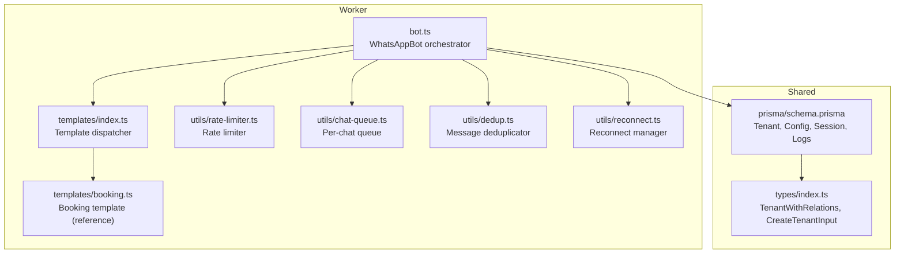
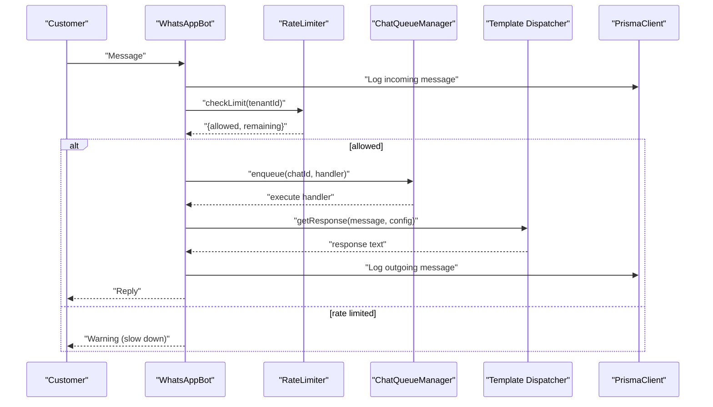
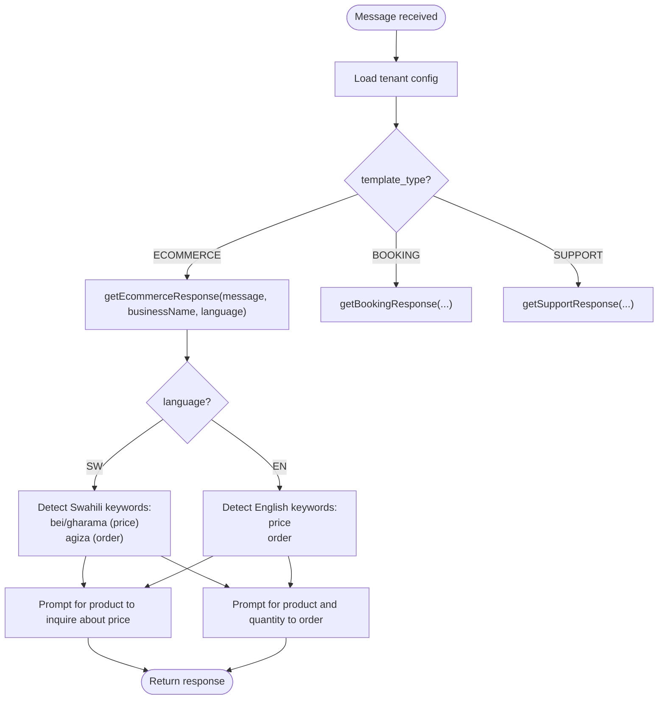
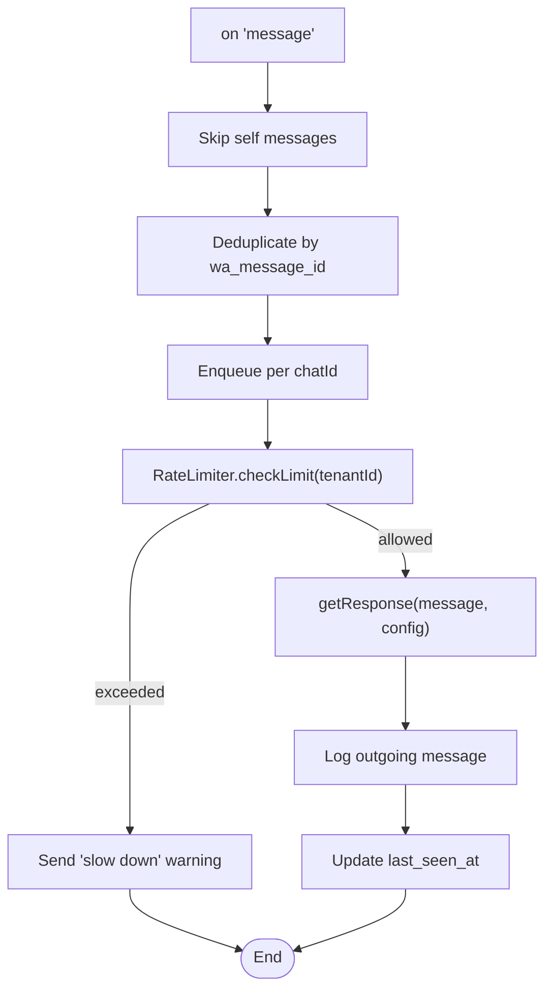
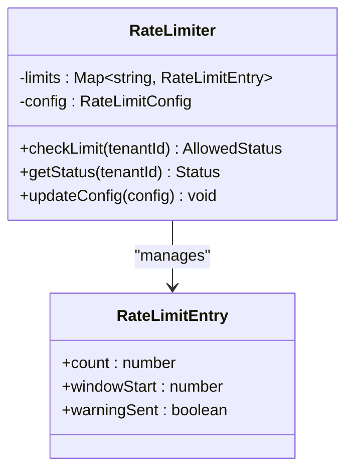
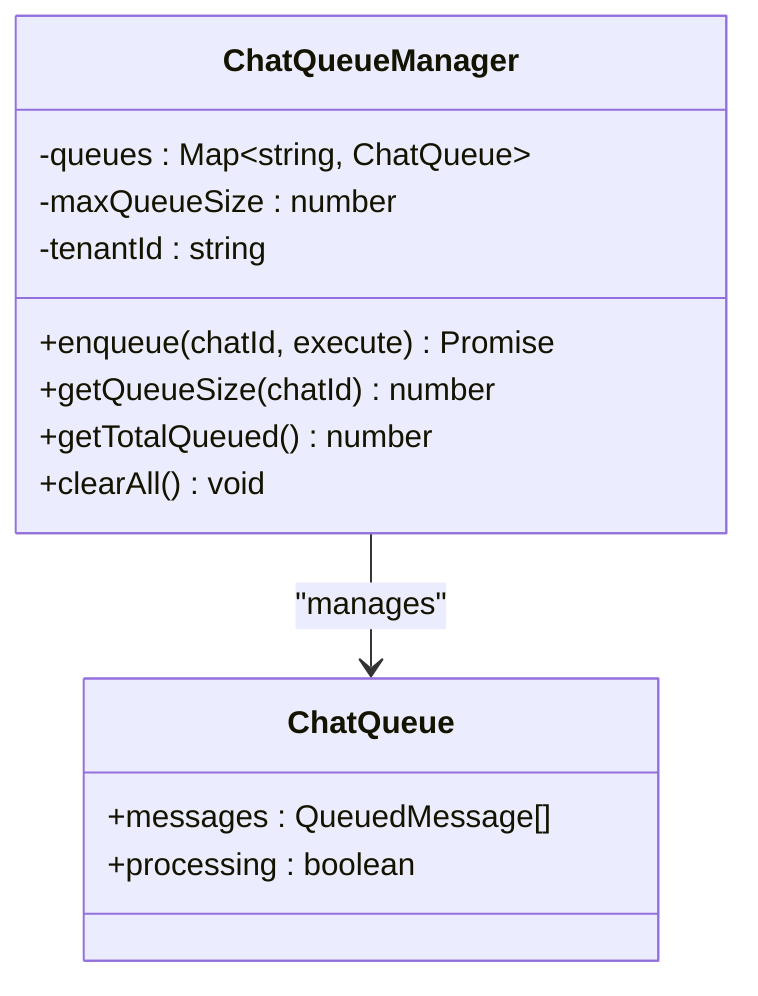
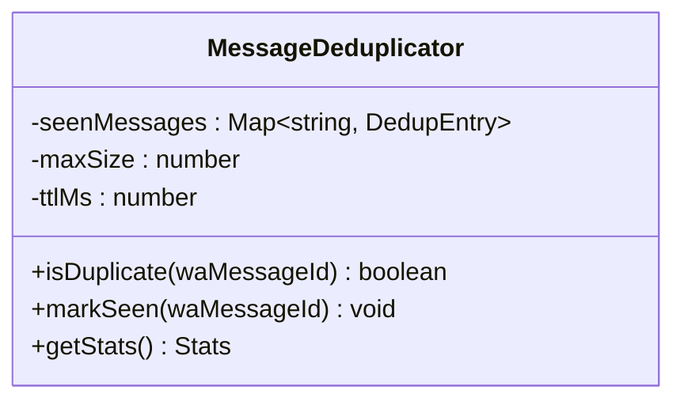
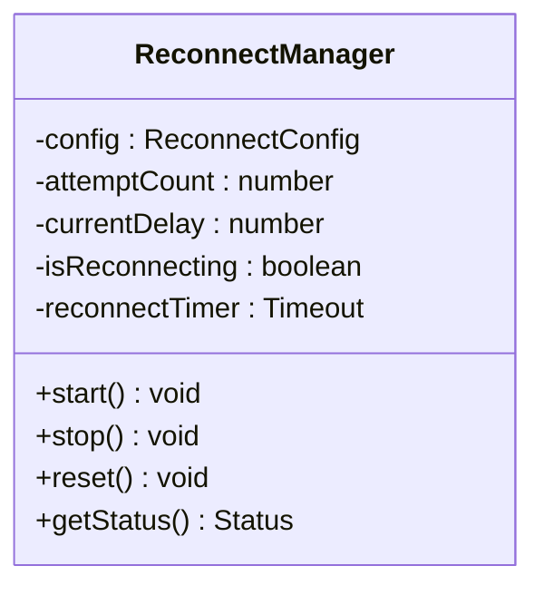
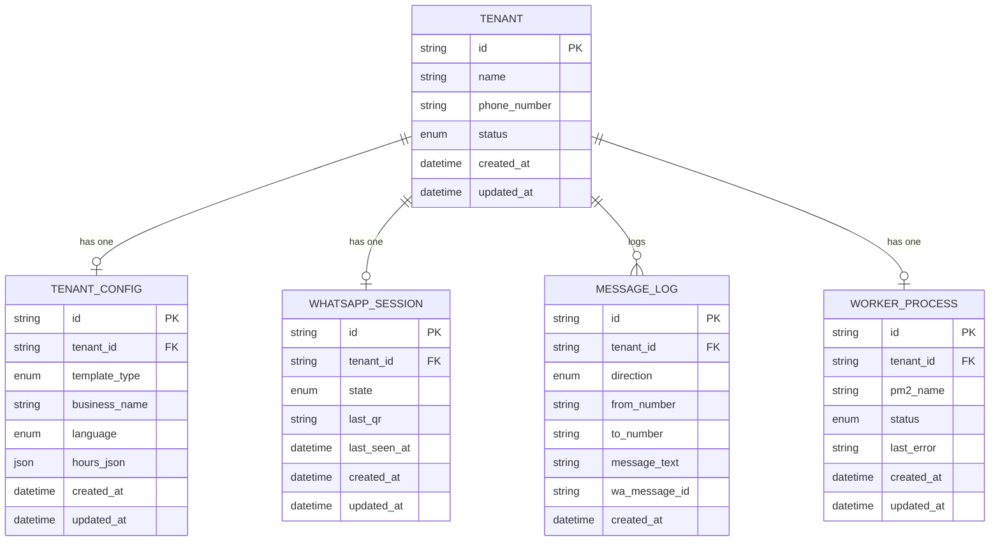
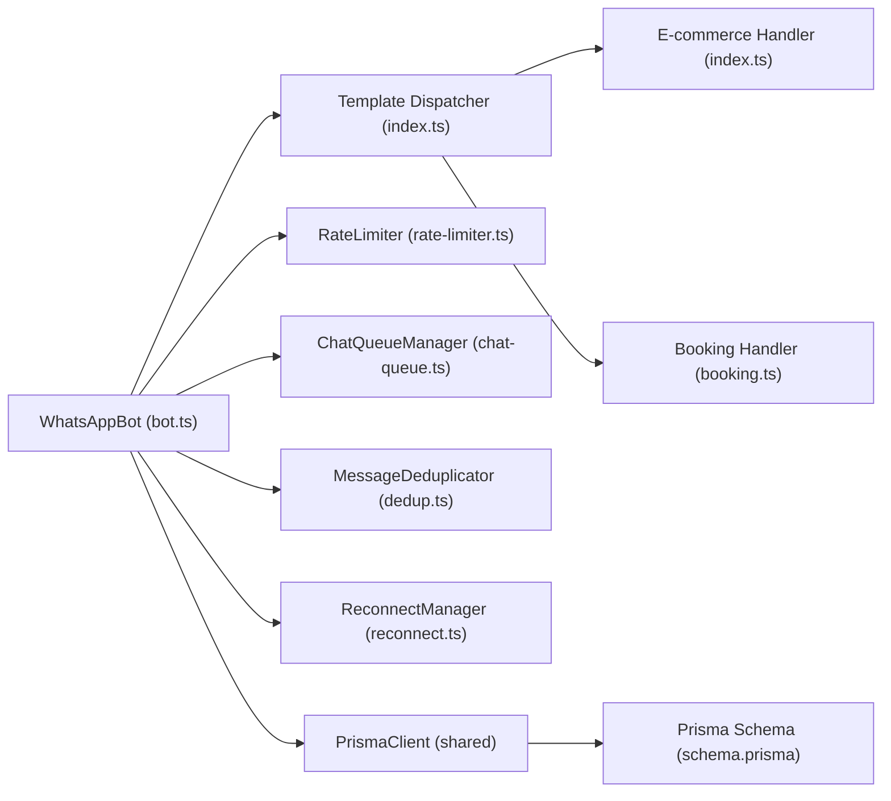

# E-commerce Template

<cite>
**Referenced Files in This Document**
- [bot.ts](file://apps/worker/src/bot.ts)
- [worker.ts](file://apps/worker/src/worker.ts)
- [index.ts](file://apps/worker/src/templates/index.ts)
- [booking.ts](file://apps/worker/src/templates/booking.ts)
- [rate-limiter.ts](file://apps/worker/src/utils/rate-limiter.ts)
- [chat-queue.ts](file://apps/worker/src/utils/chat-queue.ts)
- [dedup.ts](file://apps/worker/src/utils/dedup.ts)
- [reconnect.ts](file://apps/worker/src/utils/reconnect.ts)
- [schema.prisma](file://packages/shared/src/prisma/schema.prisma)
- [types/index.ts](file://packages/shared/src/types/index.ts)
- [README.md](file://README.md)
</cite>

## Table of Contents
1. [Introduction](#introduction)
2. [Project Structure](#project-structure)
3. [Core Components](#core-components)
4. [Architecture Overview](#architecture-overview)
5. [Detailed Component Analysis](#detailed-component-analysis)
6. [Dependency Analysis](#dependency-analysis)
7. [Performance Considerations](#performance-considerations)
8. [Troubleshooting Guide](#troubleshooting-guide)
9. [Conclusion](#conclusion)
10. [Appendices](#appendices)

## Introduction
This document explains the E-commerce template functionality within the WhatsApp chatbot platform. It focuses on how the system responds to product catalog inquiries, pricing requests, order placement workflows, and delivery information provision. It also documents the multilingual search logic for product discovery using Swahili keywords (bei/gharama for price, agiza for order) and English equivalents (price, order), along with response generation patterns for product inquiries, quantity requests, order confirmations, and delivery options. Guidance is included for integrating with e-commerce business logic, managing inventory, coordinating payments, and escalating customer service.

## Project Structure
The e-commerce template is implemented in the worker application and integrates with shared infrastructure for configuration, logging, and persistence.

**Diagram sources**
- [bot.ts](file://apps/worker/src/bot.ts#L1-L411)
- [index.ts](file://apps/worker/src/templates/index.ts#L1-L70)
- [booking.ts](file://apps/worker/src/templates/booking.ts#L1-L22)
- [rate-limiter.ts](file://apps/worker/src/utils/rate-limiter.ts#L1-L110)
- [chat-queue.ts](file://apps/worker/src/utils/chat-queue.ts#L1-L140)
- [dedup.ts](file://apps/worker/src/utils/dedup.ts#L1-L93)
- [reconnect.ts](file://apps/worker/src/utils/reconnect.ts#L1-L117)
- [schema.prisma](file://packages/shared/src/prisma/schema.prisma#L1-L178)
- [types/index.ts](file://packages/shared/src/types/index.ts#L1-L41)

**Section sources**
- [bot.ts](file://apps/worker/src/bot.ts#L1-L411)
- [index.ts](file://apps/worker/src/templates/index.ts#L1-L70)
- [schema.prisma](file://packages/shared/src/prisma/schema.prisma#L1-L178)

## Core Components
- Template dispatcher: Routes incoming messages to the appropriate template handler based on tenant configuration.
- E-commerce response generator: Implements multilingual logic for product, price, order, and delivery intents.
- WhatsAppBot: Orchestrates message handling, rate limiting, queueing, deduplication, and reconnect logic.
- Persistence and types: Tenant configuration, session state, message logs, and worker process tracking.

Key responsibilities:
- Product catalog response system: Provides structured prompts for product and price requests.
- Pricing inquiry handling: Guides users to specify products for pricing.
- Order placement workflows: Requests product and quantity details for orders.
- Delivery information provision: Offers delivery-related guidance.
- Multilingual support: Recognizes Swahili and English keywords for intent detection.

**Section sources**
- [index.ts](file://apps/worker/src/templates/index.ts#L9-L49)
- [bot.ts](file://apps/worker/src/bot.ts#L248-L331)
- [schema.prisma](file://packages/shared/src/prisma/schema.prisma#L60-L131)
- [types/index.ts](file://packages/shared/src/types/index.ts#L1-L41)

## Architecture Overview
The worker receives messages, loads tenant configuration, applies rate limiting and queueing, and dispatches to the E-commerce template. Responses are logged and sent back to the customer.

**Diagram sources**
- [bot.ts](file://apps/worker/src/bot.ts#L248-L331)
- [rate-limiter.ts](file://apps/worker/src/utils/rate-limiter.ts#L32-L73)
- [chat-queue.ts](file://apps/worker/src/utils/chat-queue.ts#L35-L67)
- [index.ts](file://apps/worker/src/templates/index.ts#L9-L23)

## Detailed Component Analysis

### Template Dispatcher and E-commerce Response Generator
The dispatcher selects the template type from tenant configuration and delegates to the E-commerce handler. The E-commerce handler recognizes multilingual keywords and returns contextual prompts.

**Diagram sources**
- [index.ts](file://apps/worker/src/templates/index.ts#L9-L49)
- [booking.ts](file://apps/worker/src/templates/booking.ts#L1-L22)

**Section sources**
- [index.ts](file://apps/worker/src/templates/index.ts#L9-L49)
- [booking.ts](file://apps/worker/src/templates/booking.ts#L1-L22)

### WhatsAppBot Message Handling Pipeline
The bot coordinates rate limiting, queueing, deduplication, and reconnect logic before invoking the template response generator.

**Diagram sources**
- [bot.ts](file://apps/worker/src/bot.ts#L153-L331)
- [dedup.ts](file://apps/worker/src/utils/dedup.ts#L28-L46)
- [rate-limiter.ts](file://apps/worker/src/utils/rate-limiter.ts#L32-L73)

**Section sources**
- [bot.ts](file://apps/worker/src/bot.ts#L153-L331)
- [dedup.ts](file://apps/worker/src/utils/dedup.ts#L1-L93)
- [rate-limiter.ts](file://apps/worker/src/utils/rate-limiter.ts#L1-L110)

### Rate Limiter
Controls the number of replies per tenant per minute to prevent spam and protect resources.

**Diagram sources**
- [rate-limiter.ts](file://apps/worker/src/utils/rate-limiter.ts#L17-L106)

**Section sources**
- [rate-limiter.ts](file://apps/worker/src/utils/rate-limiter.ts#L1-L110)

### Chat Queue Manager
Ensures sequential processing per chat to avoid race conditions and inconsistent state.

**Diagram sources**
- [chat-queue.ts](file://apps/worker/src/utils/chat-queue.ts#L21-L139)

**Section sources**
- [chat-queue.ts](file://apps/worker/src/utils/chat-queue.ts#L1-L140)

### Message Deduplicator
Prevents duplicate processing of the same message using the WhatsApp message ID.

**Diagram sources**
- [dedup.ts](file://apps/worker/src/utils/dedup.ts#L11-L89)

**Section sources**
- [dedup.ts](file://apps/worker/src/utils/dedup.ts#L1-L93)

### Reconnect Manager
Manages exponential backoff reconnection attempts when the WhatsApp client disconnects.

**Diagram sources**
- [reconnect.ts](file://apps/worker/src/utils/reconnect.ts#L14-L116)

**Section sources**
- [reconnect.ts](file://apps/worker/src/utils/reconnect.ts#L1-L117)

### Persistence and Types
Tenant configuration, session state, message logs, and worker process tracking are persisted in the database.

**Diagram sources**
- [schema.prisma](file://packages/shared/src/prisma/schema.prisma#L60-L131)

**Section sources**
- [schema.prisma](file://packages/shared/src/prisma/schema.prisma#L1-L178)
- [types/index.ts](file://packages/shared/src/types/index.ts#L1-L41)

## Dependency Analysis
- The worker depends on shared types and Prisma for persistence.
- The E-commerce template depends on tenant configuration (template_type, business_name, language).
- The bot composes utilities for reliability and resilience.

**Diagram sources**
- [bot.ts](file://apps/worker/src/bot.ts#L1-L411)
- [index.ts](file://apps/worker/src/templates/index.ts#L1-L70)
- [booking.ts](file://apps/worker/src/templates/booking.ts#L1-L22)
- [rate-limiter.ts](file://apps/worker/src/utils/rate-limiter.ts#L1-L110)
- [chat-queue.ts](file://apps/worker/src/utils/chat-queue.ts#L1-L140)
- [dedup.ts](file://apps/worker/src/utils/dedup.ts#L1-L93)
- [reconnect.ts](file://apps/worker/src/utils/reconnect.ts#L1-L117)
- [schema.prisma](file://packages/shared/src/prisma/schema.prisma#L1-L178)

**Section sources**
- [bot.ts](file://apps/worker/src/bot.ts#L1-L411)
- [index.ts](file://apps/worker/src/templates/index.ts#L1-L70)

## Performance Considerations
- Rate limiting prevents burst traffic and protects downstream systems.
- Per-chat queueing ensures deterministic processing and avoids race conditions.
- Deduplication reduces redundant processing and improves throughput.
- Heartbeat monitoring keeps the worker alive and responsive.
- Reconnect with exponential backoff minimizes downtime and resource contention.

[No sources needed since this section provides general guidance]

## Troubleshooting Guide
Common issues and resolutions:
- QR code not appearing: Check worker logs and ensure the worker is started and running.
- Session not persisting: Verify session storage path and permissions.
- Database connection errors: Confirm connection string format and PostgreSQL availability.
- WhatsApp Web errors: Ensure Chromium is installed and executable path is configured.
- Rate limit warnings: Adjust RATE_LIMIT_MAX_PER_MINUTE environment variable.
- Stale workers: Workers without heartbeats are auto-marked as ERROR; use Force Restart.

**Section sources**
- [README.md](file://README.md#L185-L208)
- [README.md](file://README.md#L452-L474)

## Conclusion
The E-commerce template provides a robust, multilingual foundation for product catalog inquiries, pricing requests, order placement, and delivery information. Through tenant configuration, the system dynamically adapts responses to Swahili and English contexts. The worker’s reliability features—rate limiting, queueing, deduplication, and reconnect—ensure consistent operation under real-world conditions. While the current implementation focuses on intent-driven prompts, future enhancements can integrate with inventory and payment systems to complete end-to-end e-commerce workflows.

[No sources needed since this section summarizes without analyzing specific files]

## Appendices

### Response Generation Patterns
- Product inquiries: Prompt users to specify the product they want to know the price for.
- Quantity requests: Prompt users to specify the product and quantity they want to order.
- Order confirmations: Provide a follow-up message acknowledging receipt of the order request.
- Delivery options: Offer guidance on delivery-related information.

These patterns align with the multilingual keyword detection logic for price and order intents.

**Section sources**
- [index.ts](file://apps/worker/src/templates/index.ts#L25-L49)

### Integration with E-commerce Business Logic
- Inventory management integration: Extend the E-commerce handler to query product availability and stock levels before confirming orders.
- Payment processing coordination: Integrate with a payment provider to collect payments upon order confirmation.
- Customer service escalation: Route complex issues to a support template or external escalation channels.

[No sources needed since this section provides general guidance]