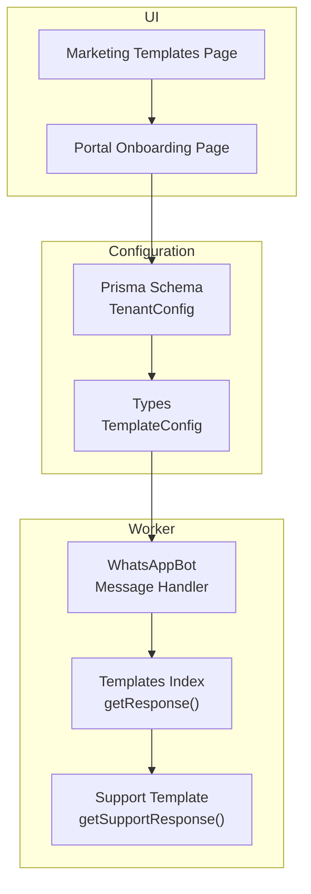
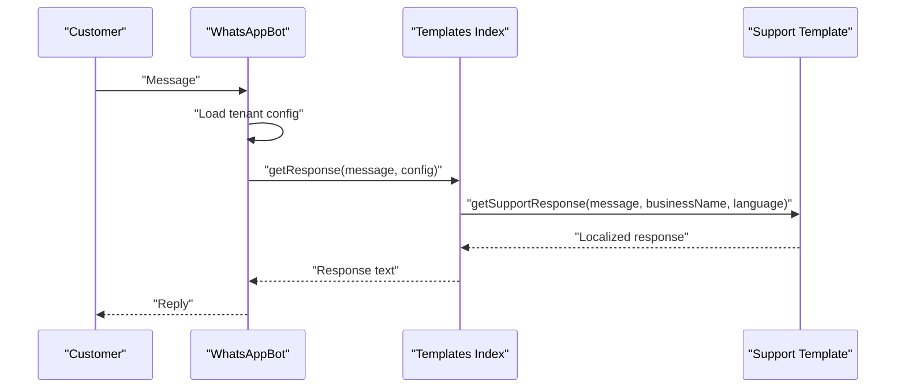
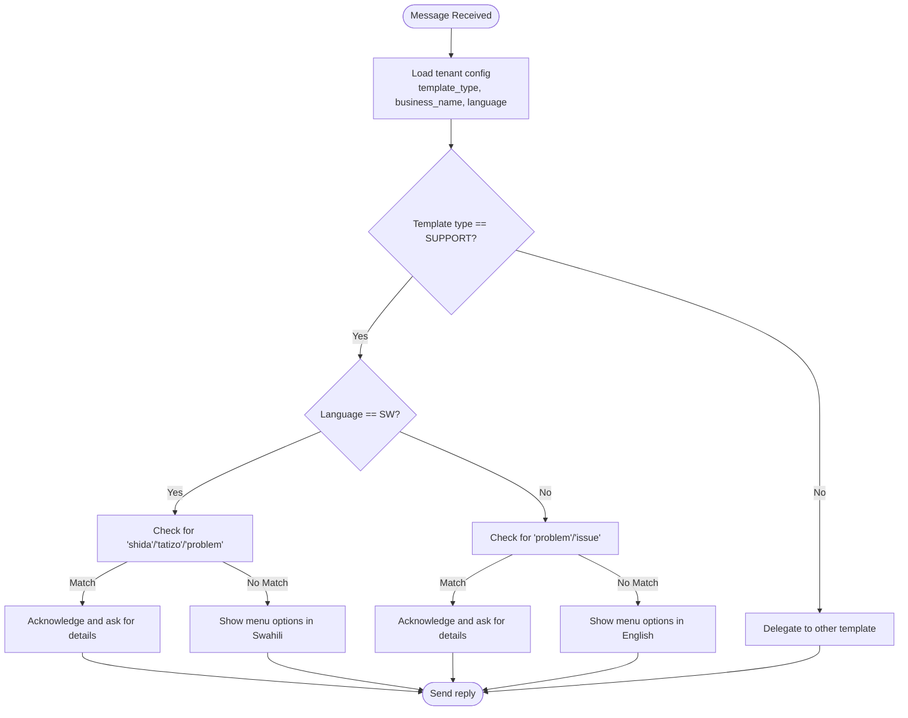
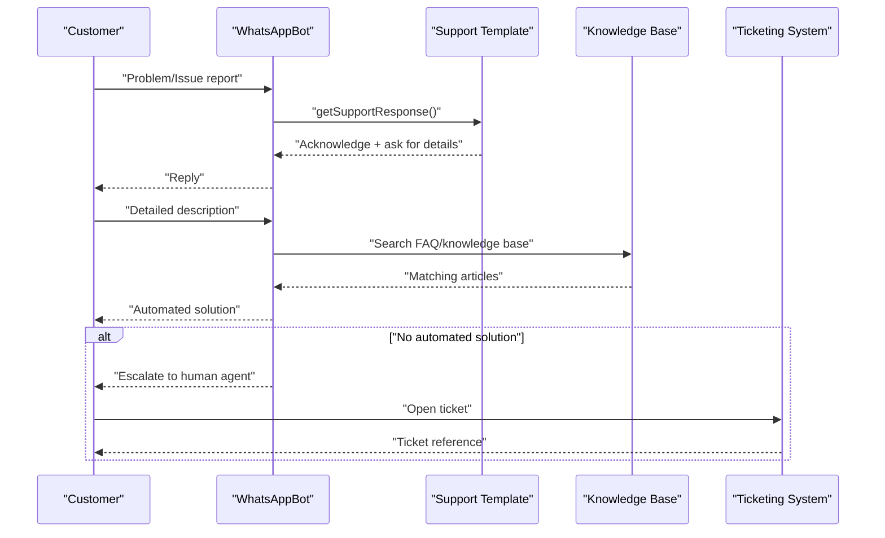
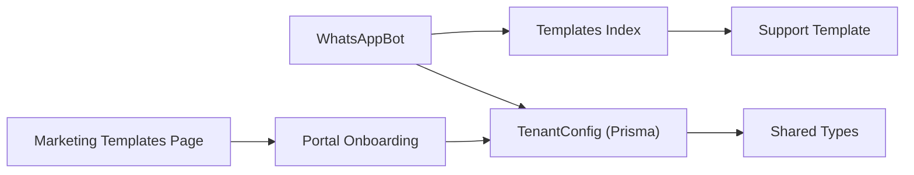

# Support Template

<cite>
**Referenced Files in This Document**
- [bot.ts](file://apps/worker/src/bot.ts)
- [worker.ts](file://apps/worker/src/worker.ts)
- [templates/index.ts](file://apps/worker/src/templates/index.ts)
- [templates/booking.ts](file://apps/worker/src/templates/booking.ts)
- [schema.prisma](file://packages/shared/src/prisma/schema.prisma)
- [types/index.ts](file://packages/shared/src/types/index.ts)
- [templates/page.tsx](file://apps/web/src/app/(marketing)/templates/page.tsx)
- [onboarding/page.tsx](file://apps/web/src/app/(portal)/app/onboarding/page.tsx)
</cite>

## Table of Contents
1. [Introduction](#introduction)
2. [Project Structure](#project-structure)
3. [Core Components](#core-components)
4. [Architecture Overview](#architecture-overview)
5. [Detailed Component Analysis](#detailed-component-analysis)
6. [Dependency Analysis](#dependency-analysis)
7. [Performance Considerations](#performance-considerations)
8. [Troubleshooting Guide](#troubleshooting-guide)
9. [Conclusion](#conclusion)

## Introduction
This document describes the Support template implementation for the customer support response system. It covers how the system recognizes issue reports, escalates problems, handles FAQs, and provides contact information. It also documents the multilingual support logic with Swahili keywords (shida/tatizo for problems) and English equivalents (problem, issue), and outlines the support workflow from initial acknowledgment to escalation to human agents. Examples of support request patterns, automated troubleshooting responses, knowledge base integration points, and integration with support ticketing systems are included, along with guidance on priority handling and customer satisfaction optimization.

## Project Structure
The Support template is part of a modular template system that routes incoming messages to a specific handler based on the tenant’s configuration. The worker receives messages, loads the tenant configuration, selects the appropriate template response function, and sends replies. The system supports three template types: BOOKING, ECOMMERCE, and SUPPORT.

**Diagram sources**
- [bot.ts](file://apps/worker/src/bot.ts#L228-L246)
- [templates/index.ts](file://apps/worker/src/templates/index.ts#L9-L23)
- [templates/index.ts](file://apps/worker/src/templates/index.ts#L51-L69)
- [schema.prisma](file://packages/shared/src/prisma/schema.prisma#L78-L90)
- [types/index.ts](file://packages/shared/src/types/index.ts#L1-L41)
- [templates/page.tsx](file://apps/web/src/app/(marketing)/templates/page.tsx#L17-L21)
- [onboarding/page.tsx](file://apps/web/src/app/(portal)/app/onboarding/page.tsx#L67-L77)

**Section sources**
- [bot.ts](file://apps/worker/src/bot.ts#L228-L246)
- [templates/index.ts](file://apps/worker/src/templates/index.ts#L9-L23)
- [templates/index.ts](file://apps/worker/src/templates/index.ts#L51-L69)
- [schema.prisma](file://packages/shared/src/prisma/schema.prisma#L78-L90)
- [types/index.ts](file://packages/shared/src/types/index.ts#L1-L41)
- [templates/page.tsx](file://apps/web/src/app/(marketing)/templates/page.tsx#L17-L21)
- [onboarding/page.tsx](file://apps/web/src/app/(portal)/app/onboarding/page.tsx#L67-L77)

## Core Components
- Template routing: The worker loads the tenant configuration and dispatches the message to the appropriate template handler via a central dispatcher.
- Support template: Implements multilingual logic to detect issue-related keywords and provide contextual responses.
- Configuration model: Stores template type, business name, and language for each tenant.
- UI integration: Marketing and portal pages expose the Support template and collect configuration inputs.

Key responsibilities:
- Detect issue keywords in Swahili and English.
- Acknowledge receipt and prompt for detailed description.
- Provide FAQ and contact information responses.
- Escalate unresolved issues to human agents.
- Integrate with knowledge base and ticketing systems.

**Section sources**
- [templates/index.ts](file://apps/worker/src/templates/index.ts#L9-L23)
- [templates/index.ts](file://apps/worker/src/templates/index.ts#L51-L69)
- [schema.prisma](file://packages/shared/src/prisma/schema.prisma#L78-L90)
- [types/index.ts](file://packages/shared/src/types/index.ts#L21-L27)
- [templates/page.tsx](file://apps/web/src/app/(marketing)/templates/page.tsx#L17-L21)
- [onboarding/page.tsx](file://apps/web/src/app/(portal)/app/onboarding/page.tsx#L67-L77)

## Architecture Overview
The Support template is invoked by the worker after loading the tenant configuration. The dispatcher selects the SUPPORT branch and delegates to the support response function, which evaluates the message content and language to produce a localized reply.

**Diagram sources**
- [bot.ts](file://apps/worker/src/bot.ts#L281-L289)
- [templates/index.ts](file://apps/worker/src/templates/index.ts#L9-L23)
- [templates/index.ts](file://apps/worker/src/templates/index.ts#L51-L69)

## Detailed Component Analysis

### Support Template Response Logic
The support response function evaluates the incoming message against keyword sets for Swahili and English and returns a localized greeting and menu prompt. When keywords indicating a problem are detected, it acknowledges the issue and requests a detailed description.

**Diagram sources**
- [templates/index.ts](file://apps/worker/src/templates/index.ts#L51-L69)

**Section sources**
- [templates/index.ts](file://apps/worker/src/templates/index.ts#L51-L69)

### Multilingual Support Logic
- Swahili keywords for problems: shida, tatizo, problem.
- English keywords for problems: problem, issue.
- Language detection is performed by converting the message to lowercase and checking for substring matches.
- Responses are localized to the tenant’s configured language.

**Section sources**
- [templates/index.ts](file://apps/worker/src/templates/index.ts#L58-L67)

### Support Workflow
Initial problem acknowledgment:
- On detecting a problem keyword, the system responds with an acknowledgment and prompts for a detailed description.

Detailed issue collection:
- The system collects the issue description and can guide the user to FAQs, contact information, or working hours.

Solution provision:
- The system can provide FAQ answers and contact details based on the message content.

Escalation to human agents:
- When an issue cannot be resolved automatically, the system can escalate to a human agent. This is indicated conceptually by the template’s menu options and can be extended to integrate with a ticketing system.

**Diagram sources**
- [templates/index.ts](file://apps/worker/src/templates/index.ts#L51-L69)

**Section sources**
- [templates/index.ts](file://apps/worker/src/templates/index.ts#L51-L69)

### Support Request Patterns and Automated Responses
Common support request patterns:
- Problem/Issue keywords trigger acknowledgment and a request for details.
- FAQ-related keywords can trigger FAQ responses.
- Contact-related keywords can trigger contact information responses.
- Working hours-related keywords can trigger operating hours responses.

Automated troubleshooting responses:
- The system can search a knowledge base for solutions and provide step-by-step guidance.

Examples of keyword-triggered responses:
- Swahili: shida, tatizo, problem → acknowledgment and request for details.
- English: problem, issue → acknowledgment and request for details.

**Section sources**
- [templates/index.ts](file://apps/worker/src/templates/index.ts#L58-L67)

### Knowledge Base Integration
- The support template can be extended to integrate with a knowledge base to provide automated troubleshooting steps and FAQ answers.
- The dispatcher pattern allows adding a knowledge base lookup before sending a reply.

[No sources needed since this section provides conceptual integration guidance]

### Integration with Support Ticketing Systems
- The support template can be extended to escalate unresolved issues to a ticketing system and provide a ticket reference to the customer.
- The system can generate a ticket with the collected details and forward it to the support team.

[No sources needed since this section provides conceptual integration guidance]

### Priority Handling and Customer Satisfaction Optimization
- Priority handling can be implemented by tagging tickets with urgency levels based on keywords or user history.
- Customer satisfaction can be optimized by providing quick, accurate responses, clear escalation paths, and timely follow-ups.

[No sources needed since this section provides general guidance]

## Dependency Analysis
The worker depends on the templates index to select the correct response function. The templates index depends on the support template module. The tenant configuration is stored in the database and exposed via shared types.

**Diagram sources**
- [bot.ts](file://apps/worker/src/bot.ts#L281-L289)
- [templates/index.ts](file://apps/worker/src/templates/index.ts#L9-L23)
- [templates/index.ts](file://apps/worker/src/templates/index.ts#L51-L69)
- [schema.prisma](file://packages/shared/src/prisma/schema.prisma#L78-L90)
- [types/index.ts](file://packages/shared/src/types/index.ts#L21-L27)
- [onboarding/page.tsx](file://apps/web/src/app/(portal)/app/onboarding/page.tsx#L67-L77)
- [templates/page.tsx](file://apps/web/src/app/(marketing)/templates/page.tsx#L17-L21)

**Section sources**
- [bot.ts](file://apps/worker/src/bot.ts#L281-L289)
- [templates/index.ts](file://apps/worker/src/templates/index.ts#L9-L23)
- [templates/index.ts](file://apps/worker/src/templates/index.ts#L51-L69)
- [schema.prisma](file://packages/shared/src/prisma/schema.prisma#L78-L90)
- [types/index.ts](file://packages/shared/src/types/index.ts#L21-L27)
- [onboarding/page.tsx](file://apps/web/src/app/(portal)/app/onboarding/page.tsx#L67-L77)
- [templates/page.tsx](file://apps/web/src/app/(marketing)/templates/page.tsx#L17-L21)

## Performance Considerations
- Rate limiting: The worker enforces rate limits to prevent spam and ensure fair usage.
- Queue management: Messages are processed sequentially per chat to avoid race conditions.
- Heartbeat monitoring: The worker maintains a heartbeat to monitor liveness and update status.

[No sources needed since this section provides general guidance]

## Troubleshooting Guide
Common issues and resolutions:
- Authentication failures: The worker updates the tenant and worker process statuses accordingly.
- Disconnections: The worker attempts to reconnect and updates states.
- Duplicate messages: The worker deduplicates messages to prevent repeated processing.
- Rate limit exceeded: The worker warns users to slow down and suppresses further replies until the warning period passes.

**Section sources**
- [bot.ts](file://apps/worker/src/bot.ts#L210-L225)
- [bot.ts](file://apps/worker/src/bot.ts#L185-L208)
- [bot.ts](file://apps/worker/src/bot.ts#L159-L164)
- [bot.ts](file://apps/worker/src/bot.ts#L264-L279)

## Conclusion
The Support template provides a robust foundation for customer support automation with multilingual capabilities, keyword-driven responses, and extensibility for knowledge base and ticketing integrations. By leveraging the existing template dispatcher and tenant configuration model, the system can be enhanced to handle complex support workflows, prioritize issues, and optimize customer satisfaction.