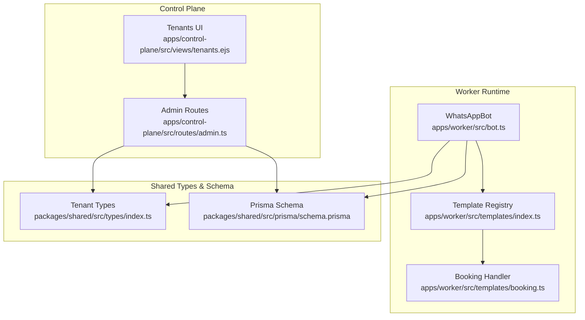
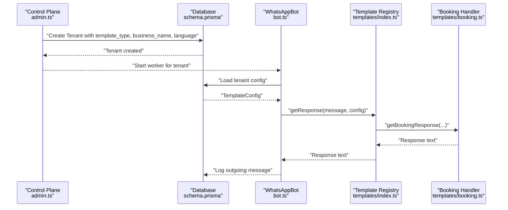
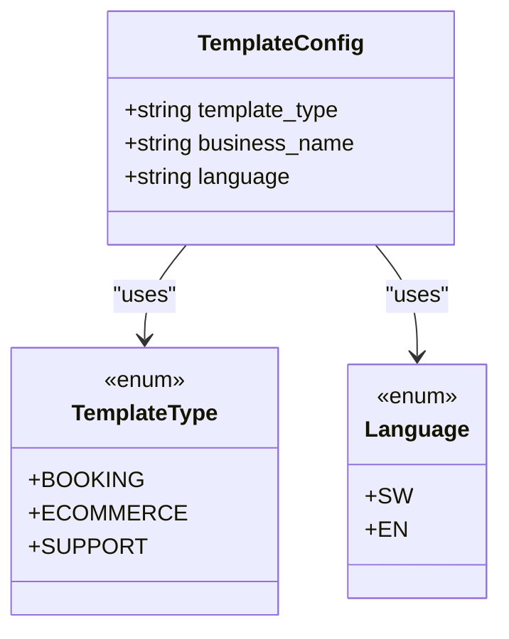
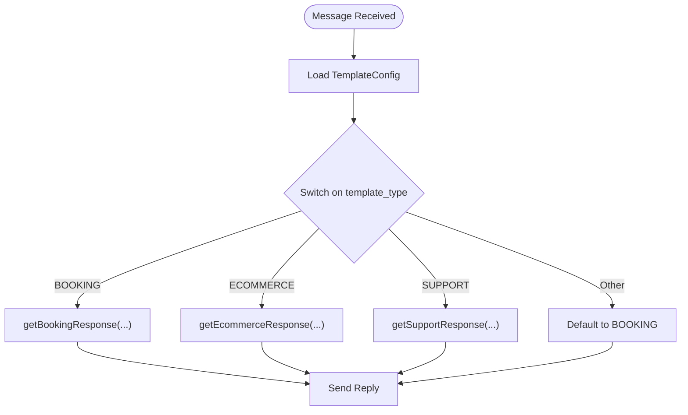
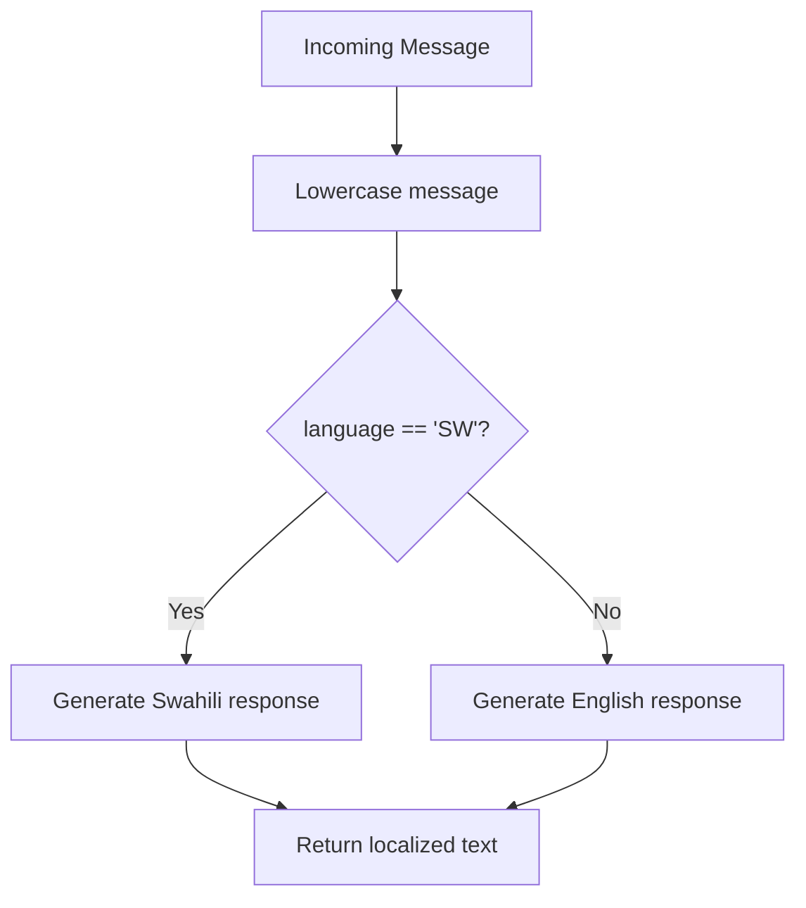
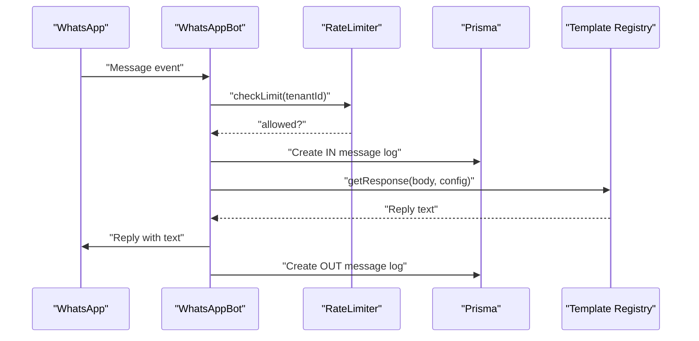
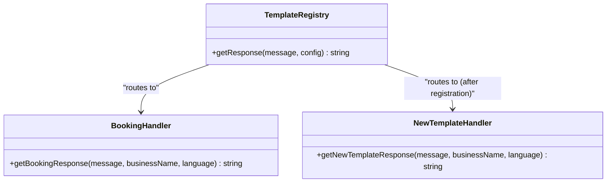
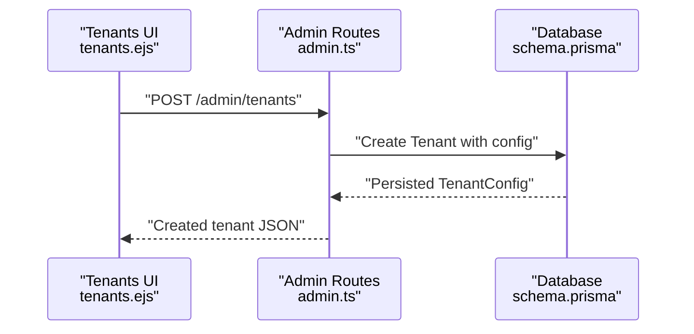
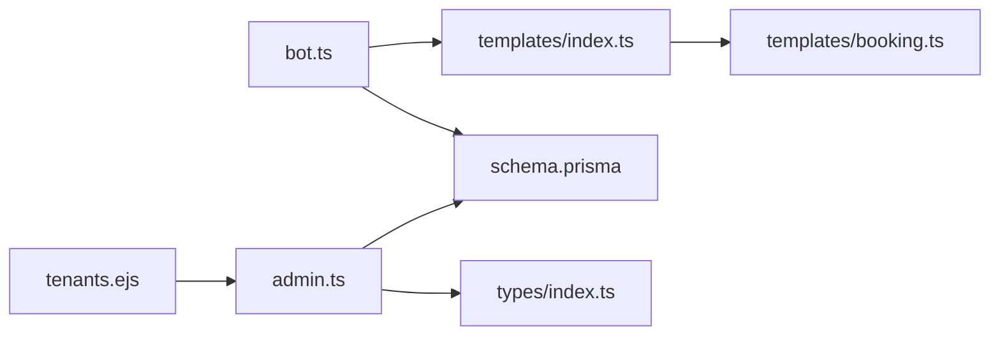

# Template Architecture

<cite>
**Referenced Files in This Document**
- [bot.ts](file://apps/worker/src/bot.ts)
- [worker.ts](file://apps/worker/src/worker.ts)
- [templates/index.ts](file://apps/worker/src/templates/index.ts)
- [templates/booking.ts](file://apps/worker/src/templates/booking.ts)
- [types/index.ts](file://packages/shared/src/types/index.ts)
- [schema.prisma](file://packages/shared/src/prisma/schema.prisma)
- [admin.ts](file://apps/control-plane/src/routes/admin.ts)
- [tenants.ejs](file://apps/control-plane/src/views/tenants.ejs)
</cite>

## Table of Contents
1. [Introduction](#introduction)
2. [Project Structure](#project-structure)
3. [Core Components](#core-components)
4. [Architecture Overview](#architecture-overview)
5. [Detailed Component Analysis](#detailed-component-analysis)
6. [Dependency Analysis](#dependency-analysis)
7. [Performance Considerations](#performance-considerations)
8. [Troubleshooting Guide](#troubleshooting-guide)
9. [Conclusion](#conclusion)
10. [Appendices](#appendices)

## Introduction
This document explains the template architecture used by the WhatsApp worker to route inbound messages to specialized response handlers based on tenant configuration. It covers the TemplateConfig interface, supported template types, language support, the main getResponse routing function, template registration, factory-style selection during tenant creation, configuration inheritance, validation via Prisma enums, and extensibility for adding new template types.

## Project Structure
The template system spans three main areas:
- Worker runtime that loads tenant configuration and routes messages
- Template registry and handlers for each template type
- Control plane that creates tenants and sets initial configuration

**Diagram sources**
- [bot.ts](file://apps/worker/src/bot.ts#L1-L411)
- [templates/index.ts](file://apps/worker/src/templates/index.ts#L1-L70)
- [templates/booking.ts](file://apps/worker/src/templates/booking.ts#L1-L22)
- [admin.ts](file://apps/control-plane/src/routes/admin.ts#L82-L140)
- [tenants.ejs](file://apps/control-plane/src/views/tenants.ejs#L22-L71)
- [types/index.ts](file://packages/shared/src/types/index.ts#L1-L41)
- [schema.prisma](file://packages/shared/src/prisma/schema.prisma#L1-L178)

**Section sources**
- [bot.ts](file://apps/worker/src/bot.ts#L1-L411)
- [templates/index.ts](file://apps/worker/src/templates/index.ts#L1-L70)
- [templates/booking.ts](file://apps/worker/src/templates/booking.ts#L1-L22)
- [admin.ts](file://apps/control-plane/src/routes/admin.ts#L82-L140)
- [tenants.ejs](file://apps/control-plane/src/views/tenants.ejs#L22-L71)
- [types/index.ts](file://packages/shared/src/types/index.ts#L1-L41)
- [schema.prisma](file://packages/shared/src/prisma/schema.prisma#L1-L178)

## Core Components
- TemplateConfig interface defines the tenant’s selected template type, display/business name, and language.
- Template type enumeration supports BOOKING, ECOMMERCE, and SUPPORT.
- Language support is SW (Swahili) and EN (English).
- The getResponse function acts as a router that selects the appropriate handler based on template_type.
- Template registration is centralized in the templates index, which imports individual handlers and exposes a single routing function.
- Tenant creation in the control plane initializes template_type, business_name, and language in the database.

**Section sources**
- [templates/index.ts](file://apps/worker/src/templates/index.ts#L3-L7)
- [templates/index.ts](file://apps/worker/src/templates/index.ts#L9-L23)
- [types/index.ts](file://packages/shared/src/types/index.ts#L21-L27)
- [schema.prisma](file://packages/shared/src/prisma/schema.prisma#L18-L27)
- [admin.ts](file://apps/control-plane/src/routes/admin.ts#L104-L140)

## Architecture Overview
The worker loads tenant configuration at startup and on readiness, then routes each incoming message to the registered template handler. The control plane ensures configuration validity via Prisma enums and UI selections.

**Diagram sources**
- [admin.ts](file://apps/control-plane/src/routes/admin.ts#L104-L140)
- [schema.prisma](file://packages/shared/src/prisma/schema.prisma#L78-L90)
- [bot.ts](file://apps/worker/src/bot.ts#L228-L246)
- [templates/index.ts](file://apps/worker/src/templates/index.ts#L9-L23)
- [templates/booking.ts](file://apps/worker/src/templates/booking.ts#L1-L22)

## Detailed Component Analysis

### TemplateConfig Interface and Validation
- TemplateConfig enforces strict literal types for template_type and language, ensuring compile-time safety.
- TemplateType and Language are defined as Prisma enums, guaranteeing database-level validation.
- The worker casts the tenant config to TemplateConfig to ensure type safety in runtime routing.

**Diagram sources**
- [templates/index.ts](file://apps/worker/src/templates/index.ts#L3-L7)
- [schema.prisma](file://packages/shared/src/prisma/schema.prisma#L18-L27)

**Section sources**
- [templates/index.ts](file://apps/worker/src/templates/index.ts#L3-L7)
- [schema.prisma](file://packages/shared/src/prisma/schema.prisma#L18-L27)
- [bot.ts](file://apps/worker/src/bot.ts#L236-L242)

### Template Type Enumeration and Registration
- Supported template types: BOOKING, ECOMMERCE, SUPPORT.
- Centralized registration in templates/index.ts imports handlers and routes messages via getResponse.
- Default case in getResponse falls back to BOOKING, ensuring resilience against invalid values.

**Diagram sources**
- [templates/index.ts](file://apps/worker/src/templates/index.ts#L9-L23)

**Section sources**
- [templates/index.ts](file://apps/worker/src/templates/index.ts#L9-L23)

### Language Support Implementation
- Handlers receive language as a literal union type and branch on language to produce localized responses.
- The worker passes language from TemplateConfig to each handler.

**Diagram sources**
- [templates/index.ts](file://apps/worker/src/templates/index.ts#L25-L49)
- [templates/booking.ts](file://apps/worker/src/templates/booking.ts#L1-L22)

**Section sources**
- [templates/index.ts](file://apps/worker/src/templates/index.ts#L25-L49)
- [templates/booking.ts](file://apps/worker/src/templates/booking.ts#L1-L22)

### Response Routing Logic
- The worker loads TemplateConfig on ready and caches it.
- For each message, it checks rate limits, logs the incoming message, routes to getResponse, sends the reply, and logs outgoing traffic.

**Diagram sources**
- [bot.ts](file://apps/worker/src/bot.ts#L248-L331)
- [templates/index.ts](file://apps/worker/src/templates/index.ts#L9-L23)

**Section sources**
- [bot.ts](file://apps/worker/src/bot.ts#L248-L331)
- [templates/index.ts](file://apps/worker/src/templates/index.ts#L9-L23)

### Factory Pattern and Extensibility
- The template registry acts as a factory that selects the appropriate handler based on template_type.
- To add a new template type:
  1. Create a new handler module under apps/worker/src/templates/.
  2. Export a function that accepts message, businessName, and language, returning a string.
  3. Import the new handler in templates/index.ts and add a case in getResponse.
  4. Optionally update Prisma enums if extending TemplateType.

**Diagram sources**
- [templates/index.ts](file://apps/worker/src/templates/index.ts#L1-L70)

**Section sources**
- [templates/index.ts](file://apps/worker/src/templates/index.ts#L1-L70)
- [README.md](file://README.md#L244-L258)

### Template Selection During Tenant Creation
- The control plane form exposes template_type, business_name, and language as selectable fields.
- On POST /admin/tenants, the backend persists TenantConfig with template_type, business_name, and language.
- The worker reads this configuration and routes messages accordingly.

**Diagram sources**
- [tenants.ejs](file://apps/control-plane/src/views/tenants.ejs#L52-L70)
- [admin.ts](file://apps/control-plane/src/routes/admin.ts#L104-L140)
- [schema.prisma](file://packages/shared/src/prisma/schema.prisma#L78-L90)

**Section sources**
- [tenants.ejs](file://apps/control-plane/src/views/tenants.ejs#L52-L70)
- [admin.ts](file://apps/control-plane/src/routes/admin.ts#L104-L140)
- [schema.prisma](file://packages/shared/src/prisma/schema.prisma#L78-L90)

### Configuration Inheritance Patterns
- The worker loads TenantWithRelations including config, enabling access to template_type, business_name, and language.
- The TemplateConfig interface mirrors the persisted configuration shape, ensuring consistent typing across layers.

**Section sources**
- [types/index.ts](file://packages/shared/src/types/index.ts#L1-L19)
- [bot.ts](file://apps/worker/src/bot.ts#L228-L246)

## Dependency Analysis
- The worker depends on the template registry for routing and on Prisma models for configuration persistence.
- The control plane depends on Prisma enums and UI forms to enforce configuration correctness.
- The template registry depends on individual handler modules for response generation.

**Diagram sources**
- [bot.ts](file://apps/worker/src/bot.ts#L1-L411)
- [templates/index.ts](file://apps/worker/src/templates/index.ts#L1-L70)
- [templates/booking.ts](file://apps/worker/src/templates/booking.ts#L1-L22)
- [admin.ts](file://apps/control-plane/src/routes/admin.ts#L82-L140)
- [tenants.ejs](file://apps/control-plane/src/views/tenants.ejs#L22-L71)
- [schema.prisma](file://packages/shared/src/prisma/schema.prisma#L1-L178)
- [types/index.ts](file://packages/shared/src/types/index.ts#L1-L41)

**Section sources**
- [bot.ts](file://apps/worker/src/bot.ts#L1-L411)
- [templates/index.ts](file://apps/worker/src/templates/index.ts#L1-L70)
- [templates/booking.ts](file://apps/worker/src/templates/booking.ts#L1-L22)
- [admin.ts](file://apps/control-plane/src/routes/admin.ts#L82-L140)
- [tenants.ejs](file://apps/control-plane/src/views/tenants.ejs#L22-L71)
- [schema.prisma](file://packages/shared/src/prisma/schema.prisma#L1-L178)
- [types/index.ts](file://packages/shared/src/types/index.ts#L1-L41)

## Performance Considerations
- Message processing is rate-limited to prevent spam and maintain service stability.
- Sequential chat queuing ensures ordered replies per customer conversation.
- Deduplication prevents repeated processing of identical messages.
- Heartbeat updates keep session and worker status synchronized.

[No sources needed since this section provides general guidance]

## Troubleshooting Guide
- If a tenant receives generic replies, verify TemplateConfig loading and template_type values.
- If routing fails unexpectedly, check the default case fallback in getResponse.
- If language-specific responses are missing, confirm language is set to SW or EN.
- For new template types, ensure the handler is imported and the case is added in getResponse.

**Section sources**
- [bot.ts](file://apps/worker/src/bot.ts#L228-L246)
- [templates/index.ts](file://apps/worker/src/templates/index.ts#L9-L23)

## Conclusion
The template architecture combines a typed configuration model, a centralized registry, and modular handlers to deliver scalable, localized responses. Prisma enums enforce validation, while the worker’s robust message lifecycle ensures reliability. Extending the system with new template types requires minimal changes to the registry and handler layer.

[No sources needed since this section summarizes without analyzing specific files]

## Appendices

### Example Template Configuration Objects
- TemplateConfig with template_type: "BOOKING", business_name: "<business>", language: "SW"
- TemplateConfig with template_type: "ECOMMERCE", business_name: "<business>", language: "EN"
- TemplateConfig with template_type: "SUPPORT", business_name: "<business>", language: "SW"

**Section sources**
- [templates/index.ts](file://apps/worker/src/templates/index.ts#L3-L7)
- [types/index.ts](file://packages/shared/src/types/index.ts#L21-L27)

### Template Type Validation Reference
- TemplateType enum values: BOOKING, ECOMMERCE, SUPPORT
- Language enum values: SW, EN

**Section sources**
- [schema.prisma](file://packages/shared/src/prisma/schema.prisma#L18-L27)