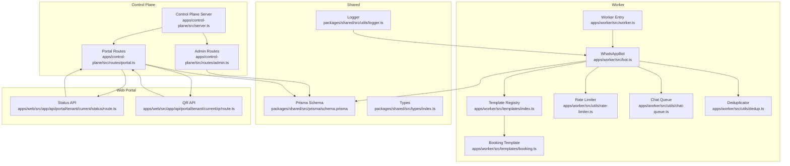
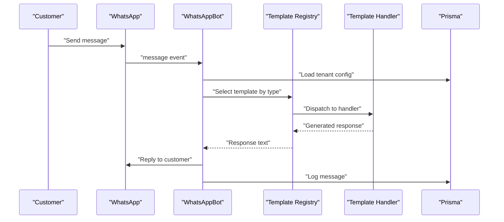
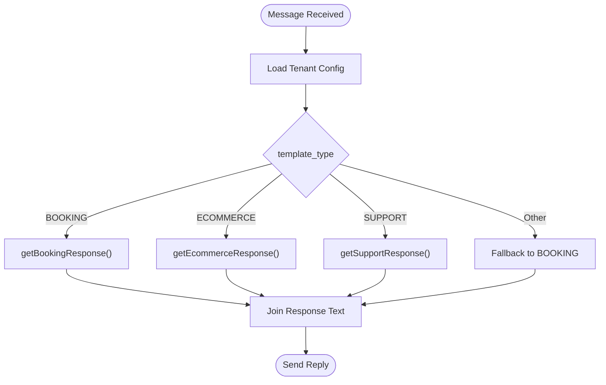
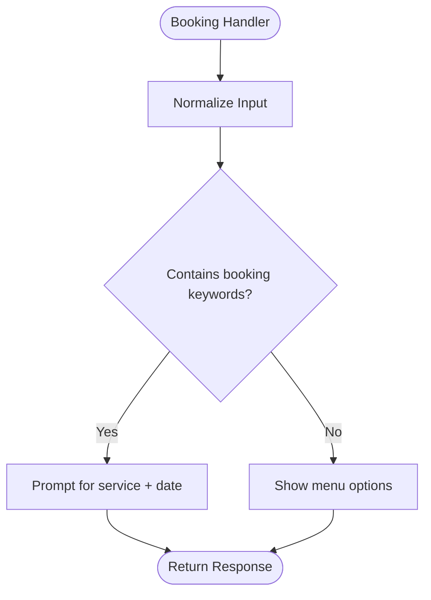
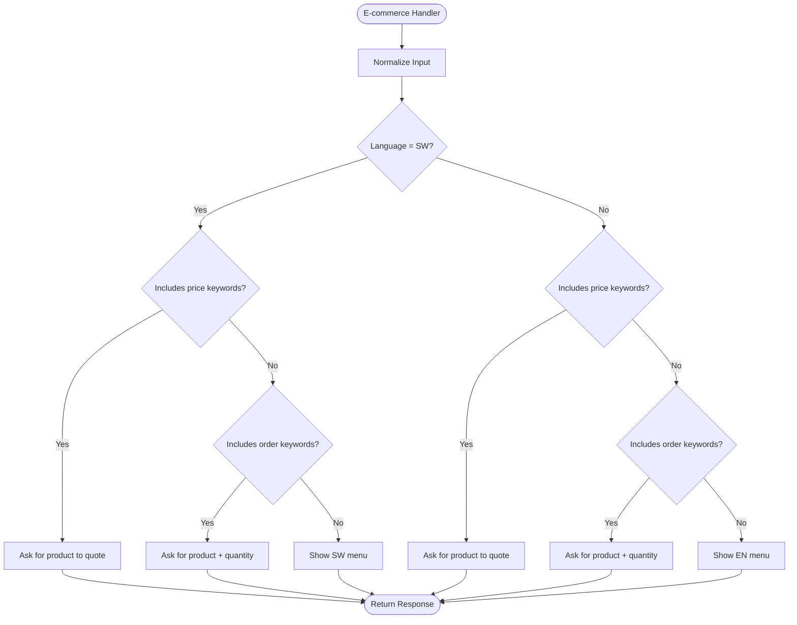
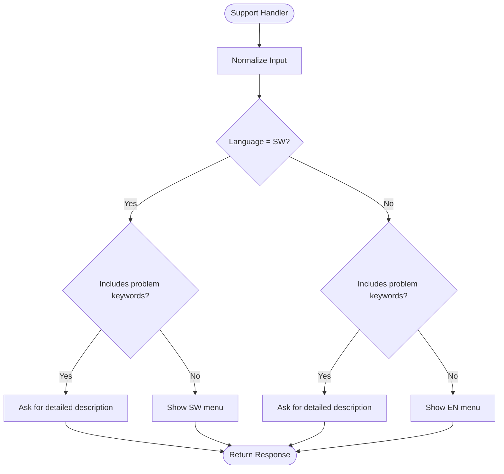
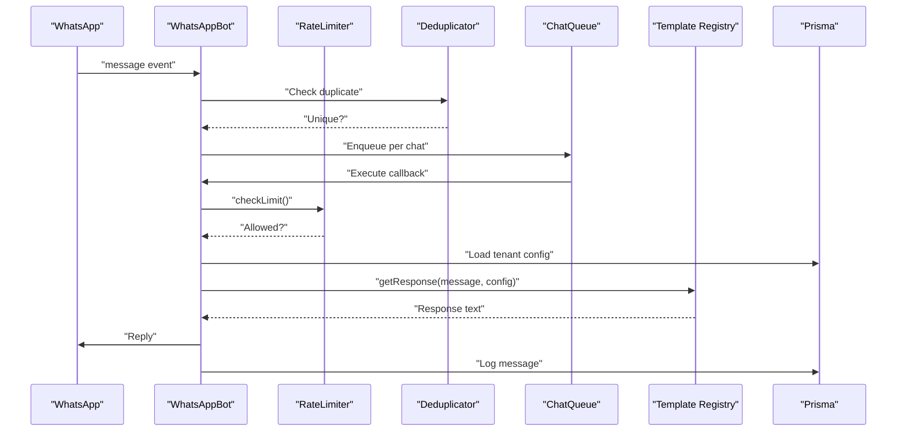
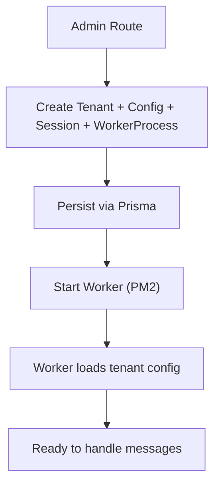
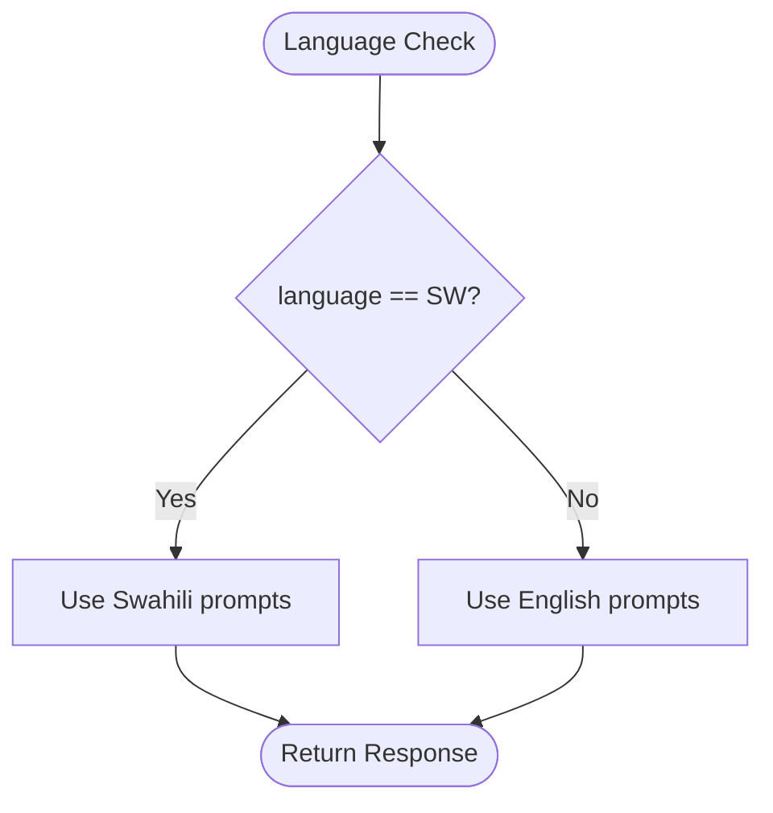
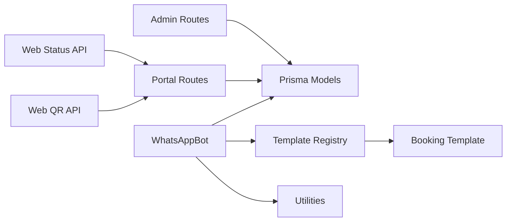

# Template System

<cite>
**Referenced Files in This Document**
- [bot.ts](file://apps/worker/src/bot.ts)
- [worker.ts](file://apps/worker/src/worker.ts)
- [index.ts](file://apps/worker/src/templates/index.ts)
- [booking.ts](file://apps/worker/src/templates/booking.ts)
- [schema.prisma](file://packages/shared/src/prisma/schema.prisma)
- [admin.ts](file://apps/control-plane/src/routes/admin.ts)
- [portal.ts](file://apps/control-plane/src/routes/portal.ts)
- [server.ts](file://apps/control-plane/src/server.ts)
- [types.index.ts](file://packages/shared/src/types/index.ts)
- [rate-limiter.ts](file://apps/worker/src/utils/rate-limiter.ts)
- [chat-queue.ts](file://apps/worker/src/utils/chat-queue.ts)
- [dedup.ts](file://apps/worker/src/utils/dedup.ts)
- [logger.ts](file://packages/shared/src/utils/logger.ts)
- [status.route.ts](file://apps/web/src/app/api/portal/tenant/current/status/route.ts)
- [qr.route.ts](file://apps/web/src/app/api/portal/tenant/current/qr/route.ts)
</cite>

## Table of Contents
1. [Introduction](#introduction)
2. [Project Structure](#project-structure)
3. [Core Components](#core-components)
4. [Architecture Overview](#architecture-overview)
5. [Detailed Component Analysis](#detailed-component-analysis)
6. [Dependency Analysis](#dependency-analysis)
7. [Performance Considerations](#performance-considerations)
8. [Troubleshooting Guide](#troubleshooting-guide)
9. [Conclusion](#conclusion)
10. [Appendices](#appendices)

## Introduction
This document describes the template-based message response system used by the WhatsApp worker. It explains how templates are selected per tenant, how responses are generated for different business types (Booking, E-commerce, Support), and how multilingual support (Swahili/English) is implemented. It also documents the template registration system, template type enumeration, and integration with the Prisma schema. Guidance is included for extending the system with new template types, implementing business-specific response logic, and maintaining consistency across tenants.

## Project Structure
The template system spans three main areas:
- Control plane: tenant lifecycle, configuration persistence, and worker orchestration
- Worker: message ingestion, template selection, response generation, and delivery
- Shared: Prisma schema, TypeScript types, and logging utilities



**Diagram sources**
- [server.ts](file://apps/control-plane/src/server.ts#L1-L89)
- [admin.ts](file://apps/control-plane/src/routes/admin.ts#L1-L528)
- [portal.ts](file://apps/control-plane/src/routes/portal.ts#L1-L246)
- [worker.ts](file://apps/worker/src/worker.ts#L1-L46)
- [bot.ts](file://apps/worker/src/bot.ts#L1-L395)
- [index.ts](file://apps/worker/src/templates/index.ts#L1-L70)
- [booking.ts](file://apps/worker/src/templates/booking.ts#L1-L22)
- [rate-limiter.ts](file://apps/worker/src/utils/rate-limiter.ts#L1-L110)
- [chat-queue.ts](file://apps/worker/src/utils/chat-queue.ts#L1-L140)
- [dedup.ts](file://apps/worker/src/utils/dedup.ts#L1-L93)
- [schema.prisma](file://packages/shared/src/prisma/schema.prisma#L1-L178)
- [types.index.ts](file://packages/shared/src/types/index.ts#L1-L41)
- [logger.ts](file://packages/shared/src/utils/logger.ts#L1-L33)
- [status.route.ts](file://apps/web/src/app/api/portal/tenant/current/status/route.ts#L1-L35)
- [qr.route.ts](file://apps/web/src/app/api/portal/tenant/current/qr/route.ts#L1-L35)

**Section sources**
- [server.ts](file://apps/control-plane/src/server.ts#L1-L89)
- [admin.ts](file://apps/control-plane/src/routes/admin.ts#L104-L140)
- [portal.ts](file://apps/control-plane/src/routes/portal.ts#L85-L153)
- [worker.ts](file://apps/worker/src/worker.ts#L1-L46)
- [bot.ts](file://apps/worker/src/bot.ts#L1-L395)
- [index.ts](file://apps/worker/src/templates/index.ts#L1-L70)
- [booking.ts](file://apps/worker/src/templates/booking.ts#L1-L22)
- [schema.prisma](file://packages/shared/src/prisma/schema.prisma#L18-L90)
- [types.index.ts](file://packages/shared/src/types/index.ts#L21-L27)
- [rate-limiter.ts](file://apps/worker/src/utils/rate-limiter.ts#L1-L110)
- [chat-queue.ts](file://apps/worker/src/utils/chat-queue.ts#L1-L140)
- [dedup.ts](file://apps/worker/src/utils/dedup.ts#L1-L93)
- [logger.ts](file://packages/shared/src/utils/logger.ts#L1-L33)
- [status.route.ts](file://apps/web/src/app/api/portal/tenant/current/status/route.ts#L1-L35)
- [qr.route.ts](file://apps/web/src/app/api/portal/tenant/current/qr/route.ts#L1-L35)

## Core Components
- Template registry: central dispatcher that selects the appropriate template handler based on tenant configuration.
- Template handlers: specialized response generators for each business type.
- Tenant configuration: stores template_type, business_name, and language per tenant.
- Worker runtime: loads tenant config, parses messages, applies rate limiting, deduplicates, queues per chat, and sends responses.
- Control plane: creates tenants, persists configuration, starts/stops workers, and exposes status/QR endpoints.
- Shared Prisma schema: defines enums and models used across the system.

Key implementation patterns:
- Template selection via tenant config
- Multilingual responses based on language flag
- Business-specific intent detection
- Hardening via rate limiting, deduplication, and chat queue

**Section sources**
- [index.ts](file://apps/worker/src/templates/index.ts#L9-L23)
- [booking.ts](file://apps/worker/src/templates/booking.ts#L1-L22)
- [bot.ts](file://apps/worker/src/bot.ts#L212-L230)
- [schema.prisma](file://packages/shared/src/prisma/schema.prisma#L78-L90)
- [admin.ts](file://apps/control-plane/src/routes/admin.ts#L104-L140)
- [portal.ts](file://apps/control-plane/src/routes/portal.ts#L105-L119)

## Architecture Overview
The system follows a decoupled pattern:
- Control plane manages tenant lifecycle and configuration
- Worker subscribes to WhatsApp events, selects templates, and responds
- Shared Prisma schema and types unify data contracts
- Web portal integrates with control plane for status and QR retrieval



**Diagram sources**
- [bot.ts](file://apps/worker/src/bot.ts#L137-L296)
- [index.ts](file://apps/worker/src/templates/index.ts#L9-L23)
- [booking.ts](file://apps/worker/src/templates/booking.ts#L1-L22)
- [schema.prisma](file://packages/shared/src/prisma/schema.prisma#L78-L118)

## Detailed Component Analysis

### Template Registry and Selection
The registry maps tenant template_type to a specific handler and delegates response generation. It supports fallback behavior and includes placeholders for E-commerce and Support.



**Diagram sources**
- [index.ts](file://apps/worker/src/templates/index.ts#L9-L23)
- [booking.ts](file://apps/worker/src/templates/booking.ts#L1-L22)

**Section sources**
- [index.ts](file://apps/worker/src/templates/index.ts#L1-L70)
- [booking.ts](file://apps/worker/src/templates/booking.ts#L1-L22)

### Booking Template Logic
The Booking template detects booking-related intents and responds accordingly in Swahili or English. It uses keyword matching to infer intent and constructs contextual prompts.



**Diagram sources**
- [booking.ts](file://apps/worker/src/templates/booking.ts#L1-L22)

**Section sources**
- [booking.ts](file://apps/worker/src/templates/booking.ts#L1-L22)

### E-commerce Template Logic
The E-commerce template responds to price and order queries, with distinct prompts for Swahili and English. It provides structured guidance for customers.



**Diagram sources**
- [index.ts](file://apps/worker/src/templates/index.ts#L25-L49)

**Section sources**
- [index.ts](file://apps/worker/src/templates/index.ts#L25-L49)

### Support Template Logic
The Support template handles issue reporting and general inquiries, offering multilingual guidance and structured prompts.



**Diagram sources**
- [index.ts](file://apps/worker/src/templates/index.ts#L51-L69)

**Section sources**
- [index.ts](file://apps/worker/src/templates/index.ts#L51-L69)

### Worker Runtime and Message Flow
The worker orchestrates message handling with rate limiting, deduplication, and per-chat queuing. It loads tenant configuration, generates responses via the template registry, and logs outcomes.



**Diagram sources**
- [bot.ts](file://apps/worker/src/bot.ts#L137-L296)
- [rate-limiter.ts](file://apps/worker/src/utils/rate-limiter.ts#L32-L73)
- [chat-queue.ts](file://apps/worker/src/utils/chat-queue.ts#L35-L68)
- [dedup.ts](file://apps/worker/src/utils/dedup.ts#L28-L46)
- [index.ts](file://apps/worker/src/templates/index.ts#L9-L23)

**Section sources**
- [bot.ts](file://apps/worker/src/bot.ts#L137-L296)
- [rate-limiter.ts](file://apps/worker/src/utils/rate-limiter.ts#L1-L110)
- [chat-queue.ts](file://apps/worker/src/utils/chat-queue.ts#L1-L140)
- [dedup.ts](file://apps/worker/src/utils/dedup.ts#L1-L93)
- [index.ts](file://apps/worker/src/templates/index.ts#L1-L70)

### Tenant Creation and Template Registration
Tenants are created with initial configuration including template_type, business_name, and language. The worker loads this configuration at startup and uses it to select the appropriate template handler.



**Diagram sources**
- [admin.ts](file://apps/control-plane/src/routes/admin.ts#L104-L140)
- [schema.prisma](file://packages/shared/src/prisma/schema.prisma#L60-L131)

**Section sources**
- [admin.ts](file://apps/control-plane/src/routes/admin.ts#L104-L140)
- [schema.prisma](file://packages/shared/src/prisma/schema.prisma#L78-L90)

### Multilingual Support (Swahili/English)
Multilingual responses are implemented by checking the language field in tenant configuration and selecting localized prompts. Both Booking and Support templates demonstrate this pattern.



**Diagram sources**
- [index.ts](file://apps/worker/src/templates/index.ts#L9-L23)
- [booking.ts](file://apps/worker/src/templates/booking.ts#L9-L14)

**Section sources**
- [index.ts](file://apps/worker/src/templates/index.ts#L9-L23)
- [booking.ts](file://apps/worker/src/templates/booking.ts#L9-L14)

### Template Type Enumeration and Prisma Integration
Template types and languages are defined as enums in the Prisma schema and are persisted with tenant configuration. The worker reads these values to select the correct template handler.

```mermaid
erEnum "TemplateType" {
BOOKING
ECOMMERCE
SUPPORT
}
erEnum "Language" {
SW
EN
}
```

**Diagram sources**
- [schema.prisma](file://packages/shared/src/prisma/schema.prisma#L18-L27)

**Section sources**
- [schema.prisma](file://packages/shared/src/prisma/schema.prisma#L18-L27)
- [schema.prisma](file://packages/shared/src/prisma/schema.prisma#L78-L90)
- [types.index.ts](file://packages/shared/src/types/index.ts#L21-L27)

### Practical Examples
- Template response generation: The registry dispatches to the appropriate handler based on template_type and language.
- Message parsing and routing: The worker normalizes input, checks rate limits, deduplicates, enqueues per chat, and finally sends a response.
- Template-specific business logic: Handlers implement intent detection and prompt construction tailored to the business domain.

**Section sources**
- [index.ts](file://apps/worker/src/templates/index.ts#L9-L23)
- [booking.ts](file://apps/worker/src/templates/booking.ts#L1-L22)
- [bot.ts](file://apps/worker/src/bot.ts#L232-L296)

### Extensibility Mechanisms for Custom Templates
To add a new template type:
1. Define a new handler function in the templates directory.
2. Register the handler in the template registry and add a case for the new template_type.
3. Update the Prisma schema if new fields are needed.
4. Ensure the handler supports multilingual responses.
5. Test with tenant creation and worker startup.

Guidance:
- Keep handlers pure and deterministic for easier testing.
- Use consistent prompt patterns across languages.
- Add logging around intent detection for observability.

**Section sources**
- [index.ts](file://apps/worker/src/templates/index.ts#L1-L70)
- [schema.prisma](file://packages/shared/src/prisma/schema.prisma#L78-L90)

### Creating New Template Types
Steps:
- Add a new handler module under templates.
- Extend the registry to route the new template_type.
- Update control plane routes to accept the new type during tenant creation/upsert.
- Ensure the handler respects language and business_name.

**Section sources**
- [booking.ts](file://apps/worker/src/templates/booking.ts#L1-L22)
- [index.ts](file://apps/worker/src/templates/index.ts#L1-L70)
- [portal.ts](file://apps/control-plane/src/routes/portal.ts#L105-L119)
- [admin.ts](file://apps/control-plane/src/routes/admin.ts#L104-L140)

### Maintaining Template Consistency Across Tenants
- Centralize prompt logic in handlers.
- Use tenant business_name consistently.
- Monitor rate limits and logs to detect anomalies.
- Use the control plane to audit tenant configurations and worker status.

**Section sources**
- [rate-limiter.ts](file://apps/worker/src/utils/rate-limiter.ts#L1-L110)
- [logger.ts](file://packages/shared/src/utils/logger.ts#L1-L33)
- [admin.ts](file://apps/control-plane/src/routes/admin.ts#L82-L102)

## Dependency Analysis
The system exhibits clear separation of concerns:
- Control plane depends on Prisma models and routes to manage tenants and workers.
- Worker depends on the template registry and utilities for reliability.
- Shared package provides schema and types used across services.



**Diagram sources**
- [admin.ts](file://apps/control-plane/src/routes/admin.ts#L1-L528)
- [portal.ts](file://apps/control-plane/src/routes/portal.ts#L1-L246)
- [bot.ts](file://apps/worker/src/bot.ts#L1-L395)
- [index.ts](file://apps/worker/src/templates/index.ts#L1-L70)
- [booking.ts](file://apps/worker/src/templates/booking.ts#L1-L22)
- [schema.prisma](file://packages/shared/src/prisma/schema.prisma#L1-L178)
- [status.route.ts](file://apps/web/src/app/api/portal/tenant/current/status/route.ts#L1-L35)
- [qr.route.ts](file://apps/web/src/app/api/portal/tenant/current/qr/route.ts#L1-L35)

**Section sources**
- [admin.ts](file://apps/control-plane/src/routes/admin.ts#L1-L528)
- [portal.ts](file://apps/control-plane/src/routes/portal.ts#L1-L246)
- [bot.ts](file://apps/worker/src/bot.ts#L1-L395)
- [index.ts](file://apps/worker/src/templates/index.ts#L1-L70)
- [booking.ts](file://apps/worker/src/templates/booking.ts#L1-L22)
- [schema.prisma](file://packages/shared/src/prisma/schema.prisma#L1-L178)
- [status.route.ts](file://apps/web/src/app/api/portal/tenant/current/status/route.ts#L1-L35)
- [qr.route.ts](file://apps/web/src/app/api/portal/tenant/current/qr/route.ts#L1-L35)

## Performance Considerations
- Rate limiting prevents burst responses; adjust maxRequests/windowMs via environment variables.
- Deduplication avoids redundant processing using message IDs.
- Chat queue ensures single-threaded processing per chat to maintain message ordering.
- Heartbeat monitoring keeps workers healthy; stale workers are auto-detected and marked.

Recommendations:
- Tune rate limit per tenant workload.
- Monitor queue sizes and adjust maxQueueSize if needed.
- Use structured logging to track performance and errors.

**Section sources**
- [rate-limiter.ts](file://apps/worker/src/utils/rate-limiter.ts#L21-L26)
- [dedup.ts](file://apps/worker/src/utils/dedup.ts#L16-L22)
- [chat-queue.ts](file://apps/worker/src/utils/chat-queue.ts#L26-L29)
- [bot.ts](file://apps/worker/src/bot.ts#L317-L343)

## Troubleshooting Guide
Common issues and resolutions:
- Worker fails to start: Verify TENANT_ID and SESSIONS_PATH; check database connectivity.
- No response to messages: Confirm template_type and language are set; inspect rate limit warnings; review logs.
- Duplicate messages: Deduplication should prevent repeated processing; check dedup cache stats.
- Stale workers: Control plane marks workers as ERROR if no heartbeat; restart worker via control plane.
- Web portal unauthorized: Ensure PORTAL_INTERNAL_KEY is configured and headers are passed correctly.

**Section sources**
- [worker.ts](file://apps/worker/src/worker.ts#L12-L15)
- [bot.ts](file://apps/worker/src/bot.ts#L248-L263)
- [dedup.ts](file://apps/worker/src/utils/dedup.ts#L28-L46)
- [admin.ts](file://apps/control-plane/src/routes/admin.ts#L30-L80)
- [status.route.ts](file://apps/web/src/app/api/portal/tenant/current/status/route.ts#L11-L13)
- [qr.route.ts](file://apps/web/src/app/api/portal/tenant/current/qr/route.ts#L11-L13)

## Conclusion
The template-based message response system cleanly separates tenant configuration, template logic, and worker runtime. It supports multiple business types, multilingual responses, and robust operational controls. Extending the system with new template types is straightforward, requiring minimal changes to the registry and handler modules while leveraging shared Prisma models and types.

## Appendices

### API Definitions
- Tenant creation endpoint accepts template_type, business_name, and language.
- Portal endpoints expose status and QR data for tenant sessions.
- Worker lifecycle is managed via control plane routes.

**Section sources**
- [admin.ts](file://apps/control-plane/src/routes/admin.ts#L104-L140)
- [portal.ts](file://apps/control-plane/src/routes/portal.ts#L159-L216)
- [status.route.ts](file://apps/web/src/app/api/portal/tenant/current/status/route.ts#L1-L35)
- [qr.route.ts](file://apps/web/src/app/api/portal/tenant/current/qr/route.ts#L1-L35)