# Template System

<cite>
**Referenced Files in This Document**
- [bot.ts](file://apps/worker/src/bot.ts)
- [worker.ts](file://apps/worker/src/worker.ts)
- [index.ts](file://apps/worker/src/templates/index.ts)
- [booking.ts](file://apps/worker/src/templates/booking.ts)
- [healthcare.ts](file://apps/worker/src/templates/healthcare.ts)
- [real-estate.ts](file://apps/worker/src/templates/real-estate.ts)
- [restaurant.ts](file://apps/worker/src/templates/restaurant.ts)
- [schema.prisma](file://packages/shared/src/prisma/schema.prisma)
- [admin.ts](file://apps/control-plane/src/routes/admin.ts)
- [portal.ts](file://apps/control-plane/src/routes/portal.ts)
- [server.ts](file://apps/control-plane/src/server.ts)
- [types.index.ts](file://packages/shared/src/types/index.ts)
- [rate-limiter.ts](file://apps/worker/src/utils/rate-limiter.ts)
- [chat-queue.ts](file://apps/worker/src/utils/chat-queue.ts)
- [dedup.ts](file://apps/worker/src/utils/dedup.ts)
- [logger.ts](file://packages/shared/src/utils/logger.ts)
- [status.route.ts](file://apps/web/src/app/api/portal/tenant/current/status/route.ts)
- [qr.route.ts](file://apps/web/src/app/api/portal/tenant/current/qr/route.ts)
</cite>

## Update Summary
**Changes Made**
- Added documentation for three new business template systems: Healthcare, Real Estate, and Restaurant
- Updated template registry to include new template handlers
- Enhanced template architecture with industry-specific conversational flows
- Updated Prisma schema documentation to reflect new template types
- Added practical examples for new template response generation

## Table of Contents
1. [Introduction](#introduction)
2. [Project Structure](#project-structure)
3. [Core Components](#core-components)
4. [Architecture Overview](#architecture-overview)
5. [Detailed Component Analysis](#detailed-component-analysis)
6. [Dependency Analysis](#dependency-analysis)
7. [Performance Considerations](#performance-considerations)
8. [Troubleshooting Guide](#troubleshooting-guide)
9. [Conclusion](#conclusion)
10. [Appendices](#appendices)

## Introduction
This document describes the template-based message response system used by the WhatsApp worker. It explains how templates are selected per tenant, how responses are generated for different business types (Booking, E-commerce, Support, Healthcare, Real Estate, Restaurant), and how multilingual support (Swahili/English) is implemented. It also documents the template registration system, template type enumeration, and integration with the Prisma schema. Guidance is included for extending the system with new template types, implementing business-specific response logic, and maintaining consistency across tenants.

## Project Structure
The template system spans three main areas:
- Control plane: tenant lifecycle, configuration persistence, and worker orchestration
- Worker: message ingestion, template selection, response generation, and delivery
- Shared: Prisma schema, TypeScript types, and logging utilities

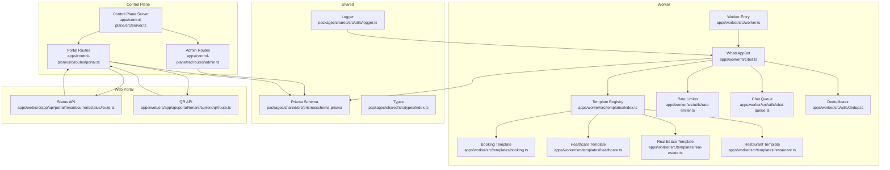
```mermaid
graph TB
subgraph "Control Plane"
CP_SERVER["Control Plane Server<br/>apps/control-plane/src/server.ts"]
CP_ADMIN["Admin Routes<br/>apps/control-plane/src/routes/admin.ts"]
CP_PORTAL["Portal Routes<br/>apps/control-plane/src/routes/portal.ts"]
end
subgraph "Worker"
WORKER_ENTRY["Worker Entry<br/>apps/worker/src/worker.ts"]
BOT["WhatsAppBot<br/>apps/worker/src/bot.ts"]
TEMPLATES_IDX["Template Registry<br/>apps/worker/src/templates/index.ts"]
TEMPLATE_BOOKING["Booking Template<br/>apps/worker/src/templates/booking.ts"]
TEMPLATE_HEALTHCARE["Healthcare Template<br/>apps/worker/src/templates/healthcare.ts"]
TEMPLATE_REAL_ESTATE["Real Estate Template<br/>apps/worker/src/templates/real-estate.ts"]
TEMPLATE_RESTAURANT["Restaurant Template<br/>apps/worker/src/templates/restaurant.ts"]
UTIL_RATE["Rate Limiter<br/>apps/worker/src/utils/rate-limiter.ts"]
UTIL_QUEUE["Chat Queue<br/>apps/worker/src/utils/chat-queue.ts"]
UTIL_DEDUP["Deduplicator<br/>apps/worker/src/utils/dedup.ts"]
end
subgraph "Shared"
PRISMA_SCHEMA["Prisma Schema<br/>packages/shared/src/prisma/schema.prisma"]
TYPES_INDEX["Types<br/>packages/shared/src/types/index.ts"]
LOGGER["Logger<br/>packages/shared/src/utils/logger.ts"]
end
subgraph "Web Portal"
WEB_STATUS["Status API<br/>apps/web/src/app/api/portal/tenant/current/status/route.ts"]
WEB_QR["QR API<br/>apps/web/src/app/api/portal/tenant/current/qr/route.ts"]
end
CP_SERVER --> CP_ADMIN
CP_SERVER --> CP_PORTAL
CP_PORTAL --> WEB_STATUS
CP_PORTAL --> WEB_QR
WORKER_ENTRY --> BOT
BOT --> TEMPLATES_IDX
TEMPLATES_IDX --> TEMPLATE_BOOKING
TEMPLATES_IDX --> TEMPLATE_HEALTHCARE
TEMPLATES_IDX --> TEMPLATE_REAL_ESTATE
TEMPLATES_IDX --> TEMPLATE_RESTAURANT
BOT --> UTIL_RATE
BOT --> UTIL_QUEUE
BOT --> UTIL_DEDUP
CP_ADMIN --> PRISMA_SCHEMA
CP_PORTAL --> PRISMA_SCHEMA
BOT --> PRISMA_SCHEMA
WEB_STATUS --> CP_PORTAL
WEB_QR --> CP_PORTAL
LOGGER --> BOT
```

**Diagram sources**
- [server.ts](file://apps/control-plane/src/server.ts#L1-L89)
- [admin.ts](file://apps/control-plane/src/routes/admin.ts#L1-L432)
- [portal.ts](file://apps/control-plane/src/routes/portal.ts#L1-L251)
- [worker.ts](file://apps/worker/src/worker.ts#L1-L46)
- [bot.ts](file://apps/worker/src/bot.ts#L1-L395)
- [index.ts](file://apps/worker/src/templates/index.ts#L1-L79)
- [booking.ts](file://apps/worker/src/templates/booking.ts#L1-L22)
- [healthcare.ts](file://apps/worker/src/templates/healthcare.ts#L1-L38)
- [real-estate.ts](file://apps/worker/src/templates/real-estate.ts#L1-L32)
- [restaurant.ts](file://apps/worker/src/templates/restaurant.ts#L1-L38)
- [rate-limiter.ts](file://apps/worker/src/utils/rate-limiter.ts#L1-L110)
- [chat-queue.ts](file://apps/worker/src/utils/chat-queue.ts#L1-L140)
- [dedup.ts](file://apps/worker/src/utils/dedup.ts#L1-L93)
- [schema.prisma](file://packages/shared/src/prisma/schema.prisma#L1-L261)
- [types.index.ts](file://packages/shared/src/types/index.ts#L1-L41)
- [logger.ts](file://packages/shared/src/utils/logger.ts#L1-L33)
- [status.route.ts](file://apps/web/src/app/api/portal/tenant/current/status/route.ts#L1-L35)
- [qr.route.ts](file://apps/web/src/app/api/portal/tenant/current/qr/route.ts#L1-L35)

**Section sources**
- [server.ts](file://apps/control-plane/src/server.ts#L1-L89)
- [admin.ts](file://apps/control-plane/src/routes/admin.ts#L92-L128)
- [portal.ts](file://apps/control-plane/src/routes/portal.ts#L85-L158)
- [worker.ts](file://apps/worker/src/worker.ts#L1-L46)
- [bot.ts](file://apps/worker/src/bot.ts#L1-L395)
- [index.ts](file://apps/worker/src/templates/index.ts#L1-L79)
- [booking.ts](file://apps/worker/src/templates/booking.ts#L1-L22)
- [healthcare.ts](file://apps/worker/src/templates/healthcare.ts#L1-L38)
- [real-estate.ts](file://apps/worker/src/templates/real-estate.ts#L1-L32)
- [restaurant.ts](file://apps/worker/src/templates/restaurant.ts#L1-L38)
- [schema.prisma](file://packages/shared/src/prisma/schema.prisma#L18-L25)
- [types.index.ts](file://packages/shared/src/types/index.ts#L21-L27)
- [rate-limiter.ts](file://apps/worker/src/utils/rate-limiter.ts#L1-L110)
- [chat-queue.ts](file://apps/worker/src/utils/chat-queue.ts#L1-L140)
- [dedup.ts](file://apps/worker/src/utils/dedup.ts#L1-L93)
- [logger.ts](file://packages/shared/src/utils/logger.ts#L1-L33)
- [status.route.ts](file://apps/web/src/app/api/portal/tenant/current/status/route.ts#L1-L35)
- [qr.route.ts](file://apps/web/src/app/api/portal/tenant/current/qr/route.ts#L1-L35)

## Core Components
- Template registry: central dispatcher that selects the appropriate template handler based on tenant configuration.
- Template handlers: specialized response generators for each business type including new Healthcare, Real Estate, and Restaurant templates.
- Tenant configuration: stores template_type, business_name, and language per tenant.
- Worker runtime: loads tenant config, parses messages, applies rate limiting, deduplicates, queues per chat, and sends responses.
- Control plane: creates tenants, persists configuration, starts/stops workers, and exposes status/QR endpoints.
- Shared Prisma schema: defines enums and models used across the system.

Key implementation patterns:
- Template selection via tenant config
- Multilingual responses based on language flag
- Business-specific intent detection
- Hardening via rate limiting, deduplication, and chat queue

**Section sources**
- [index.ts](file://apps/worker/src/templates/index.ts#L6-L10)
- [booking.ts](file://apps/worker/src/templates/booking.ts#L1-L22)
- [healthcare.ts](file://apps/worker/src/templates/healthcare.ts#L1-L38)
- [real-estate.ts](file://apps/worker/src/templates/real-estate.ts#L1-L32)
- [restaurant.ts](file://apps/worker/src/templates/restaurant.ts#L1-L38)
- [bot.ts](file://apps/worker/src/bot.ts#L212-L230)
- [schema.prisma](file://packages/shared/src/prisma/schema.prisma#L18-L25)
- [admin.ts](file://apps/control-plane/src/routes/admin.ts#L92-L128)
- [portal.ts](file://apps/control-plane/src/routes/portal.ts#L97-L158)

## Architecture Overview
The system follows a decoupled pattern:
- Control plane manages tenant lifecycle and configuration
- Worker subscribes to WhatsApp events, selects templates, and responds
- Shared Prisma schema and types unify data contracts
- Web portal integrates with control plane for status and QR retrieval

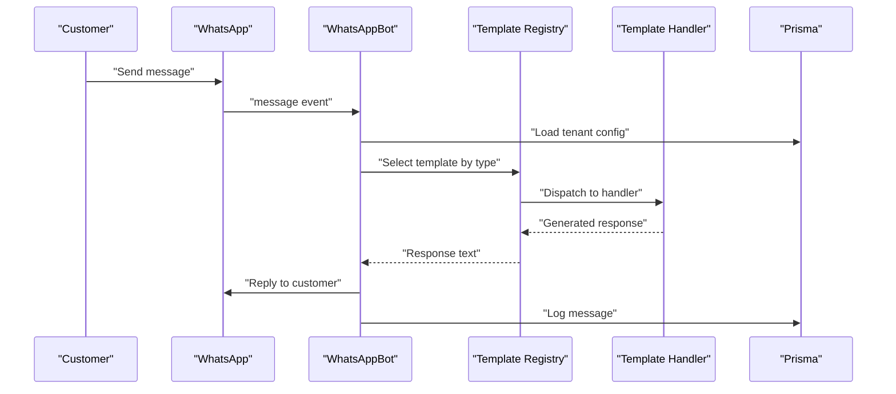
```mermaid
sequenceDiagram
participant User as "Customer"
participant WA as "WhatsApp"
participant Bot as "WhatsAppBot"
participant Reg as "Template Registry"
participant Temp as "Template Handler"
participant DB as "Prisma"
User->>WA : "Send message"
WA->>Bot : "message event"
Bot->>DB : "Load tenant config"
Bot->>Reg : "Select template by type"
Reg->>Temp : "Dispatch to handler"
Temp-->>Reg : "Generated response"
Reg-->>Bot : "Response text"
Bot->>WA : "Reply to customer"
Bot->>DB : "Log message"
```

**Diagram sources**
- [bot.ts](file://apps/worker/src/bot.ts#L137-L296)
- [index.ts](file://apps/worker/src/templates/index.ts#L12-L32)
- [booking.ts](file://apps/worker/src/templates/booking.ts#L1-L22)
- [healthcare.ts](file://apps/worker/src/templates/healthcare.ts#L1-L38)
- [real-estate.ts](file://apps/worker/src/templates/real-estate.ts#L1-L32)
- [restaurant.ts](file://apps/worker/src/templates/restaurant.ts#L1-L38)
- [schema.prisma](file://packages/shared/src/prisma/schema.prisma#L18-L25)

## Detailed Component Analysis

### Template Registry and Selection
The registry maps tenant template_type to a specific handler and delegates response generation. It supports fallback behavior and includes handlers for all six template types including the new Healthcare, Real Estate, and Restaurant templates.

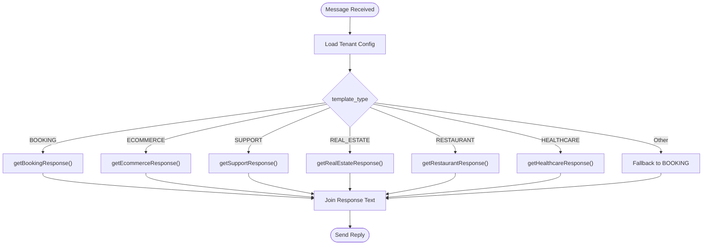
```mermaid
flowchart TD
Start(["Message Received"]) --> LoadCfg["Load Tenant Config"]
LoadCfg --> Select{"template_type"}
Select --> |BOOKING| Booking["getBookingResponse()"]
Select --> |ECOMMERCE| Ecom["getEcommerceResponse()"]
Select --> |SUPPORT| Support["getSupportResponse()"]
Select --> |REAL_ESTATE| RealEstate["getRealEstateResponse()"]
Select --> |RESTAURANT| Restaurant["getRestaurantResponse()"]
Select --> |HEALTHCARE| Healthcare["getHealthcareResponse()"]
Select --> |Other| Fallback["Fallback to BOOKING"]
Booking --> Join["Join Response Text"]
Ecom --> Join
Support --> Join
RealEstate --> Join
Restaurant --> Join
Healthcare --> Join
Fallback --> Join
Join --> End(["Send Reply"])
```

**Diagram sources**
- [index.ts](file://apps/worker/src/templates/index.ts#L12-L32)
- [booking.ts](file://apps/worker/src/templates/booking.ts#L1-L22)
- [healthcare.ts](file://apps/worker/src/templates/healthcare.ts#L1-L38)
- [real-estate.ts](file://apps/worker/src/templates/real-estate.ts#L1-L32)
- [restaurant.ts](file://apps/worker/src/templates/restaurant.ts#L1-L38)

**Section sources**
- [index.ts](file://apps/worker/src/templates/index.ts#L1-L79)
- [booking.ts](file://apps/worker/src/templates/booking.ts#L1-L22)
- [healthcare.ts](file://apps/worker/src/templates/healthcare.ts#L1-L38)
- [real-estate.ts](file://apps/worker/src/templates/real-estate.ts#L1-L32)
- [restaurant.ts](file://apps/worker/src/templates/restaurant.ts#L1-L38)

### Healthcare Template Logic
The Healthcare template handles emergency protocols, appointment scheduling, medicine prescriptions, and pricing inquiries. It provides specialized responses for medical emergencies and routine consultations.

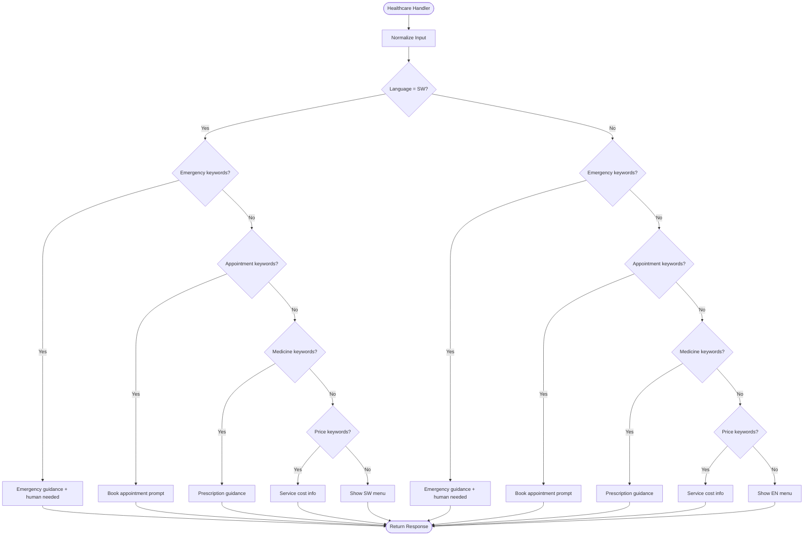
```mermaid
flowchart TD
H_Start(["Healthcare Handler"]) --> Lower["Normalize Input"]
Lower --> Lang{"Language = SW?"}
Lang --> |Yes| EmergencySW{"Emergency keywords?"}
EmergencySW --> |Yes| EmergencyRespSW["Emergency guidance + human needed"]
EmergencySW --> |No| AppointmentSW{"Appointment keywords?"}
AppointmentSW --> |Yes| BookSW["Book appointment prompt"]
AppointmentSW --> |No| MedicineSW{"Medicine keywords?"}
MedicineSW --> |Yes| PrescSW["Prescription guidance"]
MedicineSW --> |No| PriceSW{"Price keywords?"}
PriceSW --> |Yes| CostSW["Service cost info"]
PriceSW --> |No| MenuSW["Show SW menu"]
Lang --> |No| EmergencyEN{"Emergency keywords?"}
EmergencyEN --> |Yes| EmergencyRespEN["Emergency guidance + human needed"]
EmergencyEN --> |No| AppointmentEN{"Appointment keywords?"}
AppointmentEN --> |Yes| BookEN["Book appointment prompt"]
AppointmentEN --> |No| MedicineEN{"Medicine keywords?"}
MedicineEN --> |Yes| PrescEN["Prescription guidance"]
MedicineEN --> |No| PriceEN{"Price keywords?"}
PriceEN --> |Yes| CostEN["Service cost info"]
PriceEN --> |No| MenuEN["Show EN menu"]
EmergencyRespSW --> H_End(["Return Response"])
BookSW --> H_End
PrescSW --> H_End
CostSW --> H_End
MenuSW --> H_End
EmergencyRespEN --> H_End
BookEN --> H_End
PrescEN --> H_End
CostEN --> H_End
MenuEN --> H_End
```

**Diagram sources**
- [healthcare.ts](file://apps/worker/src/templates/healthcare.ts#L1-L38)

**Section sources**
- [healthcare.ts](file://apps/worker/src/templates/healthcare.ts#L1-L38)

### Real Estate Template Logic
The Real Estate template manages property listings, price inquiries, and property viewing arrangements. It handles both rental and sales property conversations.

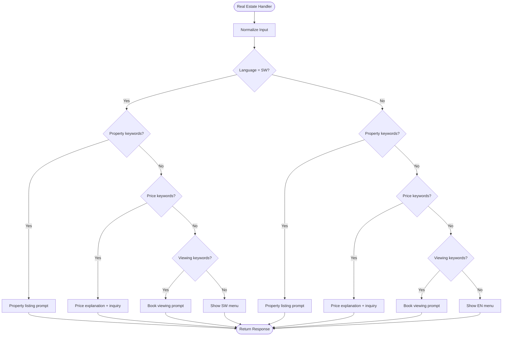
```mermaid
flowchart TD
R_Start(["Real Estate Handler"]) --> Lower["Normalize Input"]
Lower --> Lang{"Language = SW?"}
Lang --> |Yes| PropertySW{"Property keywords?"}
PropertySW --> |Yes| ListSW["Property listing prompt"]
PropertySW --> |No| PriceSW{"Price keywords?"}
PriceSW --> |Yes| QuoteSW["Price explanation + inquiry"]
PriceSW --> |No| ViewSW{"Viewing keywords?"}
ViewSW --> |Yes| BookViewSW["Book viewing prompt"]
ViewSW --> |No| MenuSW["Show SW menu"]
Lang --> |No| PropertyEN{"Property keywords?"}
PropertyEN --> |Yes| ListEN["Property listing prompt"]
PropertyEN --> |No| PriceEN{"Price keywords?"}
PriceEN --> |Yes| QuoteEN["Price explanation + inquiry"]
PriceEN --> |No| ViewEN{"Viewing keywords?"}
ViewEN --> |Yes| BookViewEN["Book viewing prompt"]
ViewEN --> |No| MenuEN["Show EN menu"]
ListSW --> R_End(["Return Response"])
QuoteSW --> R_End
BookViewSW --> R_End
MenuSW --> R_End
ListEN --> R_End
QuoteEN --> R_End
BookViewEN --> R_End
MenuEN --> R_End
```

**Diagram sources**
- [real-estate.ts](file://apps/worker/src/templates/real-estate.ts#L1-L32)

**Section sources**
- [real-estate.ts](file://apps/worker/src/templates/real-estate.ts#L1-L32)

### Restaurant Template Logic
The Restaurant template handles menu inquiries, food ordering, table reservations, and pricing questions. It provides comprehensive dining service responses.

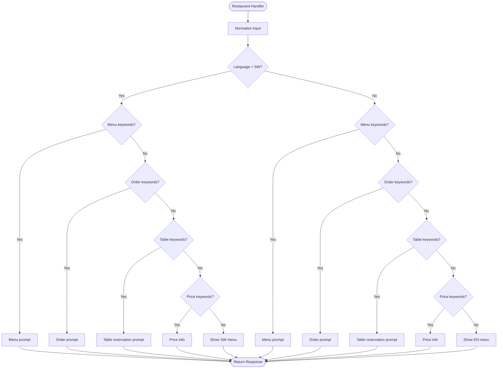
```mermaid
flowchart TD
Rest_Start(["Restaurant Handler"]) --> Lower["Normalize Input"]
Lower --> Lang{"Language = SW?"}
Lang --> |Yes| MenuSW{"Menu keywords?"}
MenuSW --> |Yes| MenuRespSW["Menu prompt"]
MenuSW --> |No| OrderSW{"Order keywords?"}
OrderSW --> |Yes| OrderRespSW["Order prompt"]
OrderSW --> |No| TableSW{"Table keywords?"}
TableSW --> |Yes| TableRespSW["Table reservation prompt"]
TableSW --> |No| PriceSW{"Price keywords?"}
PriceSW --> |Yes| PriceRespSW["Price info"]
PriceSW --> |No| MenuSW2["Show SW menu"]
Lang --> |No| MenuEN{"Menu keywords?"}
MenuEN --> |Yes| MenuRespEN["Menu prompt"]
MenuEN --> |No| OrderEN{"Order keywords?"}
OrderEN --> |Yes| OrderRespEN["Order prompt"]
OrderEN --> |No| TableEN{"Table keywords?"}
TableEN --> |Yes| TableRespEN["Table reservation prompt"]
TableEN --> |No| PriceEN{"Price keywords?"}
PriceEN --> |Yes| PriceRespEN["Price info"]
PriceEN --> |No| MenuEN2["Show EN menu"]
MenuRespSW --> Rest_End(["Return Response"])
OrderRespSW --> Rest_End
TableRespSW --> Rest_End
PriceRespSW --> Rest_End
MenuSW2 --> Rest_End
MenuRespEN --> Rest_End
OrderRespEN --> Rest_End
TableRespEN --> Rest_End
PriceRespEN --> Rest_End
MenuEN2 --> Rest_End
```

**Diagram sources**
- [restaurant.ts](file://apps/worker/src/templates/restaurant.ts#L1-L38)

**Section sources**
- [restaurant.ts](file://apps/worker/src/templates/restaurant.ts#L1-L38)

### E-commerce Template Logic
The E-commerce template responds to price and order queries, with distinct prompts for Swahili and English. It provides structured guidance for customers.

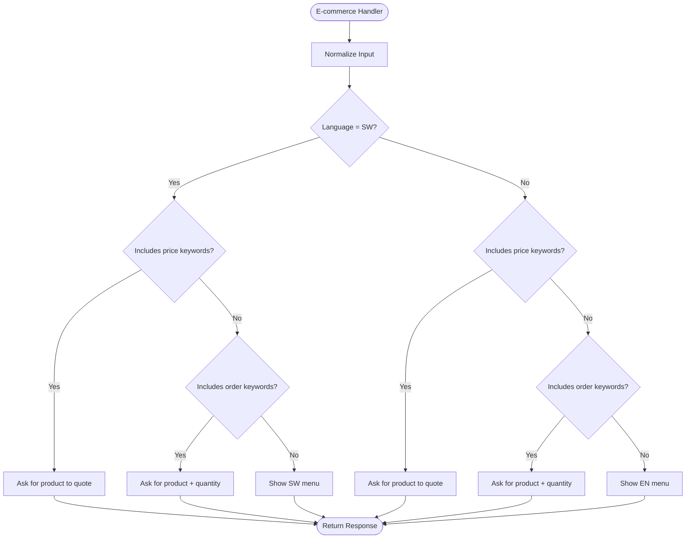
```mermaid
flowchart TD
E_Start(["E-commerce Handler"]) --> Lower["Normalize Input"]
Lower --> Lang{"Language = SW?"}
Lang --> |Yes| PriceSW{"Includes price keywords?"}
PriceSW --> |Yes| AskPriceSW["Ask for product to quote"]
PriceSW --> |No| OrderSW{"Includes order keywords?"}
OrderSW --> |Yes| AskOrderSW["Ask for product + quantity"]
OrderSW --> |No| MenuSW["Show SW menu"]
Lang --> |No| PriceEN{"Includes price keywords?"}
PriceEN --> |Yes| AskPriceEN["Ask for product to quote"]
PriceEN --> |No| OrderEN{"Includes order keywords?"}
OrderEN --> |Yes| AskOrderEN["Ask for product + quantity"]
OrderEN --> |No| MenuEN["Show EN menu"]
AskPriceSW --> E_End(["Return Response"])
AskOrderSW --> E_End
MenuSW --> E_End
AskPriceEN --> E_End
AskOrderEN --> E_End
MenuEN --> E_End
```

**Diagram sources**
- [index.ts](file://apps/worker/src/templates/index.ts#L34-L58)

**Section sources**
- [index.ts](file://apps/worker/src/templates/index.ts#L34-L58)

### Support Template Logic
The Support template handles issue reporting and general inquiries, offering multilingual guidance and structured prompts.

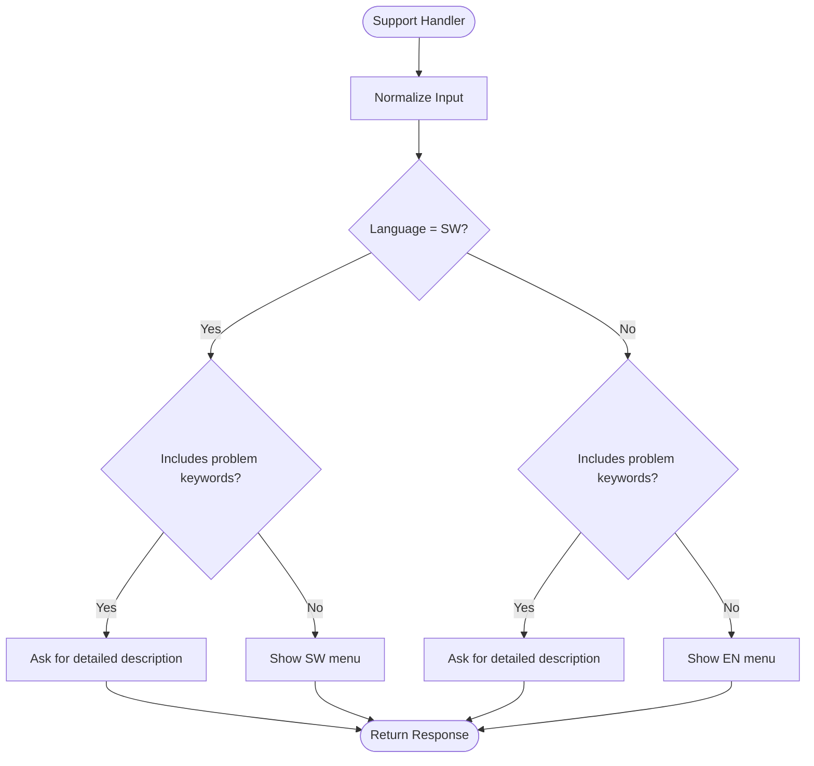
```mermaid
flowchart TD
S_Start(["Support Handler"]) --> Lower["Normalize Input"]
Lower --> Lang{"Language = SW?"}
Lang --> |Yes| IssueSW{"Includes problem keywords?"}
IssueSW --> |Yes| DescribeSW["Ask for detailed description"]
IssueSW --> |No| MenuSW["Show SW menu"]
Lang --> |No| IssueEN{"Includes problem keywords?"}
IssueEN --> |Yes| DescribeEN["Ask for detailed description"]
IssueEN --> |No| MenuEN["Show EN menu"]
DescribeSW --> S_End(["Return Response"])
MenuSW --> S_End
DescribeEN --> S_End
MenuEN --> S_End
```

**Diagram sources**
- [index.ts](file://apps/worker/src/templates/index.ts#L60-L79)

**Section sources**
- [index.ts](file://apps/worker/src/templates/index.ts#L60-L79)

### Worker Runtime and Message Flow
The worker orchestrates message handling with rate limiting, deduplication, and per-chat queuing. It loads tenant configuration, generates responses via the template registry, and logs outcomes.

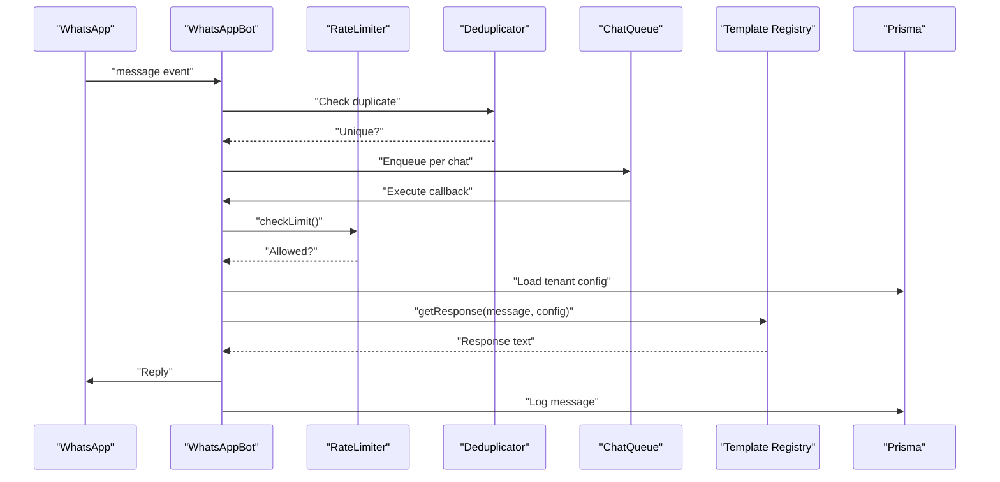
```mermaid
sequenceDiagram
participant WA as "WhatsApp"
participant Bot as "WhatsAppBot"
participant RL as "RateLimiter"
participant DEDUP as "Deduplicator"
participant QUEUE as "ChatQueue"
participant REG as "Template Registry"
participant DB as "Prisma"
WA->>Bot : "message event"
Bot->>DEDUP : "Check duplicate"
DEDUP-->>Bot : "Unique?"
Bot->>QUEUE : "Enqueue per chat"
QUEUE->>Bot : "Execute callback"
Bot->>RL : "checkLimit()"
RL-->>Bot : "Allowed?"
Bot->>DB : "Load tenant config"
Bot->>REG : "getResponse(message, config)"
REG-->>Bot : "Response text"
Bot->>WA : "Reply"
Bot->>DB : "Log message"
```

**Diagram sources**
- [bot.ts](file://apps/worker/src/bot.ts#L137-L296)
- [rate-limiter.ts](file://apps/worker/src/utils/rate-limiter.ts#L32-L73)
- [chat-queue.ts](file://apps/worker/src/utils/chat-queue.ts#L35-L68)
- [dedup.ts](file://apps/worker/src/utils/dedup.ts#L28-L46)
- [index.ts](file://apps/worker/src/templates/index.ts#L12-L32)

**Section sources**
- [bot.ts](file://apps/worker/src/bot.ts#L137-L296)
- [rate-limiter.ts](file://apps/worker/src/utils/rate-limiter.ts#L1-L110)
- [chat-queue.ts](file://apps/worker/src/utils/chat-queue.ts#L1-L140)
- [dedup.ts](file://apps/worker/src/utils/dedup.ts#L1-L93)
- [index.ts](file://apps/worker/src/templates/index.ts#L1-L79)

### Tenant Creation and Template Registration
Tenants are created with initial configuration including template_type, business_name, and language. The worker loads this configuration at startup and uses it to select the appropriate template handler. The system now supports six template types including the new Healthcare, Real Estate, and Restaurant categories.

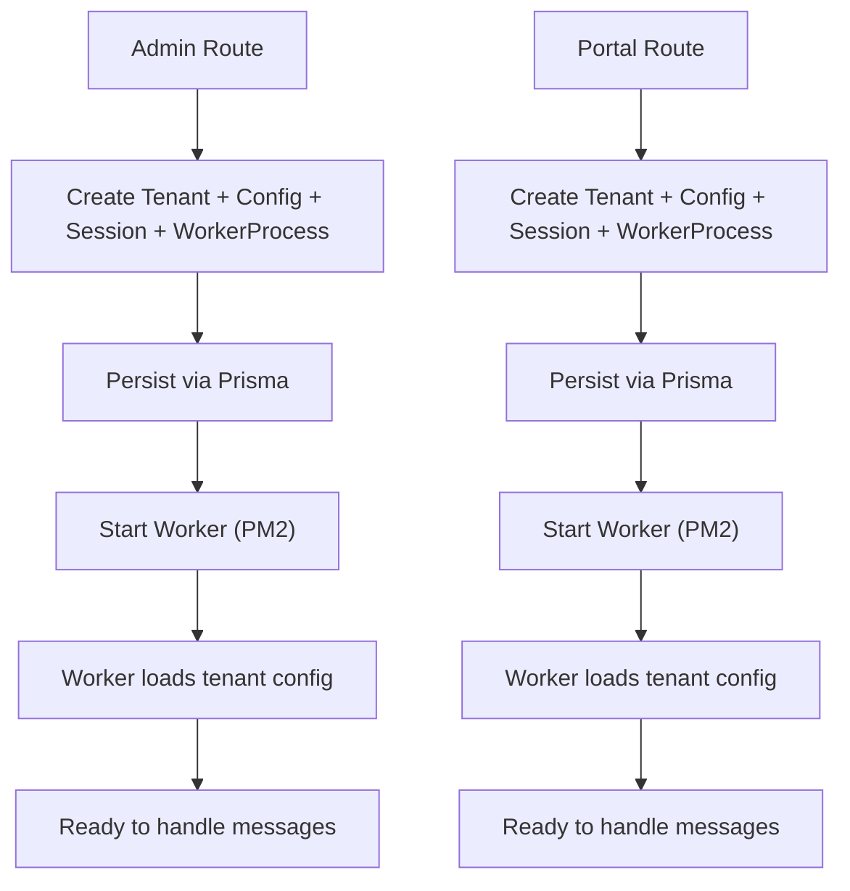
```mermaid
flowchart TD
Admin["Admin Route"] --> CreateTenant["Create Tenant + Config + Session + WorkerProcess"]
CreateTenant --> Persist["Persist via Prisma"]
Persist --> WorkerStart["Start Worker (PM2)"]
WorkerStart --> LoadCfg["Worker loads tenant config"]
LoadCfg --> Ready["Ready to handle messages"]
Portal["Portal Route"] --> CreateTenantPortal["Create Tenant + Config + Session + WorkerProcess"]
CreateTenantPortal --> PersistPortal["Persist via Prisma"]
PersistPortal --> WorkerStartPortal["Start Worker (PM2)"]
WorkerStartPortal --> LoadCfgPortal["Worker loads tenant config"]
LoadCfgPortal --> ReadyPortal["Ready to handle messages"]
```

**Diagram sources**
- [admin.ts](file://apps/control-plane/src/routes/admin.ts#L92-L128)
- [portal.ts](file://apps/control-plane/src/routes/portal.ts#L85-L158)
- [schema.prisma](file://packages/shared/src/prisma/schema.prisma#L86-L101)

**Section sources**
- [admin.ts](file://apps/control-plane/src/routes/admin.ts#L92-L128)
- [portal.ts](file://apps/control-plane/src/routes/portal.ts#L97-L158)
- [schema.prisma](file://packages/shared/src/prisma/schema.prisma#L86-L101)

### Multilingual Support (Swahili/English)
Multilingual responses are implemented by checking the language field in tenant configuration and selecting localized prompts. All template handlers demonstrate this pattern including the new Healthcare, Real Estate, and Restaurant templates.

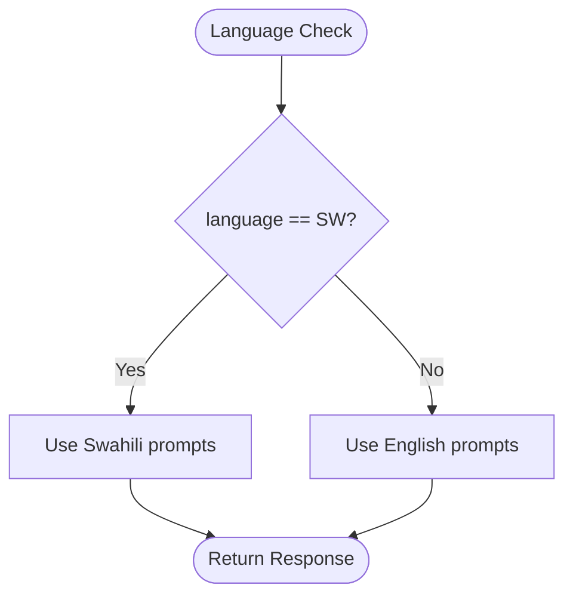
```mermaid
flowchart TD
L_Start(["Language Check"]) --> IsSW{"language == SW?"}
IsSW --> |Yes| UseSW["Use Swahili prompts"]
IsSW --> |No| UseEN["Use English prompts"]
UseSW --> L_End(["Return Response"])
UseEN --> L_End
```

**Diagram sources**
- [index.ts](file://apps/worker/src/templates/index.ts#L6-L10)
- [booking.ts](file://apps/worker/src/templates/booking.ts#L9-L14)
- [healthcare.ts](file://apps/worker/src/templates/healthcare.ts#L8-L22)
- [real-estate.ts](file://apps/worker/src/templates/real-estate.ts#L8-L19)
- [restaurant.ts](file://apps/worker/src/templates/restaurant.ts#L8-L22)

**Section sources**
- [index.ts](file://apps/worker/src/templates/index.ts#L6-L10)
- [booking.ts](file://apps/worker/src/templates/booking.ts#L9-L14)
- [healthcare.ts](file://apps/worker/src/templates/healthcare.ts#L8-L22)
- [real-estate.ts](file://apps/worker/src/templates/real-estate.ts#L8-L19)
- [restaurant.ts](file://apps/worker/src/templates/restaurant.ts#L8-L22)

### Template Type Enumeration and Prisma Integration
Template types and languages are defined as enums in the Prisma schema and are persisted with tenant configuration. The worker reads these values to select the correct template handler. The system now includes six template types: BOOKING, ECOMMERCE, SUPPORT, REAL_ESTATE, RESTAURANT, and HEALTHCARE.

```mermaid
erEnum "TemplateType" {
BOOKING
ECOMMERCE
SUPPORT
REAL_ESTATE
RESTAURANT
HEALTHCARE
}
erEnum "Language" {
SW
EN
}
```

**Diagram sources**
- [schema.prisma](file://packages/shared/src/prisma/schema.prisma#L18-L25)

**Section sources**
- [schema.prisma](file://packages/shared/src/prisma/schema.prisma#L18-L25)
- [schema.prisma](file://packages/shared/src/prisma/schema.prisma#L86-L101)
- [types.index.ts](file://packages/shared/src/types/index.ts#L21-L27)

### Practical Examples
- Template response generation: The registry dispatches to the appropriate handler based on template_type and language, including new Healthcare, Real Estate, and Restaurant templates.
- Message parsing and routing: The worker normalizes input, checks rate limits, deduplicates, enqueues per chat, and finally sends a response.
- Template-specific business logic: Handlers implement intent detection and prompt construction tailored to the business domain, with specialized responses for healthcare emergencies, property viewings, and restaurant reservations.

**Section sources**
- [index.ts](file://apps/worker/src/templates/index.ts#L12-L32)
- [booking.ts](file://apps/worker/src/templates/booking.ts#L1-L22)
- [healthcare.ts](file://apps/worker/src/templates/healthcare.ts#L1-L38)
- [real-estate.ts](file://apps/worker/src/templates/real-estate.ts#L1-L32)
- [restaurant.ts](file://apps/worker/src/templates/restaurant.ts#L1-L38)
- [bot.ts](file://apps/worker/src/bot.ts#L232-L296)

### Extensibility Mechanisms for Custom Templates
To add a new template type:
1. Define a new handler function in the templates directory.
2. Register the handler in the template registry and add a case for the new template_type.
3. Update the Prisma schema if new fields are needed.
4. Ensure the handler supports multilingual responses.
5. Test with tenant creation and worker startup.

Guidance:
- Keep handlers pure and deterministic for easier testing.
- Use consistent prompt patterns across languages.
- Add logging around intent detection for observability.

**Section sources**
- [index.ts](file://apps/worker/src/templates/index.ts#L1-L79)
- [schema.prisma](file://packages/shared/src/prisma/schema.prisma#L18-L25)

### Creating New Template Types
Steps:
- Add a new handler module under templates.
- Extend the registry to route the new template_type.
- Update control plane routes to accept the new type during tenant creation/upsert.
- Ensure the handler respects language and business_name.

**Section sources**
- [booking.ts](file://apps/worker/src/templates/booking.ts#L1-L22)
- [healthcare.ts](file://apps/worker/src/templates/healthcare.ts#L1-L38)
- [real-estate.ts](file://apps/worker/src/templates/real-estate.ts#L1-L32)
- [restaurant.ts](file://apps/worker/src/templates/restaurant.ts#L1-L38)
- [index.ts](file://apps/worker/src/templates/index.ts#L1-L79)
- [portal.ts](file://apps/control-plane/src/routes/portal.ts#L97-L158)
- [admin.ts](file://apps/control-plane/src/routes/admin.ts#L92-L128)

### Maintaining Template Consistency Across Tenants
- Centralize prompt logic in handlers.
- Use tenant business_name consistently.
- Monitor rate limits and logs to detect anomalies.
- Use the control plane to audit tenant configurations and worker status.

**Section sources**
- [rate-limiter.ts](file://apps/worker/src/utils/rate-limiter.ts#L1-L110)
- [logger.ts](file://packages/shared/src/utils/logger.ts#L1-L33)
- [admin.ts](file://apps/control-plane/src/routes/admin.ts#L8-L68)

## Dependency Analysis
The system exhibits clear separation of concerns:
- Control plane depends on Prisma models and routes to manage tenants and workers.
- Worker depends on the template registry and utilities for reliability.
- Shared package provides schema and types used across services.

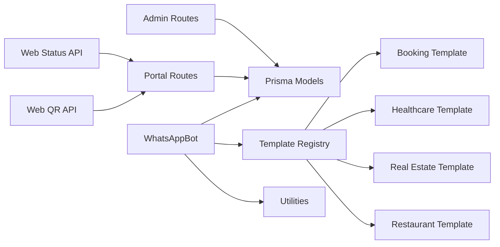
```mermaid
graph LR
CP_ADMIN["Admin Routes"] --> PRISMA["Prisma Models"]
CP_PORTAL["Portal Routes"] --> PRISMA
BOT["WhatsAppBot"] --> PRISMA
BOT --> TPL_IDX["Template Registry"]
TPL_IDX --> TPL_BOOK["Booking Template"]
TPL_IDX --> TPL_HEALTH["Healthcare Template"]
TPL_IDX --> TPL_REAL["Real Estate Template"]
TPL_IDX --> TPL_REST["Restaurant Template"]
BOT --> UTILS["Utilities"]
WEB_STATUS["Web Status API"] --> CP_PORTAL
WEB_QR["Web QR API"] --> CP_PORTAL
```

**Diagram sources**
- [admin.ts](file://apps/control-plane/src/routes/admin.ts#L1-L432)
- [portal.ts](file://apps/control-plane/src/routes/portal.ts#L1-L251)
- [bot.ts](file://apps/worker/src/bot.ts#L1-L395)
- [index.ts](file://apps/worker/src/templates/index.ts#L1-L79)
- [booking.ts](file://apps/worker/src/templates/booking.ts#L1-L22)
- [healthcare.ts](file://apps/worker/src/templates/healthcare.ts#L1-L38)
- [real-estate.ts](file://apps/worker/src/templates/real-estate.ts#L1-L32)
- [restaurant.ts](file://apps/worker/src/templates/restaurant.ts#L1-L38)
- [schema.prisma](file://packages/shared/src/prisma/schema.prisma#L1-L261)
- [status.route.ts](file://apps/web/src/app/api/portal/tenant/current/status/route.ts#L1-L35)
- [qr.route.ts](file://apps/web/src/app/api/portal/tenant/current/qr/route.ts#L1-L35)

**Section sources**
- [admin.ts](file://apps/control-plane/src/routes/admin.ts#L1-L432)
- [portal.ts](file://apps/control-plane/src/routes/portal.ts#L1-L251)
- [bot.ts](file://apps/worker/src/bot.ts#L1-L395)
- [index.ts](file://apps/worker/src/templates/index.ts#L1-L79)
- [booking.ts](file://apps/worker/src/templates/booking.ts#L1-L22)
- [healthcare.ts](file://apps/worker/src/templates/healthcare.ts#L1-L38)
- [real-estate.ts](file://apps/worker/src/templates/real-estate.ts#L1-L32)
- [restaurant.ts](file://apps/worker/src/templates/restaurant.ts#L1-L38)
- [schema.prisma](file://packages/shared/src/prisma/schema.prisma#L1-L261)
- [status.route.ts](file://apps/web/src/app/api/portal/tenant/current/status/route.ts#L1-L35)
- [qr.route.ts](file://apps/web/src/app/api/portal/tenant/current/qr/route.ts#L1-L35)

## Performance Considerations
- Rate limiting prevents burst responses; adjust maxRequests/windowMs via environment variables.
- Deduplication avoids redundant processing using message IDs.
- Chat queue ensures single-threaded processing per chat to maintain message ordering.
- Heartbeat monitoring keeps workers healthy; stale workers are auto-detected and marked.

Recommendations:
- Tune rate limit per tenant workload.
- Monitor queue sizes and adjust maxQueueSize if needed.
- Use structured logging to track performance and errors.

**Section sources**
- [rate-limiter.ts](file://apps/worker/src/utils/rate-limiter.ts#L21-L26)
- [dedup.ts](file://apps/worker/src/utils/dedup.ts#L16-L22)
- [chat-queue.ts](file://apps/worker/src/utils/chat-queue.ts#L26-L29)
- [bot.ts](file://apps/worker/src/bot.ts#L317-L343)

## Troubleshooting Guide
Common issues and resolutions:
- Worker fails to start: Verify TENANT_ID and SESSIONS_PATH; check database connectivity.
- No response to messages: Confirm template_type and language are set; inspect rate limit warnings; review logs.
- Duplicate messages: Deduplication should prevent repeated processing; check dedup cache stats.
- Stale workers: Control plane marks workers as ERROR if no heartbeat; restart worker via control plane.
- Web portal unauthorized: Ensure PORTAL_INTERNAL_KEY is configured and headers are passed correctly.

**Section sources**
- [worker.ts](file://apps/worker/src/worker.ts#L12-L15)
- [bot.ts](file://apps/worker/src/bot.ts#L248-L263)
- [dedup.ts](file://apps/worker/src/utils/dedup.ts#L28-L46)
- [admin.ts](file://apps/control-plane/src/routes/admin.ts#L8-L68)
- [status.route.ts](file://apps/web/src/app/api/portal/tenant/current/status/route.ts#L11-L13)
- [qr.route.ts](file://apps/web/src/app/api/portal/tenant/current/qr/route.ts#L11-L13)

## Conclusion
The template-based message response system cleanly separates tenant configuration, template logic, and worker runtime. It supports six business types including the new Healthcare, Real Estate, and Restaurant categories, multilingual responses, and robust operational controls. Extending the system with new template types is straightforward, requiring minimal changes to the registry and handler modules while leveraging shared Prisma models and types.

## Appendices

### API Definitions
- Tenant creation endpoint accepts template_type, business_name, and language.
- Portal endpoints expose status and QR data for tenant sessions.
- Worker lifecycle is managed via control plane routes.

**Section sources**
- [admin.ts](file://apps/control-plane/src/routes/admin.ts#L92-L128)
- [portal.ts](file://apps/control-plane/src/routes/portal.ts#L159-L251)
- [status.route.ts](file://apps/web/src/app/api/portal/tenant/current/status/route.ts#L1-L35)
- [qr.route.ts](file://apps/web/src/app/api/portal/tenant/current/qr/route.ts#L1-L35)

### New Template Types
The system now supports six template types:
- **BOOKING**: Traditional booking and appointment management
- **ECOMMERCE**: Product pricing and order management
- **SUPPORT**: Customer support and issue resolution
- **REAL_ESTATE**: Property listings, pricing, and viewings
- **RESTAURANT**: Menu, ordering, and table reservations
- **HEALTHCARE**: Medical appointments, emergencies, and prescriptions

Each template type includes specialized intent detection and multilingual response patterns tailored to the specific industry requirements.

**Section sources**
- [schema.prisma](file://packages/shared/src/prisma/schema.prisma#L18-L25)
- [index.ts](file://apps/worker/src/templates/index.ts#L6-L10)
- [healthcare.ts](file://apps/worker/src/templates/healthcare.ts#L1-L38)
- [real-estate.ts](file://apps/worker/src/templates/real-estate.ts#L1-L32)
- [restaurant.ts](file://apps/worker/src/templates/restaurant.ts#L1-L38)