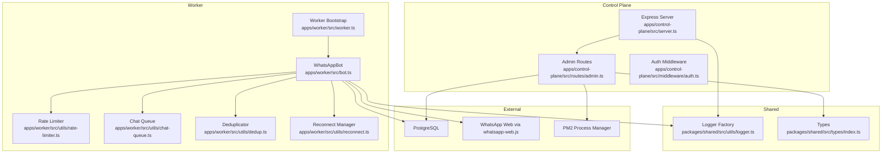
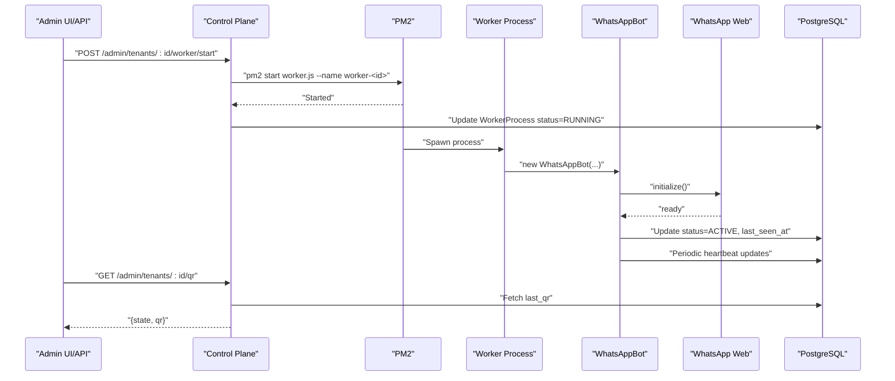
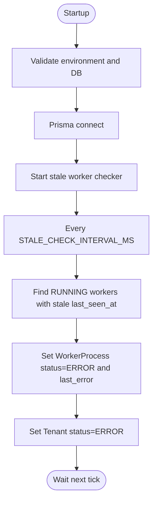
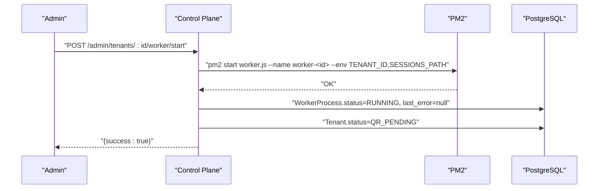
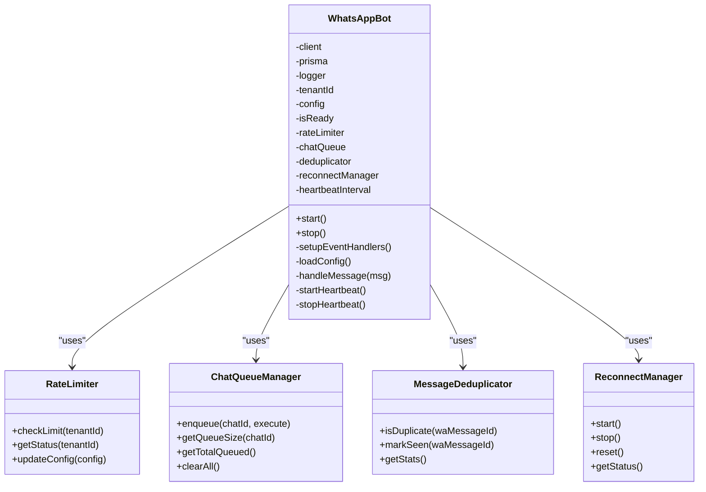
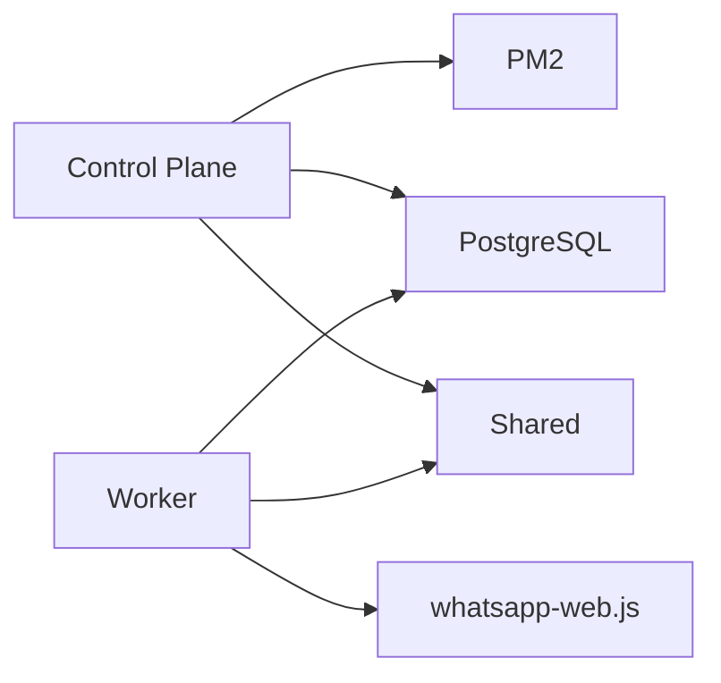

# Troubleshooting

<cite>
**Referenced Files in This Document**
- [README.md](file://README.md)
- [package.json](file://package.json)
- [ecosystem.config.js](file://ecosystem.config.js)
- [apps/control-plane/src/server.ts](file://apps/control-plane/src/server.ts)
- [apps/control-plane/src/routes/admin.ts](file://apps/control-plane/src/routes/admin.ts)
- [apps/control-plane/src/middleware/auth.ts](file://apps/control-plane/src/middleware/auth.ts)
- [apps/worker/src/worker.ts](file://apps/worker/src/worker.ts)
- [apps/worker/src/bot.ts](file://apps/worker/src/bot.ts)
- [apps/worker/src/utils/rate-limiter.ts](file://apps/worker/src/utils/rate-limiter.ts)
- [apps/worker/src/utils/chat-queue.ts](file://apps/worker/src/utils/chat-queue.ts)
- [apps/worker/src/utils/dedup.ts](file://apps/worker/src/utils/dedup.ts)
- [apps/worker/src/utils/reconnect.ts](file://apps/worker/src/utils/reconnect.ts)
- [packages/shared/src/utils/logger.ts](file://packages/shared/src/utils/logger.ts)
- [packages/shared/src/types/index.ts](file://packages/shared/src/types/index.ts)
</cite>

## Table of Contents
1. [Introduction](#introduction)
2. [Project Structure](#project-structure)
3. [Core Components](#core-components)
4. [Architecture Overview](#architecture-overview)
5. [Detailed Component Analysis](#detailed-component-analysis)
6. [Dependency Analysis](#dependency-analysis)
7. [Performance Considerations](#performance-considerations)
8. [Troubleshooting Guide](#troubleshooting-guide)
9. [Conclusion](#conclusion)
10. [Appendices](#appendices)

## Introduction
This document provides a comprehensive troubleshooting guide for the Flow HQ platform. It covers systematic diagnostics for common issues, error interpretation, and performance tuning strategies. It also documents specific workflows for QR code authentication problems, worker process failures, database connectivity issues, and WhatsApp Web integration problems. Guidance is included for log analysis, error pattern recognition, resolution procedures, monitoring, and escalation.

## Project Structure
The platform consists of:
- Control Plane: Admin API and dashboard (Express + EJS)
- Worker: Per-tenant WhatsApp bot process using whatsapp-web.js
- Shared: Common types, Prisma client, and utilities
- Sessions: Persistent WhatsApp session storage per tenant
- Logs: Tenant-specific and control-plane logs

**Diagram sources**
- [apps/control-plane/src/server.ts](file://apps/control-plane/src/server.ts#L65-L81)
- [apps/control-plane/src/routes/admin.ts](file://apps/control-plane/src/routes/admin.ts#L174-L230)
- [apps/control-plane/src/middleware/auth.ts](file://apps/control-plane/src/middleware/auth.ts#L5-L29)
- [apps/worker/src/worker.ts](file://apps/worker/src/worker.ts#L12-L24)
- [apps/worker/src/bot.ts](file://apps/worker/src/bot.ts#L27-L75)
- [apps/worker/src/utils/rate-limiter.ts](file://apps/worker/src/utils/rate-limiter.ts#L17-L26)
- [apps/worker/src/utils/chat-queue.ts](file://apps/worker/src/utils/chat-queue.ts#L21-L29)
- [apps/worker/src/utils/dedup.ts](file://apps/worker/src/utils/dedup.ts#L11-L19)
- [apps/worker/src/utils/reconnect.ts](file://apps/worker/src/utils/reconnect.ts#L14-L39)
- [packages/shared/src/utils/logger.ts](file://packages/shared/src/utils/logger.ts#L5-L30)
- [packages/shared/src/types/index.ts](file://packages/shared/src/types/index.ts#L1-L41)

**Section sources**
- [README.md](file://README.md#L116-L129)
- [package.json](file://package.json#L1-L21)
- [ecosystem.config.js](file://ecosystem.config.js#L1-L19)

## Core Components
- Control Plane server validates environment, connects to the database, sets up routes, and runs a stale worker checker.
- Admin routes manage tenants, worker lifecycle, QR retrieval, and logs. They spawn/restart workers via PM2 and update statuses in the database.
- Worker bootstrap initializes the WhatsApp bot with session persistence and graceful shutdown hooks.
- WhatsAppBot orchestrates events: QR generation, readiness, message handling, disconnections, and reconnection attempts. It maintains heartbeat, rate limiting, per-chat queuing, deduplication, and reconnect logic.
- Shared logger writes tenant-specific logs to files and console.
- Types define tenant relations and input contracts.

**Section sources**
- [apps/control-plane/src/server.ts](file://apps/control-plane/src/server.ts#L16-L39)
- [apps/control-plane/src/routes/admin.ts](file://apps/control-plane/src/routes/admin.ts#L174-L230)
- [apps/worker/src/worker.ts](file://apps/worker/src/worker.ts#L12-L24)
- [apps/worker/src/bot.ts](file://apps/worker/src/bot.ts#L27-L75)
- [packages/shared/src/utils/logger.ts](file://packages/shared/src/utils/logger.ts#L5-L30)
- [packages/shared/src/types/index.ts](file://packages/shared/src/types/index.ts#L1-L41)

## Architecture Overview
The system integrates a control plane and per-tenant workers. The control plane manages PM2-managed workers, persists state in PostgreSQL, and exposes admin APIs. Workers connect to WhatsApp Web, maintain sessions, and process messages with built-in resilience features.

**Diagram sources**
- [apps/control-plane/src/routes/admin.ts](file://apps/control-plane/src/routes/admin.ts#L174-L230)
- [apps/worker/src/bot.ts](file://apps/worker/src/bot.ts#L98-L151)
- [apps/worker/src/bot.ts](file://apps/worker/src/bot.ts#L333-L359)

## Detailed Component Analysis

### Control Plane Server and Stale Worker Detection
- Validates required environment variables and database connectivity.
- Starts a periodic stale worker checker that marks workers without recent heartbeats as ERROR and updates tenant status accordingly.

**Diagram sources**
- [apps/control-plane/src/server.ts](file://apps/control-plane/src/server.ts#L65-L81)
- [apps/control-plane/src/server.ts](file://apps/control-plane/src/server.ts#L54-L63)
- [apps/control-plane/src/routes/admin.ts](file://apps/control-plane/src/routes/admin.ts#L30-L80)

**Section sources**
- [apps/control-plane/src/server.ts](file://apps/control-plane/src/server.ts#L16-L39)
- [apps/control-plane/src/server.ts](file://apps/control-plane/src/server.ts#L54-L63)
- [apps/control-plane/src/routes/admin.ts](file://apps/control-plane/src/routes/admin.ts#L30-L80)

### Worker Lifecycle Management (PM2)
- Start: Spawns a PM2 process named worker-<tenant>, passing TENANT_ID and SESSIONS_PATH. Updates WorkerProcess and Tenant status.
- Stop/Restart: Uses PM2 stop/restart commands and updates status.
- Force Restart: Stops existing process if running, waits, then starts fresh with same name and env.

**Diagram sources**
- [apps/control-plane/src/routes/admin.ts](file://apps/control-plane/src/routes/admin.ts#L174-L230)

**Section sources**
- [apps/control-plane/src/routes/admin.ts](file://apps/control-plane/src/routes/admin.ts#L174-L230)

### WhatsAppBot: QR, Ready, Message Handling, Heartbeat, Reconnect
- QR: Emits QR code; stores state and QR image URL in database.
- Ready: Marks as CONNECTED, resets reconnect attempts, loads config, starts heartbeat.
- Message Handling: Logs incoming/outgoing, checks rate limit, applies template response, updates last seen.
- Disconnected/Auth Failure: Updates state to DISCONNECTED/ERROR, stops heartbeat, starts reconnect manager.
- Heartbeat: Periodic updates to last_seen_at and WorkerProcess status.
- Reconnect: Exponential backoff with max attempts; on max attempts, marks ERROR.

**Diagram sources**
- [apps/worker/src/bot.ts](file://apps/worker/src/bot.ts#L12-L75)
- [apps/worker/src/utils/rate-limiter.ts](file://apps/worker/src/utils/rate-limiter.ts#L17-L26)
- [apps/worker/src/utils/chat-queue.ts](file://apps/worker/src/utils/chat-queue.ts#L21-L29)
- [apps/worker/src/utils/dedup.ts](file://apps/worker/src/utils/dedup.ts#L11-L19)
- [apps/worker/src/utils/reconnect.ts](file://apps/worker/src/utils/reconnect.ts#L14-L39)

**Section sources**
- [apps/worker/src/bot.ts](file://apps/worker/src/bot.ts#L77-L226)
- [apps/worker/src/bot.ts](file://apps/worker/src/bot.ts#L333-L359)
- [apps/worker/src/bot.ts](file://apps/worker/src/bot.ts#L369-L392)
- [apps/worker/src/bot.ts](file://apps/worker/src/bot.ts#L394-L409)

### Logging and Log Locations
- Control plane logs to files and console via pino transport.
- Tenant-specific logs written to logs/<tenant_id>.log.
- Use PM2 logs for control-plane and worker processes.

**Section sources**
- [packages/shared/src/utils/logger.ts](file://packages/shared/src/utils/logger.ts#L5-L30)
- [ecosystem.config.js](file://ecosystem.config.js#L13-L15)
- [README.md](file://README.md#L406-L417)

## Dependency Analysis
- Control Plane depends on Shared (Prisma, logger) and uses PM2 to manage workers.
- Worker depends on Shared (logger, Prisma) and external libraries (whatsapp-web.js, qrcode).
- Admin routes orchestrate PM2 and database updates.
- Stability features (rate limiting, queue, dedup, reconnect) reduce coupling and improve resilience.

**Diagram sources**
- [apps/control-plane/src/server.ts](file://apps/control-plane/src/server.ts#L1-L14)
- [apps/worker/src/bot.ts](file://apps/worker/src/bot.ts#L1-L11)
- [apps/control-plane/src/routes/admin.ts](file://apps/control-plane/src/routes/admin.ts#L1-L11)

**Section sources**
- [apps/control-plane/src/server.ts](file://apps/control-plane/src/server.ts#L1-L14)
- [apps/worker/src/bot.ts](file://apps/worker/src/bot.ts#L1-L11)
- [apps/control-plane/src/routes/admin.ts](file://apps/control-plane/src/routes/admin.ts#L1-L11)

## Performance Considerations
- Rate limiting: Default 10 replies per minute per tenant to avoid throttling and downstream issues.
- Per-chat queue: Ensures sequential processing per chat to prevent race conditions and excessive concurrency.
- Deduplication: Prevents repeated processing of identical messages.
- Heartbeat: Keeps tenant status and worker health visible; stale detection auto-updates status.
- Reconnect: Exponential backoff prevents flooding WhatsApp servers and reduces resource contention.
- Memory hygiene: Chat queue cleans up empty queues; deduplicator periodically evicts old entries.

**Section sources**
- [apps/worker/src/utils/rate-limiter.ts](file://apps/worker/src/utils/rate-limiter.ts#L17-L26)
- [apps/worker/src/utils/chat-queue.ts](file://apps/worker/src/utils/chat-queue.ts#L113-L138)
- [apps/worker/src/utils/dedup.ts](file://apps/worker/src/utils/dedup.ts#L59-L88)
- [apps/worker/src/bot.ts](file://apps/worker/src/bot.ts#L333-L359)
- [apps/worker/src/utils/reconnect.ts](file://apps/worker/src/utils/reconnect.ts#L87-L115)

## Troubleshooting Guide

### General Diagnostics Workflow
- Confirm environment variables and database connectivity.
- Check PM2 status and logs for control plane and worker.
- Inspect tenant status and worker process state in the database.
- Tail tenant-specific logs for detailed context.

**Section sources**
- [apps/control-plane/src/server.ts](file://apps/control-plane/src/server.ts#L16-L39)
- [README.md](file://README.md#L406-L417)
- [apps/control-plane/src/routes/admin.ts](file://apps/control-plane/src/routes/admin.ts#L30-L80)

### QR Code Authentication Problems
Symptoms:
- QR not appearing in admin UI.
- QR endpoint returns empty or fails.

Checklist:
- Verify worker started and running under PM2.
- Confirm worker logs show QR event and database update.
- Ensure sessions directory exists and is writable.
- Validate SESSIONS_PATH and PUPPETEER_EXECUTABLE_PATH.
- Check browser/headless rendering prerequisites.

Resolution steps:
- Restart worker for the tenant.
- Clear stale sessions if necessary.
- Install Chromium/Chrome and set executable path.
- Review logs for “QR code received” and “QR code saved to database”.

**Section sources**
- [apps/control-plane/src/routes/admin.ts](file://apps/control-plane/src/routes/admin.ts#L174-L230)
- [apps/worker/src/bot.ts](file://apps/worker/src/bot.ts#L77-L96)
- [apps/worker/src/bot.ts](file://apps/worker/src/bot.ts#L84-L95)
- [README.md](file://README.md#L185-L208)

### Worker Process Failures
Symptoms:
- Worker shows STOPPED or ERROR in admin UI.
- PM2 reports offline worker.

Checklist:
- Use PM2 list/status to confirm process state.
- Check worker logs for startup errors.
- Validate TENANT_ID and SESSIONS_PATH.
- Confirm database connectivity and Prisma client initialization.

Resolution steps:
- Force restart worker via admin UI.
- If persistent, stop and start again with explicit env.
- Review uncaught exceptions and rejections in worker logs.
- Ensure graceful shutdown hooks are respected.

**Section sources**
- [apps/control-plane/src/routes/admin.ts](file://apps/control-plane/src/routes/admin.ts#L232-L283)
- [apps/worker/src/worker.ts](file://apps/worker/src/worker.ts#L26-L45)
- [apps/worker/src/bot.ts](file://apps/worker/src/bot.ts#L369-L392)

### Database Connection Issues
Symptoms:
- Control plane fails to start or logs connection errors.
- Admin routes return database-related errors.

Checklist:
- Verify DATABASE_URL format and credentials.
- Confirm PostgreSQL service is running.
- Test connectivity with psql.

Resolution steps:
- Fix DATABASE_URL format.
- Ensure database is reachable and user has privileges.
- Retry startup after fixing credentials.

**Section sources**
- [apps/control-plane/src/server.ts](file://apps/control-plane/src/server.ts#L26-L32)
- [README.md](file://README.md#L196-L198)
- [README.md](file://README.md#L466-L474)

### WhatsApp Web Integration Problems
Symptoms:
- Disconnected state, frequent reconnects.
- Auth failure errors.
- No heartbeat updates.

Checklist:
- Confirm Chromium/Chrome path and headless arguments.
- Review reconnect attempts and max attempts reached.
- Check rate limit warnings and suppression behavior.
- Validate per-chat queue capacity and wait messages.

Resolution steps:
- Set PUPPETEER_EXECUTABLE_PATH correctly.
- Reduce burst traffic to avoid rate limit warnings.
- Monitor queue sizes and adjust maxQueueSize if needed.
- Investigate repeated disconnects and auth failures.

**Section sources**
- [apps/control-plane/src/server.ts](file://apps/control-plane/src/server.ts#L34-L38)
- [apps/worker/src/bot.ts](file://apps/worker/src/bot.ts#L185-L208)
- [apps/worker/src/bot.ts](file://apps/worker/src/bot.ts#L210-L225)
- [apps/worker/src/utils/reconnect.ts](file://apps/worker/src/utils/reconnect.ts#L87-L115)
- [apps/worker/src/utils/rate-limiter.ts](file://apps/worker/src/utils/rate-limiter.ts#L28-L73)
- [apps/worker/src/utils/chat-queue.ts](file://apps/worker/src/utils/chat-queue.ts#L38-L42)

### Stale Workers and Heartbeat Issues
Symptoms:
- Tenant shows STALE in admin UI.
- Worker marked ERROR automatically.

Checklist:
- Review STALE_THRESHOLD_MINUTES and STALE_CHECK_INTERVAL_MS.
- Inspect heartbeat intervals and last_seen_at updates.
- Use Force Restart to recover.

Resolution steps:
- Adjust stale thresholds if environment requires it.
- Investigate network or session instability causing missed heartbeats.
- Use Force Restart to re-establish worker.

**Section sources**
- [apps/control-plane/src/server.ts](file://apps/control-plane/src/server.ts#L54-L63)
- [apps/control-plane/src/routes/admin.ts](file://apps/control-plane/src/routes/admin.ts#L30-L80)
- [apps/worker/src/bot.ts](file://apps/worker/src/bot.ts#L333-L359)

### Log Analysis and Error Pattern Recognition
Common patterns:
- “QR code received/saved”: Indicates successful QR generation and persistence.
- “Heartbeat sent”: Confirms worker is alive and updating status.
- “Rate limit exceeded”: Signals suppression of replies; consider adjusting RATE_LIMIT_MAX_PER_MINUTE.
- “Queue full”: Indicates per-chat queue overflow; reduce burst or increase capacity.
- “Max reconnect attempts reached”: Worker exhausted retries; investigate underlying cause.

Tools:
- PM2 logs for control-plane and worker processes.
- Tenant-specific logs in logs/<tenant_id>.log.
- Database queries to inspect tenant, session, and worker states.

**Section sources**
- [packages/shared/src/utils/logger.ts](file://packages/shared/src/utils/logger.ts#L5-L30)
- [apps/worker/src/bot.ts](file://apps/worker/src/bot.ts#L264-L279)
- [apps/worker/src/utils/chat-queue.ts](file://apps/worker/src/utils/chat-queue.ts#L38-L42)
- [apps/worker/src/utils/reconnect.ts](file://apps/worker/src/utils/reconnect.ts#L87-L93)
- [README.md](file://README.md#L406-L417)

### Performance Bottlenecks, Memory Leaks, and Scalability
- Bottlenecks:
  - High message volume: Use rate limiter and per-chat queue to throttle and serialize.
  - Frequent reconnects: Tune reconnect backoff and ensure stable Chromium/Chrome path.
- Memory leaks:
  - Deduplicator periodically cleans expired entries.
  - Chat queue deletes empty queues after processing.
- Scalability:
  - Each tenant runs a separate worker process managed by PM2.
  - Heartbeat and stale detection enable centralized monitoring.

Mitigations:
- Monitor queue sizes and tune maxQueueSize.
- Adjust rate limit windows and counts.
- Ensure sufficient disk space for sessions and logs.

**Section sources**
- [apps/worker/src/utils/dedup.ts](file://apps/worker/src/utils/dedup.ts#L59-L88)
- [apps/worker/src/utils/chat-queue.ts](file://apps/worker/src/utils/chat-queue.ts#L134-L138)
- [apps/worker/src/utils/rate-limiter.ts](file://apps/worker/src/utils/rate-limiter.ts#L95-L105)
- [apps/worker/src/utils/reconnect.ts](file://apps/worker/src/utils/reconnect.ts#L31-L39)

### Monitoring Tools and Interpretation
- PM2:
  - List processes, view logs, restart services.
- Database:
  - Query tenants, sessions, and worker processes to verify states.
- Logs:
  - Use tenant-specific logs for targeted diagnostics.

**Section sources**
- [README.md](file://README.md#L406-L440)

### Escalation Procedures and Coordination
Escalation steps:
- Document symptoms, timestamps, and environment details.
- Collect PM2 logs, tenant logs, and database state snapshots.
- Coordinate with system administrators for:
  - System-level checks (disk, CPU, memory).
  - Network stability and Chromium/Chrome installation.
  - Database health and connectivity.

Coordination points:
- System administrators handle OS-level and infrastructure concerns.
- Platform team handles application logs, PM2, and database states.

**Section sources**
- [README.md](file://README.md#L442-L451)

## Conclusion
This guide provides a structured approach to diagnosing and resolving common Flow HQ issues. By leveraging PM2, logs, database states, and built-in stability features, most problems can be identified and resolved efficiently. For persistent or critical issues, escalate with detailed evidence and coordinate with system administrators.

## Appendices

### Quick Reference: Common Commands and Paths
- Start control plane: see project scripts and ecosystem configuration.
- PM2 logs: control-plane and worker processes.
- Tenant logs: logs/<tenant_id>.log.
- Database connectivity: psql with DATABASE_URL.

**Section sources**
- [package.json](file://package.json#L9-L16)
- [ecosystem.config.js](file://ecosystem.config.js#L1-L19)
- [README.md](file://README.md#L406-L417)
- [README.md](file://README.md#L466-L474)