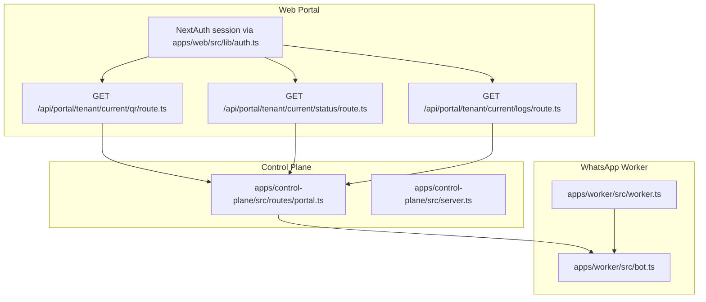
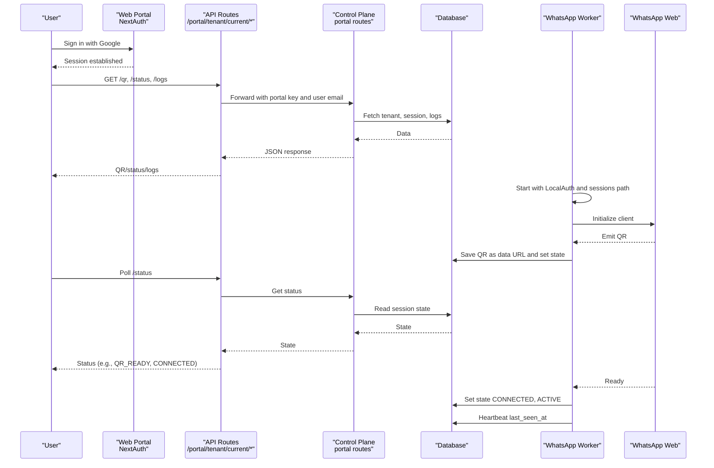
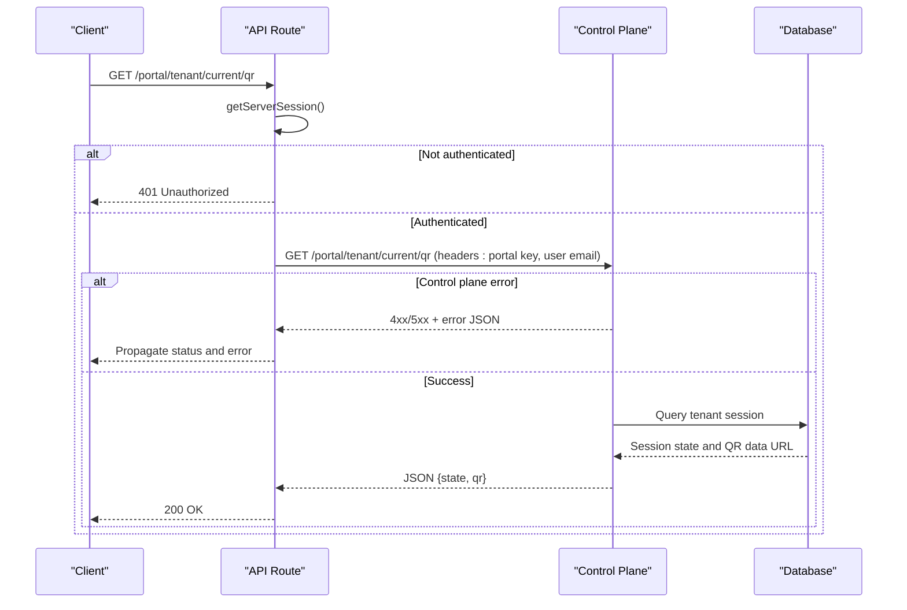
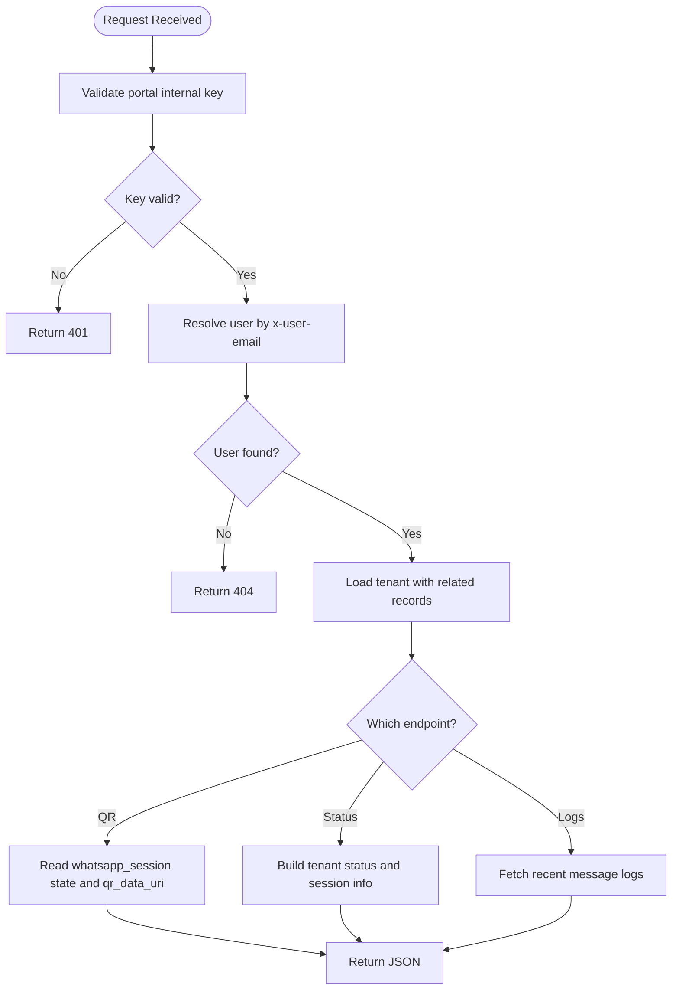
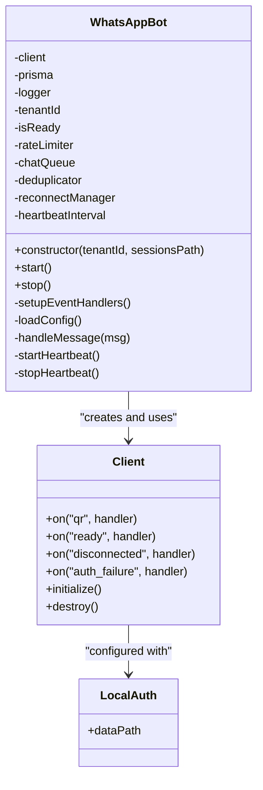
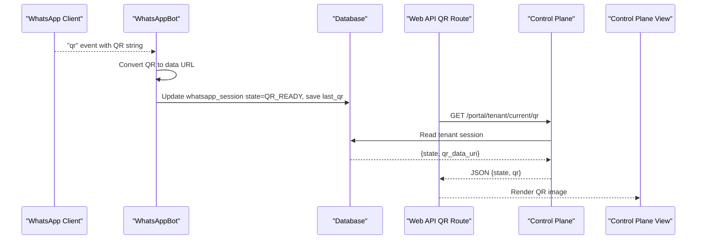
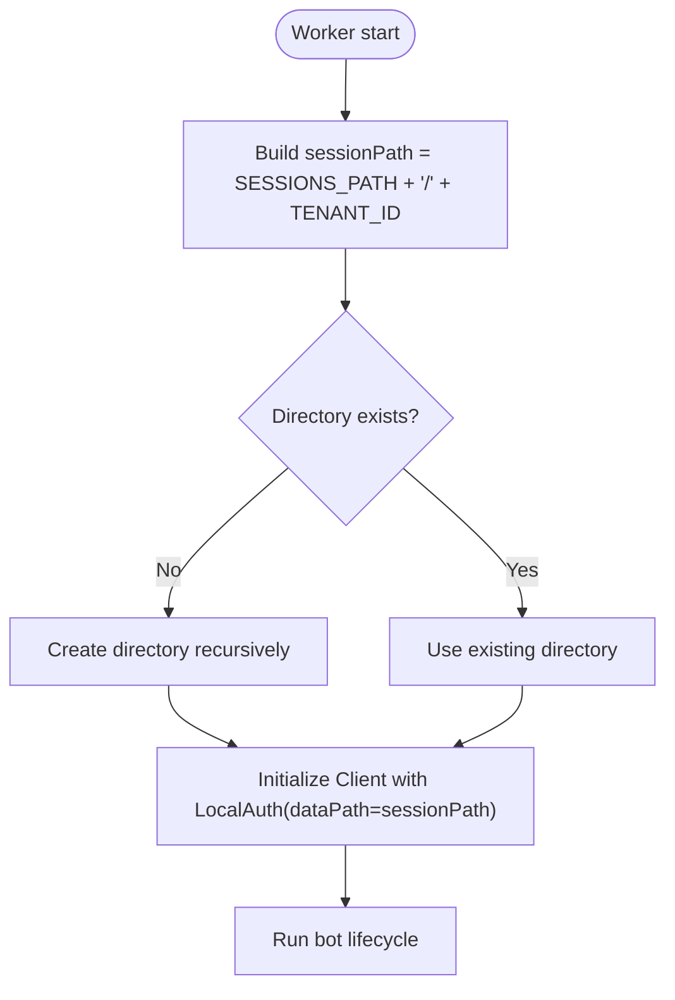
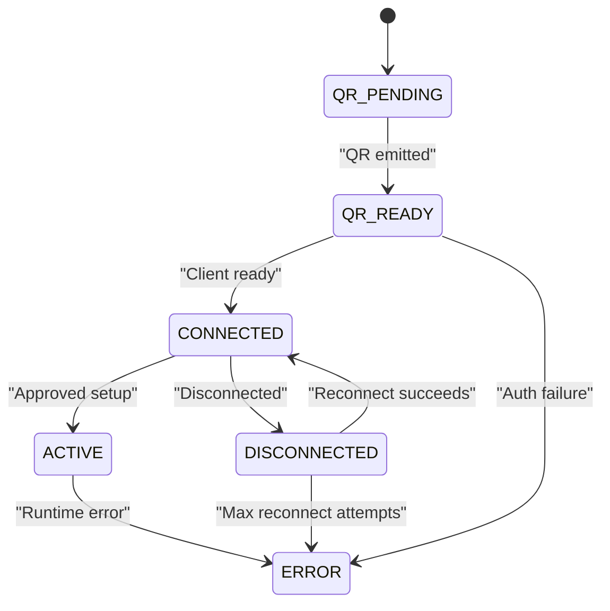
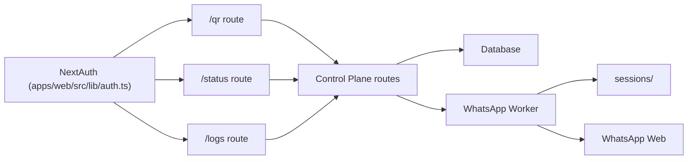

# Authentication Flow

<cite>
**Referenced Files in This Document**
- [apps/web/src/app/api/portal/tenant/current/qr/route.ts](file://apps/web/src/app/api/portal/tenant/current/qr/route.ts)
- [apps/web/src/app/api/portal/tenant/current/status/route.ts](file://apps/web/src/app/api/portal/tenant/current/status/route.ts)
- [apps/web/src/app/api/portal/tenant/current/logs/route.ts](file://apps/web/src/app/api/portal/tenant/current/logs/route.ts)
- [apps/web/src/lib/auth.ts](file://apps/web/src/lib/auth.ts)
- [apps/control-plane/src/routes/portal.ts](file://apps/control-plane/src/routes/portal.ts)
- [apps/control-plane/src/server.ts](file://apps/control-plane/src/server.ts)
- [apps/worker/src/bot.ts](file://apps/worker/src/bot.ts)
- [apps/worker/src/worker.ts](file://apps/worker/src/worker.ts)
- [packages/shared/src/types/index.ts](file://packages/shared/src/types/index.ts)
</cite>

## Table of Contents
1. [Introduction](#introduction)
2. [Project Structure](#project-structure)
3. [Core Components](#core-components)
4. [Architecture Overview](#architecture-overview)
5. [Detailed Component Analysis](#detailed-component-analysis)
6. [Dependency Analysis](#dependency-analysis)
7. [Performance Considerations](#performance-considerations)
8. [Troubleshooting Guide](#troubleshooting-guide)
9. [Conclusion](#conclusion)

## Introduction
This document explains the WhatsApp Web authentication flow and QR code generation in the system. It covers how QR codes are generated, displayed, and consumed, how sessions are persisted using the LocalAuth strategy, and how authentication state is managed across the frontend, control plane, and worker. It also documents session storage under the sessions directory, troubleshooting procedures for common issues such as QR display problems, session corruption, and authentication timeouts, and provides practical examples for authentication failures, session restoration, and manual reset procedures.

## Project Structure
The authentication flow spans three main areas:
- Frontend API routes that proxy requests to the control plane after validating the user session.
- Control plane routes that serve QR data, status, and logs for the authenticated tenant.
- Worker that initializes a WhatsApp client with LocalAuth, generates QR codes, updates state, and manages connectivity.

**Diagram sources**
- [apps/web/src/app/api/portal/tenant/current/qr/route.ts](file://apps/web/src/app/api/portal/tenant/current/qr/route.ts#L1-L35)
- [apps/web/src/app/api/portal/tenant/current/status/route.ts](file://apps/web/src/app/api/portal/tenant/current/status/route.ts#L1-L35)
- [apps/web/src/app/api/portal/tenant/current/logs/route.ts](file://apps/web/src/app/api/portal/tenant/current/logs/route.ts#L1-L35)
- [apps/web/src/lib/auth.ts](file://apps/web/src/lib/auth.ts#L1-L76)
- [apps/control-plane/src/routes/portal.ts](file://apps/control-plane/src/routes/portal.ts#L1-L246)
- [apps/control-plane/src/server.ts](file://apps/control-plane/src/server.ts#L1-L89)
- [apps/worker/src/worker.ts](file://apps/worker/src/worker.ts#L1-L46)
- [apps/worker/src/bot.ts](file://apps/worker/src/bot.ts#L1-L411)

**Section sources**
- [apps/web/src/app/api/portal/tenant/current/qr/route.ts](file://apps/web/src/app/api/portal/tenant/current/qr/route.ts#L1-L35)
- [apps/web/src/app/api/portal/tenant/current/status/route.ts](file://apps/web/src/app/api/portal/tenant/current/status/route.ts#L1-L35)
- [apps/web/src/app/api/portal/tenant/current/logs/route.ts](file://apps/web/src/app/api/portal/tenant/current/logs/route.ts#L1-L35)
- [apps/web/src/lib/auth.ts](file://apps/web/src/lib/auth.ts#L1-L76)
- [apps/control-plane/src/routes/portal.ts](file://apps/control-plane/src/routes/portal.ts#L1-L246)
- [apps/control-plane/src/server.ts](file://apps/control-plane/src/server.ts#L1-L89)
- [apps/worker/src/worker.ts](file://apps/worker/src/worker.ts#L1-L46)
- [apps/worker/src/bot.ts](file://apps/worker/src/bot.ts#L1-L411)

## Core Components
- Frontend API routes for QR, status, and logs:
  - Validate the NextAuth session, forward requests to the control plane with internal keys and user identity, and return JSON responses.
- Control plane routes:
  - Serve tenant QR data, status, and logs; enforce portal internal key authentication; fetch data from the database.
- Worker:
  - Initializes a WhatsApp client with LocalAuth strategy and a dedicated session directory per tenant.
  - Emits QR codes, persists them as data URLs, transitions authentication states, and manages connectivity and heartbeat.
- Session storage:
  - LocalAuth stores session artifacts under a tenant-specific folder inside the sessions directory.

**Section sources**
- [apps/web/src/app/api/portal/tenant/current/qr/route.ts](file://apps/web/src/app/api/portal/tenant/current/qr/route.ts#L1-L35)
- [apps/web/src/app/api/portal/tenant/current/status/route.ts](file://apps/web/src/app/api/portal/tenant/current/status/route.ts#L1-L35)
- [apps/web/src/app/api/portal/tenant/current/logs/route.ts](file://apps/web/src/app/api/portal/tenant/current/logs/route.ts#L1-L35)
- [apps/control-plane/src/routes/portal.ts](file://apps/control-plane/src/routes/portal.ts#L1-L246)
- [apps/worker/src/bot.ts](file://apps/worker/src/bot.ts#L1-L411)
- [apps/worker/src/worker.ts](file://apps/worker/src/worker.ts#L1-L46)

## Architecture Overview
The authentication flow begins when a user signs in via Google through NextAuth. The portal then proxies tenant-specific requests to the control plane, which reads from the database and returns QR, status, and logs. The worker runs independently, initializes the WhatsApp client with LocalAuth, emits QR codes, updates state, and maintains connectivity.

**Diagram sources**
- [apps/web/src/lib/auth.ts](file://apps/web/src/lib/auth.ts#L1-L76)
- [apps/web/src/app/api/portal/tenant/current/qr/route.ts](file://apps/web/src/app/api/portal/tenant/current/qr/route.ts#L1-L35)
- [apps/web/src/app/api/portal/tenant/current/status/route.ts](file://apps/web/src/app/api/portal/tenant/current/status/route.ts#L1-L35)
- [apps/web/src/app/api/portal/tenant/current/logs/route.ts](file://apps/web/src/app/api/portal/tenant/current/logs/route.ts#L1-L35)
- [apps/control-plane/src/routes/portal.ts](file://apps/control-plane/src/routes/portal.ts#L155-L216)
- [apps/worker/src/bot.ts](file://apps/worker/src/bot.ts#L77-L151)
- [apps/worker/src/worker.ts](file://apps/worker/src/worker.ts#L1-L46)

## Detailed Component Analysis

### Frontend API Routes: QR, Status, Logs
- Purpose:
  - Validate the NextAuth session.
  - Forward requests to the control plane with an internal key and the user’s email.
  - Return JSON responses or propagate errors.
- Security:
  - Unauthorized users receive a 401.
  - Internal key validation is enforced by the control plane.
- Error handling:
  - Propagates non-OK responses from the control plane.
  - Catches network errors and returns a generic 500.

**Diagram sources**
- [apps/web/src/app/api/portal/tenant/current/qr/route.ts](file://apps/web/src/app/api/portal/tenant/current/qr/route.ts#L8-L34)
- [apps/web/src/app/api/portal/tenant/current/status/route.ts](file://apps/web/src/app/api/portal/tenant/current/status/route.ts#L8-L34)
- [apps/web/src/app/api/portal/tenant/current/logs/route.ts](file://apps/web/src/app/api/portal/tenant/current/logs/route.ts#L8-L34)
- [apps/control-plane/src/routes/portal.ts](file://apps/control-plane/src/routes/portal.ts#L155-L216)

**Section sources**
- [apps/web/src/app/api/portal/tenant/current/qr/route.ts](file://apps/web/src/app/api/portal/tenant/current/qr/route.ts#L1-L35)
- [apps/web/src/app/api/portal/tenant/current/status/route.ts](file://apps/web/src/app/api/portal/tenant/current/status/route.ts#L1-L35)
- [apps/web/src/app/api/portal/tenant/current/logs/route.ts](file://apps/web/src/app/api/portal/tenant/current/logs/route.ts#L1-L35)

### Control Plane Routes: QR, Status, Logs
- Purpose:
  - Enforce portal internal key authentication.
  - Resolve the tenant from the user email header.
  - Return QR data URL and state, tenant status, and recent logs.
- Data model:
  - Uses the tenant’s associated WhatsApp session and worker process records.

**Diagram sources**
- [apps/control-plane/src/routes/portal.ts](file://apps/control-plane/src/routes/portal.ts#L12-L25)
- [apps/control-plane/src/routes/portal.ts](file://apps/control-plane/src/routes/portal.ts#L155-L243)

**Section sources**
- [apps/control-plane/src/routes/portal.ts](file://apps/control-plane/src/routes/portal.ts#L1-L246)

### Worker: LocalAuth Strategy, QR Generation, Session Persistence
- Initialization:
  - Creates a session directory per tenant under the sessions path.
  - Initializes a WhatsApp client with LocalAuth using the tenant-specific dataPath.
- QR handling:
  - On receiving a QR event, converts the QR string to a data URL and persists it to the tenant’s session record.
  - Updates session state to QR_READY.
- Connectivity:
  - On ready, sets state CONNECTED, marks tenant ACTIVE, resets reconnect manager, loads configuration, starts heartbeat.
  - On disconnect, sets DISCONNECTED, marks tenant ERROR, starts reconnect manager.
  - On auth_failure, marks tenant ERROR and logs the reason.
- Heartbeat:
  - Periodically updates last_seen_at and worker status.

**Diagram sources**
- [apps/worker/src/bot.ts](file://apps/worker/src/bot.ts#L12-L75)
- [apps/worker/src/bot.ts](file://apps/worker/src/bot.ts#L64-L72)

**Section sources**
- [apps/worker/src/bot.ts](file://apps/worker/src/bot.ts#L1-L411)
- [apps/worker/src/worker.ts](file://apps/worker/src/worker.ts#L1-L46)

### QR Code Display System
- QR generation:
  - The worker receives a QR string from the WhatsApp client and converts it to a data URL.
  - The control plane serves the QR data URL to the frontend.
- Frontend consumption:
  - The web routes proxy to the control plane and return the QR data URL to the client.
- Display:
  - The control plane view renders the QR image when present; otherwise, it shows appropriate status placeholders.

**Diagram sources**
- [apps/worker/src/bot.ts](file://apps/worker/src/bot.ts#L78-L96)
- [apps/control-plane/src/routes/portal.ts](file://apps/control-plane/src/routes/portal.ts#L188-L216)
- [apps/web/src/app/api/portal/tenant/current/qr/route.ts](file://apps/web/src/app/api/portal/tenant/current/qr/route.ts#L15-L34)

**Section sources**
- [apps/worker/src/bot.ts](file://apps/worker/src/bot.ts#L78-L96)
- [apps/control-plane/src/routes/portal.ts](file://apps/control-plane/src/routes/portal.ts#L188-L216)
- [apps/web/src/app/api/portal/tenant/current/qr/route.ts](file://apps/web/src/app/api/portal/tenant/current/qr/route.ts#L1-L35)

### Session Storage in the sessions Directory
- Path construction:
  - The worker constructs a session directory path using the sessionsPath and tenantId.
  - Ensures the directory exists; creates it if missing.
- LocalAuth strategy:
  - The client uses LocalAuth with dataPath pointing to the tenant’s session directory.
- Implications:
  - Session artifacts persist locally on disk under the sessions directory.
  - Restarting the worker with the same tenantId reuses the stored session if valid.

**Diagram sources**
- [apps/worker/src/worker.ts](file://apps/worker/src/worker.ts#L7-L9)
- [apps/worker/src/bot.ts](file://apps/worker/src/bot.ts#L58-L62)
- [apps/worker/src/bot.ts](file://apps/worker/src/bot.ts#L64-L72)

**Section sources**
- [apps/worker/src/worker.ts](file://apps/worker/src/worker.ts#L1-L46)
- [apps/worker/src/bot.ts](file://apps/worker/src/bot.ts#L58-L72)

### Authentication State Management
- States tracked:
  - QR_READY: QR emitted and saved.
  - CONNECTED: Client ready and authenticated.
  - DISCONNECTED: Client disconnected.
  - ACTIVE: Tenant operational.
  - ERROR: Tenant or worker in error state.
- Transitions:
  - QR emission → QR_READY.
  - Successful ready → CONNECTED, ACTIVE.
  - Disconnect → DISCONNECTED, ERROR, trigger reconnect.
  - Auth failure → ERROR.

**Diagram sources**
- [apps/worker/src/bot.ts](file://apps/worker/src/bot.ts#L98-L151)
- [apps/worker/src/bot.ts](file://apps/worker/src/bot.ts#L185-L225)

**Section sources**
- [apps/worker/src/bot.ts](file://apps/worker/src/bot.ts#L98-L151)
- [apps/worker/src/bot.ts](file://apps/worker/src/bot.ts#L185-L225)

## Dependency Analysis
- Frontend depends on NextAuth for session validation and forwards to control plane.
- Control plane depends on the database to resolve tenant and session data.
- Worker depends on LocalAuth and the sessions directory for persistence.
- All components share the shared types for tenant/session/worker structures.

**Diagram sources**
- [apps/web/src/lib/auth.ts](file://apps/web/src/lib/auth.ts#L1-L76)
- [apps/web/src/app/api/portal/tenant/current/qr/route.ts](file://apps/web/src/app/api/portal/tenant/current/qr/route.ts#L1-L35)
- [apps/web/src/app/api/portal/tenant/current/status/route.ts](file://apps/web/src/app/api/portal/tenant/current/status/route.ts#L1-L35)
- [apps/web/src/app/api/portal/tenant/current/logs/route.ts](file://apps/web/src/app/api/portal/tenant/current/logs/route.ts#L1-L35)
- [apps/control-plane/src/routes/portal.ts](file://apps/control-plane/src/routes/portal.ts#L1-L246)
- [apps/worker/src/bot.ts](file://apps/worker/src/bot.ts#L1-L411)
- [apps/worker/src/worker.ts](file://apps/worker/src/worker.ts#L1-L46)

**Section sources**
- [apps/web/src/lib/auth.ts](file://apps/web/src/lib/auth.ts#L1-L76)
- [apps/control-plane/src/routes/portal.ts](file://apps/control-plane/src/routes/portal.ts#L1-L246)
- [apps/worker/src/bot.ts](file://apps/worker/src/bot.ts#L1-L411)
- [apps/worker/src/worker.ts](file://apps/worker/src/worker.ts#L1-L46)

## Performance Considerations
- Headless browser startup:
  - The worker runs a headless browser; ensure sufficient resources and consider production configuration for Puppeteer.
- Heartbeat cadence:
  - Adjust heartbeat intervals to balance freshness vs. DB load.
- Rate limiting:
  - Built-in rate limiter prevents flooding; tune thresholds per tenant workload.
- Queue management:
  - Chat queue prevents overload; monitor queue full conditions and inform users.

[No sources needed since this section provides general guidance]

## Troubleshooting Guide

### Common Issues and Procedures

- QR code does not appear
  - Verify the worker is running and emitting QR events.
  - Confirm the control plane returns a QR data URL and the frontend displays it.
  - Check that the portal internal key and user email headers are correctly forwarded.
  - Review logs from the worker and control plane for errors.

- Session corruption or stale session
  - Restart the worker to force a fresh initialization with LocalAuth.
  - Clear the tenant’s session directory under sessions/<tenantId> to remove corrupted artifacts.
  - Ensure the sessions directory is writable and accessible by the worker process.

- Authentication timeout or repeated QR generation
  - Ensure the worker remains online during scanning.
  - Check for frequent disconnects and review reconnect logs.
  - Validate that the heartbeat keeps last_seen_at updated.

- Authentication failures
  - The worker marks tenant ERROR on auth_failure; inspect worker logs for the specific failure reason.
  - Reset the session by clearing the tenant’s session directory and restarting the worker.

- Manual authentication reset
  - Stop the worker gracefully.
  - Delete the tenant’s session folder under sessions/<tenantId>.
  - Start the worker again; it will regenerate QR and reinitialize the session.

- Production Puppeteer warnings
  - Ensure a compatible Chromium installation and set the executable path in production to avoid startup failures.

**Section sources**
- [apps/worker/src/bot.ts](file://apps/worker/src/bot.ts#L210-L225)
- [apps/worker/src/bot.ts](file://apps/worker/src/bot.ts#L333-L359)
- [apps/control-plane/src/server.ts](file://apps/control-plane/src/server.ts#L34-L38)

## Conclusion
The system integrates NextAuth-based user sessions, a control plane for QR/status/log retrieval, and a worker that leverages LocalAuth to persist WhatsApp sessions. QR codes are generated by the worker, stored in the database as data URLs, and surfaced to the frontend via secure API routes. Robust state management and heartbeat mechanisms keep the system observable and resilient. Following the troubleshooting steps ensures quick recovery from common issues such as QR display problems, session corruption, and authentication timeouts.