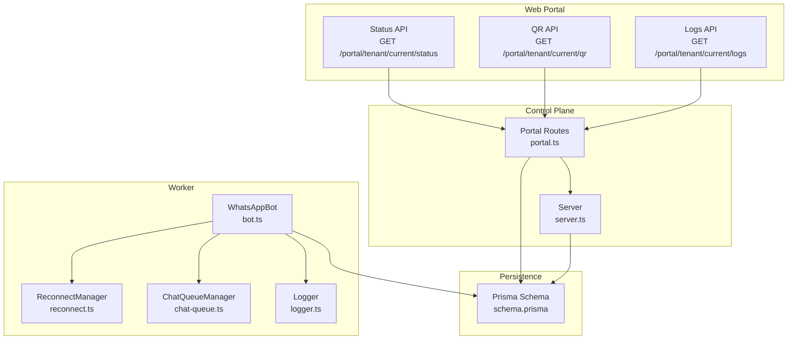
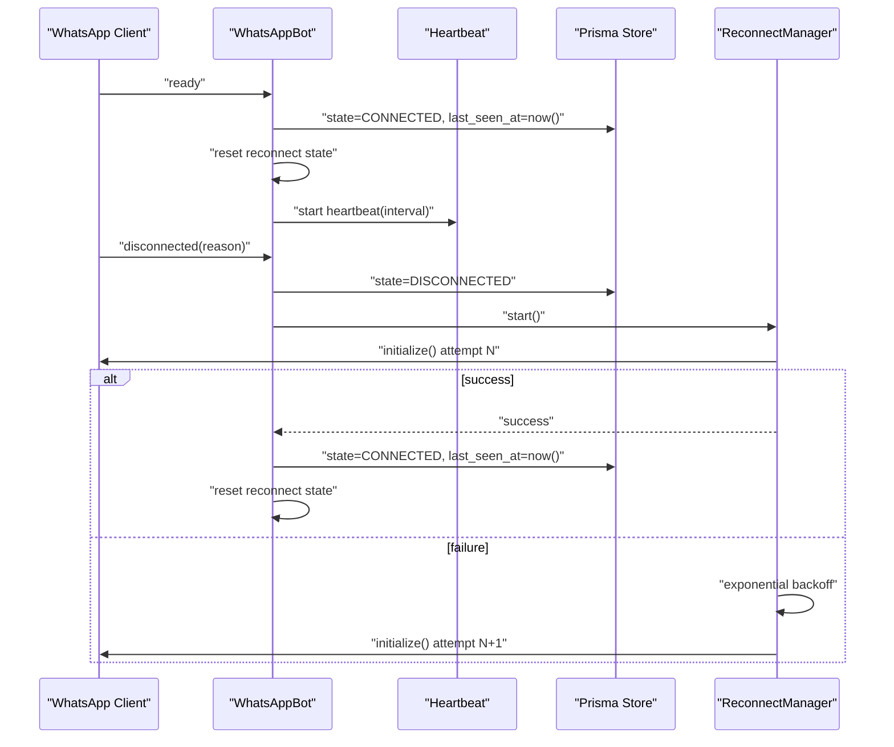
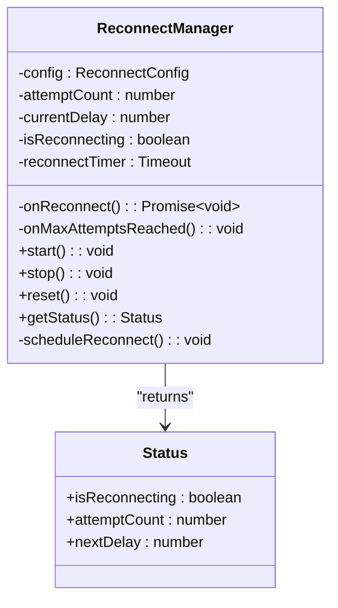
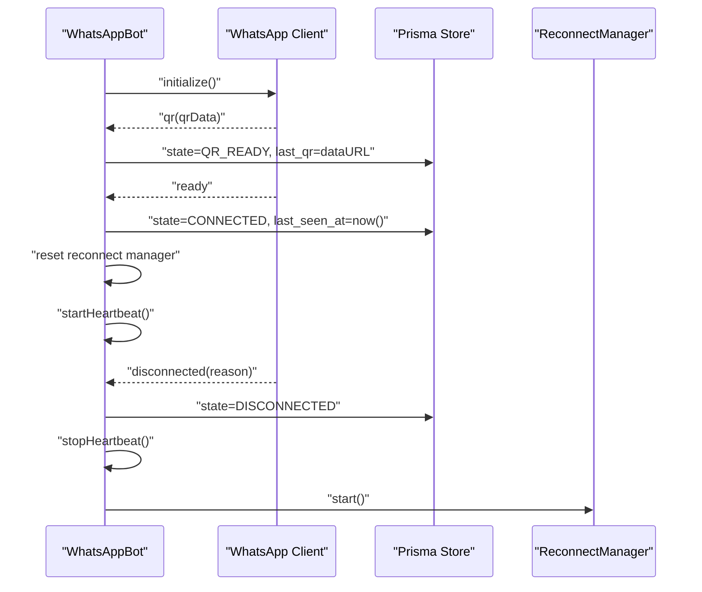
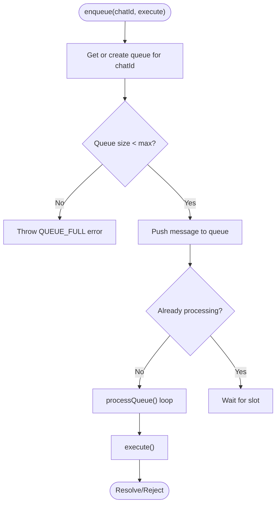
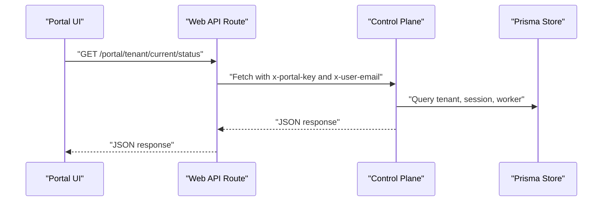
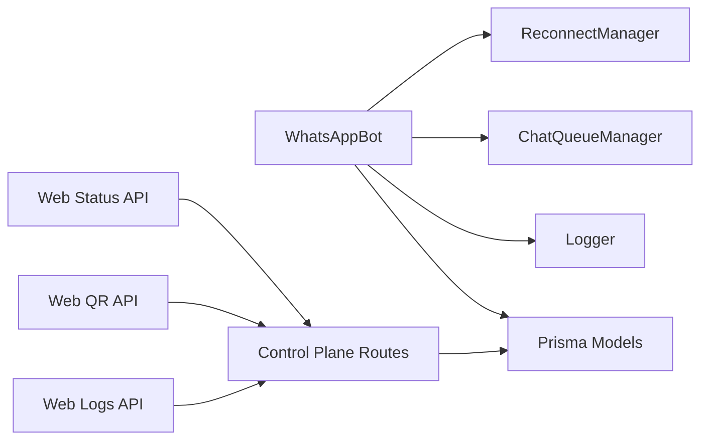

# Connection Troubleshooting

<cite>
**Referenced Files in This Document**
- [bot.ts](file://apps/worker/src/bot.ts)
- [reconnect.ts](file://apps/worker/src/utils/reconnect.ts)
- [chat-queue.ts](file://apps/worker/src/utils/chat-queue.ts)
- [logger.ts](file://packages/shared/src/utils/logger.ts)
- [schema.prisma](file://packages/shared/src/prisma/schema.prisma)
- [server.ts](file://apps/control-plane/src/server.ts)
- [portal.ts](file://apps/control-plane/src/routes/portal.ts)
- [status.route.ts](file://apps/web/src/app/api/portal/tenant/current/status/route.ts)
- [qr.route.ts](file://apps/web/src/app/api/portal/tenant/current/qr/route.ts)
- [logs.route.ts](file://apps/web/src/app/api/portal/tenant/current/logs/route.ts)
- [status.page.tsx](file://apps/web/src/app/(portal)/app/status/page.tsx)
</cite>

## Table of Contents
1. [Introduction](#introduction)
2. [Project Structure](#project-structure)
3. [Core Components](#core-components)
4. [Architecture Overview](#architecture-overview)
5. [Detailed Component Analysis](#detailed-component-analysis)
6. [Dependency Analysis](#dependency-analysis)
7. [Performance Considerations](#performance-considerations)
8. [Troubleshooting Guide](#troubleshooting-guide)
9. [Conclusion](#conclusion)
10. [Appendices](#appendices)

## Introduction
This document provides comprehensive troubleshooting guidance for WhatsApp connection issues within the system. It explains disconnection causes, automatic reconnection behavior, manual recovery procedures, and permanent failure scenarios. It also documents the reconnect manager, heartbeat monitoring, and connection health indicators, along with practical steps for diagnosing and resolving common issues such as network connectivity problems, WhatsApp Web restrictions, Chrome/Chromium dependency issues, and session corruption.

## Project Structure
The solution comprises:
- Worker process that manages the WhatsApp client, heartbeat, and reconnection
- Control plane that exposes status, QR, and logs endpoints
- Web portal APIs that proxy requests to the control plane
- Shared logging utilities and Prisma schema for persistence

**Diagram sources**
- [status.route.ts](file://apps/web/src/app/api/portal/tenant/current/status/route.ts#L1-L35)
- [qr.route.ts](file://apps/web/src/app/api/portal/tenant/current/qr/route.ts#L1-L35)
- [logs.route.ts](file://apps/web/src/app/api/portal/tenant/current/logs/route.ts#L1-L35)
- [portal.ts](file://apps/control-plane/src/routes/portal.ts#L155-L243)
- [server.ts](file://apps/control-plane/src/server.ts#L1-L89)
- [bot.ts](file://apps/worker/src/bot.ts#L1-L411)
- [reconnect.ts](file://apps/worker/src/utils/reconnect.ts#L1-L117)
- [chat-queue.ts](file://apps/worker/src/utils/chat-queue.ts#L1-L140)
- [logger.ts](file://packages/shared/src/utils/logger.ts#L1-L33)
- [schema.prisma](file://packages/shared/src/prisma/schema.prisma#L92-L131)

**Section sources**
- [status.route.ts](file://apps/web/src/app/api/portal/tenant/current/status/route.ts#L1-L35)
- [qr.route.ts](file://apps/web/src/app/api/portal/tenant/current/qr/route.ts#L1-L35)
- [logs.route.ts](file://apps/web/src/app/api/portal/tenant/current/logs/route.ts#L1-L35)
- [portal.ts](file://apps/control-plane/src/routes/portal.ts#L155-L243)
- [server.ts](file://apps/control-plane/src/server.ts#L1-L89)
- [bot.ts](file://apps/worker/src/bot.ts#L1-L411)
- [reconnect.ts](file://apps/worker/src/utils/reconnect.ts#L1-L117)
- [chat-queue.ts](file://apps/worker/src/utils/chat-queue.ts#L1-L140)
- [logger.ts](file://packages/shared/src/utils/logger.ts#L1-L33)
- [schema.prisma](file://packages/shared/src/prisma/schema.prisma#L92-L131)

## Core Components
- WhatsAppBot orchestrates the WhatsApp client lifecycle, event handling, heartbeat, and recovery.
- ReconnectManager implements exponential backoff reconnection with configurable limits.
- ChatQueueManager ensures sequential processing per chat to avoid concurrency issues.
- Logger writes structured logs to stdout and tenant-specific files.
- Control plane routes expose status, QR, and logs via authenticated endpoints.
- Web portal APIs proxy frontend requests to the control plane.

Key connection health indicators:
- Tenant status (ACTIVE vs ERROR)
- WhatsApp session state (CONNECTED, DISCONNECTED, QR_READY)
- Worker process status (RUNNING vs ERROR)
- Heartbeat timestamps (last_seen_at)
- Message logs for inbound/outbound activity

**Section sources**
- [bot.ts](file://apps/worker/src/bot.ts#L12-L75)
- [reconnect.ts](file://apps/worker/src/utils/reconnect.ts#L14-L85)
- [chat-queue.ts](file://apps/worker/src/utils/chat-queue.ts#L21-L29)
- [logger.ts](file://packages/shared/src/utils/logger.ts#L5-L30)
- [portal.ts](file://apps/control-plane/src/routes/portal.ts#L155-L243)
- [schema.prisma](file://packages/shared/src/prisma/schema.prisma#L92-L131)

## Architecture Overview
The system monitors connection health via periodic heartbeats and updates the database. On disconnection, the worker triggers the reconnect manager to attempt restoration with exponential backoff. The control plane surfaces status, QR, and logs for diagnostics.

**Diagram sources**
- [bot.ts](file://apps/worker/src/bot.ts#L98-L208)
- [reconnect.ts](file://apps/worker/src/utils/reconnect.ts#L87-L115)
- [schema.prisma](file://packages/shared/src/prisma/schema.prisma#L92-L103)

## Detailed Component Analysis

### Reconnect Manager
Implements exponential backoff with configurable parameters:
- Initial delay, maximum delay, maximum attempts, and backoff multiplier
- Tracks attempt count and next delay
- Stops and resets state appropriately
- Invokes callbacks on max attempts reached

**Diagram sources**
- [reconnect.ts](file://apps/worker/src/utils/reconnect.ts#L7-L85)

**Section sources**
- [reconnect.ts](file://apps/worker/src/utils/reconnect.ts#L14-L117)

### WhatsAppBot and Heartbeat
- Initializes the WhatsApp client with LocalAuth and headless browser options
- Emits QR code and transitions session state to QR_READY
- On ready, sets CONNECTED, clears reconnect attempts, loads configuration, starts heartbeat
- On disconnected, marks DISCONNECTED, stops heartbeat, starts reconnect manager
- Heartbeat updates last_seen_at and worker status periodically

**Diagram sources**
- [bot.ts](file://apps/worker/src/bot.ts#L77-L208)
- [bot.ts](file://apps/worker/src/bot.ts#L333-L367)
- [schema.prisma](file://packages/shared/src/prisma/schema.prisma#L92-L103)

**Section sources**
- [bot.ts](file://apps/worker/src/bot.ts#L64-L75)
- [bot.ts](file://apps/worker/src/bot.ts#L77-L226)
- [bot.ts](file://apps/worker/src/bot.ts#L333-L367)

### Chat Queue Manager
- Ensures sequential processing per chat to prevent race conditions
- Enforces a maximum queue size per chat
- Logs queue metrics and cleans up empty queues

**Diagram sources**
- [chat-queue.ts](file://apps/worker/src/utils/chat-queue.ts#L35-L138)

**Section sources**
- [chat-queue.ts](file://apps/worker/src/utils/chat-queue.ts#L21-L140)

### Control Plane and Web APIs
- Control plane validates environment, connects to database, and exposes authenticated endpoints
- Web portal APIs forward requests to control plane with internal key and user email headers
- Endpoints: status, QR, logs

**Diagram sources**
- [status.route.ts](file://apps/web/src/app/api/portal/tenant/current/status/route.ts#L8-L29)
- [portal.ts](file://apps/control-plane/src/routes/portal.ts#L155-L186)
- [server.ts](file://apps/control-plane/src/server.ts#L16-L39)

**Section sources**
- [portal.ts](file://apps/control-plane/src/routes/portal.ts#L1-L246)
- [status.route.ts](file://apps/web/src/app/api/portal/tenant/current/status/route.ts#L1-L35)
- [qr.route.ts](file://apps/web/src/app/api/portal/tenant/current/qr/route.ts#L1-L35)
- [logs.route.ts](file://apps/web/src/app/api/portal/tenant/current/logs/route.ts#L1-L35)

## Dependency Analysis
- WhatsAppBot depends on ReconnectManager, ChatQueueManager, Logger, and Prisma models
- Control plane routes depend on Prisma for data access
- Web API routes depend on control plane for backend operations
- Heartbeat relies on database updates to reflect connection health

**Diagram sources**
- [bot.ts](file://apps/worker/src/bot.ts#L10-L25)
- [reconnect.ts](file://apps/worker/src/utils/reconnect.ts#L1-L11)
- [chat-queue.ts](file://apps/worker/src/utils/chat-queue.ts#L1-L10)
- [portal.ts](file://apps/control-plane/src/routes/portal.ts#L1-L8)
- [status.route.ts](file://apps/web/src/app/api/portal/tenant/current/status/route.ts#L1-L7)

**Section sources**
- [bot.ts](file://apps/worker/src/bot.ts#L10-L25)
- [portal.ts](file://apps/control-plane/src/routes/portal.ts#L1-L8)
- [status.route.ts](file://apps/web/src/app/api/portal/tenant/current/status/route.ts#L1-L7)

## Performance Considerations
- Heartbeat interval is configurable and should balance responsiveness with resource usage
- Exponential backoff prevents thrashing during prolonged outages
- Queue limits protect the system from overload under bursty traffic
- Logging levels and destinations are configurable for operational visibility

[No sources needed since this section provides general guidance]

## Troubleshooting Guide

### Understanding Connection States and Health Indicators
- Session state: DISCONNECTED, CONNECTED, QR_READY
- Tenant status: ACTIVE, ERROR
- Worker status: RUNNING, ERROR
- Heartbeat: last_seen_at timestamp
- Logs: message logs for inbound/outbound activity

Health checks:
- Confirm session state and last_seen_at via status endpoint
- Verify tenant and worker statuses
- Inspect recent message logs for activity

**Section sources**
- [portal.ts](file://apps/control-plane/src/routes/portal.ts#L155-L186)
- [schema.prisma](file://packages/shared/src/prisma/schema.prisma#L92-L131)
- [status.page.tsx](file://apps/web/src/app/(portal)/app/status/page.tsx#L102-L126)

### Disconnection Reasons and Automatic Recovery
Common reasons:
- Network instability or timeouts
- WhatsApp Web restrictions or account limitations
- Browser/headless Chromium issues
- Session corruption or invalid credentials

Automatic recovery:
- On disconnected event, the system transitions to DISCONNECTED, stops heartbeat, and starts ReconnectManager
- ReconnectManager retries with exponential backoff until max attempts are reached
- On success, resets reconnect state and resumes normal operation
- On max attempts reached, marks tenant and worker as ERROR

Manual recovery steps:
- Restart the worker process if it becomes unresponsive
- Clear corrupted session data and regenerate QR code
- Review logs for repeated failures and adjust retry parameters if needed

**Section sources**
- [bot.ts](file://apps/worker/src/bot.ts#L185-L208)
- [reconnect.ts](file://apps/worker/src/utils/reconnect.ts#L87-L115)
- [bot.ts](file://apps/worker/src/bot.ts#L42-L56)

### Manual Reconnection Procedures
- Trigger QR regeneration: Access QR endpoint and scan with WhatsApp Web
- Force restart: Stop and start the worker process
- Clear session: Remove local auth data directory for the tenant and restart

Diagnostic steps:
- Check status endpoint for current state and timestamps
- Fetch logs to identify recurring error patterns
- Verify environment variables for Chrome/Chromium path and Puppeteer settings

**Section sources**
- [qr.route.ts](file://apps/web/src/app/api/portal/tenant/current/qr/route.ts#L1-L35)
- [logs.route.ts](file://apps/web/src/app/api/portal/tenant/current/logs/route.ts#L1-L35)
- [server.ts](file://apps/control-plane/src/server.ts#L34-L38)

### Permanent Failure Scenarios
- Max reconnect attempts reached: System marks tenant and worker as ERROR
- Auth failure: Tenant marked as ERROR with detailed message
- Stale worker detection: Background job detects inactive workers and can mark them stale

Escalation path:
- Review logs and error messages stored in the worker process record
- Investigate underlying infrastructure (network, browser, storage)
- Contact support with logs and timestamps

**Section sources**
- [reconnect.ts](file://apps/worker/src/utils/reconnect.ts#L87-L92)
- [bot.ts](file://apps/worker/src/bot.ts#L210-L225)
- [server.ts](file://apps/control-plane/src/server.ts#L54-L63)

### Diagnostic Procedures and Log Analysis
- Enable appropriate log levels and destinations
- Tail tenant-specific logs for the affected tenant
- Correlate timestamps of disconnections with heartbeat intervals
- Search for repeated error patterns in message logs

Log locations and structure:
- Console output with pretty printing
- Tenant-specific log files under logs directory

**Section sources**
- [logger.ts](file://packages/shared/src/utils/logger.ts#L5-L30)
- [bot.ts](file://apps/worker/src/bot.ts#L333-L359)

### Practical Troubleshooting Steps

Network Connectivity Problems
- Verify outbound internet access from the host
- Check firewall rules and proxy configurations
- Monitor heartbeat intervals and last_seen_at timestamps

WhatsApp Web Restrictions
- Ensure the device is not restricted or flagged
- Attempt to sign in manually via QR to confirm account status
- Review logs for auth-related errors

Chrome/Chromium Dependency Issues
- Confirm Puppeteer executable path is set in production
- Install and configure Chrome/Chromium as required
- Validate browser arguments and sandbox settings

Session Corruption
- Clear local auth data directory for the tenant
- Regenerate QR and re-authenticate
- Monitor logs for repeated initialization failures

**Section sources**
- [server.ts](file://apps/control-plane/src/server.ts#L34-L38)
- [bot.ts](file://apps/worker/src/bot.ts#L64-L72)
- [qr.route.ts](file://apps/web/src/app/api/portal/tenant/current/qr/route.ts#L1-L35)

## Conclusion
The system provides robust connection monitoring, automatic exponential backoff reconnection, and comprehensive health indicators. By leveraging status, QR, and logs endpoints, operators can quickly diagnose and recover from most connection issues. Persistent problems should be escalated with detailed logs and timestamps for deeper investigation.

[No sources needed since this section summarizes without analyzing specific files]

## Appendices

### Connection Health Dashboard Fields
- Tenant status
- Session state
- Last seen timestamp
- Worker status
- Recent message logs

**Section sources**
- [portal.ts](file://apps/control-plane/src/routes/portal.ts#L155-L186)
- [status.page.tsx](file://apps/web/src/app/(portal)/app/status/page.tsx#L102-L126)