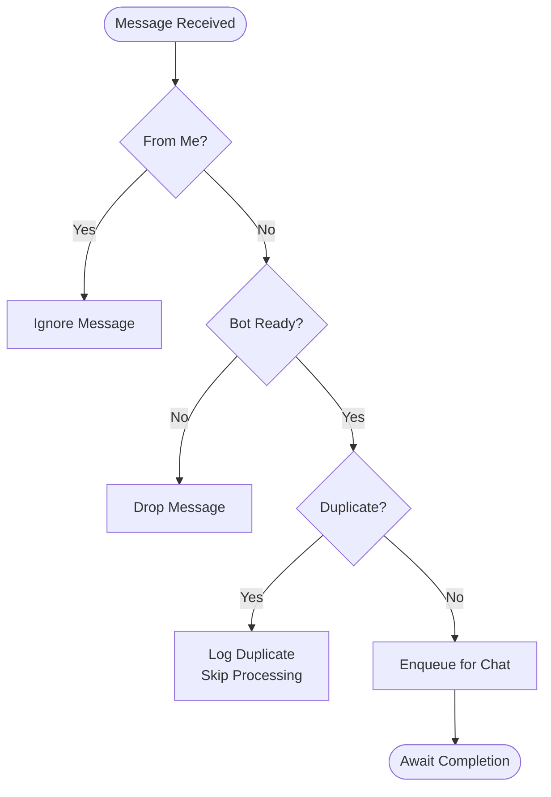

# Message Processing

<cite>
**Referenced Files in This Document**
- [bot.ts](file://apps/worker/src/bot.ts)
- [worker.ts](file://apps/worker/src/worker.ts)
- [chat-queue.ts](file://apps/worker/src/utils/chat-queue.ts)
- [dedup.ts](file://apps/worker/src/utils/dedup.ts)
- [rate-limiter.ts](file://apps/worker/src/utils/rate-limiter.ts)
- [index.ts](file://apps/worker/src/templates/index.ts)
- [booking.ts](file://apps/worker/src/templates/booking.ts)
- [logger.ts](file://packages/shared/src/utils/logger.ts)
- [.env.example](file://.env.example)
- [package.json](file://apps/worker/package.json)
</cite>

## Table of Contents
1. [Introduction](#introduction)
2. [Project Structure](#project-structure)
3. [Core Components](#core-components)
4. [Architecture Overview](#architecture-overview)
5. [Detailed Component Analysis](#detailed-component-analysis)
6. [Dependency Analysis](#dependency-analysis)
7. [Performance Considerations](#performance-considerations)
8. [Troubleshooting Guide](#troubleshooting-guide)
9. [Conclusion](#conclusion)
10. [Appendices](#appendices)

## Introduction
This document explains the message processing pipeline and handling workflows for the WhatsApp worker. It covers the end-to-end lifecycle from message receipt to response, including duplicate message detection, chat queue management for sequential processing, template-driven routing, rate limiting, logging, error handling, and operational safeguards such as reconnection and heartbeats. Practical examples illustrate queue overflow handling and deduplication behavior, along with performance and memory management recommendations.

## Project Structure
The worker module orchestrates WhatsApp message handling for a tenant. Key elements:
- Worker bootstrap initializes environment, loads tenant configuration, and starts the bot.
- The bot listens for incoming messages, deduplicates them, enqueues per-chat for sequential processing, applies rate limiting, routes to template handlers, logs activity, and handles errors without crashing.
- Utilities provide chat queue management, message deduplication, and rate limiting.
- Templates define routing logic for different business domains.

**Diagram sources**
- [worker.ts](file://apps/worker/src/worker.ts#L1-L46)
- [bot.ts](file://apps/worker/src/bot.ts#L1-L411)
- [chat-queue.ts](file://apps/worker/src/utils/chat-queue.ts#L1-L140)
- [dedup.ts](file://apps/worker/src/utils/dedup.ts#L1-L93)
- [rate-limiter.ts](file://apps/worker/src/utils/rate-limiter.ts#L1-L110)
- [index.ts](file://apps/worker/src/templates/index.ts#L1-L70)
- [booking.ts](file://apps/worker/src/templates/booking.ts#L1-L22)
- [logger.ts](file://packages/shared/src/utils/logger.ts#L1-L33)

**Section sources**
- [worker.ts](file://apps/worker/src/worker.ts#L1-L46)
- [bot.ts](file://apps/worker/src/bot.ts#L1-L411)
- [chat-queue.ts](file://apps/worker/src/utils/chat-queue.ts#L1-L140)
- [dedup.ts](file://apps/worker/src/utils/dedup.ts#L1-L93)
- [rate-limiter.ts](file://apps/worker/src/utils/rate-limiter.ts#L1-L110)
- [index.ts](file://apps/worker/src/templates/index.ts#L1-L70)
- [booking.ts](file://apps/worker/src/templates/booking.ts#L1-L22)
- [logger.ts](file://packages/shared/src/utils/logger.ts#L1-L33)

## Core Components
- WhatsAppBot: Central orchestrator for message reception, deduplication, queueing, rate limiting, template routing, logging, and error handling.
- ChatQueueManager: Maintains per-chat FIFO queues to ensure sequential processing and bounded concurrency.
- MessageDeduplicator: Tracks seen message IDs to prevent duplicate processing.
- RateLimiter: Enforces per-tenant reply rate limits with configurable windows.
- Template Router: Routes messages to domain-specific handlers based on tenant configuration.
- Logger: Provides structured logging with console and tenant-specific file outputs.

**Section sources**
- [bot.ts](file://apps/worker/src/bot.ts#L12-L75)
- [chat-queue.ts](file://apps/worker/src/utils/chat-queue.ts#L21-L139)
- [dedup.ts](file://apps/worker/src/utils/dedup.ts#L11-L89)
- [rate-limiter.ts](file://apps/worker/src/utils/rate-limiter.ts#L17-L106)
- [index.ts](file://apps/worker/src/templates/index.ts#L9-L23)
- [logger.ts](file://packages/shared/src/utils/logger.ts#L5-L30)

## Architecture Overview
The message lifecycle is event-driven and resilient:
- Event emission triggers message handling.
- Deduplication prevents repeated work.
- Chat queues serialize processing per chat.
- Rate limiter controls outbound reply cadence.
- Template router selects appropriate response logic.
- Logging captures all events and errors.
- Heartbeat and reconnect guard against disconnections.

**Diagram sources**
- [bot.ts](file://apps/worker/src/bot.ts#L153-L183)
- [bot.ts](file://apps/worker/src/bot.ts#L248-L331)
- [dedup.ts](file://apps/worker/src/utils/dedup.ts#L28-L46)
- [chat-queue.ts](file://apps/worker/src/utils/chat-queue.ts#L35-L68)
- [rate-limiter.ts](file://apps/worker/src/utils/rate-limiter.ts#L32-L73)
- [index.ts](file://apps/worker/src/templates/index.ts#L9-L23)

## Detailed Component Analysis

### Message Reception Flow
- The bot registers a listener for incoming messages.
- It ignores messages from itself and checks readiness.
- Duplicate messages are skipped using a deduplication cache keyed by message ID.
- Messages are enqueued for sequential processing by chat ID.

**Diagram sources**
- [bot.ts](file://apps/worker/src/bot.ts#L153-L183)
- [dedup.ts](file://apps/worker/src/utils/dedup.ts#L28-L46)

**Section sources**
- [bot.ts](file://apps/worker/src/bot.ts#L153-L183)

### Duplicate Message Detection and Prevention
- Uses a time-bounded cache keyed by WhatsApp message ID.
- Periodic cleanup removes expired entries.
- Evicts oldest entries when capacity is exceeded.
- Provides statistics for observability.

**Diagram sources**
- [dedup.ts](file://apps/worker/src/utils/dedup.ts#L11-L89)

**Section sources**
- [dedup.ts](file://apps/worker/src/utils/dedup.ts#L11-L89)

### Chat Queue Management for Sequential Processing
- Maintains a map of queues per chat ID.
- Enforces a maximum queue size per chat.
- Processes messages in FIFO order, continuing after failures.
- Cleans up empty queues to prevent memory leaks.
- Supports total queue size inspection and bulk clearing on shutdown.

**Diagram sources**
- [chat-queue.ts](file://apps/worker/src/utils/chat-queue.ts#L21-L139)

**Section sources**
- [chat-queue.ts](file://apps/worker/src/utils/chat-queue.ts#L21-L139)

### Rate Limiting Enforcement
- Tracks per-tenant counts within a sliding window.
- Emits a one-time warning when the limit is exceeded.
- Allows subsequent requests after the window resets.
- Provides status queries for monitoring.

**Diagram sources**
- [rate-limiter.ts](file://apps/worker/src/utils/rate-limiter.ts#L32-L73)

**Section sources**
- [rate-limiter.ts](file://apps/worker/src/utils/rate-limiter.ts#L17-L106)

### Message Routing to Template Handlers
- Loads tenant configuration (template type, business name, language).
- Routes to domain-specific handlers:
  - BOOKING: booking intent detection and guidance.
  - ECOMMERCE: product info and ordering prompts.
  - SUPPORT: issue and contact guidance.
- Defaults to booking handler if no config is present.

**Diagram sources**
- [index.ts](file://apps/worker/src/templates/index.ts#L9-L23)
- [booking.ts](file://apps/worker/src/templates/booking.ts#L1-L22)

**Section sources**
- [index.ts](file://apps/worker/src/templates/index.ts#L9-L23)
- [booking.ts](file://apps/worker/src/templates/booking.ts#L1-L22)

### Message Lifecycle: Receipt to Response
- Log incoming message metadata.
- Apply rate limit; optionally warn and suppress replies.
- Route to template handler and send reply.
- Log outgoing message metadata.
- Update last seen timestamps.

**Diagram sources**
- [bot.ts](file://apps/worker/src/bot.ts#L248-L331)

**Section sources**
- [bot.ts](file://apps/worker/src/bot.ts#L248-L331)

### Queue Overflow Handling
- When a chat’s queue exceeds the configured maximum, the enqueue operation throws a specific error indicating overflow.
- The caller catches this error and sends a “please wait” message to the user, preventing system overload and maintaining UX.

**Diagram sources**
- [chat-queue.ts](file://apps/worker/src/utils/chat-queue.ts#L38-L42)
- [bot.ts](file://apps/worker/src/bot.ts#L171-L182)

**Section sources**
- [chat-queue.ts](file://apps/worker/src/utils/chat-queue.ts#L38-L42)
- [bot.ts](file://apps/worker/src/bot.ts#L171-L182)

### Error Handling Strategies
- Global try/catch around message handling ensures the worker continues operating even if individual messages fail.
- Errors are logged and optionally persisted to the worker process record.
- Disconnection triggers a reconnect manager with capped retries; persistent failures mark the tenant and worker process as ERROR.
- Heartbeat updates keep the system monitored and responsive.

**Diagram sources**
- [bot.ts](file://apps/worker/src/bot.ts#L313-L331)
- [bot.ts](file://apps/worker/src/bot.ts#L185-L208)
- [bot.ts](file://apps/worker/src/bot.ts#L38-L56)

**Section sources**
- [bot.ts](file://apps/worker/src/bot.ts#L185-L208)
- [bot.ts](file://apps/worker/src/bot.ts#L313-L331)
- [bot.ts](file://apps/worker/src/bot.ts#L38-L56)

## Dependency Analysis
- The worker entrypoint depends on the bot class and environment configuration.
- The bot composes three utilities and a template router.
- Shared logging infrastructure supports tenant-scoped logs.
- Environment variables configure runtime behavior such as rate limits and heartbeat intervals.

**Diagram sources**
- [.env.example](file://.env.example#L1-L22)
- [worker.ts](file://apps/worker/src/worker.ts#L1-L46)
- [bot.ts](file://apps/worker/src/bot.ts#L1-L411)
- [chat-queue.ts](file://apps/worker/src/utils/chat-queue.ts#L1-L140)
- [dedup.ts](file://apps/worker/src/utils/dedup.ts#L1-L93)
- [rate-limiter.ts](file://apps/worker/src/utils/rate-limiter.ts#L1-L110)
- [index.ts](file://apps/worker/src/templates/index.ts#L1-L70)
- [booking.ts](file://apps/worker/src/templates/booking.ts#L1-L22)
- [logger.ts](file://packages/shared/src/utils/logger.ts#L1-L33)

**Section sources**
- [.env.example](file://.env.example#L1-L22)
- [package.json](file://apps/worker/package.json#L1-L22)
- [worker.ts](file://apps/worker/src/worker.ts#L1-L46)
- [bot.ts](file://apps/worker/src/bot.ts#L1-L411)

## Performance Considerations
- Concurrency control: Chat queues serialize per-chat processing, reducing race conditions and resource contention.
- Memory management: Empty queues are removed; dedup cache enforces eviction policies to cap memory usage.
- Rate limiting: Prevents bursty reply patterns that could trigger platform throttling.
- I/O batching: Logging and DB writes are performed synchronously within handlers; consider batching or async buffering for high throughput.
- Heartbeat and reconnect: Keep the session healthy and recover quickly from transient failures.
- Environment tuning: Adjust queue sizes, rate limits, and heartbeat intervals via environment variables.

[No sources needed since this section provides general guidance]

## Troubleshooting Guide
- Duplicate messages: Verify dedup cache is active and not overwhelmed; check TTL and max size settings.
- Queue overflow: Increase per-chat queue size or reduce inbound rate; inform users with wait messages.
- Rate limit warnings: Tune max requests per window; monitor warningSent state.
- Disconnections: Inspect reconnect attempts and error logs; confirm network stability.
- Logging: Ensure logs are written to tenant-specific files and console; adjust LOG_LEVEL as needed.

**Section sources**
- [dedup.ts](file://apps/worker/src/utils/dedup.ts#L59-L88)
- [chat-queue.ts](file://apps/worker/src/utils/chat-queue.ts#L38-L42)
- [rate-limiter.ts](file://apps/worker/src/utils/rate-limiter.ts#L62-L73)
- [bot.ts](file://apps/worker/src/bot.ts#L185-L208)
- [logger.ts](file://packages/shared/src/utils/logger.ts#L19-L30)

## Conclusion
The worker implements a robust, event-driven message processing pipeline with built-in safeguards for reliability and scalability. Deduplication, per-chat queuing, rate limiting, and structured logging collectively ensure predictable behavior under load. The modular design allows easy extension to additional template types and operational improvements.

[No sources needed since this section summarizes without analyzing specific files]

## Appendices

### Practical Examples
- Example: High-volume support chat
  - Enable per-chat serialization to avoid conflicting replies.
  - Set moderate rate limit to balance responsiveness and compliance.
  - Monitor queue size and send wait messages proactively.
- Example: Booking flow
  - Use booking template routing to guide users toward service selection.
  - Log all interactions for audit and analytics.
- Example: Queue overflow handling
  - When enqueue throws QUEUE_FULL, reply with a wait message and retry later.

**Section sources**
- [chat-queue.ts](file://apps/worker/src/utils/chat-queue.ts#L38-L42)
- [bot.ts](file://apps/worker/src/bot.ts#L171-L182)
- [index.ts](file://apps/worker/src/templates/index.ts#L14-L22)

### Configuration Options
- RATE_LIMIT_MAX_PER_MINUTE: Maximum replies per minute per tenant.
- HEARTBEAT_INTERVAL_MS: Interval for heartbeat updates.
- STALE_THRESHOLD_MINUTES and STALE_CHECK_INTERVAL_MS: Thresholds for stale session detection.

**Section sources**
- [.env.example](file://.env.example#L19-L22)
- [bot.ts](file://apps/worker/src/bot.ts#L33-L34)
- [bot.ts](file://apps/worker/src/bot.ts#L334-L356)