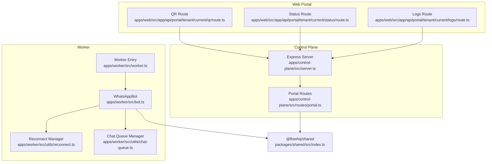
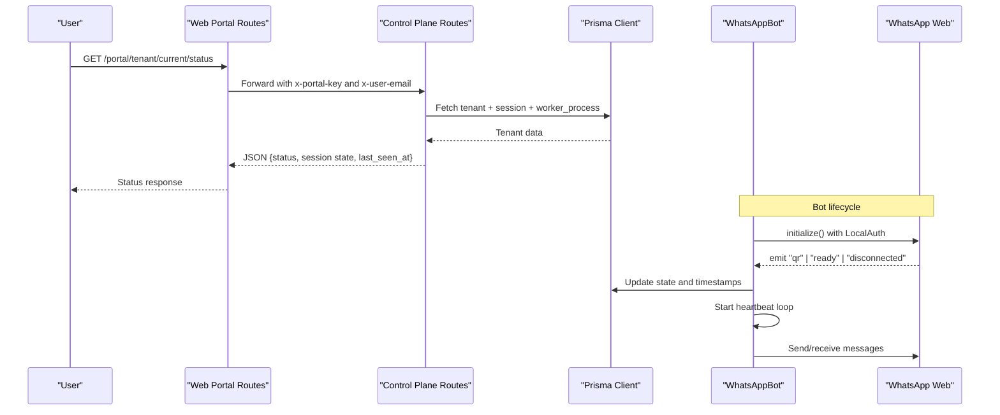
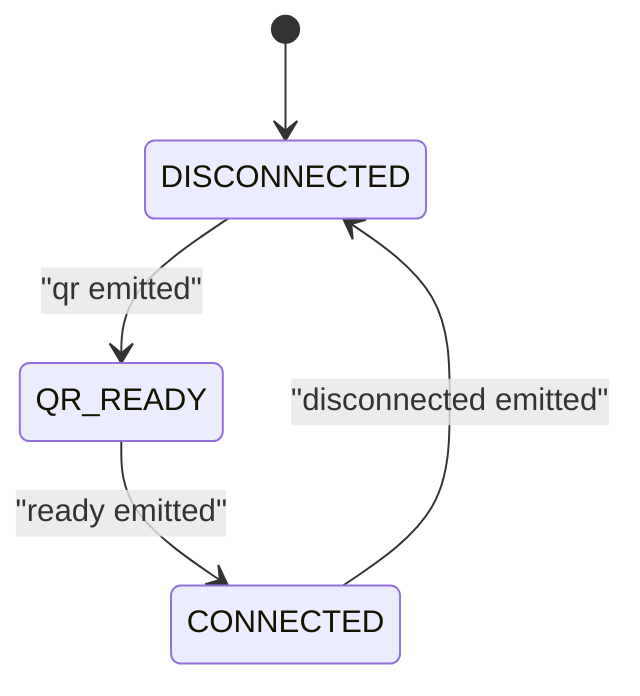
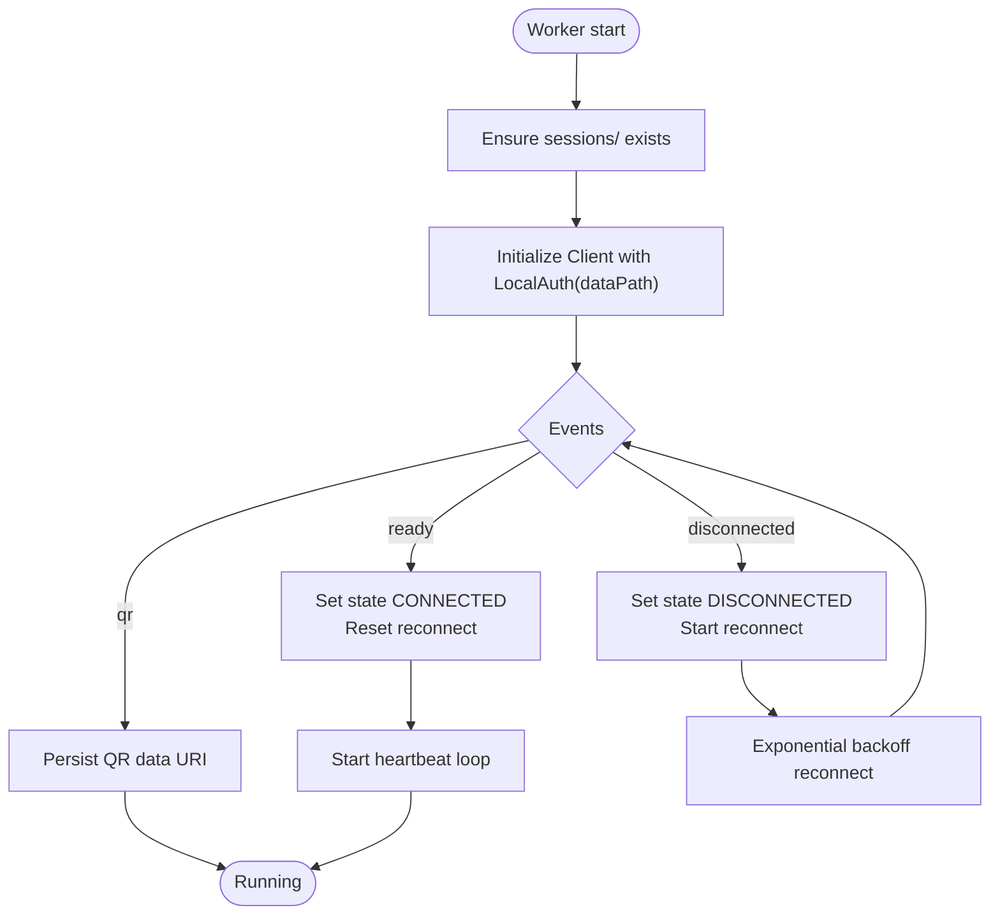
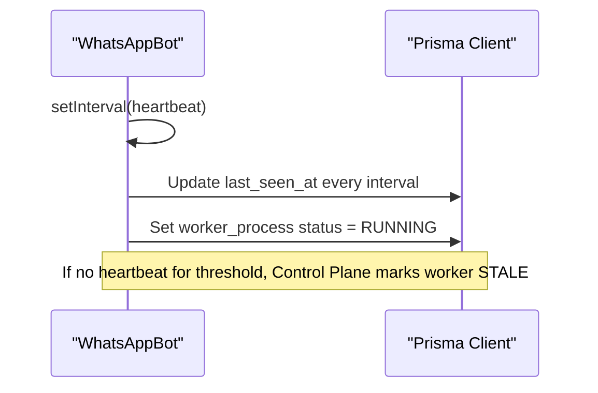
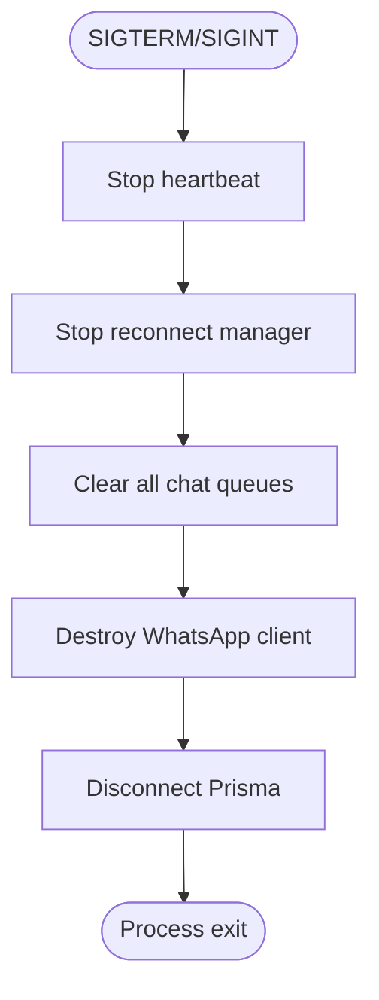
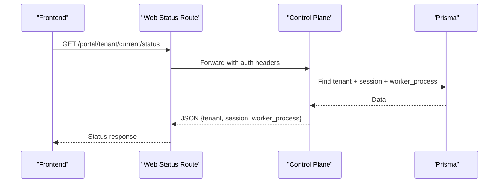
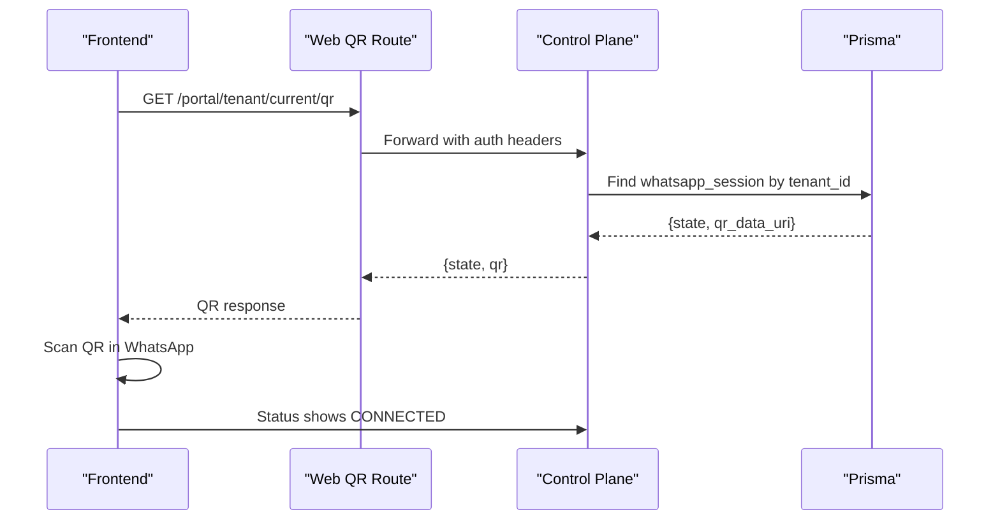
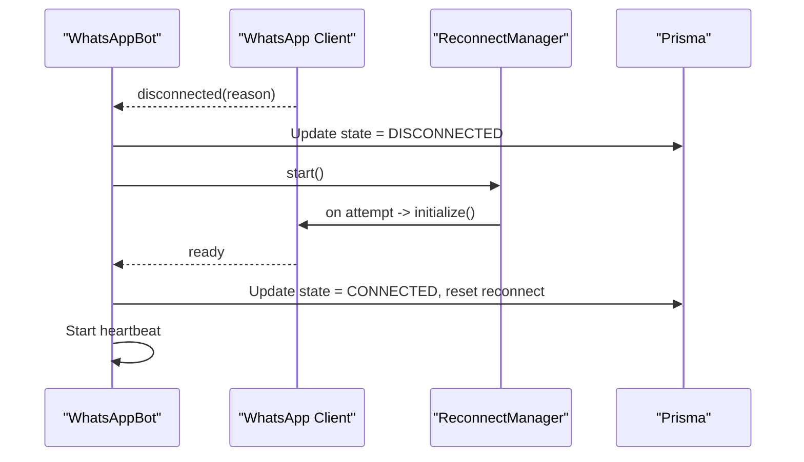
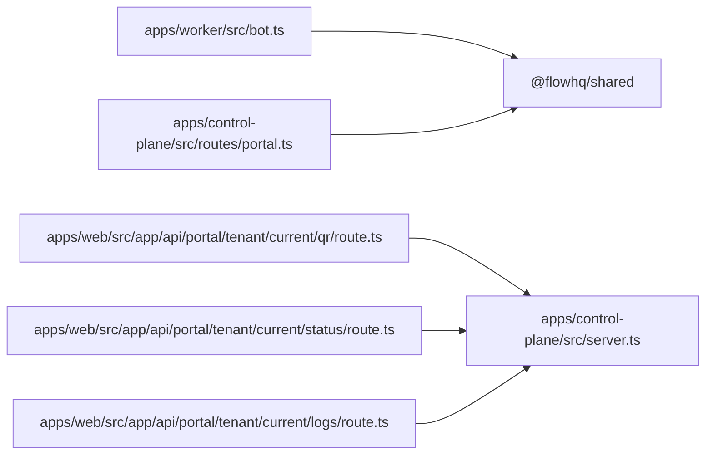

# Session Management

<cite>
**Referenced Files in This Document**
- [README.md](file://README.md)
- [package.json](file://package.json)
- [apps/worker/src/bot.ts](file://apps/worker/src/bot.ts)
- [apps/worker/src/worker.ts](file://apps/worker/src/worker.ts)
- [apps/worker/src/utils/reconnect.ts](file://apps/worker/src/utils/reconnect.ts)
- [apps/worker/src/utils/chat-queue.ts](file://apps/worker/src/utils/chat-queue.ts)
- [apps/control-plane/src/server.ts](file://apps/control-plane/src/server.ts)
- [apps/control-plane/src/routes/portal.ts](file://apps/control-plane/src/routes/portal.ts)
- [apps/web/src/app/api/portal/tenant/current/qr/route.ts](file://apps/web/src/app/api/portal/tenant/current/qr/route.ts)
- [apps/web/src/app/api/portal/tenant/current/status/route.ts](file://apps/web/src/app/api/portal/tenant/current/status/route.ts)
- [apps/web/src/app/api/portal/tenant/current/logs/route.ts](file://apps/web/src/app/api/portal/tenant/current/logs/route.ts)
- [packages/shared/src/index.ts](file://packages/shared/src/index.ts)
</cite>

## Table of Contents
1. [Introduction](#introduction)
2. [Project Structure](#project-structure)
3. [Core Components](#core-components)
4. [Architecture Overview](#architecture-overview)
5. [Detailed Component Analysis](#detailed-component-analysis)
6. [Dependency Analysis](#dependency-analysis)
7. [Performance Considerations](#performance-considerations)
8. [Troubleshooting Guide](#troubleshooting-guide)
9. [Conclusion](#conclusion)
10. [Appendices](#appendices)

## Introduction
This document explains WhatsApp session lifecycle management and state tracking in the multi-tenant platform. It covers session states (DISCONNECTED, QR_READY, CONNECTED), session persistence using the LocalAuth strategy, session restoration, storage structure under sessions/, cleanup and recovery procedures, monitoring and state transitions, error handling, security considerations, permissions, and migration between deployments.

## Project Structure
The repository is a monorepo with three main applications and a shared package:
- Control Plane: Admin API and dashboard (Express + EJS)
- Worker: Per-tenant WhatsApp bot process using whatsapp-web.js with LocalAuth
- Web: Portal frontend APIs that proxy to the Control Plane
- Shared: Common types, Prisma client, and utilities

**Diagram sources**
- [apps/control-plane/src/server.ts](file://apps/control-plane/src/server.ts#L1-L89)
- [apps/control-plane/src/routes/portal.ts](file://apps/control-plane/src/routes/portal.ts#L1-L246)
- [apps/web/src/app/api/portal/tenant/current/qr/route.ts](file://apps/web/src/app/api/portal/tenant/current/qr/route.ts#L1-L35)
- [apps/web/src/app/api/portal/tenant/current/status/route.ts](file://apps/web/src/app/api/portal/tenant/current/status/route.ts#L1-L35)
- [apps/web/src/app/api/portal/tenant/current/logs/route.ts](file://apps/web/src/app/api/portal/tenant/current/logs/route.ts#L1-L35)
- [apps/worker/src/worker.ts](file://apps/worker/src/worker.ts#L1-L46)
- [apps/worker/src/bot.ts](file://apps/worker/src/bot.ts#L1-L411)
- [apps/worker/src/utils/reconnect.ts](file://apps/worker/src/utils/reconnect.ts#L1-L117)
- [apps/worker/src/utils/chat-queue.ts](file://apps/worker/src/utils/chat-queue.ts#L1-L140)
- [packages/shared/src/index.ts](file://packages/shared/src/index.ts#L1-L4)

**Section sources**
- [README.md](file://README.md#L116-L129)
- [package.json](file://package.json#L1-L21)

## Core Components
- WhatsAppBot: Orchestrates WhatsApp client lifecycle, event handling, state updates, heartbeat, and cleanup.
- ReconnectManager: Implements exponential backoff for automatic reconnection after disconnections.
- ChatQueueManager: Ensures sequential processing per chat to avoid race conditions and improve reliability.
- Control Plane Portal Routes: Expose tenant status, QR code, and logs to the Web Portal.
- Worker Entry Point: Initializes the bot with tenant ID and sessions path, handles graceful shutdown.

Key responsibilities:
- Session persistence: LocalAuth with dataPath pointing to sessions/<tenant_id>
- State transitions: DISCONNECTED → QR_READY → CONNECTED and back on disconnect
- Persistence and restoration: whatsapp-web.js restores session automatically from persisted files
- Monitoring: Heartbeat updates last_seen_at and worker status
- Recovery: Automatic reconnect with capped attempts and delays

**Section sources**
- [apps/worker/src/bot.ts](file://apps/worker/src/bot.ts#L12-L75)
- [apps/worker/src/utils/reconnect.ts](file://apps/worker/src/utils/reconnect.ts#L14-L39)
- [apps/worker/src/utils/chat-queue.ts](file://apps/worker/src/utils/chat-queue.ts#L21-L29)
- [apps/control-plane/src/routes/portal.ts](file://apps/control-plane/src/routes/portal.ts#L155-L216)
- [apps/worker/src/worker.ts](file://apps/worker/src/worker.ts#L1-L46)

## Architecture Overview
The system comprises:
- Worker process per tenant with LocalAuth session storage
- Control Plane managing tenant state and exposing status via REST
- Web Portal routes that proxy to Control Plane for QR, status, and logs
- Shared Prisma client for database operations

**Diagram sources**
- [apps/web/src/app/api/portal/tenant/current/status/route.ts](file://apps/web/src/app/api/portal/tenant/current/status/route.ts#L1-L35)
- [apps/control-plane/src/routes/portal.ts](file://apps/control-plane/src/routes/portal.ts#L155-L186)
- [apps/worker/src/bot.ts](file://apps/worker/src/bot.ts#L77-L226)

## Detailed Component Analysis

### Session States and Transitions
States:
- DISCONNECTED: Client disconnected; triggers reconnect manager
- QR_READY: QR code available for linking device
- CONNECTED: Client ready and actively processing messages

Transitions:
- On disconnected(reason): set state to DISCONNECTED, stop heartbeat, start reconnect
- On qr(qrString): convert to data URL, set state to QR_READY
- On ready: set state to CONNECTED, reset reconnect, update tenant and worker statuses, start heartbeat

**Diagram sources**
- [apps/worker/src/bot.ts](file://apps/worker/src/bot.ts#L77-L226)

**Section sources**
- [apps/worker/src/bot.ts](file://apps/worker/src/bot.ts#L77-L226)

### Session Persistence with LocalAuth
- Data path: sessions/<tenant_id>
- whatsapp-web.js persists cookies and device keys under this directory
- On restart, the client restores session automatically if files exist
- Directory is created if missing

**Diagram sources**
- [apps/worker/src/bot.ts](file://apps/worker/src/bot.ts#L27-L75)
- [apps/worker/src/bot.ts](file://apps/worker/src/bot.ts#L77-L226)
- [apps/worker/src/utils/reconnect.ts](file://apps/worker/src/utils/reconnect.ts#L44-L115)

**Section sources**
- [apps/worker/src/bot.ts](file://apps/worker/src/bot.ts#L58-L72)

### Session Storage Structure
- sessions/<tenant_id>/ contains LocalAuth files
- Created automatically when worker initializes for a tenant
- Used by whatsapp-web.js for session restoration

Best practices:
- Ensure write permissions for the sessions directory
- Back up sessions/<tenant_id> for migration or disaster recovery
- Do not tamper with session files manually

**Section sources**
- [apps/worker/src/bot.ts](file://apps/worker/src/bot.ts#L58-L62)
- [README.md](file://README.md#L192-L194)

### Session Restoration Mechanisms
- LocalAuth automatically restores session on client initialization if session files exist
- On ready, reconnect attempts are reset and heartbeat begins
- On auth_failure, worker status is set to ERROR and last_error recorded

Operational tips:
- If QR does not appear, verify worker started and sessions directory is writable
- If session lost, remove or rename the tenant’s session folder to force QR regeneration

**Section sources**
- [apps/worker/src/bot.ts](file://apps/worker/src/bot.ts#L98-L151)
- [apps/worker/src/bot.ts](file://apps/worker/src/bot.ts#L210-L225)

### Session Monitoring and Heartbeat
- Heartbeat interval controlled by HEARTBEAT_INTERVAL_MS
- Updates last_seen_at in WhatsAppSession and worker_process status to RUNNING
- Prevents dashboard staleness; stale workers auto-marked ERROR after threshold

**Diagram sources**
- [apps/worker/src/bot.ts](file://apps/worker/src/bot.ts#L333-L367)
- [apps/control-plane/src/server.ts](file://apps/control-plane/src/server.ts#L54-L63)

**Section sources**
- [apps/worker/src/bot.ts](file://apps/worker/src/bot.ts#L333-L367)
- [apps/control-plane/src/server.ts](file://apps/control-plane/src/server.ts#L54-L63)

### Session Cleanup Procedures
- Graceful shutdown stops heartbeat, clears reconnect timers, clears chat queues, and destroys the client
- Use SIGTERM/SIGINT handlers to ensure cleanup before process exit

**Diagram sources**
- [apps/worker/src/worker.ts](file://apps/worker/src/worker.ts#L26-L45)
- [apps/worker/src/bot.ts](file://apps/worker/src/bot.ts#L394-L409)

**Section sources**
- [apps/worker/src/worker.ts](file://apps/worker/src/worker.ts#L26-L45)
- [apps/worker/src/bot.ts](file://apps/worker/src/bot.ts#L394-L409)

### Session Corruption Recovery
Symptoms:
- Repeated disconnects
- QR keeps appearing repeatedly
- Auth failure logged

Recovery steps:
- Remove or rename sessions/<tenant_id> to force QR regeneration
- Restart worker; it will recreate session files upon successful QR scan
- Monitor logs and status endpoint for recovery confirmation

**Section sources**
- [README.md](file://README.md#L185-L208)
- [apps/worker/src/bot.ts](file://apps/worker/src/bot.ts#L210-L225)

### Practical Examples

#### Example: Monitoring Session State
- Frontend calls Web Portal route to fetch status
- Web route proxies to Control Plane
- Control Plane queries tenant, session, and worker_process
- Response includes state and last_seen_at

**Diagram sources**
- [apps/web/src/app/api/portal/tenant/current/status/route.ts](file://apps/web/src/app/api/portal/tenant/current/status/route.ts#L1-L35)
- [apps/control-plane/src/routes/portal.ts](file://apps/control-plane/src/routes/portal.ts#L155-L186)

**Section sources**
- [apps/web/src/app/api/portal/tenant/current/status/route.ts](file://apps/web/src/app/api/portal/tenant/current/status/route.ts#L1-L35)
- [apps/control-plane/src/routes/portal.ts](file://apps/control-plane/src/routes/portal.ts#L155-L186)

#### Example: QR Code Retrieval and Scanning
- Web QR route proxies to Control Plane
- Control Plane returns session state and QR data URI
- After scanning, state transitions to CONNECTED

**Diagram sources**
- [apps/web/src/app/api/portal/tenant/current/qr/route.ts](file://apps/web/src/app/api/portal/tenant/current/qr/route.ts#L1-L35)
- [apps/control-plane/src/routes/portal.ts](file://apps/control-plane/src/routes/portal.ts#L188-L216)
- [apps/worker/src/bot.ts](file://apps/worker/src/bot.ts#L77-L96)

**Section sources**
- [apps/web/src/app/api/portal/tenant/current/qr/route.ts](file://apps/web/src/app/api/portal/tenant/current/qr/route.ts#L1-L35)
- [apps/control-plane/src/routes/portal.ts](file://apps/control-plane/src/routes/portal.ts#L188-L216)
- [apps/worker/src/bot.ts](file://apps/worker/src/bot.ts#L77-L96)

#### Example: Session Disconnection and Recovery
- Client emits disconnected; state becomes DISCONNECTED
- ReconnectManager schedules exponential backoff attempts
- On ready, state becomes CONNECTED and heartbeat resumes

**Diagram sources**
- [apps/worker/src/bot.ts](file://apps/worker/src/bot.ts#L185-L208)
- [apps/worker/src/utils/reconnect.ts](file://apps/worker/src/utils/reconnect.ts#L44-L115)

**Section sources**
- [apps/worker/src/bot.ts](file://apps/worker/src/bot.ts#L185-L208)
- [apps/worker/src/utils/reconnect.ts](file://apps/worker/src/utils/reconnect.ts#L44-L115)

### Session Security Considerations
- Store sessions/ directory securely; restrict filesystem access
- Use strong admin passwords and secure environment variables
- Ensure database credentials are strong and rotated
- Consider encrypting session files at rest if required by policy
- Limit access to PM2 logs and logs/<tenant_id>.log files

**Section sources**
- [README.md](file://README.md#L442-L450)

### Session File Permissions
- sessions/<tenant_id> must be writable by the worker process
- Verify directory exists and permissions before starting worker
- On permission errors, worker may fail to persist or restore session

**Section sources**
- [README.md](file://README.md#L192-L194)

### Session Migration Between Deployments
Steps:
- Stop the worker for the tenant
- Back up sessions/<tenant_id> to a secure location
- Restore backup to the new deployment’s sessions/<tenant_id>
- Start the worker; session should restore automatically
- Verify status shows CONNECTED and logs show normal operation

Notes:
- Ensure identical environment variables (e.g., PUPPETEER_EXECUTABLE_PATH) across deployments
- Confirm database connectivity and portal/internal keys match

**Section sources**
- [README.md](file://README.md#L300-L350)

## Dependency Analysis
- Worker depends on @flowhq/shared for Prisma client and logger
- Control Plane routes depend on Prisma client and shared logger
- Web Portal routes proxy to Control Plane and depend on environment variables for URLs and keys
- whatsapp-web.js uses LocalAuth with dataPath to persist session files

**Diagram sources**
- [apps/worker/src/bot.ts](file://apps/worker/src/bot.ts#L1-L11)
- [apps/control-plane/src/routes/portal.ts](file://apps/control-plane/src/routes/portal.ts#L1-L5)
- [apps/web/src/app/api/portal/tenant/current/qr/route.ts](file://apps/web/src/app/api/portal/tenant/current/qr/route.ts#L1-L7)
- [apps/web/src/app/api/portal/tenant/current/status/route.ts](file://apps/web/src/app/api/portal/tenant/current/status/route.ts#L1-L7)
- [apps/web/src/app/api/portal/tenant/current/logs/route.ts](file://apps/web/src/app/api/portal/tenant/current/logs/route.ts#L1-L7)
- [packages/shared/src/index.ts](file://packages/shared/src/index.ts#L1-L4)

**Section sources**
- [packages/shared/src/index.ts](file://packages/shared/src/index.ts#L1-L4)
- [apps/control-plane/src/server.ts](file://apps/control-plane/src/server.ts#L1-L14)

## Performance Considerations
- Heartbeat interval affects database write frequency; tune HEARTBEAT_INTERVAL_MS
- Rate limiting prevents flooding; adjust RATE_LIMIT_MAX_PER_MINUTE
- Chat queue limits prevent memory growth; tune maxQueueSize
- Reconnect backoff avoids overwhelming the server; configurable via ReconnectManager defaults

[No sources needed since this section provides general guidance]

## Troubleshooting Guide
Common issues and resolutions:
- QR code not appearing
  - Check worker logs and PM2 status
  - Ensure worker started and sessions directory writable
- Session not persisting
  - Verify sessions/<tenant_id> exists and is writable
  - Confirm SESSIONS_PATH environment variable is correct
- Database connection errors
  - Verify PostgreSQL is running and DATABASE_URL format is correct
- WhatsApp Web errors
  - Ensure Chromium/Chrome is installed and PUPPETEER_EXECUTABLE_PATH is set
- Worker stuck in STALE
  - Control Plane auto-marks after threshold; use Force Restart to recover
- Session corruption
  - Remove sessions/<tenant_id>; restart worker to regenerate QR

**Section sources**
- [README.md](file://README.md#L185-L208)
- [README.md](file://README.md#L452-L474)

## Conclusion
The platform implements robust session lifecycle management using LocalAuth for persistence, clear state transitions, automated recovery via exponential backoff, and comprehensive monitoring through heartbeats. With proper permissions, backups, and migration procedures, sessions can be reliably restored and migrated across deployments while maintaining multi-tenant isolation and operational stability.

## Appendices

### Environment Variables Relevant to Sessions
- SESSIONS_PATH: Base path for session storage (default: ./sessions)
- HEARTBEAT_INTERVAL_MS: Interval for heartbeat updates (default: 30000)
- RATE_LIMIT_MAX_PER_MINUTE: Rate limit for replies per tenant (default: 10)
- PUPPETEER_EXECUTABLE_PATH: Path to Chromium/Chrome binary (required in production)

**Section sources**
- [README.md](file://README.md#L146-L161)
- [apps/worker/src/bot.ts](file://apps/worker/src/bot.ts#L33-L36)