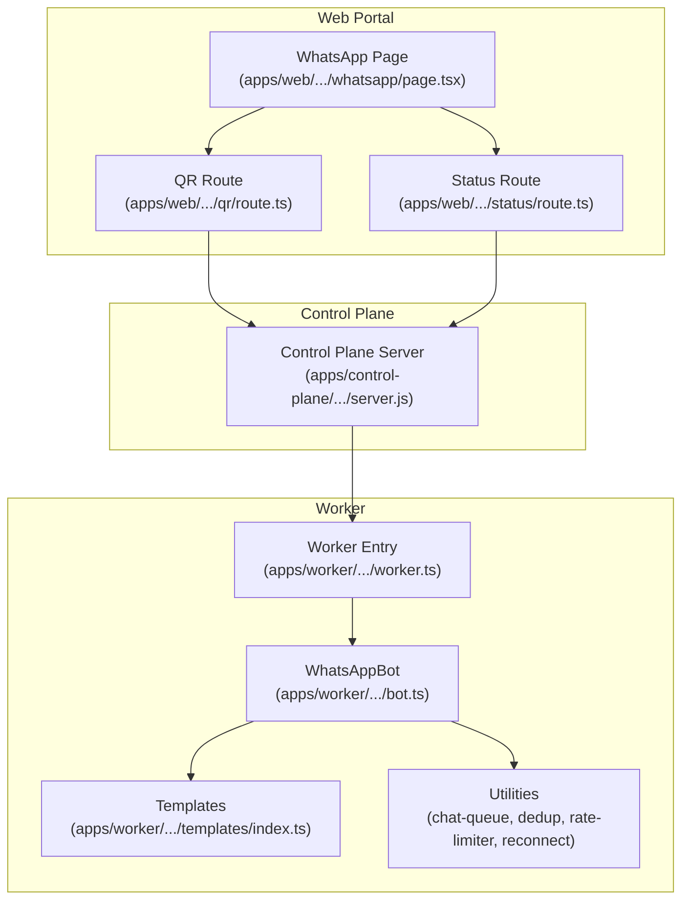
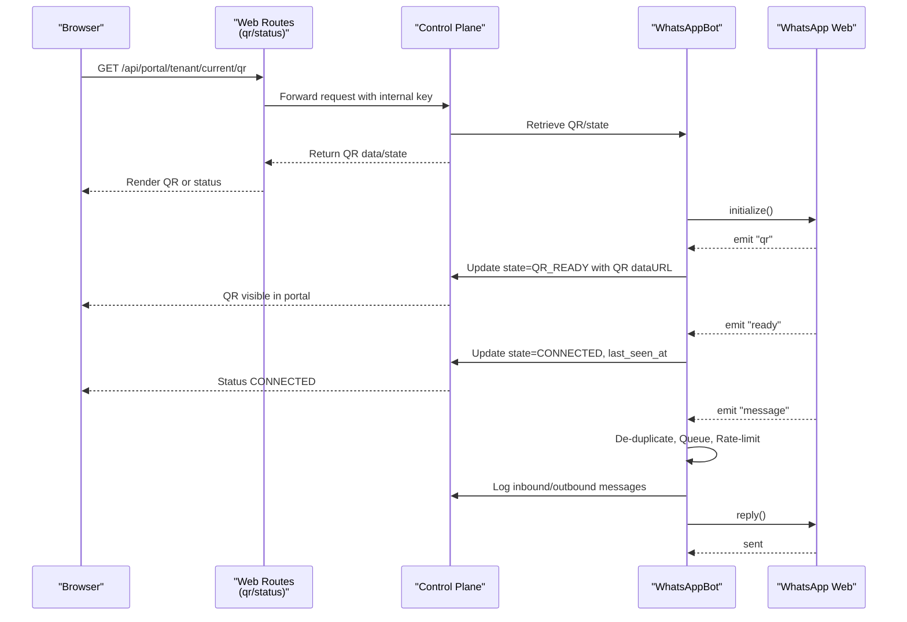
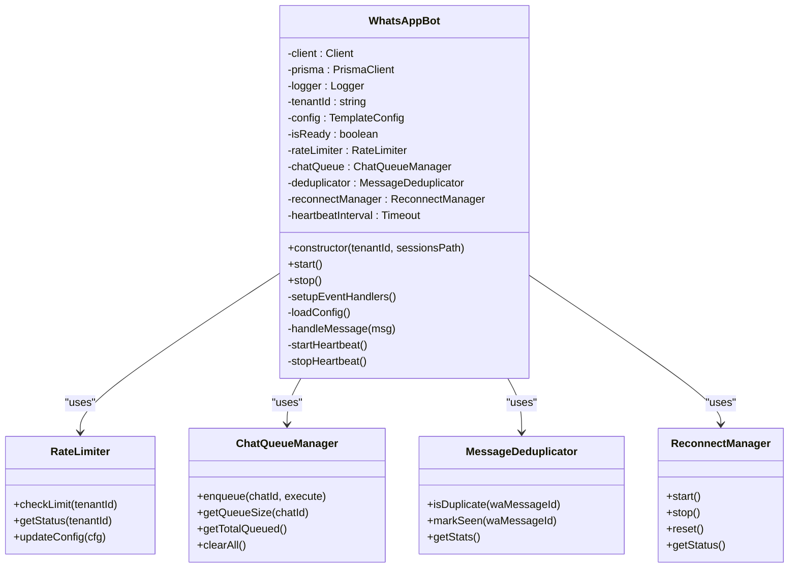
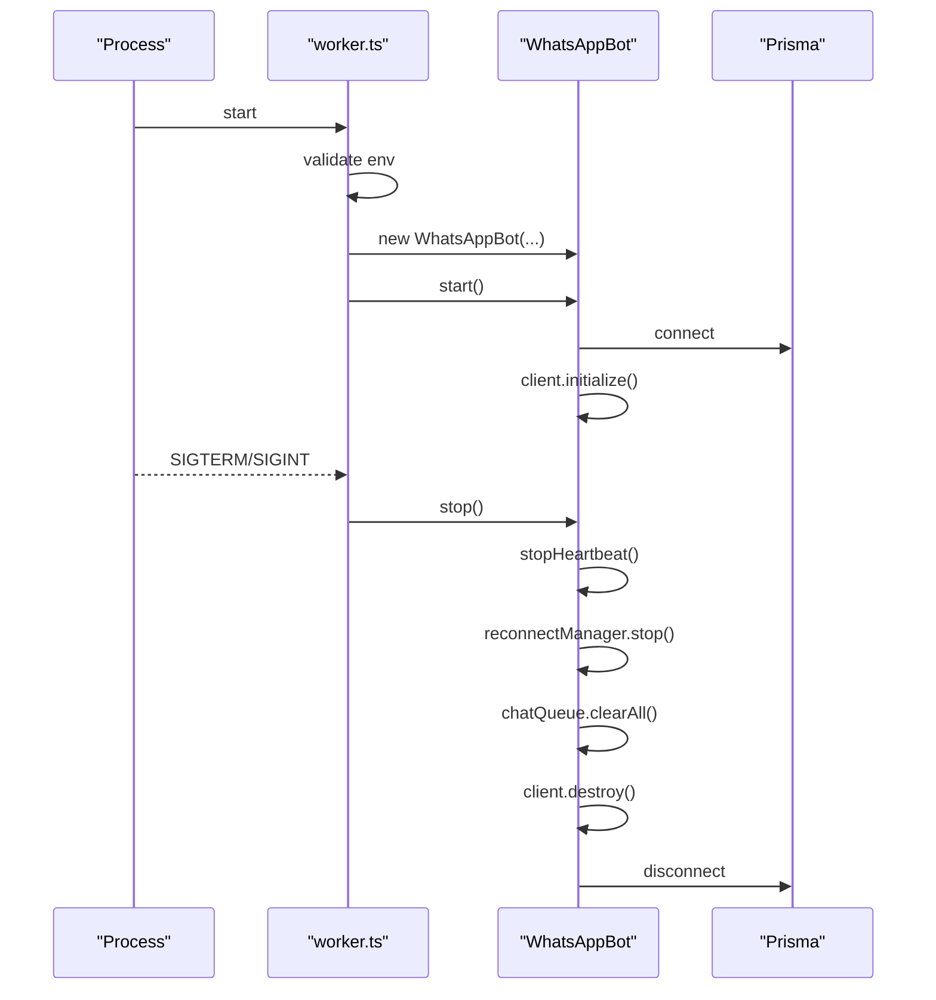
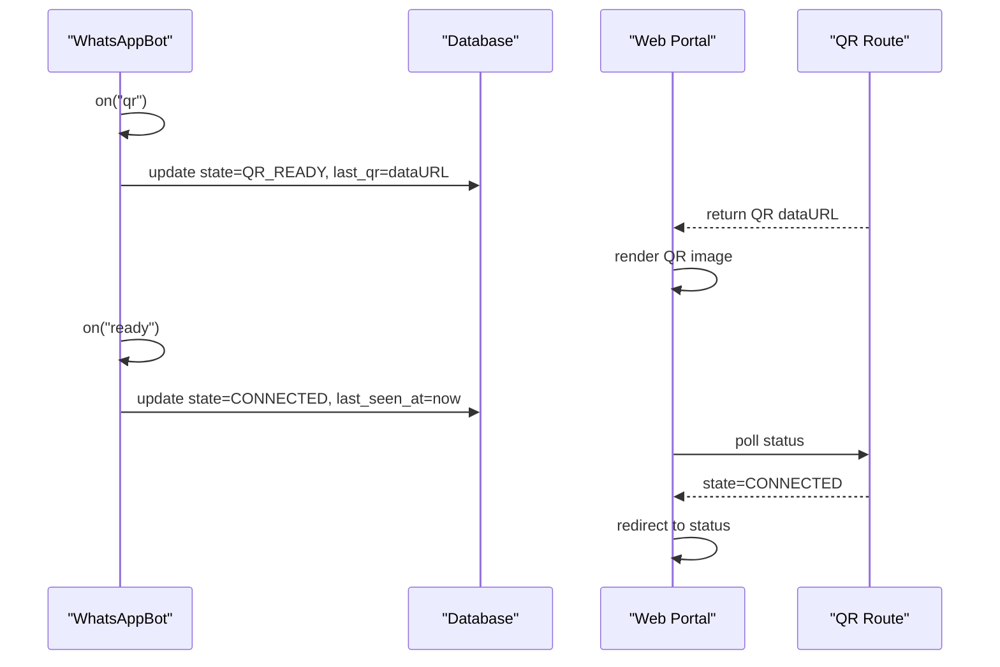
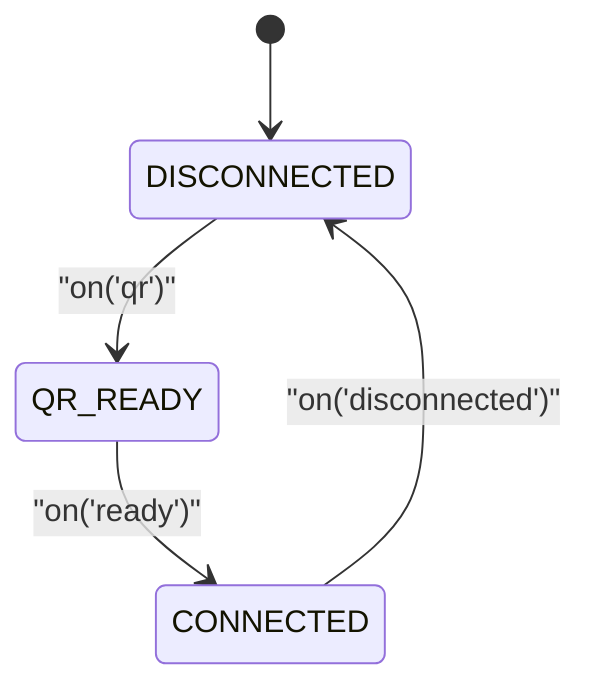
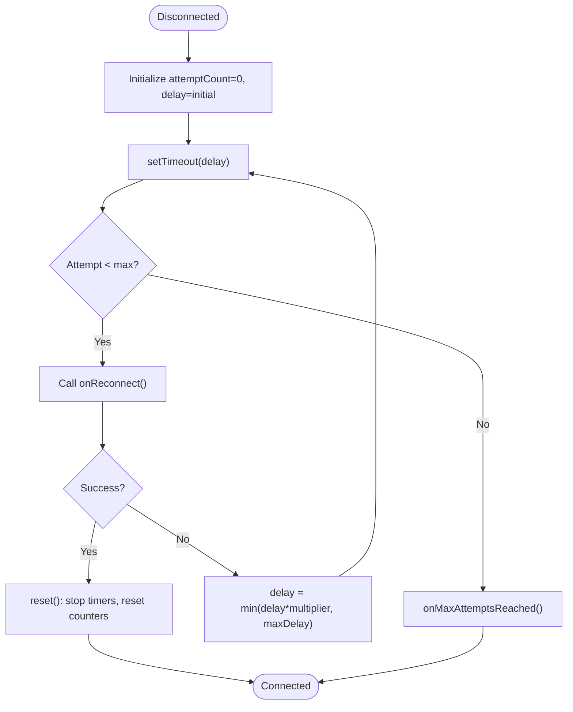
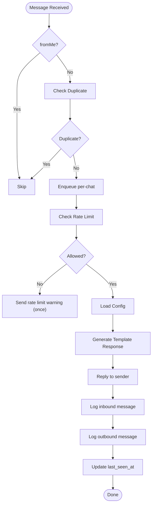
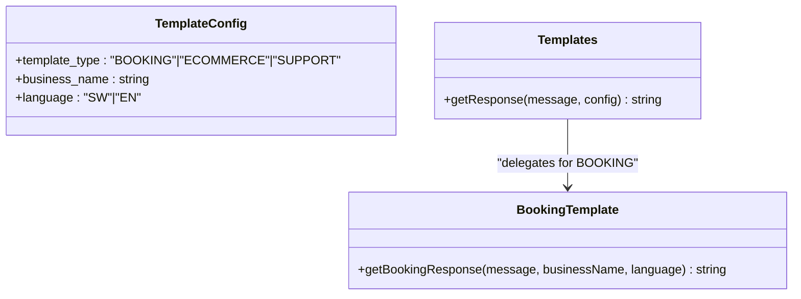
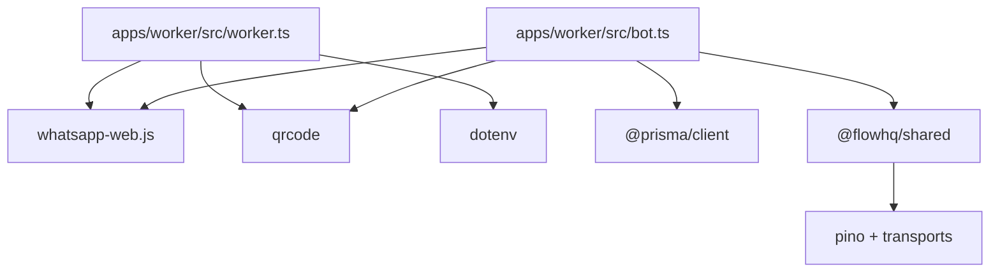

# WhatsApp Integration

<cite>
**Referenced Files in This Document**
- [apps/web/src/app/(portal)/app/whatsapp/page.tsx](file://apps/web/src/app/(portal)/app/whatsapp/page.tsx)
- [apps/web/src/app/api/portal/tenant/current/qr/route.ts](file://apps/web/src/app/api/portal/tenant/current/qr/route.ts)
- [apps/web/src/app/api/portal/tenant/current/status/route.ts](file://apps/web/src/app/api/portal/tenant/current/status/route.ts)
- [apps/worker/src/bot.ts](file://apps/worker/src/bot.ts)
- [apps/worker/src/worker.ts](file://apps/worker/src/worker.ts)
- [apps/worker/src/templates/index.ts](file://apps/worker/src/templates/index.ts)
- [apps/worker/src/templates/booking.ts](file://apps/worker/src/templates/booking.ts)
- [apps/worker/src/utils/chat-queue.ts](file://apps/worker/src/utils/chat-queue.ts)
- [apps/worker/src/utils/dedup.ts](file://apps/worker/src/utils/dedup.ts)
- [apps/worker/src/utils/rate-limiter.ts](file://apps/worker/src/utils/rate-limiter.ts)
- [apps/worker/src/utils/reconnect.ts](file://apps/worker/src/utils/reconnect.ts)
- [apps/worker/package.json](file://apps/worker/package.json)
- [packages/shared/src/utils/logger.ts](file://packages/shared/src/utils/logger.ts)
- [apps/control-plane/dist/server.js](file://apps/control-plane/dist/server.js)
</cite>

## Table of Contents
1. [Introduction](#introduction)
2. [Project Structure](#project-structure)
3. [Core Components](#core-components)
4. [Architecture Overview](#architecture-overview)
5. [Detailed Component Analysis](#detailed-component-analysis)
6. [Dependency Analysis](#dependency-analysis)
7. [Performance Considerations](#performance-considerations)
8. [Troubleshooting Guide](#troubleshooting-guide)
9. [Conclusion](#conclusion)
10. [Appendices](#appendices)

## Introduction
This document explains the WhatsApp Web API integration and automation built with the whatsapp-web.js library. It covers QR code authentication flow, session management and persistence, worker lifecycle, session states (DISCONNECTED, QR_READY, CONNECTED), automatic reconnection, message processing workflows, template-based response generation, and error handling strategies. It also provides guidance on Chrome/Chromium dependencies, executable path configuration, and system requirements for reliable operation.

## Project Structure
The integration spans three primary areas:
- Frontend portal for QR display and status monitoring
- Control plane backend for orchestration and session state
- Worker process that runs the WhatsApp client, handles messages, and manages persistence

**Diagram sources**
- [apps/web/src/app/(portal)/app/whatsapp/page.tsx](file://apps/web/src/app/(portal)/app/whatsapp/page.tsx#L1-L115)
- [apps/web/src/app/api/portal/tenant/current/qr/route.ts](file://apps/web/src/app/api/portal/tenant/current/qr/route.ts#L1-L35)
- [apps/web/src/app/api/portal/tenant/current/status/route.ts](file://apps/web/src/app/api/portal/tenant/current/status/route.ts#L1-L35)
- [apps/control-plane/dist/server.js](file://apps/control-plane/dist/server.js#L1-L108)
- [apps/worker/src/worker.ts](file://apps/worker/src/worker.ts#L1-L46)
- [apps/worker/src/bot.ts](file://apps/worker/src/bot.ts#L1-L395)
- [apps/worker/src/templates/index.ts](file://apps/worker/src/templates/index.ts#L1-L70)
- [apps/worker/src/utils/chat-queue.ts](file://apps/worker/src/utils/chat-queue.ts#L1-L140)
- [apps/worker/src/utils/dedup.ts](file://apps/worker/src/utils/dedup.ts#L1-L93)
- [apps/worker/src/utils/rate-limiter.ts](file://apps/worker/src/utils/rate-limiter.ts#L1-L110)
- [apps/worker/src/utils/reconnect.ts](file://apps/worker/src/utils/reconnect.ts#L1-L117)

**Section sources**
- [apps/web/src/app/(portal)/app/whatsapp/page.tsx](file://apps/web/src/app/(portal)/app/whatsapp/page.tsx#L1-L115)
- [apps/web/src/app/api/portal/tenant/current/qr/route.ts](file://apps/web/src/app/api/portal/tenant/current/qr/route.ts#L1-L35)
- [apps/web/src/app/api/portal/tenant/current/status/route.ts](file://apps/web/src/app/api/portal/tenant/current/status/route.ts#L1-L35)
- [apps/control-plane/dist/server.js](file://apps/control-plane/dist/server.js#L1-L108)
- [apps/worker/src/worker.ts](file://apps/worker/src/worker.ts#L1-L46)
- [apps/worker/src/bot.ts](file://apps/worker/src/bot.ts#L1-L395)

## Core Components
- WhatsAppBot: Orchestrates the whatsapp-web.js client, event handlers, session state updates, message processing, rate limiting, deduplication, queueing, and reconnect logic.
- Worker entry: Initializes environment, validates required variables, starts the bot, and handles graceful shutdown signals.
- Templates: Provides template-based response generation based on tenant configuration (type, language, business name).
- Utilities: ChatQueueManager (per-chat sequential processing), MessageDeduplicator (prevent duplicate processing), RateLimiter (outgoing reply throttling), ReconnectManager (exponential backoff).
- Web Portal: Fetches QR and status from the control plane and renders connection state to the user.
- Control Plane: Validates environment, exposes endpoints for QR and status, and coordinates worker lifecycle.

**Section sources**
- [apps/worker/src/bot.ts](file://apps/worker/src/bot.ts#L1-L395)
- [apps/worker/src/worker.ts](file://apps/worker/src/worker.ts#L1-L46)
- [apps/worker/src/templates/index.ts](file://apps/worker/src/templates/index.ts#L1-L70)
- [apps/worker/src/utils/chat-queue.ts](file://apps/worker/src/utils/chat-queue.ts#L1-L140)
- [apps/worker/src/utils/dedup.ts](file://apps/worker/src/utils/dedup.ts#L1-L93)
- [apps/worker/src/utils/rate-limiter.ts](file://apps/worker/src/utils/rate-limiter.ts#L1-L110)
- [apps/worker/src/utils/reconnect.ts](file://apps/worker/src/utils/reconnect.ts#L1-L117)
- [apps/web/src/app/(portal)/app/whatsapp/page.tsx](file://apps/web/src/app/(portal)/app/whatsapp/page.tsx#L1-L115)
- [apps/web/src/app/api/portal/tenant/current/qr/route.ts](file://apps/web/src/app/api/portal/tenant/current/qr/route.ts#L1-L35)
- [apps/web/src/app/api/portal/tenant/current/status/route.ts](file://apps/web/src/app/api/portal/tenant/current/status/route.ts#L1-L35)
- [apps/control-plane/dist/server.js](file://apps/control-plane/dist/server.js#L1-L108)

## Architecture Overview
The system follows a client-server-worker pattern:
- The web portal communicates with the control plane via internal keys and user sessions.
- The control plane exposes endpoints for QR retrieval and status.
- The worker process initializes the WhatsApp client, persists session data, and processes messages.
- Session state is stored in the database and surfaced to the portal.

**Diagram sources**
- [apps/web/src/app/api/portal/tenant/current/qr/route.ts](file://apps/web/src/app/api/portal/tenant/current/qr/route.ts#L1-L35)
- [apps/web/src/app/api/portal/tenant/current/status/route.ts](file://apps/web/src/app/api/portal/tenant/current/status/route.ts#L1-L35)
- [apps/control-plane/dist/server.js](file://apps/control-plane/dist/server.js#L1-L108)
- [apps/worker/src/bot.ts](file://apps/worker/src/bot.ts#L77-L210)

## Detailed Component Analysis

### WhatsAppBot: Client, Events, Persistence, and Recovery
WhatsAppBot encapsulates:
- Client initialization with LocalAuth and headless Chromium/Puppeteer options
- Event handlers for QR, ready, message, and disconnected
- Session state updates in the database
- Heartbeat maintenance
- Message processing pipeline with deduplication, queueing, and rate limiting
- Automatic reconnection with exponential backoff

**Diagram sources**
- [apps/worker/src/bot.ts](file://apps/worker/src/bot.ts#L12-L75)
- [apps/worker/src/utils/rate-limiter.ts](file://apps/worker/src/utils/rate-limiter.ts#L17-L106)
- [apps/worker/src/utils/chat-queue.ts](file://apps/worker/src/utils/chat-queue.ts#L21-L139)
- [apps/worker/src/utils/dedup.ts](file://apps/worker/src/utils/dedup.ts#L11-L89)
- [apps/worker/src/utils/reconnect.ts](file://apps/worker/src/utils/reconnect.ts#L14-L85)

Key behaviors:
- QR code handling: Converts QR string to a data URL and persists state=QR_READY.
- Ready state: Updates state=CONNECTED, sets ACTIVE tenant status, RUNNING worker status, loads configuration, starts heartbeat.
- Disconnected: Updates DISCONNECTED state, stops heartbeat, triggers reconnect manager.
- Message handling: Logs inbound, checks rate limit, generates template-based response, logs outbound, updates last_seen_at.
- Heartbeat: Periodically updates last_seen_at and worker status to keep the worker healthy.

**Section sources**
- [apps/worker/src/bot.ts](file://apps/worker/src/bot.ts#L77-L210)
- [apps/worker/src/bot.ts](file://apps/worker/src/bot.ts#L232-L315)
- [apps/worker/src/bot.ts](file://apps/worker/src/bot.ts#L317-L351)
- [apps/worker/src/bot.ts](file://apps/worker/src/bot.ts#L353-L394)

### Worker Lifecycle and Signals
The worker entry script:
- Loads environment variables
- Validates TENANT_ID presence
- Instantiates WhatsAppBot and starts it
- Handles SIGTERM/SIGINT for graceful shutdown
- Catches uncaught exceptions and unhandled rejections

**Diagram sources**
- [apps/worker/src/worker.ts](file://apps/worker/src/worker.ts#L1-L46)
- [apps/worker/src/bot.ts](file://apps/worker/src/bot.ts#L378-L393)

**Section sources**
- [apps/worker/src/worker.ts](file://apps/worker/src/worker.ts#L1-L46)
- [apps/worker/src/bot.ts](file://apps/worker/src/bot.ts#L378-L393)

### QR Authentication Flow
End-to-end QR authentication:
- Worker emits QR event
- QR is converted to data URL and persisted with state=QR_READY
- Web portal polls QR endpoint and displays QR image
- On successful scan, WhatsApp emits ready
- Worker updates state=CONNECTED and marks tenant ACTIVE

**Diagram sources**
- [apps/worker/src/bot.ts](file://apps/worker/src/bot.ts#L77-L96)
- [apps/web/src/app/api/portal/tenant/current/qr/route.ts](file://apps/web/src/app/api/portal/tenant/current/qr/route.ts#L1-L35)
- [apps/web/src/app/(portal)/app/whatsapp/page.tsx](file://apps/web/src/app/(portal)/app/whatsapp/page.tsx#L17-L48)

**Section sources**
- [apps/worker/src/bot.ts](file://apps/worker/src/bot.ts#L77-L96)
- [apps/web/src/app/api/portal/tenant/current/qr/route.ts](file://apps/web/src/app/api/portal/tenant/current/qr/route.ts#L1-L35)
- [apps/web/src/app/(portal)/app/whatsapp/page.tsx](file://apps/web/src/app/(portal)/app/whatsapp/page.tsx#L17-L48)

### Session States and Transitions
Session states observed in the code:
- DISCONNECTED: Emitted when the client disconnects; heartbeat stopped; reconnect initiated.
- QR_READY: Persisted when QR is emitted; QR dataURL stored.
- CONNECTED: Set when ready; tenant ACTIVE; worker RUNNING.

**Diagram sources**
- [apps/worker/src/bot.ts](file://apps/worker/src/bot.ts#L98-L135)
- [apps/worker/src/bot.ts](file://apps/worker/src/bot.ts#L169-L192)
- [apps/worker/src/bot.ts](file://apps/worker/src/bot.ts#L77-L96)

**Section sources**
- [apps/worker/src/bot.ts](file://apps/worker/src/bot.ts#L98-L135)
- [apps/worker/src/bot.ts](file://apps/worker/src/bot.ts#L169-L192)
- [apps/worker/src/bot.ts](file://apps/worker/src/bot.ts#L77-L96)

### Automatic Reconnection Mechanism
Exponential backoff reconnection:
- Starts on disconnect; schedules attempts with increasing delays
- Resets on successful ready event
- Stops and resets on explicit stop or max attempts reached

**Diagram sources**
- [apps/worker/src/utils/reconnect.ts](file://apps/worker/src/utils/reconnect.ts#L44-L115)

**Section sources**
- [apps/worker/src/utils/reconnect.ts](file://apps/worker/src/utils/reconnect.ts#L14-L117)
- [apps/worker/src/bot.ts](file://apps/worker/src/bot.ts#L37-L56)
- [apps/worker/src/bot.ts](file://apps/worker/src/bot.ts#L169-L192)
- [apps/worker/src/bot.ts](file://apps/worker/src/bot.ts#L98-L135)

### Message Processing Workflow
Template-based response generation:
- Load tenant configuration (template type, language, business name)
- De-duplicate incoming message IDs
- Enqueue per-chat for sequential processing
- Apply rate limiting for outgoing replies
- Generate response using templates
- Log inbound and outbound messages
- Update last_seen_at

**Diagram sources**
- [apps/worker/src/bot.ts](file://apps/worker/src/bot.ts#L137-L167)
- [apps/worker/src/bot.ts](file://apps/worker/src/bot.ts#L232-L315)
- [apps/worker/src/templates/index.ts](file://apps/worker/src/templates/index.ts#L9-L23)
- [apps/worker/src/templates/booking.ts](file://apps/worker/src/templates/booking.ts#L1-L22)
- [apps/worker/src/utils/dedup.ts](file://apps/worker/src/utils/dedup.ts#L28-L46)
- [apps/worker/src/utils/chat-queue.ts](file://apps/worker/src/utils/chat-queue.ts#L35-L68)
- [apps/worker/src/utils/rate-limiter.ts](file://apps/worker/src/utils/rate-limiter.ts#L32-L73)

**Section sources**
- [apps/worker/src/bot.ts](file://apps/worker/src/bot.ts#L137-L167)
- [apps/worker/src/bot.ts](file://apps/worker/src/bot.ts#L232-L315)
- [apps/worker/src/templates/index.ts](file://apps/worker/src/templates/index.ts#L1-L70)
- [apps/worker/src/templates/booking.ts](file://apps/worker/src/templates/booking.ts#L1-L22)
- [apps/worker/src/utils/dedup.ts](file://apps/worker/src/utils/dedup.ts#L1-L93)
- [apps/worker/src/utils/chat-queue.ts](file://apps/worker/src/utils/chat-queue.ts#L1-L140)
- [apps/worker/src/utils/rate-limiter.ts](file://apps/worker/src/utils/rate-limiter.ts#L1-L110)

### Template-Based Responses
Response generation depends on:
- Template type: BOOKING, ECOMMERCE, SUPPORT
- Business name and language (SW/EN)
- Intent detection for booking-related keywords

**Diagram sources**
- [apps/worker/src/templates/index.ts](file://apps/worker/src/templates/index.ts#L3-L23)
- [apps/worker/src/templates/booking.ts](file://apps/worker/src/templates/booking.ts#L1-L22)

**Section sources**
- [apps/worker/src/templates/index.ts](file://apps/worker/src/templates/index.ts#L1-L70)
- [apps/worker/src/templates/booking.ts](file://apps/worker/src/templates/booking.ts#L1-L22)

## Dependency Analysis
External libraries and runtime dependencies:
- whatsapp-web.js: Core WhatsApp client
- qrcode: QR data URL generation
- puppeteer/chromium: Headless browser automation
- dotenv: Environment configuration
- pino/pino-pretty/pino/file: Structured logging
- prisma/@prisma/client: Database access

**Diagram sources**
- [apps/worker/package.json](file://apps/worker/package.json#L9-L14)
- [apps/worker/src/worker.ts](file://apps/worker/src/worker.ts#L1-L10)
- [apps/worker/src/bot.ts](file://apps/worker/src/bot.ts#L1-L11)
- [packages/shared/src/utils/logger.ts](file://packages/shared/src/utils/logger.ts#L1-L33)

**Section sources**
- [apps/worker/package.json](file://apps/worker/package.json#L1-L22)
- [apps/worker/src/worker.ts](file://apps/worker/src/worker.ts#L1-L10)
- [apps/worker/src/bot.ts](file://apps/worker/src/bot.ts#L1-L11)
- [packages/shared/src/utils/logger.ts](file://packages/shared/src/utils/logger.ts#L1-L33)

## Performance Considerations
- Per-chat queueing prevents race conditions and ensures ordered processing per conversation.
- De-duplication avoids redundant processing of identical messages.
- Rate limiting controls outbound reply frequency to prevent throttling.
- Heartbeat keeps the worker alive and monitored.
- Exponential backoff reduces load during reconnection storms.

[No sources needed since this section provides general guidance]

## Troubleshooting Guide

Common issues and resolutions:
- QR code not displaying or refreshing
  - Verify QR endpoint returns data and state transitions to QR_READY.
  - Ensure the worker is running and connected to the database.
  - Confirm the portal route forwards internal key and user email headers.

- Session persistence failures
  - Check LocalAuth dataPath exists and is writable.
  - Validate database connectivity and prisma client initialization.
  - Review logs for errors updating session or worker status.

- WhatsApp Web connectivity issues
  - Confirm Chrome/Chromium installation and executable path configured.
  - Ensure environment variables for Puppeteer executable path are set in production.
  - Monitor reconnection attempts and logs for repeated disconnections.

- Worker crashes or exits
  - Inspect uncaught exception and unhandled rejection handlers.
  - Verify graceful shutdown on SIGTERM/SIGINT.

- Rate limit exceeded
  - Adjust RATE_LIMIT_MAX_PER_MINUTE environment variable.
  - Expect a single warning per tenant per rate window.

- Queue full
  - Reduce concurrent chats or increase queue capacity.
  - Consider sending a wait message to users when queue is full.

**Section sources**
- [apps/web/src/app/api/portal/tenant/current/qr/route.ts](file://apps/web/src/app/api/portal/tenant/current/qr/route.ts#L15-L34)
- [apps/worker/src/bot.ts](file://apps/worker/src/bot.ts#L58-L62)
- [apps/worker/src/bot.ts](file://apps/worker/src/bot.ts#L357-L376)
- [apps/control-plane/dist/server.js](file://apps/control-plane/dist/server.js#L65-L69)
- [apps/worker/src/utils/rate-limiter.ts](file://apps/worker/src/utils/rate-limiter.ts#L98-L105)
- [apps/worker/src/utils/chat-queue.ts](file://apps/worker/src/utils/chat-queue.ts#L38-L42)
- [apps/worker/src/worker.ts](file://apps/worker/src/worker.ts#L38-L45)

## Conclusion
The integration leverages whatsapp-web.js with robust session management, persistent state tracking, and resilient message processing. The worker process maintains health via heartbeat and reconnect logic, while the portal provides real-time visibility into QR and connection status. By tuning environment variables and ensuring proper Chrome/Chromium configuration, the system achieves reliable automation for WhatsApp Web.

[No sources needed since this section summarizes without analyzing specific files]

## Appendices

### Environment Variables and Configuration
- TENANT_ID: Required to start the worker.
- SESSIONS_PATH: Directory for LocalAuth session storage.
- RATE_LIMIT_MAX_PER_MINUTE: Outgoing reply limit per minute.
- HEARTBEAT_INTERVAL_MS: Interval for heartbeat updates.
- PUPPETEER_EXECUTABLE_PATH: Path to Chrome/Chromium binary (required in production).
- CONTROL_PLANE_URL and PORTAL_INTERNAL_KEY: Used by web routes to proxy requests to the control plane.

**Section sources**
- [apps/worker/src/worker.ts](file://apps/worker/src/worker.ts#L7-L8)
- [apps/worker/src/bot.ts](file://apps/worker/src/bot.ts#L33-L34)
- [apps/worker/src/bot.ts](file://apps/worker/src/bot.ts#L317-L343)
- [apps/control-plane/dist/server.js](file://apps/control-plane/dist/server.js#L65-L69)
- [apps/web/src/app/api/portal/tenant/current/qr/route.ts](file://apps/web/src/app/api/portal/tenant/current/qr/route.ts#L5-L6)

### Logging and Diagnostics
- Structured logging via pino with pretty output and optional per-tenant file transport.
- Logs are written under a logs directory relative to the project root.

**Section sources**
- [packages/shared/src/utils/logger.ts](file://packages/shared/src/utils/logger.ts#L5-L30)