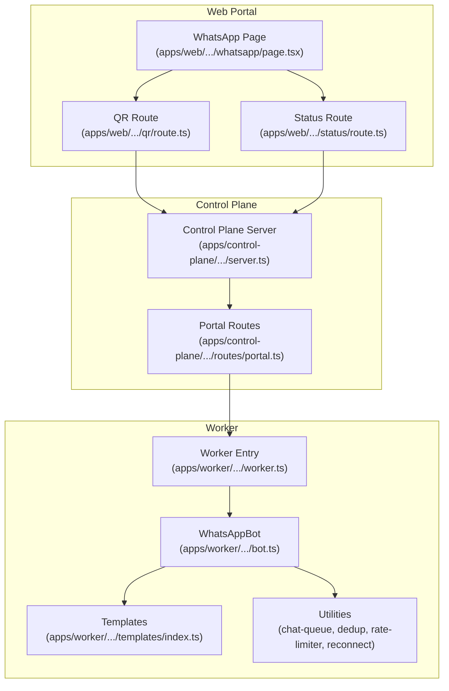
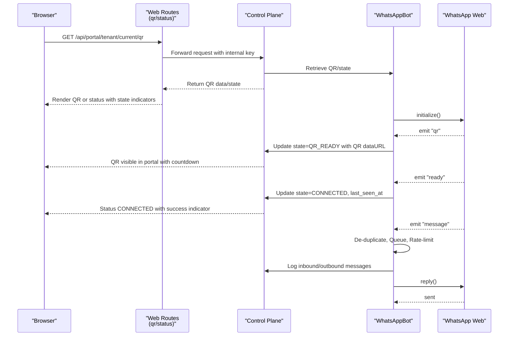
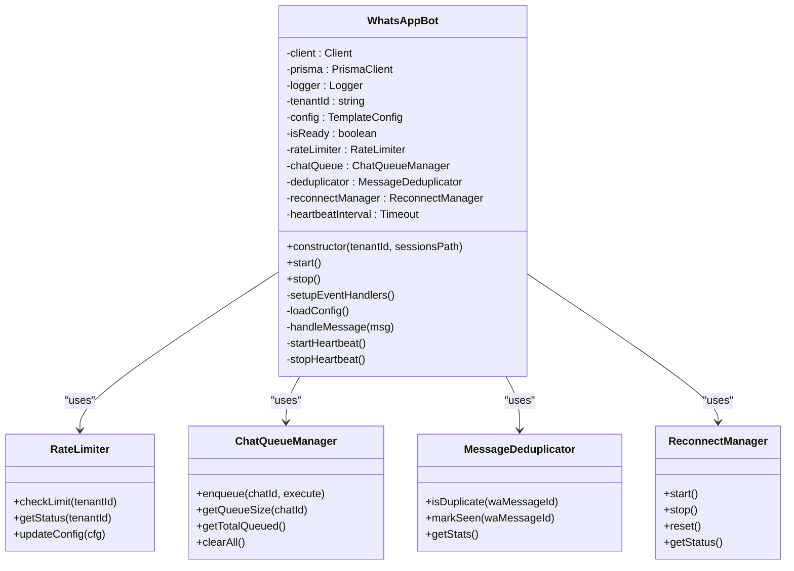
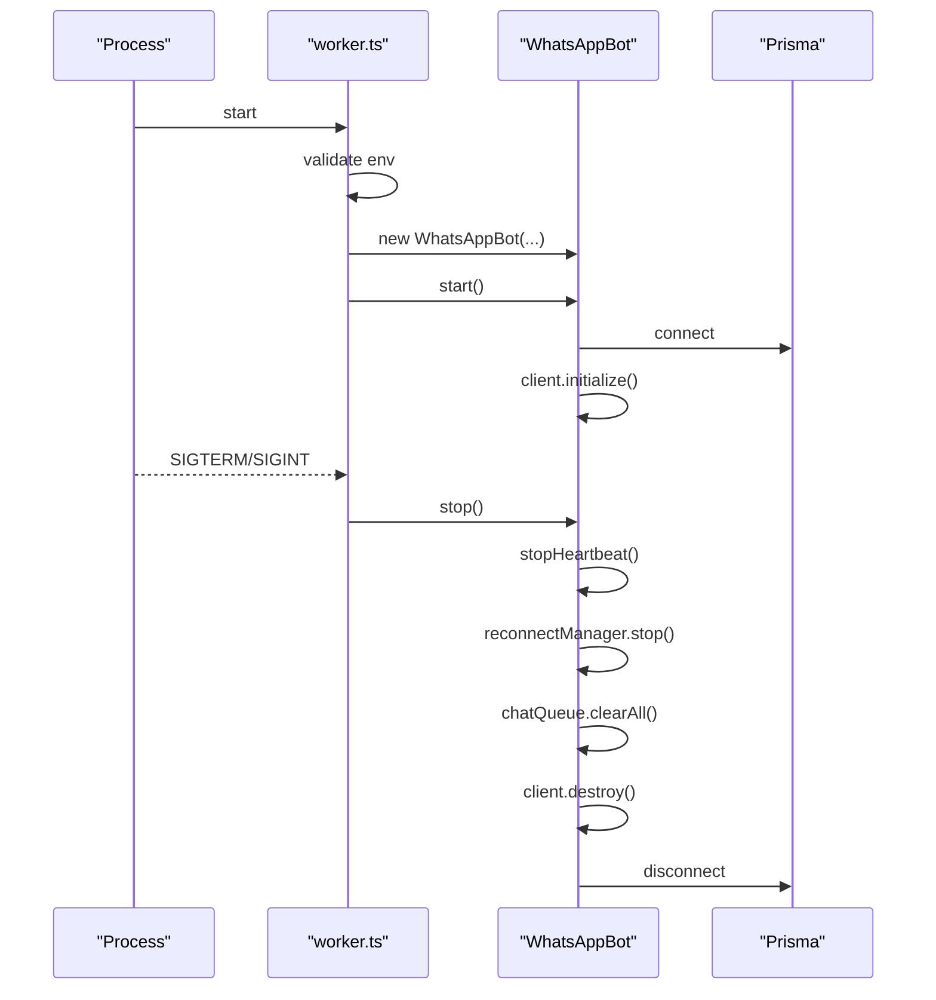
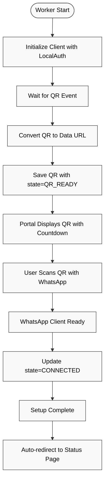
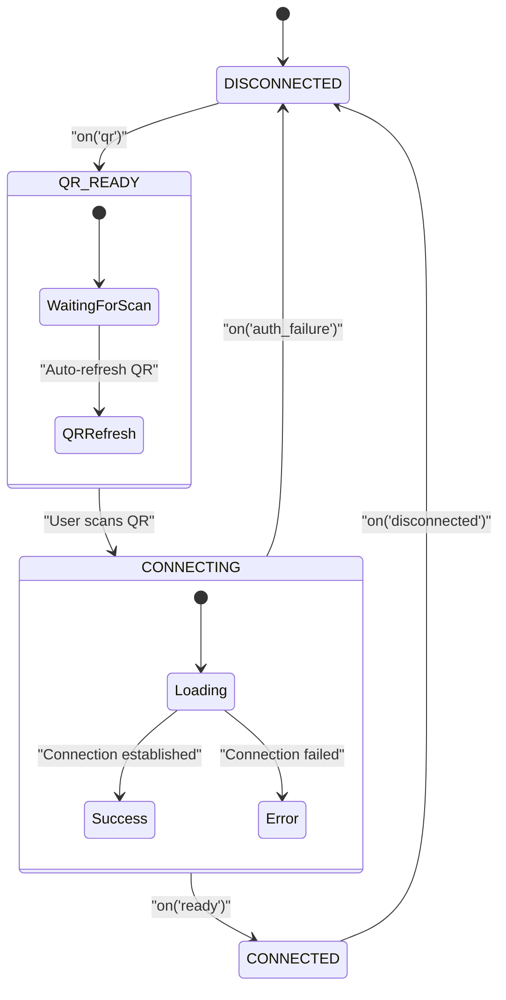
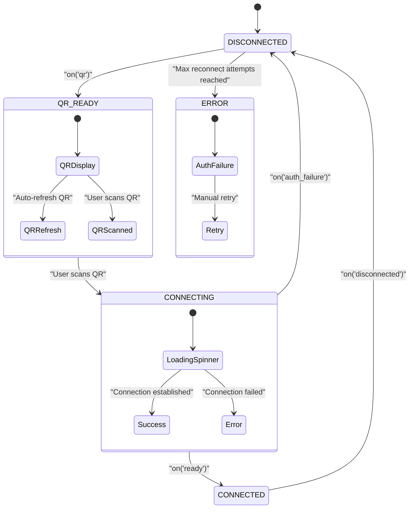
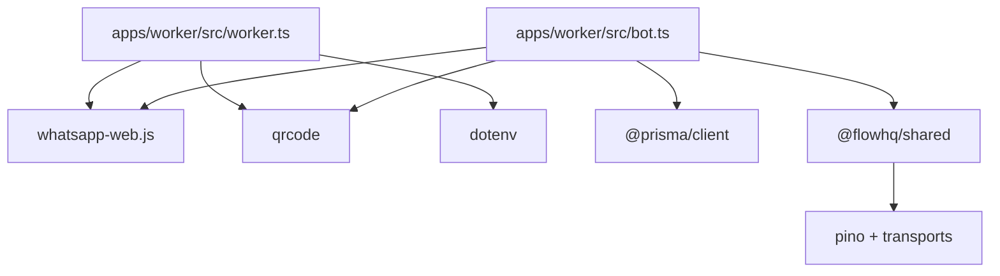

# WhatsApp Integration

<cite>
**Referenced Files in This Document**
- [apps/web/src/app/(portal)/app/whatsapp/page.tsx](file://apps/web/src/app/(portal)/app/whatsapp/page.tsx)
- [apps/web/src/app/api/portal/tenant/current/qr/route.ts](file://apps/web/src/app/api/portal/tenant/current/qr/route.ts)
- [apps/web/src/app/api/portal/tenant/current/status/route.ts](file://apps/web/src/app/api/portal/tenant/current/status/route.ts)
- [apps/worker/src/bot.ts](file://apps/worker/src/bot.ts)
- [apps/worker/src/worker.ts](file://apps/worker/src/worker.ts)
- [apps/worker/src/templates/index.ts](file://apps/worker/src/templates/index.ts)
- [apps/worker/src/templates/booking.ts](file://apps/worker/src/templates/booking.ts)
- [apps/worker/src/utils/chat-queue.ts](file://apps/worker/src/utils/chat-queue.ts)
- [apps/worker/src/utils/dedup.ts](file://apps/worker/src/utils/dedup.ts)
- [apps/worker/src/utils/rate-limiter.ts](file://apps/worker/src/utils/rate-limiter.ts)
- [apps/worker/src/utils/reconnect.ts](file://apps/worker/src/utils/reconnect.ts)
- [apps/worker/package.json](file://apps/worker/package.json)
- [packages/shared/src/utils/logger.ts](file://packages/shared/src/utils/logger.ts)
- [apps/control-plane/src/server.ts](file://apps/control-plane/src/server.ts)
- [apps/control-plane/src/routes/portal.ts](file://apps/control-plane/src/routes/portal.ts)
</cite>

## Update Summary
**Changes Made**
- Enhanced WhatsApp connection flow documentation with step-by-step process
- Improved QR code handling documentation with new state management
- Added comprehensive coverage of new connection states (QR_READY, CONNECTED, CONNECTING)
- Updated session state transitions with detailed flow diagrams
- Enhanced frontend integration documentation with countdown and state indicators
- Expanded troubleshooting guide with new state-specific scenarios

## Table of Contents
1. [Introduction](#introduction)
2. [Project Structure](#project-structure)
3. [Core Components](#core-components)
4. [Architecture Overview](#architecture-overview)
5. [Detailed Component Analysis](#detailed-component-analysis)
6. [Enhanced Connection Flow](#enhanced-connection-flow)
7. [Session States and Transitions](#session-states-and-transitions)
8. [Dependency Analysis](#dependency-analysis)
9. [Performance Considerations](#performance-considerations)
10. [Troubleshooting Guide](#troubleshooting-guide)
11. [Conclusion](#conclusion)
12. [Appendices](#appendices)

## Introduction
This document explains the WhatsApp Web API integration and automation built with the whatsapp-web.js library. It covers QR code authentication flow, session management and persistence, worker lifecycle, session states (DISCONNECTED, QR_READY, CONNECTED, CONNECTING), automatic reconnection, message processing workflows, template-based response generation, and error handling strategies. It also provides guidance on Chrome/Chromium dependencies, executable path configuration, and system requirements for reliable operation.

**Updated** Enhanced with step-by-step connection flow, improved QR code handling, and comprehensive state management documentation.

## Project Structure
The integration spans three primary areas:
- Frontend portal for QR display and status monitoring with enhanced state indicators
- Control plane backend for orchestration and session state management
- Worker process that runs the WhatsApp client, handles messages, and manages persistence

```mermaid
graph TB
subgraph "Web Portal"
WP["WhatsApp Page<br/>(apps/web/.../whatsapp/page.tsx)"]
QRRoute["QR Route<br/>(apps/web/.../qr/route.ts)"]
StatusRoute["Status Route<br/>(apps/web/.../status/route.ts)"]
end
subgraph "Control Plane"
CP["Control Plane Server<br/>(apps/control-plane/.../server.ts)"]
PortalRoutes["Portal Routes<br/>(apps/control-plane/.../routes/portal.ts)"]
end
subgraph "Worker"
WorkerMain["Worker Entry<br/>(apps/worker/.../worker.ts)"]
Bot["WhatsAppBot<br/>(apps/worker/.../bot.ts)"]
Templates["Templates<br/>(apps/worker/.../templates/index.ts)"]
Utils["Utilities<br/>(chat-queue, dedup, rate-limiter, reconnect)"]
end
WP --> QRRoute
WP --> StatusRoute
QRRoute --> CP
StatusRoute --> CP
CP --> PortalRoutes
PortalRoutes --> WorkerMain
WorkerMain --> Bot
Bot --> Templates
Bot --> Utils
```

**Diagram sources**
- [apps/web/src/app/(portal)/app/whatsapp/page.tsx](file://apps/web/src/app/(portal)/app/whatsapp/page.tsx#L1-L163)
- [apps/web/src/app/api/portal/tenant/current/qr/route.ts](file://apps/web/src/app/api/portal/tenant/current/qr/route.ts#L1-L35)
- [apps/web/src/app/api/portal/tenant/current/status/route.ts](file://apps/web/src/app/api/portal/tenant/current/status/route.ts#L1-L35)
- [apps/control-plane/src/server.ts](file://apps/control-plane/src/server.ts#L1-L89)
- [apps/control-plane/src/routes/portal.ts](file://apps/control-plane/src/routes/portal.ts#L1-L246)
- [apps/worker/src/worker.ts](file://apps/worker/src/worker.ts#L1-L46)
- [apps/worker/src/bot.ts](file://apps/worker/src/bot.ts#L1-L411)

**Section sources**
- [apps/web/src/app/(portal)/app/whatsapp/page.tsx](file://apps/web/src/app/(portal)/app/whatsapp/page.tsx#L1-L163)
- [apps/web/src/app/api/portal/tenant/current/qr/route.ts](file://apps/web/src/app/api/portal/tenant/current/qr/route.ts#L1-L35)
- [apps/web/src/app/api/portal/tenant/current/status/route.ts](file://apps/web/src/app/api/portal/tenant/current/status/route.ts#L1-L35)
- [apps/control-plane/src/server.ts](file://apps/control-plane/src/server.ts#L1-L89)
- [apps/control-plane/src/routes/portal.ts](file://apps/control-plane/src/routes/portal.ts#L1-L246)
- [apps/worker/src/worker.ts](file://apps/worker/src/worker.ts#L1-L46)
- [apps/worker/src/bot.ts](file://apps/worker/src/bot.ts#L1-L411)

## Core Components
- WhatsAppBot: Orchestrates the whatsapp-web.js client, event handlers, session state updates, message processing, rate limiting, deduplication, queueing, and reconnect logic.
- Worker entry: Initializes environment, validates required variables, starts the bot, and handles graceful shutdown signals.
- Templates: Provides template-based response generation based on tenant configuration (type, language, business name).
- Utilities: ChatQueueManager (per-chat sequential processing), MessageDeduplicator (prevent duplicate processing), RateLimiter (outgoing reply throttling), ReconnectManager (exponential backoff).
- Web Portal: Fetches QR and status from the control plane and renders connection state to the user with enhanced state indicators.
- Control Plane: Validates environment, exposes endpoints for QR and status, and coordinates worker lifecycle.

**Updated** Enhanced with new connection states and improved state management capabilities.

**Section sources**
- [apps/worker/src/bot.ts](file://apps/worker/src/bot.ts#L1-L411)
- [apps/worker/src/worker.ts](file://apps/worker/src/worker.ts#L1-L46)
- [apps/worker/src/templates/index.ts](file://apps/worker/src/templates/index.ts#L1-L70)
- [apps/worker/src/utils/chat-queue.ts](file://apps/worker/src/utils/chat-queue.ts#L1-L140)
- [apps/worker/src/utils/dedup.ts](file://apps/worker/src/utils/dedup.ts#L1-L93)
- [apps/worker/src/utils/rate-limiter.ts](file://apps/worker/src/utils/rate-limiter.ts#L1-L110)
- [apps/worker/src/utils/reconnect.ts](file://apps/worker/src/utils/reconnect.ts#L1-L117)
- [apps/web/src/app/(portal)/app/whatsapp/page.tsx](file://apps/web/src/app/(portal)/app/whatsapp/page.tsx#L1-L163)
- [apps/web/src/app/api/portal/tenant/current/qr/route.ts](file://apps/web/src/app/api/portal/tenant/current/qr/route.ts#L1-L35)
- [apps/web/src/app/api/portal/tenant/current/status/route.ts](file://apps/web/src/app/api/portal/tenant/current/status/route.ts#L1-L35)
- [apps/control-plane/src/server.ts](file://apps/control-plane/src/server.ts#L1-L89)
- [apps/control-plane/src/routes/portal.ts](file://apps/control-plane/src/routes/portal.ts#L1-L246)

## Architecture Overview
The system follows a client-server-worker pattern with enhanced state management:
- The web portal communicates with the control plane via internal keys and user sessions.
- The control plane exposes endpoints for QR retrieval and status with comprehensive state tracking.
- The worker process initializes the WhatsApp client, persists session data, and processes messages.
- Session state is stored in the database and surfaced to the portal with real-time updates.

```mermaid
sequenceDiagram
participant Browser as "Browser"
participant Web as "Web Routes<br/>(qr/status)"
participant Control as "Control Plane"
participant Worker as "WhatsAppBot"
participant WA as "WhatsApp Web"
Browser->>Web : GET /api/portal/tenant/current/qr
Web->>Control : Forward request with internal key
Control->>Worker : Retrieve QR/state
Control-->>Web : Return QR data/state
Web-->>Browser : Render QR or status with state indicators
Worker->>WA : initialize()
WA-->>Worker : emit "qr"
Worker->>Control : Update state=QR_READY with QR dataURL
Control-->>Browser : QR visible in portal with countdown
WA-->>Worker : emit "ready"
Worker->>Control : Update state=CONNECTED, last_seen_at
Control-->>Browser : Status CONNECTED with success indicator
WA-->>Worker : emit "message"
Worker->>Worker : De-duplicate, Queue, Rate-limit
Worker->>Control : Log inbound/outbound messages
Worker->>WA : reply()
WA-->>Worker : sent
```

**Diagram sources**
- [apps/web/src/app/api/portal/tenant/current/qr/route.ts](file://apps/web/src/app/api/portal/tenant/current/qr/route.ts#L1-L35)
- [apps/web/src/app/api/portal/tenant/current/status/route.ts](file://apps/web/src/app/api/portal/tenant/current/status/route.ts#L1-L35)
- [apps/control-plane/src/routes/portal.ts](file://apps/control-plane/src/routes/portal.ts#L192-L216)
- [apps/worker/src/bot.ts](file://apps/worker/src/bot.ts#L77-L226)

## Detailed Component Analysis

### WhatsAppBot: Client, Events, Persistence, and Recovery
WhatsAppBot encapsulates:
- Client initialization with LocalAuth and headless Chromium/Puppeteer options
- Event handlers for QR, ready, message, and disconnected with enhanced state management
- Session state updates in the database with comprehensive state tracking
- Heartbeat maintenance with periodic status updates
- Message processing pipeline with deduplication, queueing, and rate limiting
- Automatic reconnection with exponential backoff and error state management

```mermaid
classDiagram
class WhatsAppBot {
-client : Client
-prisma : PrismaClient
-logger : Logger
-tenantId : string
-config : TemplateConfig
-isReady : boolean
-rateLimiter : RateLimiter
-chatQueue : ChatQueueManager
-deduplicator : MessageDeduplicator
-reconnectManager : ReconnectManager
-heartbeatInterval : Timeout
+constructor(tenantId, sessionsPath)
+start()
+stop()
-setupEventHandlers()
-loadConfig()
-handleMessage(msg)
-startHeartbeat()
-stopHeartbeat()
}
class RateLimiter {
+checkLimit(tenantId)
+getStatus(tenantId)
+updateConfig(cfg)
}
class ChatQueueManager {
+enqueue(chatId, execute)
+getQueueSize(chatId)
+getTotalQueued()
+clearAll()
}
class MessageDeduplicator {
+isDuplicate(waMessageId)
+markSeen(waMessageId)
+getStats()
}
class ReconnectManager {
+start()
+stop()
+reset()
+getStatus()
}
WhatsAppBot --> RateLimiter : "uses"
WhatsAppBot --> ChatQueueManager : "uses"
WhatsAppBot --> MessageDeduplicator : "uses"
WhatsAppBot --> ReconnectManager : "uses"
```

**Diagram sources**
- [apps/worker/src/bot.ts](file://apps/worker/src/bot.ts#L12-L75)
- [apps/worker/src/utils/rate-limiter.ts](file://apps/worker/src/utils/rate-limiter.ts#L17-L106)
- [apps/worker/src/utils/chat-queue.ts](file://apps/worker/src/utils/chat-queue.ts#L21-L139)
- [apps/worker/src/utils/dedup.ts](file://apps/worker/src/utils/dedup.ts#L11-L89)
- [apps/worker/src/utils/reconnect.ts](file://apps/worker/src/utils/reconnect.ts#L14-L85)

Key behaviors:
- QR code handling: Converts QR string to a data URL and persists state=QR_READY with enhanced error handling.
- Ready state: Updates state=CONNECTED, sets ACTIVE tenant status, RUNNING worker status, loads configuration, starts heartbeat.
- Disconnected: Updates DISCONNECTED state, stops heartbeat, triggers reconnect manager with comprehensive error logging.
- Auth failure: Updates ERROR state for both tenant and worker process with detailed error messages.
- Message handling: Logs inbound, checks rate limit, generates template-based response, logs outbound, updates last_seen_at.

**Updated** Enhanced with auth_failure event handling and comprehensive state management.

**Section sources**
- [apps/worker/src/bot.ts](file://apps/worker/src/bot.ts#L77-L226)
- [apps/worker/src/bot.ts](file://apps/worker/src/bot.ts#L228-L331)
- [apps/worker/src/bot.ts](file://apps/worker/src/bot.ts#L333-L409)

### Worker Lifecycle and Signals
The worker entry script:
- Loads environment variables
- Validates TENANT_ID presence
- Instantiates WhatsAppBot and starts it
- Handles SIGTERM/SIGINT for graceful shutdown
- Catches uncaught exceptions and unhandled rejections

```mermaid
sequenceDiagram
participant Proc as "Process"
participant Entry as "worker.ts"
participant Bot as "WhatsAppBot"
participant DB as "Prisma"
Proc->>Entry : start
Entry->>Entry : validate env
Entry->>Bot : new WhatsAppBot(...)
Entry->>Bot : start()
Bot->>DB : connect
Bot->>Bot : client.initialize()
Proc-->>Entry : SIGTERM/SIGINT
Entry->>Bot : stop()
Bot->>Bot : stopHeartbeat()
Bot->>Bot : reconnectManager.stop()
Bot->>Bot : chatQueue.clearAll()
Bot->>Bot : client.destroy()
Bot->>DB : disconnect
```

**Diagram sources**
- [apps/worker/src/worker.ts](file://apps/worker/src/worker.ts#L1-L46)
- [apps/worker/src/bot.ts](file://apps/worker/src/bot.ts#L394-L409)

**Section sources**
- [apps/worker/src/worker.ts](file://apps/worker/src/worker.ts#L1-L46)
- [apps/worker/src/bot.ts](file://apps/worker/src/bot.ts#L394-L409)

## Enhanced Connection Flow

### Step-by-Step QR Authentication Process
The enhanced connection flow provides a comprehensive step-by-step process with real-time state updates:

```mermaid
flowchart TD
Start(["Worker Start"]) --> Init["Initialize Client with LocalAuth"]
Init --> QR["Wait for QR Event"]
QR --> QRProcessing["Convert QR to Data URL"]
QRProcessing --> SaveQR["Save QR with state=QR_READY"]
SaveQR --> Portal["Portal Displays QR with Countdown"]
Portal --> UserScan["User Scans QR with WhatsApp"]
UserScan --> WAReady["WhatsApp Client Ready"]
WAReady --> UpdateConnected["Update state=CONNECTED"]
UpdateConnected --> SetupComplete["Setup Complete"]
SetupComplete --> PortalRedirect["Auto-redirect to Status Page"]
classDef default fill:#f9f9f9,stroke:#333,color:#000
```

**Diagram sources**
- [apps/worker/src/bot.ts](file://apps/worker/src/bot.ts#L77-L151)
- [apps/web/src/app/(portal)/app/whatsapp/page.tsx](file://apps/web/src/app/(portal)/app/whatsapp/page.tsx#L18-L48)

### Frontend Integration with Enhanced State Management
The web portal now provides comprehensive state indicators and real-time updates:

```mermaid
stateDiagram-v2
[*] --> DISCONNECTED
DISCONNECTED --> QR_READY : "on('qr')"
QR_READY --> CONNECTING : "User scans QR"
CONNECTING --> CONNECTED : "on('ready')"
CONNECTED --> DISCONNECTED : "on('disconnected')"
CONNECTING --> DISCONNECTED : "on('auth_failure')"
state QR_READY {
[*] --> WaitingForScan
WaitingForScan --> QRRefresh : "Auto-refresh QR"
}
state CONNECTING {
[*] --> Loading
Loading --> Success : "Connection established"
Loading --> Error : "Connection failed"
}
```

**Diagram sources**
- [apps/worker/src/bot.ts](file://apps/worker/src/bot.ts#L77-L226)
- [apps/web/src/app/(portal)/app/whatsapp/page.tsx](file://apps/web/src/app/(portal)/app/whatsapp/page.tsx#L81-L163)

**Updated** Enhanced with CONNECTING state and comprehensive state transitions.

**Section sources**
- [apps/worker/src/bot.ts](file://apps/worker/src/bot.ts#L77-L226)
- [apps/web/src/app/(portal)/app/whatsapp/page.tsx](file://apps/web/src/app/(portal)/app/whatsapp/page.tsx#L18-L163)

## Session States and Transitions

### Comprehensive State Management
The system now manages four distinct connection states with detailed transitions:

```mermaid
stateDiagram-v2
[*] --> DISCONNECTED
DISCONNECTED --> QR_READY : "on('qr')"
QR_READY --> CONNECTING : "User scans QR"
CONNECTING --> CONNECTED : "on('ready')"
CONNECTING --> DISCONNECTED : "on('auth_failure')"
CONNECTED --> DISCONNECTED : "on('disconnected')"
DISCONNECTED --> ERROR : "Max reconnect attempts reached"
state QR_READY {
[*] --> QRDisplay
QRDisplay --> QRRefresh : "Auto-refresh QR"
QRDisplay --> QRScanned : "User scans QR"
}
state CONNECTING {
[*] --> LoadingSpinner
LoadingSpinner --> Success : "Connection established"
LoadingSpinner --> Error : "Connection failed"
}
state ERROR {
[*] --> AuthFailure
AuthFailure --> Retry : "Manual retry"
}
```

**Diagram sources**
- [apps/worker/src/bot.ts](file://apps/worker/src/bot.ts#L98-L226)
- [apps/worker/src/utils/reconnect.ts](file://apps/worker/src/utils/reconnect.ts#L87-L115)

### State-Specific Behavior and UI Indicators
Each state now has specific behavior and user interface indicators:

- **DISCONNECTED**: Worker is offline, heartbeat stopped, reconnect process initiated
- **QR_READY**: QR code available for scanning, portal displays QR with countdown
- **CONNECTING**: Connection in progress, portal shows loading spinner and connecting badge
- **CONNECTED**: Active connection, portal shows success state with auto-redirect
- **ERROR**: Critical error state, requires manual intervention

**Updated** Added CONNECTING state and comprehensive state management with UI indicators.

**Section sources**
- [apps/worker/src/bot.ts](file://apps/worker/src/bot.ts#L98-L226)
- [apps/web/src/app/(portal)/app/whatsapp/page.tsx](file://apps/web/src/app/(portal)/app/whatsapp/page.tsx#L124-L163)
- [apps/worker/src/utils/reconnect.ts](file://apps/worker/src/utils/reconnect.ts#L14-L117)

## Dependency Analysis
External libraries and runtime dependencies:
- whatsapp-web.js: Core WhatsApp client
- qrcode: QR data URL generation
- puppeteer/chromium: Headless browser automation
- dotenv: Environment configuration
- pino/pino-pretty/pino/file: Structured logging
- prisma/@prisma/client: Database access

```mermaid
graph TB
Worker["apps/worker/src/worker.ts"] --> WWeb["whatsapp-web.js"]
Worker --> Qr["qrcode"]
Worker --> Dot["dotenv"]
Bot["apps/worker/src/bot.ts"] --> WWeb
Bot --> Qr
Bot --> Prisma["@prisma/client"]
Bot --> Shared["@flowhq/shared"]
Shared --> Pino["pino + transports"]
```

**Diagram sources**
- [apps/worker/package.json](file://apps/worker/package.json#L9-L14)
- [apps/worker/src/worker.ts](file://apps/worker/src/worker.ts#L1-L10)
- [apps/worker/src/bot.ts](file://apps/worker/src/bot.ts#L1-L11)
- [packages/shared/src/utils/logger.ts](file://packages/shared/src/utils/logger.ts#L1-L33)

**Section sources**
- [apps/worker/package.json](file://apps/worker/package.json#L1-L22)
- [apps/worker/src/worker.ts](file://apps/worker/src/worker.ts#L1-L10)
- [apps/worker/src/bot.ts](file://apps/worker/src/bot.ts#L1-L11)
- [packages/shared/src/utils/logger.ts](file://packages/shared/src/utils/logger.ts#L1-L33)

## Performance Considerations
- Per-chat queueing prevents race conditions and ensures ordered processing per conversation.
- De-duplication avoids redundant processing of identical messages.
- Rate limiting controls outbound reply frequency to prevent throttling.
- Heartbeat keeps the worker alive and monitored with configurable intervals.
- Exponential backoff reduces load during reconnection storms.
- Enhanced state management reduces unnecessary reconnection attempts.

## Troubleshooting Guide

### Enhanced State-Specific Troubleshooting
Common issues and resolutions with state-specific guidance:

#### QR State Issues
- **QR code not displaying or refreshing**
  - Verify QR endpoint returns data and state transitions to QR_READY.
  - Ensure the worker is running and connected to the database.
  - Confirm the portal route forwards internal key and user email headers.
  - Check that QR data URL is properly generated and stored.

- **QR code shows but won't scan**
  - Verify QR code refreshes automatically every 3 seconds.
  - Ensure portal displays countdown timer for QR refresh.
  - Check that QR data URL is valid and not corrupted.

#### Connecting State Issues
- **Connection stuck in CONNECTING state**
  - Verify Chrome/Chromium installation and executable path configured.
  - Check that Puppeteer can access the browser binary.
  - Monitor reconnection attempts and logs for authentication failures.
  - Look for auth_failure events indicating permanent connection issues.

#### Connected State Issues
- **Connection drops to DISCONNECTED frequently**
  - Monitor heartbeat logs for connection stability.
  - Check network connectivity and firewall settings.
  - Verify session persistence is working correctly.
  - Review reconnection logs for patterns.

- **Messages not being processed**
  - Check chat queue status for blocked messages.
  - Verify rate limiter configuration allows sufficient replies.
  - Ensure template configuration is properly loaded.
  - Monitor deduplication cache for message processing issues.

#### Error State Issues
- **Worker shows ERROR status**
  - Check auth_failure logs for authentication problems.
  - Verify tenant configuration is correct.
  - Review database connection status.
  - Check for exceeded rate limits or queue capacity issues.

**Updated** Added CONNECTING state troubleshooting and enhanced state-specific guidance.

**Section sources**
- [apps/web/src/app/api/portal/tenant/current/qr/route.ts](file://apps/web/src/app/api/portal/tenant/current/qr/route.ts#L15-L34)
- [apps/worker/src/bot.ts](file://apps/worker/src/bot.ts#L58-L62)
- [apps/worker/src/bot.ts](file://apps/worker/src/bot.ts#L210-L226)
- [apps/control-plane/src/server.ts](file://apps/control-plane/src/server.ts#L34-L38)
- [apps/worker/src/utils/rate-limiter.ts](file://apps/worker/src/utils/rate-limiter.ts#L98-L105)
- [apps/worker/src/utils/chat-queue.ts](file://apps/worker/src/utils/chat-queue.ts#L38-L42)
- [apps/worker/src/worker.ts](file://apps/worker/src/worker.ts#L38-L45)

## Conclusion
The integration leverages whatsapp-web.js with robust session management, persistent state tracking, and resilient message processing. The worker process maintains health via heartbeat and reconnect logic, while the portal provides real-time visibility into QR and connection status with comprehensive state indicators. By tuning environment variables and ensuring proper Chrome/Chromium configuration, the system achieves reliable automation for WhatsApp Web with enhanced state management and user experience.

## Appendices

### Environment Variables and Configuration
- TENANT_ID: Required to start the worker.
- SESSIONS_PATH: Directory for LocalAuth session storage.
- RATE_LIMIT_MAX_PER_MINUTE: Outgoing reply limit per minute.
- HEARTBEAT_INTERVAL_MS: Interval for heartbeat updates.
- PUPPETEER_EXECUTABLE_PATH: Path to Chrome/Chromium binary (required in production).
- CONTROL_PLANE_URL and PORTAL_INTERNAL_KEY: Used by web routes to proxy requests to the control plane.

**Section sources**
- [apps/worker/src/worker.ts](file://apps/worker/src/worker.ts#L7-L8)
- [apps/worker/src/bot.ts](file://apps/worker/src/bot.ts#L33-L34)
- [apps/worker/src/bot.ts](file://apps/worker/src/bot.ts#L333-L359)
- [apps/control-plane/src/server.ts](file://apps/control-plane/src/server.ts#L17-L39)
- [apps/web/src/app/api/portal/tenant/current/qr/route.ts](file://apps/web/src/app/api/portal/tenant/current/qr/route.ts#L5-L6)

### Logging and Diagnostics
- Structured logging via pino with pretty output and optional per-tenant file transport.
- Logs are written under a logs directory relative to the project root.
- Enhanced state change logging for debugging connection issues.
- Comprehensive error logging for authentication and connection failures.

**Section sources**
- [packages/shared/src/utils/logger.ts](file://packages/shared/src/utils/logger.ts#L5-L30)
- [apps/worker/src/bot.ts](file://apps/worker/src/bot.ts#L93-L95)
- [apps/worker/src/bot.ts](file://apps/worker/src/bot.ts#L210-L226)

### Enhanced State Management Features
- Real-time state transitions with comprehensive logging
- Frontend state indicators with visual feedback
- Auto-refresh QR codes with countdown timers
- Graceful error handling with state recovery
- Detailed troubleshooting information for each state

**Section sources**
- [apps/web/src/app/(portal)/app/whatsapp/page.tsx](file://apps/web/src/app/(portal)/app/whatsapp/page.tsx#L81-L163)
- [apps/worker/src/bot.ts](file://apps/worker/src/bot.ts#L77-L226)
- [apps/control-plane/src/routes/portal.ts](file://apps/control-plane/src/routes/portal.ts#L192-L216)