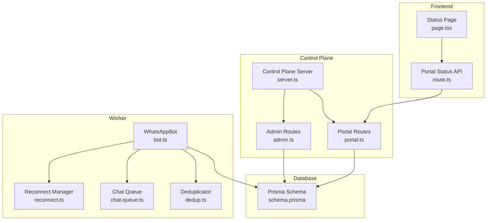
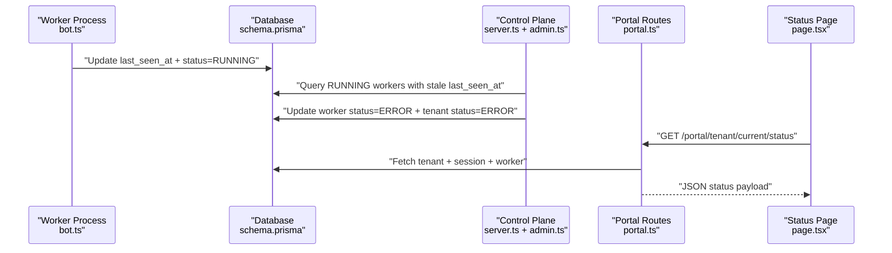
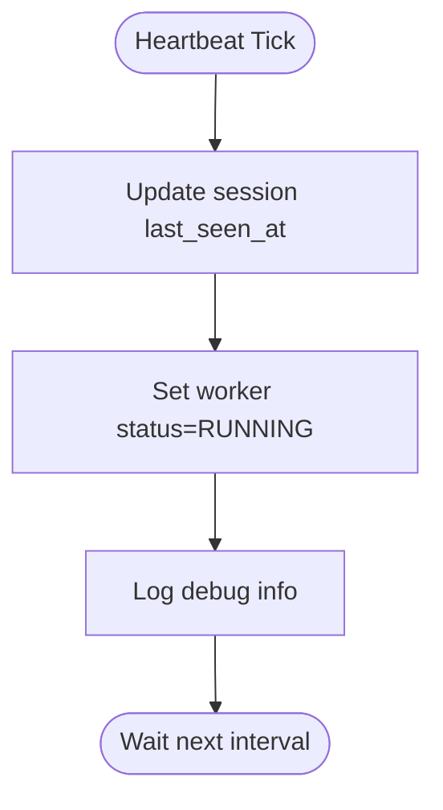
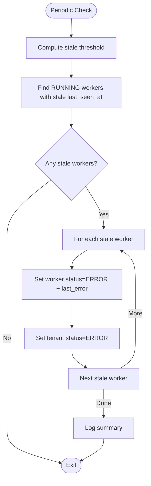
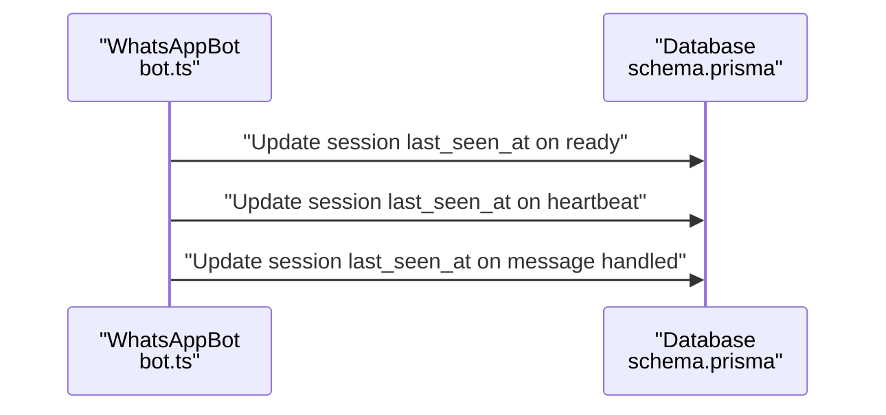
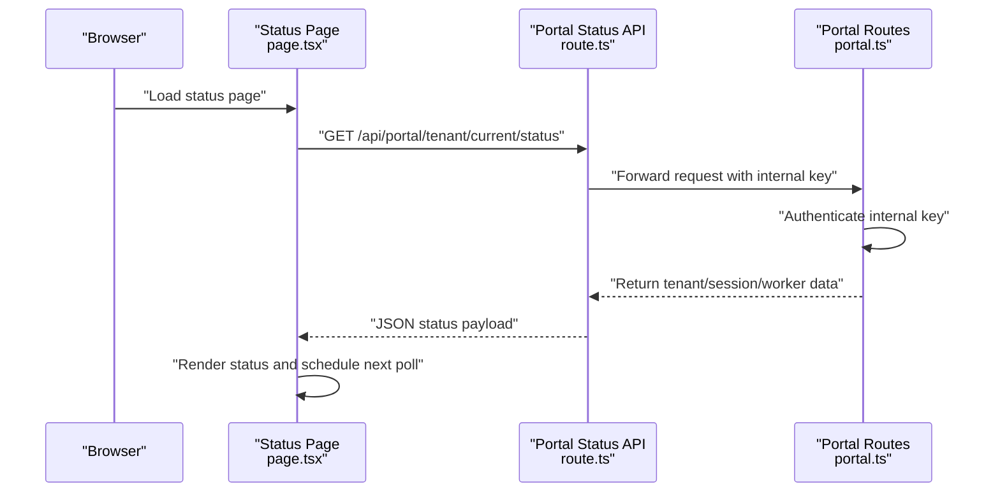
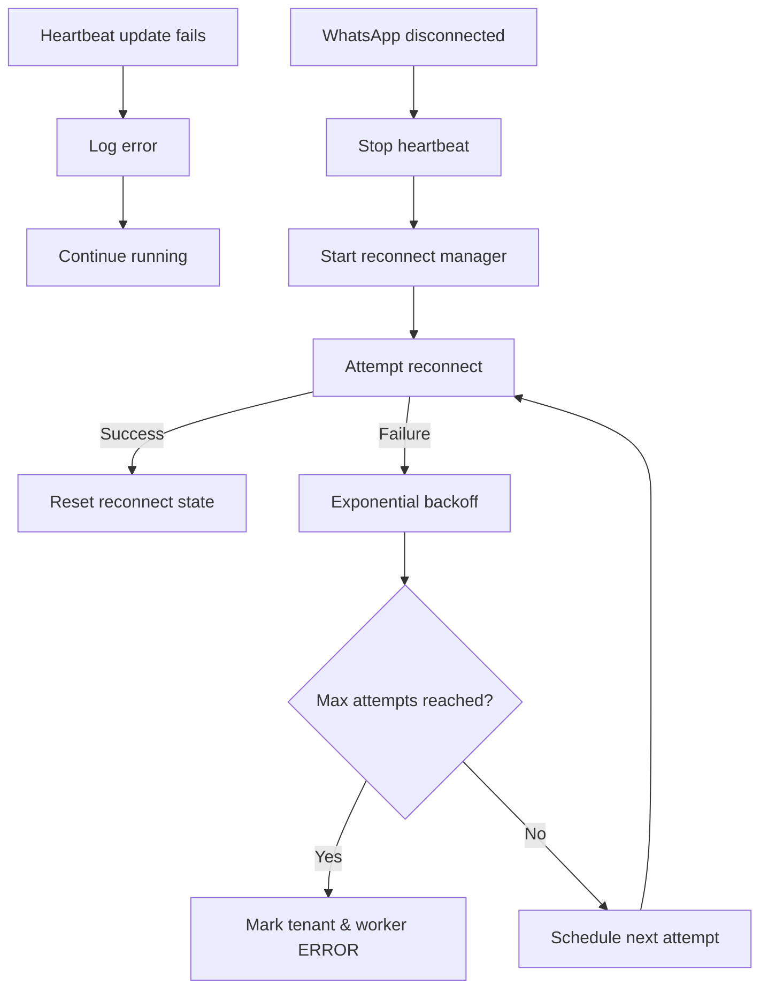
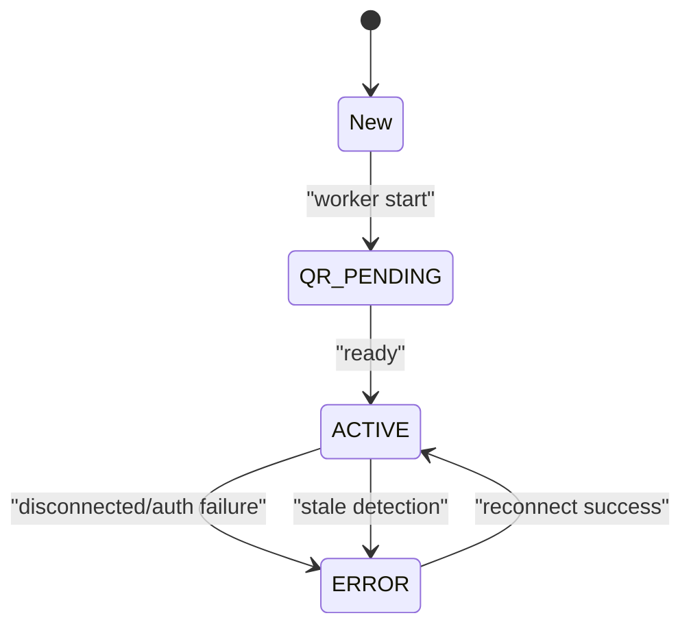
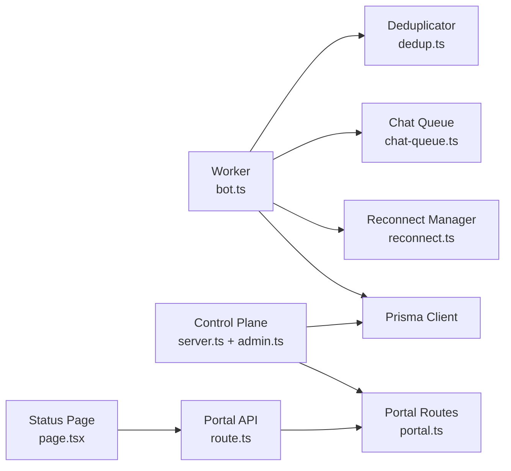
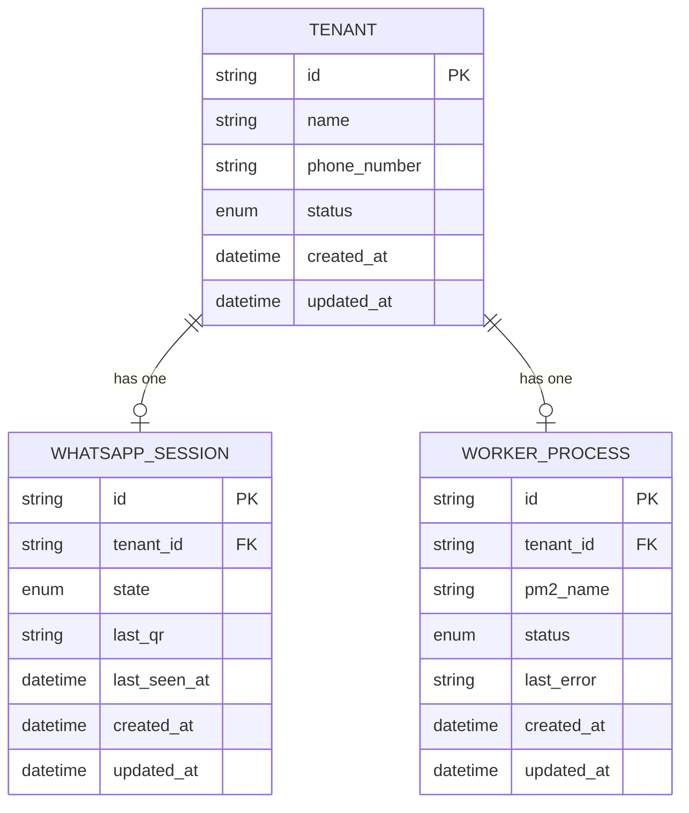

# Heartbeat and Health Monitoring

<cite>
**Referenced Files in This Document**
- [server.ts](file://apps/control-plane/src/server.ts)
- [admin.ts](file://apps/control-plane/src/routes/admin.ts)
- [bot.ts](file://apps/worker/src/bot.ts)
- [schema.prisma](file://packages/shared/src/prisma/schema.prisma)
- [page.tsx](file://apps/web/src/app/(portal)/app/status/page.tsx)
- [route.ts](file://apps/web/src/app/api/portal/tenant/current/status/route.ts)
- [portal.ts](file://apps/control-plane/src/routes/portal.ts)
- [reconnect.ts](file://apps/worker/src/utils/reconnect.ts)
- [chat-queue.ts](file://apps/worker/src/utils/chat-queue.ts)
- [dedup.ts](file://apps/worker/src/utils/dedup.ts)
- [ecosystem.config.js](file://ecosystem.config.js)
</cite>

## Table of Contents
1. [Introduction](#introduction)
2. [Project Structure](#project-structure)
3. [Core Components](#core-components)
4. [Architecture Overview](#architecture-overview)
5. [Detailed Component Analysis](#detailed-component-analysis)
6. [Dependency Analysis](#dependency-analysis)
7. [Performance Considerations](#performance-considerations)
8. [Troubleshooting Guide](#troubleshooting-guide)
9. [Conclusion](#conclusion)
10. [Appendices](#appendices)

## Introduction
This document explains the heartbeat monitoring and worker health-check system used to track the operational status of tenant-specific workers and maintain synchronization with tenant status. It covers:
- How the heartbeat mechanism works in the worker
- How stale workers are detected and marked
- How last_seen_at timestamps are tracked and used
- How health check intervals are configured and executed
- Practical configuration examples and monitoring integrations
- Network timeout handling and recovery from heartbeat failures
- The relationship between worker health and tenant status synchronization

## Project Structure
The heartbeat and health monitoring spans three main areas:
- Control plane server that schedules periodic stale-worker detection
- Worker process that sends heartbeats and updates session/worker status
- Frontend portal that surfaces status and integrates with the control plane

**Diagram sources**
- [server.ts](file://apps/control-plane/src/server.ts#L54-L63)
- [admin.ts](file://apps/control-plane/src/routes/admin.ts#L30-L80)
- [portal.ts](file://apps/control-plane/src/routes/portal.ts#L159-L186)
- [bot.ts](file://apps/worker/src/bot.ts#L333-L359)
- [page.tsx](file://apps/web/src/app/(portal)/app/status/page.tsx#L24-L44)
- [route.ts](file://apps/web/src/app/api/portal/tenant/current/status/route.ts#L8-L34)
- [schema.prisma](file://packages/shared/src/prisma/schema.prisma#L92-L131)

**Section sources**
- [server.ts](file://apps/control-plane/src/server.ts#L54-L63)
- [admin.ts](file://apps/control-plane/src/routes/admin.ts#L30-L80)
- [portal.ts](file://apps/control-plane/src/routes/portal.ts#L159-L186)
- [bot.ts](file://apps/worker/src/bot.ts#L333-L359)
- [page.tsx](file://apps/web/src/app/(portal)/app/status/page.tsx#L24-L44)
- [route.ts](file://apps/web/src/app/api/portal/tenant/current/status/route.ts#L8-L34)
- [schema.prisma](file://packages/shared/src/prisma/schema.prisma#L92-L131)

## Core Components
- Heartbeat sender in the worker: Periodically updates the session’s last_seen_at and worker status.
- Stale worker detector in the control plane: Periodically scans RUNNING workers whose sessions exceed a configurable staleness threshold and marks them ERROR, cascading tenant status to ERROR.
- Status API and portal page: Expose tenant and session status to the frontend for monitoring dashboards.
- Database schema: Defines tenant, session, and worker-process entities and their relationships.

Key responsibilities:
- Worker: Send heartbeat, update status, handle disconnections, and reconnect with exponential backoff.
- Control plane: Run periodic stale-worker checks and synchronize tenant status.
- Frontend: Poll status via internal API and display health indicators.

**Section sources**
- [bot.ts](file://apps/worker/src/bot.ts#L333-L359)
- [admin.ts](file://apps/control-plane/src/routes/admin.ts#L30-L80)
- [portal.ts](file://apps/control-plane/src/routes/portal.ts#L159-L186)
- [schema.prisma](file://packages/shared/src/prisma/schema.prisma#L92-L131)

## Architecture Overview
The heartbeat and health monitoring architecture consists of:
- Worker process that maintains a WhatsApp session and periodically writes last_seen_at to the database and sets worker status to RUNNING.
- Control plane server that runs a periodic job to detect stale workers by comparing last_seen_at against a staleness threshold and updates worker and tenant statuses accordingly.
- Portal routes protected by an internal key that expose tenant status and session info to the frontend.
- Frontend polling the portal API to render live status.

**Diagram sources**
- [bot.ts](file://apps/worker/src/bot.ts#L333-L359)
- [admin.ts](file://apps/control-plane/src/routes/admin.ts#L30-L80)
- [portal.ts](file://apps/control-plane/src/routes/portal.ts#L159-L186)
- [page.tsx](file://apps/web/src/app/(portal)/app/status/page.tsx#L24-L44)

## Detailed Component Analysis

### Heartbeat Mechanism in the Worker
The worker sends periodic heartbeats to keep the session alive and signal health:
- Interval is configurable via HEARTBEAT_INTERVAL_MS (default 30000 ms).
- On each heartbeat:
  - Updates the session’s last_seen_at to the current time.
  - Sets the worker process status to RUNNING.
- Heartbeat is started after successful readiness and stopped on disconnection.

**Diagram sources**
- [bot.ts](file://apps/worker/src/bot.ts#L333-L359)

**Section sources**
- [bot.ts](file://apps/worker/src/bot.ts#L333-L359)

### Stale Worker Detection and Automatic Status Updates
The control plane periodically detects stale workers:
- Interval is configurable via STALE_CHECK_INTERVAL_MS (default 60000 ms).
- Threshold is configurable via STALE_THRESHOLD_MINUTES (default 2 minutes).
- Detection logic:
  - Find RUNNING workers whose tenant’s session last_seen_at is earlier than (now - threshold).
  - For each stale worker:
    - Update worker status to ERROR and set last_error.
    - Update tenant status to ERROR.
- Logging tracks warnings and informational summaries.

**Diagram sources**
- [server.ts](file://apps/control-plane/src/server.ts#L54-L63)
- [admin.ts](file://apps/control-plane/src/routes/admin.ts#L30-L80)

**Section sources**
- [server.ts](file://apps/control-plane/src/server.ts#L54-L63)
- [admin.ts](file://apps/control-plane/src/routes/admin.ts#L30-L80)

### last_seen_at Timestamp Tracking
The worker updates last_seen_at on:
- Ready event (after successful WhatsApp client initialization).
- Every heartbeat tick.
- After handling each incoming message.

The control plane uses last_seen_at to determine staleness.

**Diagram sources**
- [bot.ts](file://apps/worker/src/bot.ts#L98-L151)
- [bot.ts](file://apps/worker/src/bot.ts#L333-L359)
- [bot.ts](file://apps/worker/src/bot.ts#L307-L311)

**Section sources**
- [bot.ts](file://apps/worker/src/bot.ts#L98-L151)
- [bot.ts](file://apps/worker/src/bot.ts#L333-L359)
- [bot.ts](file://apps/worker/src/bot.ts#L307-L311)

### Health Check Intervals and Configuration
- Worker heartbeat interval:
  - Environment: HEARTBEAT_INTERVAL_MS (default 30000 ms).
  - Implementation: Uses parsed integer from environment.
- Control plane stale check interval:
  - Environment: STALE_CHECK_INTERVAL_MS (default 60000 ms).
  - Implementation: Starts a periodic timer that invokes markStaleWorkers.
- Staleness threshold:
  - Environment: STALE_THRESHOLD_MINUTES (default 2 minutes).
  - Implementation: Computes threshold date and compares last_seen_at.

Operational guidance:
- Lower heartbeat intervals increase responsiveness but also DB write frequency.
- Higher staleness thresholds tolerate more transient network issues but delay error detection.

**Section sources**
- [bot.ts](file://apps/worker/src/bot.ts#L333-L359)
- [server.ts](file://apps/control-plane/src/server.ts#L54-L63)
- [admin.ts](file://apps/control-plane/src/routes/admin.ts#L12-L12)

### Monitoring Dashboard Integration and Alerting
- Frontend status page polls the portal API endpoint every 10 seconds and renders tenant and session status.
- Portal routes require an internal key header (PORTAL_INTERNAL_KEY) for access.
- Integration ideas:
  - Use the portal status endpoint as a data source for dashboards.
  - Alert on tenant status=ERROR or worker status=ERROR.
  - Correlate with message logs and setup request status for richer context.

**Diagram sources**
- [page.tsx](file://apps/web/src/app/(portal)/app/status/page.tsx#L24-L44)
- [route.ts](file://apps/web/src/app/api/portal/tenant/current/status/route.ts#L8-L34)
- [portal.ts](file://apps/control-plane/src/routes/portal.ts#L159-L186)

**Section sources**
- [page.tsx](file://apps/web/src/app/(portal)/app/status/page.tsx#L24-L44)
- [route.ts](file://apps/web/src/app/api/portal/tenant/current/status/route.ts#L8-L34)
- [portal.ts](file://apps/control-plane/src/routes/portal.ts#L12-L25)

### Network Timeout Handling and Recovery from Heartbeat Failures
- Worker heartbeat failures:
  - Heartbeat updates are wrapped in try/catch; failures are logged but do not crash the worker.
  - Disconnection triggers stopHeartbeat and starts reconnect manager with exponential backoff.
- Reconnect manager:
  - Configurable initial delay, max delay, max attempts, and backoff multiplier.
  - On reaching max attempts, marks tenant and worker as ERROR.
- Chat queue and deduplication:
  - Prevent message storms and ensure ordered processing per chat.
  - Deduplicator prevents duplicate processing of messages.

**Diagram sources**
- [bot.ts](file://apps/worker/src/bot.ts#L333-L359)
- [bot.ts](file://apps/worker/src/bot.ts#L185-L208)
- [reconnect.ts](file://apps/worker/src/utils/reconnect.ts#L87-L115)

**Section sources**
- [bot.ts](file://apps/worker/src/bot.ts#L333-L359)
- [bot.ts](file://apps/worker/src/bot.ts#L185-L208)
- [reconnect.ts](file://apps/worker/src/utils/reconnect.ts#L87-L115)

### Relationship Between Worker Health and Tenant Status Synchronization
- Worker status transitions:
  - READY: worker status becomes RUNNING and tenant status becomes ACTIVE.
  - DISCONNECTED: worker status becomes ERROR and tenant status becomes ERROR; reconnect manager starts.
  - AUTH FAILURE: worker status becomes ERROR and tenant status becomes ERROR.
  - HEARTBEAT: worker status remains RUNNING.
  - STALE DETECTION: RUNNING worker with stale last_seen_at becomes ERROR and tenant becomes ERROR.
- Tenant status lifecycle:
  - NEW → QR_PENDING → APPROVED → ACTIVE (via setup request and worker start).
  - ACTIVE → ERROR on disconnect or auth failure.
  - ERROR → ACTIVE after successful reconnection and heartbeat.

**Diagram sources**
- [bot.ts](file://apps/worker/src/bot.ts#L98-L151)
- [bot.ts](file://apps/worker/src/bot.ts#L185-L208)
- [admin.ts](file://apps/control-plane/src/routes/admin.ts#L30-L80)

**Section sources**
- [bot.ts](file://apps/worker/src/bot.ts#L98-L151)
- [bot.ts](file://apps/worker/src/bot.ts#L185-L208)
- [admin.ts](file://apps/control-plane/src/routes/admin.ts#L30-L80)

## Dependency Analysis
- Worker depends on:
  - Prisma client for database updates.
  - WhatsApp client for session management.
  - Reconnect manager for resilience.
  - Chat queue and deduplicator for throughput and correctness.
- Control plane depends on:
  - Prisma client for querying and updating worker and tenant records.
  - Internal portal key for authenticating frontend requests.
- Frontend depends on:
  - Portal status API for live tenant/session/worker data.

**Diagram sources**
- [bot.ts](file://apps/worker/src/bot.ts#L27-L75)
- [reconnect.ts](file://apps/worker/src/utils/reconnect.ts#L14-L39)
- [chat-queue.ts](file://apps/worker/src/utils/chat-queue.ts#L21-L29)
- [dedup.ts](file://apps/worker/src/utils/dedup.ts#L1-L20)
- [server.ts](file://apps/control-plane/src/server.ts#L54-L63)
- [admin.ts](file://apps/control-plane/src/routes/admin.ts#L30-L80)
- [portal.ts](file://apps/control-plane/src/routes/portal.ts#L159-L186)
- [route.ts](file://apps/web/src/app/api/portal/tenant/current/status/route.ts#L8-L34)
- [page.tsx](file://apps/web/src/app/(portal)/app/status/page.tsx#L24-L44)

**Section sources**
- [bot.ts](file://apps/worker/src/bot.ts#L27-L75)
- [reconnect.ts](file://apps/worker/src/utils/reconnect.ts#L14-L39)
- [chat-queue.ts](file://apps/worker/src/utils/chat-queue.ts#L21-L29)
- [dedup.ts](file://apps/worker/src/utils/dedup.ts#L1-L20)
- [server.ts](file://apps/control-plane/src/server.ts#L54-L63)
- [admin.ts](file://apps/control-plane/src/routes/admin.ts#L30-L80)
- [portal.ts](file://apps/control-plane/src/routes/portal.ts#L159-L186)
- [route.ts](file://apps/web/src/app/api/portal/tenant/current/status/route.ts#L8-L34)
- [page.tsx](file://apps/web/src/app/(portal)/app/status/page.tsx#L24-L44)

## Performance Considerations
- Heartbeat interval tuning:
  - Increase interval to reduce DB writes and CPU usage.
  - Decrease interval to improve staleness detection latency.
- Staleness threshold tuning:
  - Larger threshold reduces false positives during brief network hiccups.
  - Smaller threshold accelerates detection of truly dead workers.
- Queue and deduplication:
  - Chat queue prevents overload and ensures ordered processing.
  - Deduplicator avoids redundant work and protects against message storms.
- Reconnect backoff:
  - Exponential backoff prevents flooding the WhatsApp service and conserves resources.

[No sources needed since this section provides general guidance]

## Troubleshooting Guide
Common scenarios and resolutions:
- Worker appears healthy but is marked ERROR:
  - Verify HEARTBEAT_INTERVAL_MS and STALE_CHECK_INTERVAL_MS alignment.
  - Confirm that last_seen_at is being updated on ready and heartbeat ticks.
  - Check for database connectivity and Prisma client initialization errors.
- Frequent ERROR due to staleness:
  - Increase STALE_THRESHOLD_MINUTES if intermittent network issues occur.
  - Reduce heartbeat interval to ensure timely updates.
- Disconnections and repeated reconnect attempts:
  - Review reconnect configuration (initial delay, max attempts, backoff).
  - Investigate underlying network or browser/headless environment issues.
- Frontend status not updating:
  - Ensure PORTAL_INTERNAL_KEY is configured and passed in headers.
  - Verify that the portal routes are reachable and returning JSON.

**Section sources**
- [bot.ts](file://apps/worker/src/bot.ts#L333-L359)
- [admin.ts](file://apps/control-plane/src/routes/admin.ts#L30-L80)
- [portal.ts](file://apps/control-plane/src/routes/portal.ts#L12-L25)
- [route.ts](file://apps/web/src/app/api/portal/tenant/current/status/route.ts#L8-L34)

## Conclusion
The heartbeat and health monitoring system provides robust worker and tenant status tracking through:
- Periodic heartbeats that update session timestamps and worker status
- Controlled staleness detection that escalates to ERROR states
- Clear tenant status synchronization to reflect operational health
- Frontend integration for real-time visibility and alerting

Proper configuration of intervals and thresholds, combined with resilient reconnect logic, ensures reliable operation under various network conditions.

[No sources needed since this section summarizes without analyzing specific files]

## Appendices

### Configuration Reference
- Worker heartbeat interval:
  - Variable: HEARTBEAT_INTERVAL_MS
  - Default: 30000 ms
  - Effect: Controls frequency of last_seen_at updates and worker status=RUNNING
- Stale worker check interval:
  - Variable: STALE_CHECK_INTERVAL_MS
  - Default: 60000 ms
  - Effect: Frequency of staleness scanning
- Staleness threshold:
  - Variable: STALE_THRESHOLD_MINUTES
  - Default: 2 minutes
  - Effect: Threshold for marking workers as ERROR
- Portal internal key:
  - Variable: PORTAL_INTERNAL_KEY
  - Purpose: Protects portal routes from unauthorized access
- Frontend polling:
  - Interval: 10000 ms (as implemented in the status page)

**Section sources**
- [bot.ts](file://apps/worker/src/bot.ts#L333-L359)
- [server.ts](file://apps/control-plane/src/server.ts#L54-L63)
- [admin.ts](file://apps/control-plane/src/routes/admin.ts#L12-L12)
- [portal.ts](file://apps/control-plane/src/routes/portal.ts#L12-L25)
- [page.tsx](file://apps/web/src/app/(portal)/app/status/page.tsx#L42-L42)

### Data Model Overview

**Diagram sources**
- [schema.prisma](file://packages/shared/src/prisma/schema.prisma#L60-L131)