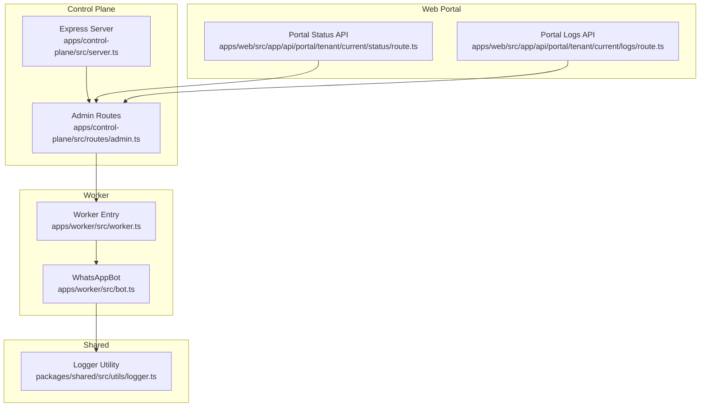
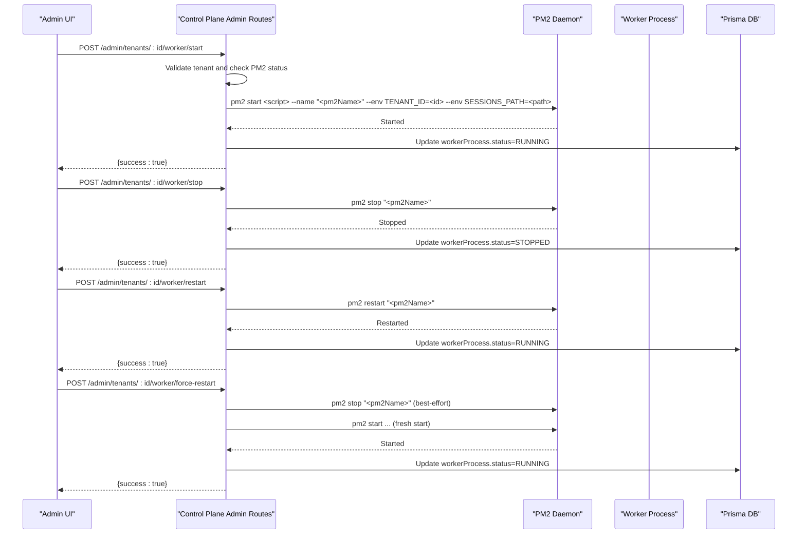
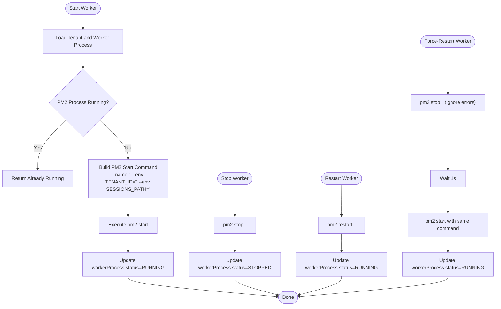
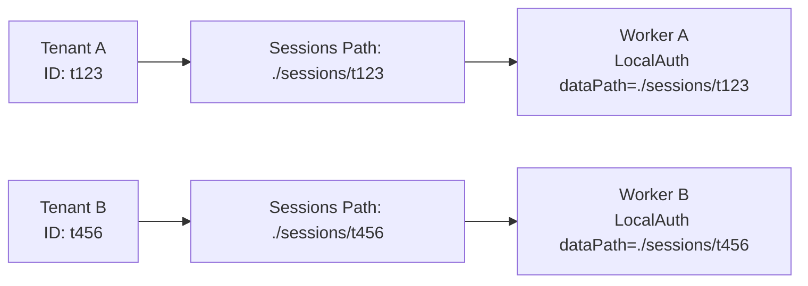
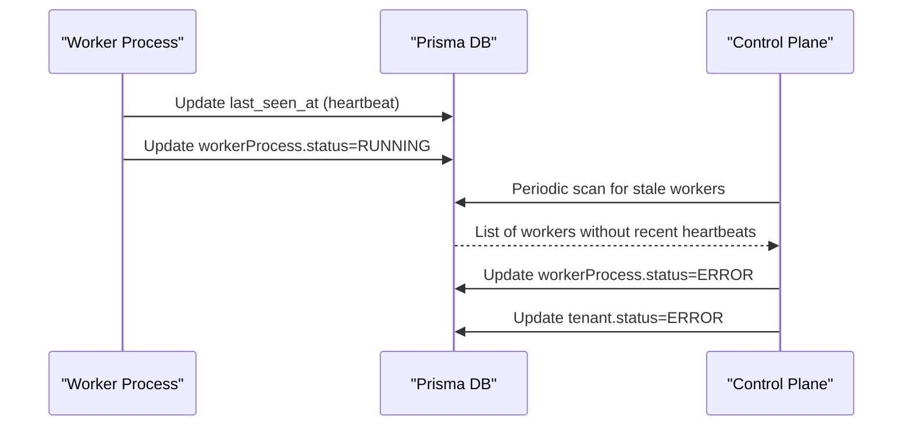
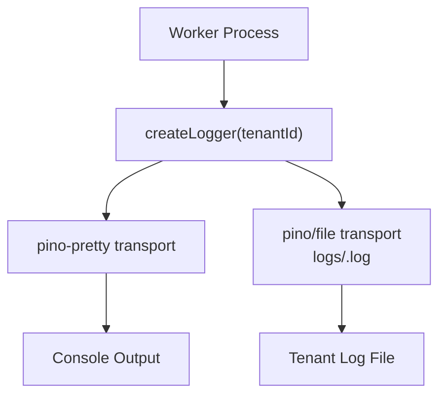
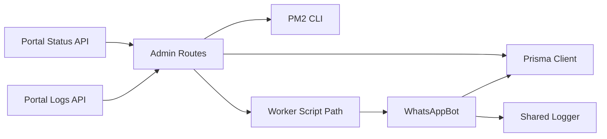

# PM2 Process Management

<cite>
**Referenced Files in This Document**
- [ecosystem.config.js](file://ecosystem.config.js)
- [server.ts](file://apps/control-plane/src/server.ts)
- [admin.ts](file://apps/control-plane/src/routes/admin.ts)
- [worker.ts](file://apps/worker/src/worker.ts)
- [bot.ts](file://apps/worker/src/bot.ts)
- [logger.ts](file://packages/shared/src/utils/logger.ts)
- [status.route.ts](file://apps/web/src/app/api/portal/tenant/current/status/route.ts)
- [logs.route.ts](file://apps/web/src/app/api/portal/tenant/current/logs/route.ts)
</cite>

## Table of Contents
1. [Introduction](#introduction)
2. [Project Structure](#project-structure)
3. [Core Components](#core-components)
4. [Architecture Overview](#architecture-overview)
5. [Detailed Component Analysis](#detailed-component-analysis)
6. [Dependency Analysis](#dependency-analysis)
7. [Performance Considerations](#performance-considerations)
8. [Troubleshooting Guide](#troubleshooting-guide)
9. [Conclusion](#conclusion)

## Introduction
This document explains PM2 process management in the worker orchestration system. It covers how the control plane API starts, stops, restarts, and force-restarts worker processes, how environment variables are configured, and how process naming conventions isolate tenants. It also documents process isolation via session paths, monitoring via heartbeats and logs, and operational troubleshooting strategies.

## Project Structure
The system consists of:
- Control Plane: Express server exposing administrative APIs to manage worker processes and monitor tenant status.
- Worker: Per-tenant process that runs a WhatsApp bot with isolated session storage and logging.
- Shared Logging: Tenant-aware logger that writes to centralized logs and per-tenant files.
- Web Portal: Frontend APIs that proxy to the control plane for status and logs.

**Diagram sources**
- [server.ts](file://apps/control-plane/src/server.ts#L65-L83)
- [admin.ts](file://apps/control-plane/src/routes/admin.ts#L174-L332)
- [worker.ts](file://apps/worker/src/worker.ts#L1-L46)
- [bot.ts](file://apps/worker/src/bot.ts#L12-L75)
- [logger.ts](file://packages/shared/src/utils/logger.ts#L5-L30)
- [status.route.ts](file://apps/web/src/app/api/portal/tenant/current/status/route.ts#L8-L34)
- [logs.route.ts](file://apps/web/src/app/api/portal/tenant/current/logs/route.ts#L8-L34)

**Section sources**
- [server.ts](file://apps/control-plane/src/server.ts#L1-L89)
- [admin.ts](file://apps/control-plane/src/routes/admin.ts#L1-L528)
- [worker.ts](file://apps/worker/src/worker.ts#L1-L46)
- [bot.ts](file://apps/worker/src/bot.ts#L1-L411)
- [logger.ts](file://packages/shared/src/utils/logger.ts#L1-L33)
- [status.route.ts](file://apps/web/src/app/api/portal/tenant/current/status/route.ts#L1-L35)
- [logs.route.ts](file://apps/web/src/app/api/portal/tenant/current/logs/route.ts#L1-L35)

## Core Components
- Control Plane Server: Initializes environment, validates prerequisites, sets up routes, and schedules stale worker checks.
- Admin Routes: Orchestrates PM2 lifecycle operations for workers, including start, stop, restart, and force-restart.
- Worker Process: Starts a WhatsApp bot per tenant, manages session isolation, and handles lifecycle signals.
- Shared Logger: Creates tenant-scoped logs and centralizes output for monitoring.
- Web Portal APIs: Proxy endpoints that call control plane endpoints for status and logs.

Key responsibilities:
- PM2 command execution patterns for start/stop/restart/force-restart
- Environment variable injection for tenant identity and session path
- Process naming convention for tenant isolation
- Heartbeat-driven monitoring and stale worker detection
- Session path management per tenant

**Section sources**
- [server.ts](file://apps/control-plane/src/server.ts#L16-L39)
- [admin.ts](file://apps/control-plane/src/routes/admin.ts#L174-L332)
- [worker.ts](file://apps/worker/src/worker.ts#L7-L30)
- [logger.ts](file://packages/shared/src/utils/logger.ts#L5-L30)

## Architecture Overview
The control plane exposes administrative endpoints that execute PM2 commands against the worker script. Each tenant’s worker is identified by a unique PM2 name and runs with tenant-specific environment variables. The worker maintains a heartbeat and stores sessions under a tenant-scoped path. The web portal proxies to the control plane for status and logs.

**Diagram sources**
- [admin.ts](file://apps/control-plane/src/routes/admin.ts#L174-L332)

## Detailed Component Analysis

### PM2 Lifecycle Operations in Control Plane
- Start: Validates tenant existence, checks if the process is already running, constructs a PM2 start command with a tenant-specific name and environment variables, executes the command, updates DB status, and transitions tenant state accordingly.
- Stop: Executes a PM2 stop for the tenant’s process name and updates DB status to STOPPED.
- Restart: Executes a PM2 restart and updates DB status to RUNNING.
- Force-Restart: Attempts to stop the process (best-effort), waits, then starts a fresh process with the same name and environment variables.

**Diagram sources**
- [admin.ts](file://apps/control-plane/src/routes/admin.ts#L174-L332)

**Section sources**
- [admin.ts](file://apps/control-plane/src/routes/admin.ts#L174-L332)

### Process Naming Conventions and Environment Variables
- Naming: The PM2 process name is derived from the tenant’s display name or ID to ensure uniqueness and readability.
- Environment Variables:
  - TENANT_ID: Identifies the tenant for the worker.
  - SESSIONS_PATH: Points to the tenant-scoped session storage directory.
- These variables are injected into the PM2 process during start and used by the worker to initialize session storage and logging.

**Section sources**
- [admin.ts](file://apps/control-plane/src/routes/admin.ts#L124-L126)
- [admin.ts](file://apps/control-plane/src/routes/admin.ts#L198-L198)
- [admin.ts](file://apps/control-plane/src/routes/admin.ts#L449-L450)
- [worker.ts](file://apps/worker/src/worker.ts#L7-L9)

### Process Isolation Between Tenants
- Session Path Isolation: Each worker writes session data under a directory named after the tenant ID, preventing cross-tenant session interference.
- Logging Isolation: The shared logger creates per-tenant log files, enabling tenant-specific diagnostics without mixing logs.

**Diagram sources**
- [bot.ts](file://apps/worker/src/bot.ts#L58-L67)
- [logger.ts](file://packages/shared/src/utils/logger.ts#L19-L24)

**Section sources**
- [bot.ts](file://apps/worker/src/bot.ts#L58-L67)
- [logger.ts](file://packages/shared/src/utils/logger.ts#L19-L24)

### Process Monitoring and Heartbeats
- Heartbeat Interval: The worker sends periodic heartbeats to update session last_seen_at and worker status.
- Stale Worker Detection: The control plane periodically scans for workers without recent heartbeats and marks them as ERROR.
- Status Updates: On successful readiness, the worker updates status to RUNNING and resets reconnect attempts.

**Diagram sources**
- [bot.ts](file://apps/worker/src/bot.ts#L333-L359)
- [admin.ts](file://apps/control-plane/src/routes/admin.ts#L30-L80)

**Section sources**
- [bot.ts](file://apps/worker/src/bot.ts#L333-L359)
- [admin.ts](file://apps/control-plane/src/routes/admin.ts#L30-L80)

### Log Management and Visibility
- Centralized Logs Directory: Logs are written to a shared logs directory.
- Per-Tenant Log Files: When a tenant ID is present, logs are duplicated to a tenant-specific file for easy filtering.
- Web Portal Access: The portal exposes endpoints that proxy to the control plane to fetch status and logs.

**Diagram sources**
- [logger.ts](file://packages/shared/src/utils/logger.ts#L5-L30)

**Section sources**
- [logger.ts](file://packages/shared/src/utils/logger.ts#L5-L30)
- [status.route.ts](file://apps/web/src/app/api/portal/tenant/current/status/route.ts#L8-L34)
- [logs.route.ts](file://apps/web/src/app/api/portal/tenant/current/logs/route.ts#L8-L34)

### PM2 Command Execution Patterns Used in Control Plane
- Start: pm2 start <script> --name "<pm2Name>" --env TENANT_ID=<id> --env SESSIONS_PATH=<path>
- Stop: pm2 stop "<pm2Name>"
- Restart: pm2 restart "<pm2Name>"
- Force-Restart: pm2 stop "<pm2Name>" (best-effort), then pm2 start with the same command

These commands are executed synchronously via child process execution and are logged for auditability.

**Section sources**
- [admin.ts](file://apps/control-plane/src/routes/admin.ts#L198-L198)
- [admin.ts](file://apps/control-plane/src/routes/admin.ts#L243-L243)
- [admin.ts](file://apps/control-plane/src/routes/admin.ts#L268-L268)
- [admin.ts](file://apps/control-plane/src/routes/admin.ts#L310-L310)

## Dependency Analysis
- Control Plane depends on:
  - PM2 CLI for process lifecycle operations
  - Prisma for tenant, session, and worker process metadata
  - Worker script path resolved from control plane source tree
- Worker depends on:
  - WhatsApp client with LocalAuth using tenant-scoped session path
  - Shared logger for tenant-aware logging
  - Prisma for status updates and message logging
- Web Portal depends on:
  - Control Plane endpoints for status and logs

**Diagram sources**
- [admin.ts](file://apps/control-plane/src/routes/admin.ts#L11-L11)
- [admin.ts](file://apps/control-plane/src/routes/admin.ts#L174-L332)
- [worker.ts](file://apps/worker/src/worker.ts#L1-L46)
- [bot.ts](file://apps/worker/src/bot.ts#L12-L75)
- [logger.ts](file://packages/shared/src/utils/logger.ts#L5-L30)
- [status.route.ts](file://apps/web/src/app/api/portal/tenant/current/status/route.ts#L8-L34)
- [logs.route.ts](file://apps/web/src/app/api/portal/tenant/current/logs/route.ts#L8-L34)

**Section sources**
- [admin.ts](file://apps/control-plane/src/routes/admin.ts#L11-L11)
- [admin.ts](file://apps/control-plane/src/routes/admin.ts#L174-L332)
- [worker.ts](file://apps/worker/src/worker.ts#L1-L46)
- [bot.ts](file://apps/worker/src/bot.ts#L12-L75)
- [logger.ts](file://packages/shared/src/utils/logger.ts#L5-L30)
- [status.route.ts](file://apps/web/src/app/api/portal/tenant/current/status/route.ts#L8-L34)
- [logs.route.ts](file://apps/web/src/app/api/portal/tenant/current/logs/route.ts#L8-L34)

## Performance Considerations
- Heartbeat Interval: Tune HEARTBEAT_INTERVAL_MS to balance responsiveness and overhead.
- Rate Limiting: The worker enforces per-minute reply limits to prevent throttling and resource spikes.
- Session Storage: Ensure disk I/O for session storage is on fast volumes to avoid initialization delays.
- PM2 Memory Limits: Configure max_memory_restart in PM2 ecosystem to prevent runaway memory growth.
- Logging Volume: Monitor per-tenant log sizes and rotate logs to control disk usage.

[No sources needed since this section provides general guidance]

## Troubleshooting Guide
Common issues and resolutions:
- Worker fails to start:
  - Verify PM2 installation and permissions.
  - Confirm PUPPETEER_EXECUTABLE_PATH is set in production.
  - Check that SESSIONS_PATH exists and is writable.
  - Review per-tenant logs for initialization errors.
- Worker stuck in QR_PENDING:
  - Ensure the worker process is running and heartbeats are being sent.
  - Use PM2 status to confirm process health.
- Frequent restarts:
  - Inspect max_memory_restart thresholds and adjust if needed.
  - Review error logs for recurring exceptions.
- Cross-tenant interference:
  - Verify SESSIONS_PATH is tenant-scoped and not shared.
  - Confirm PM2 process names are unique per tenant.

Operational checks:
- Process status: Use PM2 describe "<pm2Name>" to verify online/running state.
- Logs: Tail logs/<tenantId>.log for tenant-specific events.
- Heartbeats: Confirm last_seen_at updates in the database.

**Section sources**
- [server.ts](file://apps/control-plane/src/server.ts#L34-L38)
- [admin.ts](file://apps/control-plane/src/routes/admin.ts#L17-L24)
- [bot.ts](file://apps/worker/src/bot.ts#L333-L359)
- [logger.ts](file://packages/shared/src/utils/logger.ts#L19-L24)

## Conclusion
The control plane orchestrates PM2-managed worker processes per tenant, enforcing isolation via environment variables and session paths. Heartbeats and stale worker detection provide robust monitoring, while the shared logger enables tenant-scoped diagnostics. By following the documented command patterns and isolation strategies, administrators can reliably manage worker lifecycles and troubleshoot issues efficiently.