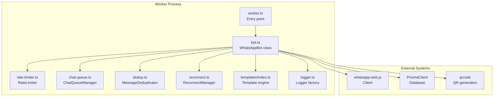
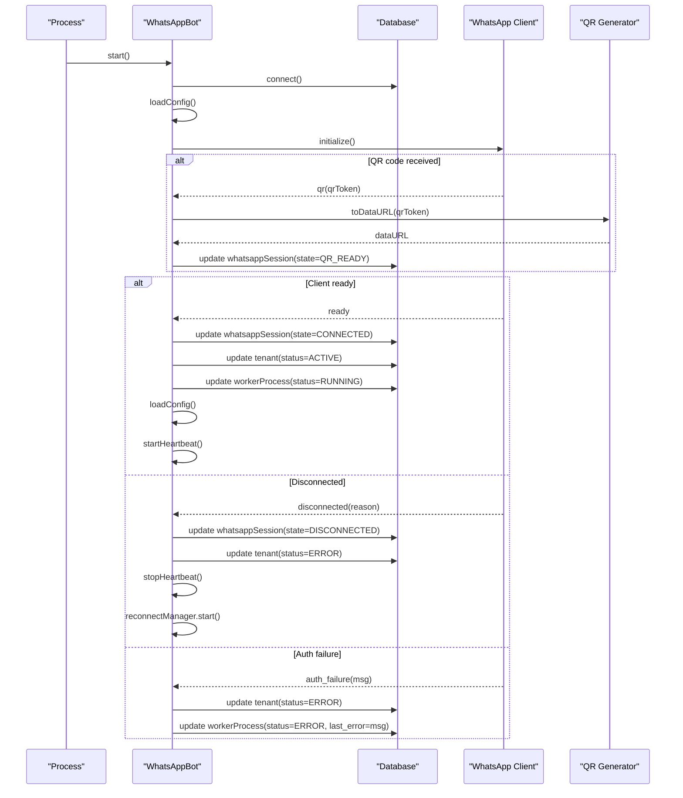
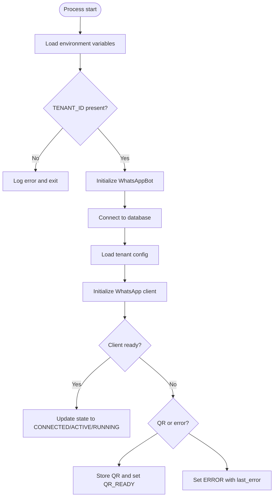
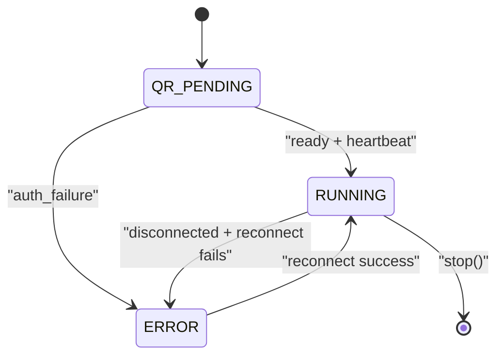
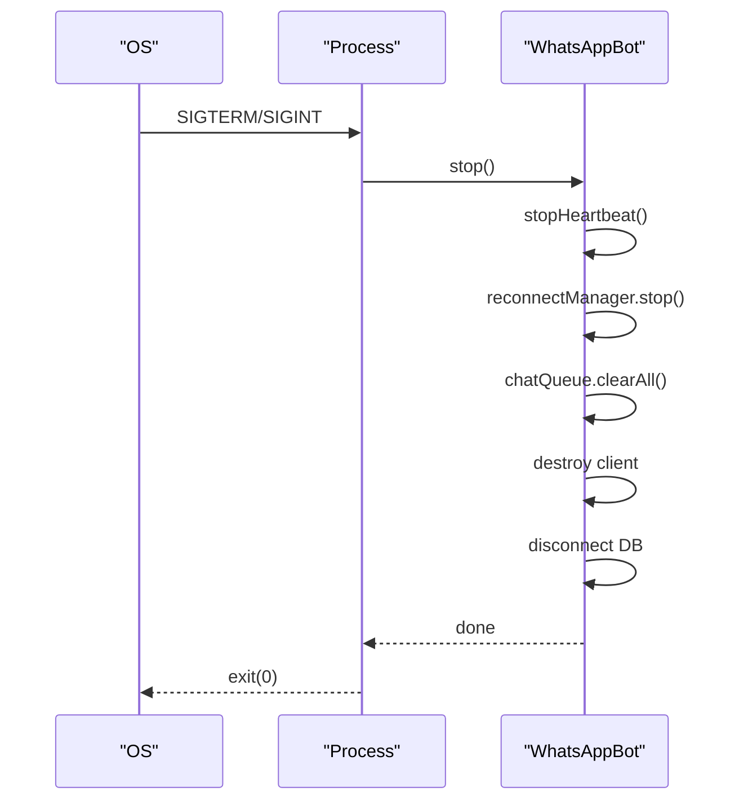
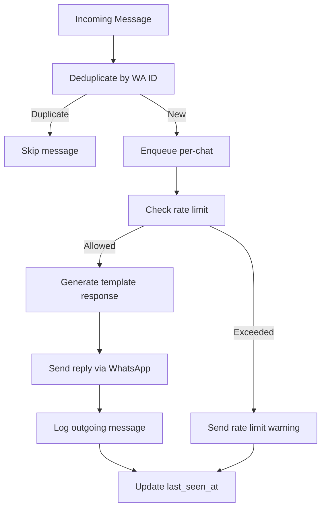
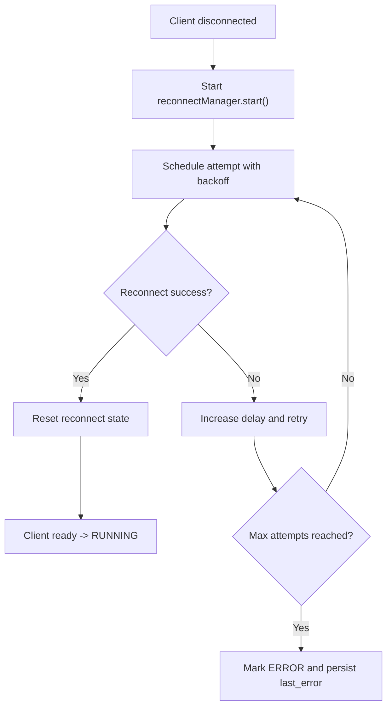
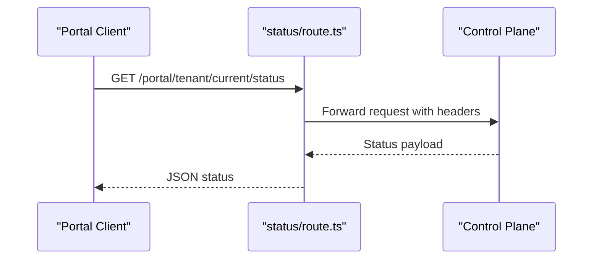
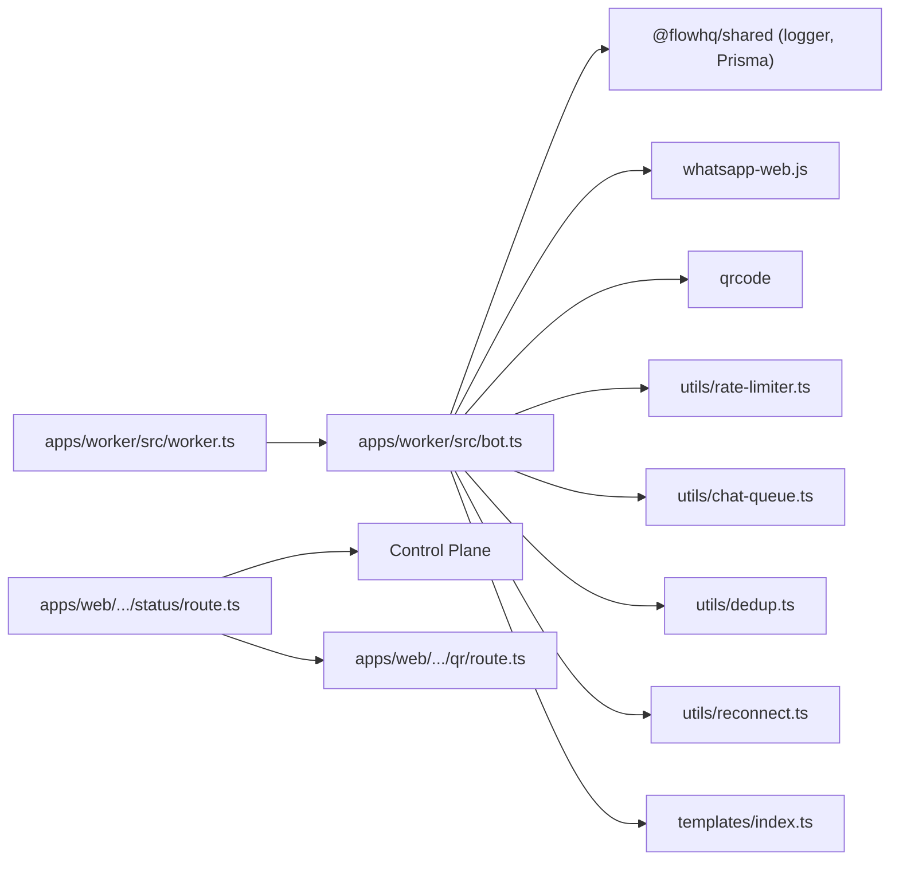

# Worker Lifecycle Management

<cite>
**Referenced Files in This Document**
- [worker.ts](file://apps/worker/src/worker.ts)
- [bot.ts](file://apps/worker/src/bot.ts)
- [reconnect.ts](file://apps/worker/src/utils/reconnect.ts)
- [chat-queue.ts](file://apps/worker/src/utils/chat-queue.ts)
- [rate-limiter.ts](file://apps/worker/src/utils/rate-limiter.ts)
- [dedup.ts](file://apps/worker/src/utils/dedup.ts)
- [index.ts](file://apps/worker/src/templates/index.ts)
- [logger.ts](file://packages/shared/src/utils/logger.ts)
- [status/route.ts](file://apps/web/src/app/api/portal/tenant/current/status/route.ts)
- [qr/route.ts](file://apps/web/src/app/api/portal/tenant/current/qr/route.ts)
- [package.json](file://apps/worker/package.json)
- [ecosystem.config.js](file://ecosystem.config.js)
</cite>

## Table of Contents
1. [Introduction](#introduction)
2. [Project Structure](#project-structure)
3. [Core Components](#core-components)
4. [Architecture Overview](#architecture-overview)
5. [Detailed Component Analysis](#detailed-component-analysis)
6. [Dependency Analysis](#dependency-analysis)
7. [Performance Considerations](#performance-considerations)
8. [Troubleshooting Guide](#troubleshooting-guide)
9. [Conclusion](#conclusion)
10. [Appendices](#appendices)

## Introduction
This document explains the complete lifecycle of the worker process that powers the WhatsApp integration for a tenant. It covers the startup sequence from tenant creation to QR code authentication, runtime state management (RUNNING, STOPPED, ERROR, QR_PENDING), automatic state transitions, initialization procedures, environment setup, dependency loading, graceful shutdown, monitoring, health checks, recovery mechanisms, error handling, and cleanup procedures for terminated workers.

## Project Structure
The worker is implemented as a standalone Node.js service under apps/worker. It initializes a WhatsApp client, manages session persistence, handles incoming messages, enforces rate limits, ensures message uniqueness, and maintains a heartbeat to signal liveness. The frontend portal exposes endpoints to fetch QR codes and worker status, which are proxied to the control plane.

**Diagram sources**
- [worker.ts](file://apps/worker/src/worker.ts#L1-L46)
- [bot.ts](file://apps/worker/src/bot.ts#L1-L411)
- [rate-limiter.ts](file://apps/worker/src/utils/rate-limiter.ts#L1-L110)
- [chat-queue.ts](file://apps/worker/src/utils/chat-queue.ts#L1-L140)
- [dedup.ts](file://apps/worker/src/utils/dedup.ts#L1-L93)
- [reconnect.ts](file://apps/worker/src/utils/reconnect.ts#L1-L117)
- [index.ts](file://apps/worker/src/templates/index.ts#L1-L70)
- [logger.ts](file://packages/shared/src/utils/logger.ts#L1-L33)

**Section sources**
- [worker.ts](file://apps/worker/src/worker.ts#L1-L46)
- [bot.ts](file://apps/worker/src/bot.ts#L1-L411)
- [package.json](file://apps/worker/package.json#L1-L22)

## Core Components
- WhatsAppBot: Orchestrates client initialization, event handling, state updates, heartbeat, and shutdown.
- RateLimiter: Enforces per-tenant reply rate limits with configurable windows.
- ChatQueueManager: Ensures sequential processing per chat to avoid race conditions.
- MessageDeduplicator: Prevents reprocessing the same message using WA message IDs.
- ReconnectManager: Implements exponential backoff to recover from disconnections.
- Template Engine: Selects appropriate response based on tenant configuration.
- Logger Factory: Creates structured logs with optional tenant-specific files.

**Section sources**
- [bot.ts](file://apps/worker/src/bot.ts#L12-L75)
- [rate-limiter.ts](file://apps/worker/src/utils/rate-limiter.ts#L17-L26)
- [chat-queue.ts](file://apps/worker/src/utils/chat-queue.ts#L21-L29)
- [dedup.ts](file://apps/worker/src/utils/dedup.ts#L11-L19)
- [reconnect.ts](file://apps/worker/src/utils/reconnect.ts#L14-L39)
- [index.ts](file://apps/worker/src/templates/index.ts#L3-L7)
- [logger.ts](file://packages/shared/src/utils/logger.ts#L5-L30)

## Architecture Overview
The worker starts, connects to the database, loads tenant configuration, initializes the WhatsApp client, and transitions to RUNNING after successful authentication. It periodically sends heartbeats and updates status. On QR receipt, it stores QR data and marks state as QR_READY. On disconnect, it resets heartbeat, updates state to DISCONNECTED, and triggers reconnect attempts with exponential backoff. On auth failure, it marks ERROR and persists the last error.

**Diagram sources**
- [bot.ts](file://apps/worker/src/bot.ts#L77-L226)
- [bot.ts](file://apps/worker/src/bot.ts#L369-L392)
- [bot.ts](file://apps/worker/src/bot.ts#L333-L367)
- [reconnect.ts](file://apps/worker/src/utils/reconnect.ts#L44-L52)

## Detailed Component Analysis

### Worker Startup Sequence
- Environment loading: The worker reads TENANT_ID and SESSIONS_PATH, configures logging, and validates prerequisites.
- Initialization: It constructs WhatsAppBot with session storage path derived from SESSIONS_PATH and TENANT_ID.
- Start: The bot connects to the database, loads tenant configuration, and initializes the WhatsApp client.
- State transitions: On ready, it sets CONNECTED, ACTIVE, RUNNING; on QR, it sets QR_READY and persists QR data.

**Diagram sources**
- [worker.ts](file://apps/worker/src/worker.ts#L1-L46)
- [bot.ts](file://apps/worker/src/bot.ts#L369-L392)
- [bot.ts](file://apps/worker/src/bot.ts#L98-L151)
- [bot.ts](file://apps/worker/src/bot.ts#L77-L96)
- [bot.ts](file://apps/worker/src/bot.ts#L210-L225)

**Section sources**
- [worker.ts](file://apps/worker/src/worker.ts#L1-L46)
- [bot.ts](file://apps/worker/src/bot.ts#L27-L75)
- [bot.ts](file://apps/worker/src/bot.ts#L369-L392)

### State Management and Transitions
States:
- QR_PENDING: Triggered when a QR code is generated; persisted as QR_READY with data URL.
- RUNNING: Set upon successful ready event and heartbeat.
- ERROR: Set on auth failure or max reconnect attempts reached.
- STOPPED: Not explicitly set by the worker; implies process termination.

Automatic transitions:
- QR code -> QR_READY (persisted)
- ready -> CONNECTED -> ACTIVE -> RUNNING (with heartbeat)
- disconnected -> DISCONNECTED -> ERROR -> RUNNING (on reconnect success)
- auth_failure -> ERROR

**Diagram sources**
- [bot.ts](file://apps/worker/src/bot.ts#L77-L151)
- [bot.ts](file://apps/worker/src/bot.ts#L185-L225)
- [reconnect.ts](file://apps/worker/src/utils/reconnect.ts#L87-L115)

**Section sources**
- [bot.ts](file://apps/worker/src/bot.ts#L77-L151)
- [bot.ts](file://apps/worker/src/bot.ts#L185-L225)
- [reconnect.ts](file://apps/worker/src/utils/reconnect.ts#L44-L85)

### Graceful Shutdown
- Signal handlers: SIGTERM and SIGINT trigger graceful shutdown.
- Stop sequence: Stops heartbeat, halts reconnect attempts, clears chat queues, destroys client, disconnects database.
- Exit: Process exits cleanly after cleanup.

**Diagram sources**
- [worker.ts](file://apps/worker/src/worker.ts#L26-L36)
- [bot.ts](file://apps/worker/src/bot.ts#L394-L409)

**Section sources**
- [worker.ts](file://apps/worker/src/worker.ts#L26-L36)
- [bot.ts](file://apps/worker/src/bot.ts#L394-L409)

### Message Processing Pipeline
- Deduplication: Skips duplicate WA message IDs.
- Queueing: Sequentially processes messages per chat to avoid concurrency issues.
- Rate limiting: Enforces per-tenant reply rate; warns and suppresses if exceeded.
- Template selection: Chooses response based on tenant template type and language.
- Logging: Records incoming and outgoing messages and updates last seen timestamps.

**Diagram sources**
- [bot.ts](file://apps/worker/src/bot.ts#L153-L183)
- [bot.ts](file://apps/worker/src/bot.ts#L248-L331)
- [dedup.ts](file://apps/worker/src/utils/dedup.ts#L28-L46)
- [chat-queue.ts](file://apps/worker/src/utils/chat-queue.ts#L35-L68)
- [rate-limiter.ts](file://apps/worker/src/utils/rate-limiter.ts#L32-L73)
- [index.ts](file://apps/worker/src/templates/index.ts#L9-L23)

**Section sources**
- [bot.ts](file://apps/worker/src/bot.ts#L153-L183)
- [bot.ts](file://apps/worker/src/bot.ts#L248-L331)
- [dedup.ts](file://apps/worker/src/utils/dedup.ts#L11-L46)
- [chat-queue.ts](file://apps/worker/src/utils/chat-queue.ts#L21-L68)
- [rate-limiter.ts](file://apps/worker/src/utils/rate-limiter.ts#L17-L73)
- [index.ts](file://apps/worker/src/templates/index.ts#L3-L23)

### Recovery Mechanisms
- ReconnectManager: Schedules exponential backoff attempts with capped delays and maximum retries. On success, resets state; on reaching max attempts, marks ERROR and persists last error.
- Heartbeat: Keeps state RUNNING and last_seen_at updated; stops on disconnect and resumes on ready.
- Session persistence: Uses LocalAuth with a tenant-scoped dataPath to persist browser sessions.

**Diagram sources**
- [bot.ts](file://apps/worker/src/bot.ts#L185-L208)
- [reconnect.ts](file://apps/worker/src/utils/reconnect.ts#L44-L115)
- [bot.ts](file://apps/worker/src/bot.ts#L333-L367)

**Section sources**
- [reconnect.ts](file://apps/worker/src/utils/reconnect.ts#L14-L117)
- [bot.ts](file://apps/worker/src/bot.ts#L37-L56)
- [bot.ts](file://apps/worker/src/bot.ts#L333-L367)

### Health Checks and Monitoring
- Heartbeat: Periodic updates to database keep the worker process alive and RUNNING.
- Status endpoint: Frontend proxies a GET request to the control plane to retrieve current status and QR data.
- Logs: Tenant-specific logs are written to files for easier debugging.

**Diagram sources**
- [status/route.ts](file://apps/web/src/app/api/portal/tenant/current/status/route.ts#L8-L34)

**Section sources**
- [bot.ts](file://apps/worker/src/bot.ts#L333-L367)
- [status/route.ts](file://apps/web/src/app/api/portal/tenant/current/status/route.ts#L1-L35)
- [qr/route.ts](file://apps/web/src/app/api/portal/tenant/current/qr/route.ts#L1-L35)
- [logger.ts](file://packages/shared/src/utils/logger.ts#L5-L30)

### Environment Setup and Dependencies
- Environment variables:
  - TENANT_ID: Required to identify the tenant and derive session storage path.
  - SESSIONS_PATH: Optional; defaults to ./sessions.
  - RATE_LIMIT_MAX_PER_MINUTE: Configures rate limiter window.
  - HEARTBEAT_INTERVAL_MS: Controls heartbeat frequency.
  - LOG_LEVEL: Sets logger verbosity.
- Dependencies:
  - whatsapp-web.js: WhatsApp client and authentication.
  - qrcode: Converts QR tokens to data URLs.
  - dotenv: Loads environment variables from .env.
  - @flowhq/shared: Logger factory and Prisma client.

**Section sources**
- [worker.ts](file://apps/worker/src/worker.ts#L1-L46)
- [bot.ts](file://apps/worker/src/bot.ts#L27-L75)
- [bot.ts](file://apps/worker/src/bot.ts#L333-L359)
- [package.json](file://apps/worker/package.json#L9-L20)

## Dependency Analysis
The worker depends on shared utilities for logging and database access, and integrates with external systems for messaging and QR handling. The control plane is accessed via the portal frontend.

**Diagram sources**
- [worker.ts](file://apps/worker/src/worker.ts#L1-L46)
- [bot.ts](file://apps/worker/src/bot.ts#L1-L11)
- [status/route.ts](file://apps/web/src/app/api/portal/tenant/current/status/route.ts#L1-L35)
- [qr/route.ts](file://apps/web/src/app/api/portal/tenant/current/qr/route.ts#L1-L35)

**Section sources**
- [worker.ts](file://apps/worker/src/worker.ts#L1-L46)
- [bot.ts](file://apps/worker/src/bot.ts#L1-L11)
- [status/route.ts](file://apps/web/src/app/api/portal/tenant/current/status/route.ts#L1-L35)
- [qr/route.ts](file://apps/web/src/app/api/portal/tenant/current/qr/route.ts#L1-L35)

## Performance Considerations
- Heartbeat interval: Tune HEARTBEAT_INTERVAL_MS to balance responsiveness and overhead.
- Rate limiting: Adjust RATE_LIMIT_MAX_PER_MINUTE to match tenant throughput needs.
- Queue sizing: Configure ChatQueueManager max size to handle bursty traffic without blocking.
- Cleanup: Deduplicator periodic cleanup prevents memory bloat; ensure TTL aligns with expected message volume.
- Headless mode: Puppeteer runs in headless mode with sandbox arguments to reduce resource usage.

[No sources needed since this section provides general guidance]

## Troubleshooting Guide
Common issues and remedies:
- Missing TENANT_ID: The process exits early with an error; ensure environment is configured.
- QR not appearing: Verify QR_READY updates and that QR code generation completes; check database writes.
- Stuck in ERROR: Inspect last_error persisted in workerProcess; reconcile with reconnect attempts.
- High latency: Review heartbeat interval, queue sizes, and rate limiter thresholds.
- Duplicate messages: Confirm deduplication cache entries and cleanup intervals.
- Graceful shutdown failures: Ensure SIGTERM/SIGINT handlers are active and stop() completes client and DB teardown.

**Section sources**
- [worker.ts](file://apps/worker/src/worker.ts#L12-L15)
- [bot.ts](file://apps/worker/src/bot.ts#L77-L96)
- [bot.ts](file://apps/worker/src/bot.ts#L42-L55)
- [bot.ts](file://apps/worker/src/bot.ts#L317-L330)
- [dedup.ts](file://apps/worker/src/utils/dedup.ts#L59-L88)
- [worker.ts](file://apps/worker/src/worker.ts#L26-L36)

## Conclusion
The worker lifecycle is robustly managed through explicit state transitions, resilient recovery with exponential backoff, and structured logging. The startup sequence from tenant creation to QR authentication is automated, and runtime health is maintained via heartbeats. The design emphasizes graceful shutdown, error containment, and observability, enabling reliable operation across diverse environments.

[No sources needed since this section summarizes without analyzing specific files]

## Appendices

### Practical Examples

- Worker state monitoring:
  - Poll the status endpoint to retrieve RUNNING/ERROR/QR_READY states.
  - Observe tenant status updates in the database reflecting ACTIVE/ERROR.
  - Monitor heartbeat intervals to confirm liveness.

- Health check implementation:
  - Use the heartbeat mechanism to maintain RUNNING state.
  - Implement periodic checks against last_seen_at to detect stale workers.

- State transition debugging:
  - Enable detailed logs around QR, ready, disconnected, and auth_failure events.
  - Inspect workerProcess.last_error for contextual failure information.

- Worker recovery:
  - Allow ReconnectManager to exhaust max attempts; on failure, ERROR state is persisted.
  - On reconnect success, READY resets state and transitions to RUNNING.

- Cleanup procedures:
  - On stop(), queues are cleared and all managers are halted.
  - Client is destroyed and database connection is closed.

**Section sources**
- [status/route.ts](file://apps/web/src/app/api/portal/tenant/current/status/route.ts#L8-L34)
- [bot.ts](file://apps/worker/src/bot.ts#L98-L151)
- [bot.ts](file://apps/worker/src/bot.ts#L185-L225)
- [reconnect.ts](file://apps/worker/src/utils/reconnect.ts#L87-L115)
- [bot.ts](file://apps/worker/src/bot.ts#L394-L409)