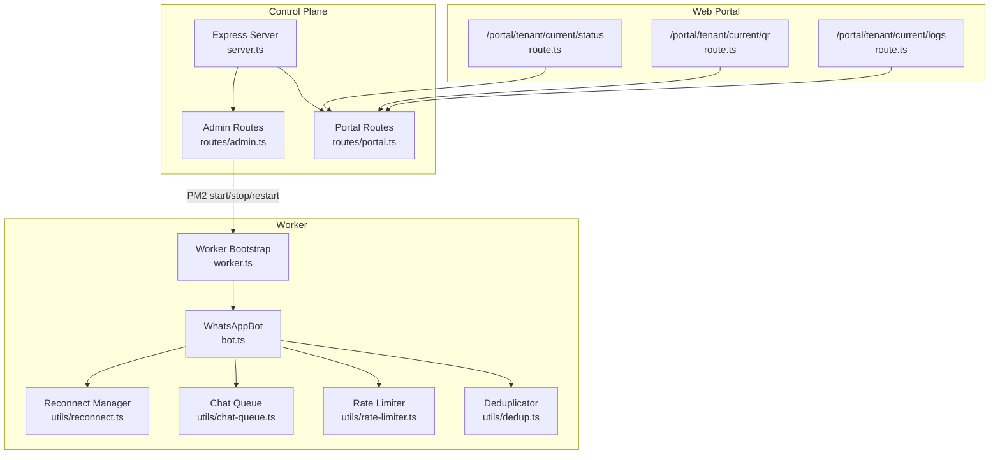
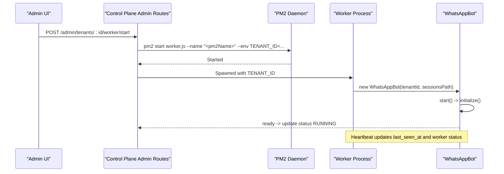
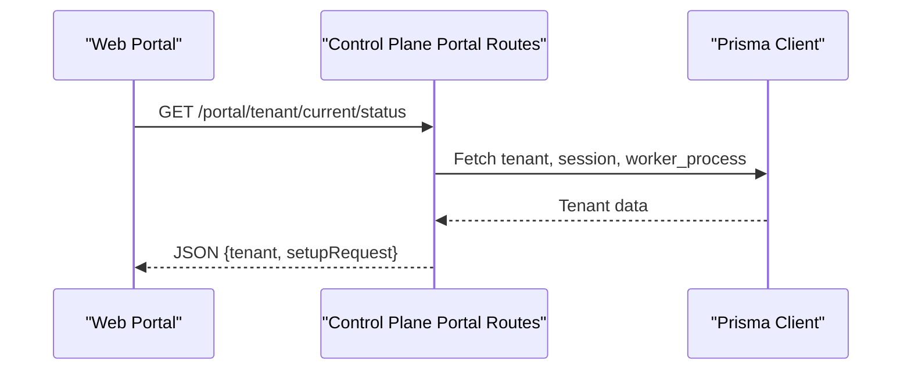
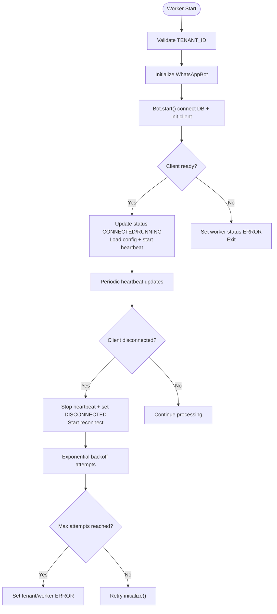
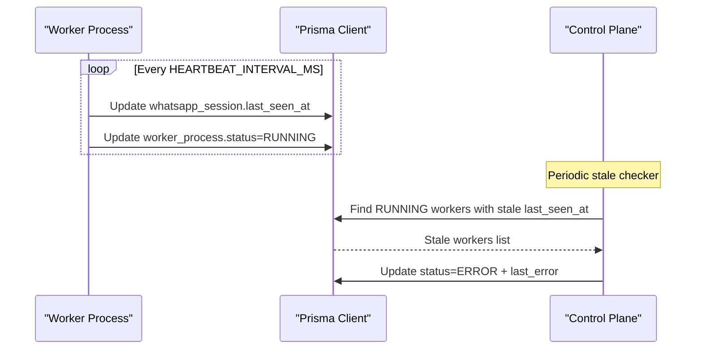
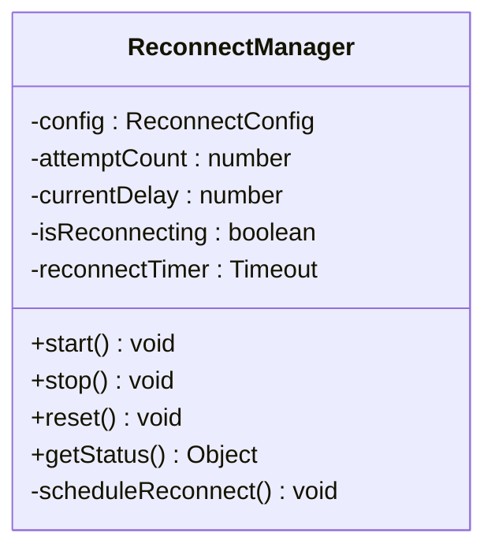
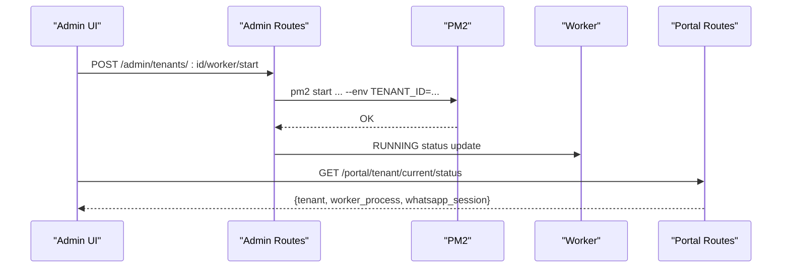
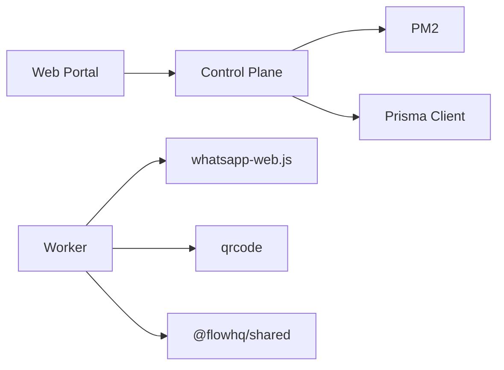

# Worker Orchestration

<cite>
**Referenced Files in This Document**
- [ecosystem.config.js](file://ecosystem.config.js)
- [apps/worker/package.json](file://apps/worker/package.json)
- [apps/control-plane/package.json](file://apps/control-plane/package.json)
- [apps/web/package.json](file://apps/web/package.json)
- [apps/worker/src/worker.ts](file://apps/worker/src/worker.ts)
- [apps/worker/src/bot.ts](file://apps/worker/src/bot.ts)
- [apps/control-plane/src/server.ts](file://apps/control-plane/src/server.ts)
- [apps/control-plane/src/routes/admin.ts](file://apps/control-plane/src/routes/admin.ts)
- [apps/control-plane/src/routes/portal.ts](file://apps/control-plane/src/routes/portal.ts)
- [apps/web/src/app/api/portal/tenant/current/status/route.ts](file://apps/web/src/app/api/portal/tenant/current/status/route.ts)
- [apps/web/src/app/api/portal/tenant/current/qr/route.ts](file://apps/web/src/app/api/portal/tenant/current/qr/route.ts)
- [apps/web/src/app/api/portal/tenant/current/logs/route.ts](file://apps/web/src/app/api/portal/tenant/current/logs/route.ts)
- [apps/worker/src/utils/reconnect.ts](file://apps/worker/src/utils/reconnect.ts)
- [apps/worker/src/utils/chat-queue.ts](file://apps/worker/src/utils/chat-queue.ts)
- [apps/worker/src/utils/rate-limiter.ts](file://apps/worker/src/utils/rate-limiter.ts)
- [apps/worker/src/utils/dedup.ts](file://apps/worker/src/utils/dedup.ts)
</cite>

## Table of Contents
1. [Introduction](#introduction)
2. [Project Structure](#project-structure)
3. [Core Components](#core-components)
4. [Architecture Overview](#architecture-overview)
5. [Detailed Component Analysis](#detailed-component-analysis)
6. [Dependency Analysis](#dependency-analysis)
7. [Performance Considerations](#performance-considerations)
8. [Troubleshooting Guide](#troubleshooting-guide)
9. [Conclusion](#conclusion)
10. [Appendices](#appendices)

## Introduction
This document explains how worker processes are orchestrated and managed across the system. It covers PM2 integration for lifecycle management, worker creation and termination, status monitoring and health checks, automatic recovery, startup sequencing, tenant isolation, heartbeat monitoring, stale worker detection, and the relationship between control plane API endpoints and worker operations such as start/stop/restart and QR code retrieval. Practical examples and troubleshooting guidance are included for managing workers effectively.

## Project Structure
The system comprises three primary applications:
- Control Plane: Express server exposing administrative and portal APIs, orchestrating workers via PM2, and monitoring worker health.
- Worker: A per-tenant process built with whatsapp-web.js, handling messaging, rate limiting, deduplication, and reconnection.
- Web Portal: Next.js frontend APIs that proxy to the control plane for tenant status, QR retrieval, and logs.

**Diagram sources**
- [apps/control-plane/src/server.ts](file://apps/control-plane/src/server.ts#L65-L83)
- [apps/control-plane/src/routes/admin.ts](file://apps/control-plane/src/routes/admin.ts#L174-L230)
- [apps/control-plane/src/routes/portal.ts](file://apps/control-plane/src/routes/portal.ts#L159-L186)
- [apps/worker/src/worker.ts](file://apps/worker/src/worker.ts#L1-L46)
- [apps/worker/src/bot.ts](file://apps/worker/src/bot.ts#L1-L411)
- [apps/worker/src/utils/reconnect.ts](file://apps/worker/src/utils/reconnect.ts#L1-L117)
- [apps/worker/src/utils/chat-queue.ts](file://apps/worker/src/utils/chat-queue.ts#L1-L140)
- [apps/worker/src/utils/rate-limiter.ts](file://apps/worker/src/utils/rate-limiter.ts#L1-L110)
- [apps/worker/src/utils/dedup.ts](file://apps/worker/src/utils/dedup.ts#L1-L93)
- [apps/web/src/app/api/portal/tenant/current/status/route.ts](file://apps/web/src/app/api/portal/tenant/current/status/route.ts#L1-L35)
- [apps/web/src/app/api/portal/tenant/current/qr/route.ts](file://apps/web/src/app/api/portal/tenant/current/qr/route.ts#L1-L35)
- [apps/web/src/app/api/portal/tenant/current/logs/route.ts](file://apps/web/src/app/api/portal/tenant/current/logs/route.ts#L1-L35)

**Section sources**
- [apps/control-plane/src/server.ts](file://apps/control-plane/src/server.ts#L1-L89)
- [apps/control-plane/src/routes/admin.ts](file://apps/control-plane/src/routes/admin.ts#L1-L528)
- [apps/control-plane/src/routes/portal.ts](file://apps/control-plane/src/routes/portal.ts#L1-L246)
- [apps/worker/src/worker.ts](file://apps/worker/src/worker.ts#L1-L46)
- [apps/worker/src/bot.ts](file://apps/worker/src/bot.ts#L1-L411)
- [apps/web/src/app/api/portal/tenant/current/status/route.ts](file://apps/web/src/app/api/portal/tenant/current/status/route.ts#L1-L35)
- [apps/web/src/app/api/portal/tenant/current/qr/route.ts](file://apps/web/src/app/api/portal/tenant/current/qr/route.ts#L1-L35)
- [apps/web/src/app/api/portal/tenant/current/logs/route.ts](file://apps/web/src/app/api/portal/tenant/current/logs/route.ts#L1-L35)

## Core Components
- Control Plane Server: Validates environment, connects to the database, starts periodic stale worker checks, and exposes admin and portal endpoints.
- Admin Routes: Manage worker lifecycle (start/stop/restart/force-restart), QR retrieval, and logs. Uses PM2 CLI to control worker processes.
- Portal Routes: Provide tenant-centric endpoints for status, QR, and logs, secured by an internal portal key and user identity.
- Worker Bootstrap: Loads environment, initializes logging, constructs WhatsAppBot, and registers graceful shutdown handlers.
- WhatsAppBot: Orchestrates WhatsApp client lifecycle, handles QR generation, readiness, message processing, rate limiting, deduplication, chat queueing, reconnect logic, and heartbeat updates.
- Hardening Utilities: ReconnectManager, ChatQueueManager, RateLimiter, MessageDeduplicator.

**Section sources**
- [apps/control-plane/src/server.ts](file://apps/control-plane/src/server.ts#L16-L83)
- [apps/control-plane/src/routes/admin.ts](file://apps/control-plane/src/routes/admin.ts#L174-L332)
- [apps/control-plane/src/routes/portal.ts](file://apps/control-plane/src/routes/portal.ts#L159-L216)
- [apps/worker/src/worker.ts](file://apps/worker/src/worker.ts#L1-L46)
- [apps/worker/src/bot.ts](file://apps/worker/src/bot.ts#L1-L411)
- [apps/worker/src/utils/reconnect.ts](file://apps/worker/src/utils/reconnect.ts#L1-L117)
- [apps/worker/src/utils/chat-queue.ts](file://apps/worker/src/utils/chat-queue.ts#L1-L140)
- [apps/worker/src/utils/rate-limiter.ts](file://apps/worker/src/utils/rate-limiter.ts#L1-L110)
- [apps/worker/src/utils/dedup.ts](file://apps/worker/src/utils/dedup.ts#L1-L93)

## Architecture Overview
The control plane coordinates worker processes and exposes APIs consumed by the web portal. Workers are isolated per tenant and monitored via heartbeats and stale detection.

**Diagram sources**
- [apps/control-plane/src/routes/admin.ts](file://apps/control-plane/src/routes/admin.ts#L174-L230)
- [apps/worker/src/worker.ts](file://apps/worker/src/worker.ts#L19-L24)
- [apps/worker/src/bot.ts](file://apps/worker/src/bot.ts#L369-L392)
- [apps/worker/src/bot.ts](file://apps/worker/src/bot.ts#L146-L151)

## Detailed Component Analysis

### Control Plane Orchestration and Monitoring
- Environment validation ensures required variables are present and warns about production Puppeteer configuration.
- Stale worker checker runs periodically to detect workers that have not sent heartbeats within a threshold and marks them ERROR.
- Admin routes:
  - Start: Checks if a PM2 process is already running; otherwise spawns a new worker with environment variables for tenant ID and sessions path.
  - Stop: Stops the PM2 process and updates worker status to STOPPED.
  - Restart: Restarts the existing PM2 process and resets error state.
  - Force Restart: Stops and re-spawns the worker with a clean environment.
  - QR Retrieval: Returns QR state and data URI for tenant.
- Portal routes:
  - Tenant status endpoint proxies to control plane and returns tenant, session, and worker info.
  - QR endpoint returns QR state and data URI.
  - Logs endpoint returns recent message logs.

**Diagram sources**
- [apps/control-plane/src/routes/portal.ts](file://apps/control-plane/src/routes/portal.ts#L159-L186)
- [apps/web/src/app/api/portal/tenant/current/status/route.ts](file://apps/web/src/app/api/portal/tenant/current/status/route.ts#L8-L29)

**Section sources**
- [apps/control-plane/src/server.ts](file://apps/control-plane/src/server.ts#L16-L83)
- [apps/control-plane/src/routes/admin.ts](file://apps/control-plane/src/routes/admin.ts#L174-L332)
- [apps/control-plane/src/routes/portal.ts](file://apps/control-plane/src/routes/portal.ts#L159-L216)
- [apps/web/src/app/api/portal/tenant/current/status/route.ts](file://apps/web/src/app/api/portal/tenant/current/status/route.ts#L8-L29)
- [apps/web/src/app/api/portal/tenant/current/qr/route.ts](file://apps/web/src/app/api/portal/tenant/current/qr/route.ts#L8-L29)
- [apps/web/src/app/api/portal/tenant/current/logs/route.ts](file://apps/web/src/app/api/portal/tenant/current/logs/route.ts#L8-L29)

### Worker Startup Sequence and Lifecycle
- Worker bootstrap validates TENANT_ID, initializes logger, constructs WhatsAppBot, starts it, and registers SIGTERM/SIGINT handlers for graceful shutdown.
- WhatsAppBot.start() connects to the database, loads tenant config, and initializes the WhatsApp client.
- On ready, worker updates session state to CONNECTED, sets tenant and worker status to RUNNING, loads templates, and starts heartbeat.
- On disconnected, heartbeat stops, session state updates to DISCONNECTED, and reconnect manager initiates exponential backoff retries.
- On auth failure, tenant and worker statuses are set to ERROR.

**Diagram sources**
- [apps/worker/src/worker.ts](file://apps/worker/src/worker.ts#L12-L24)
- [apps/worker/src/bot.ts](file://apps/worker/src/bot.ts#L369-L392)
- [apps/worker/src/bot.ts](file://apps/worker/src/bot.ts#L98-L151)
- [apps/worker/src/bot.ts](file://apps/worker/src/bot.ts#L185-L208)
- [apps/worker/src/utils/reconnect.ts](file://apps/worker/src/utils/reconnect.ts#L87-L115)

**Section sources**
- [apps/worker/src/worker.ts](file://apps/worker/src/worker.ts#L1-L46)
- [apps/worker/src/bot.ts](file://apps/worker/src/bot.ts#L369-L410)
- [apps/worker/src/utils/reconnect.ts](file://apps/worker/src/utils/reconnect.ts#L1-L117)

### Status Monitoring and Health Checks
- Heartbeat: Every interval, the worker updates the session’s last_seen_at and worker status to RUNNING.
- Stale Detection: Control plane periodically queries RUNNING workers whose sessions have not been updated beyond a threshold and marks them ERROR.
- Session States: QR_READY, CONNECTED, DISCONNECTED are tracked in the database and surfaced via QR and status endpoints.

**Diagram sources**
- [apps/worker/src/bot.ts](file://apps/worker/src/bot.ts#L333-L367)
- [apps/control-plane/src/routes/admin.ts](file://apps/control-plane/src/routes/admin.ts#L30-L80)

**Section sources**
- [apps/worker/src/bot.ts](file://apps/worker/src/bot.ts#L333-L367)
- [apps/control-plane/src/routes/admin.ts](file://apps/control-plane/src/routes/admin.ts#L30-L80)

### Automatic Recovery Mechanisms
- ReconnectManager implements exponential backoff with configurable max attempts and delays. On max attempts, it marks tenant and worker as ERROR and persists the reason.
- On successful ready, reconnect state is reset to avoid accumulating failures.

**Diagram sources**
- [apps/worker/src/utils/reconnect.ts](file://apps/worker/src/utils/reconnect.ts#L14-L116)

**Section sources**
- [apps/worker/src/utils/reconnect.ts](file://apps/worker/src/utils/reconnect.ts#L1-L117)
- [apps/worker/src/bot.ts](file://apps/worker/src/bot.ts#L37-L56)
- [apps/worker/src/bot.ts](file://apps/worker/src/bot.ts#L185-L208)

### Process Isolation Between Tenants
- Each worker process is spawned with a dedicated TENANT_ID environment variable and a tenant-specific sessions directory, ensuring process isolation and separate persistent sessions.
- Admin routes construct a unique PM2 name per tenant and pass environment variables accordingly.

**Section sources**
- [apps/worker/src/worker.ts](file://apps/worker/src/worker.ts#L7-L10)
- [apps/control-plane/src/routes/admin.ts](file://apps/control-plane/src/routes/admin.ts#L185-L200)
- [apps/control-plane/src/routes/admin.ts](file://apps/control-plane/src/routes/admin.ts#L448-L450)

### Heartbeat Monitoring System
- Worker sends periodic heartbeats updating last_seen_at and status to RUNNING.
- Control plane maintains a stale worker checker that flags inactive workers and transitions them to ERROR.

**Section sources**
- [apps/worker/src/bot.ts](file://apps/worker/src/bot.ts#L333-L367)
- [apps/control-plane/src/server.ts](file://apps/control-plane/src/server.ts#L54-L63)
- [apps/control-plane/src/routes/admin.ts](file://apps/control-plane/src/routes/admin.ts#L30-L80)

### Stale Worker Detection
- The stale checker queries RUNNING workers whose last_seen_at precedes the stale threshold and updates their status to ERROR with a descriptive message.

**Section sources**
- [apps/control-plane/src/routes/admin.ts](file://apps/control-plane/src/routes/admin.ts#L30-L80)

### Relationship Between Control Plane API Endpoints and Worker Management
- Start/Stop/Restart/Force Restart: Admin routes spawn/stop/restart PM2 processes and update worker and tenant statuses.
- QR Retrieval: Admin and portal routes return QR state and data URI for tenant onboarding.
- Status and Logs: Portal routes expose tenant status and message logs.

**Diagram sources**
- [apps/control-plane/src/routes/admin.ts](file://apps/control-plane/src/routes/admin.ts#L174-L230)
- [apps/control-plane/src/routes/portal.ts](file://apps/control-plane/src/routes/portal.ts#L159-L186)

**Section sources**
- [apps/control-plane/src/routes/admin.ts](file://apps/control-plane/src/routes/admin.ts#L174-L332)
- [apps/control-plane/src/routes/portal.ts](file://apps/control-plane/src/routes/portal.ts#L159-L216)

## Dependency Analysis
- Control plane depends on PM2 for process management and Prisma for persistence.
- Worker depends on whatsapp-web.js, QR code generation, and shared utilities for hardening.
- Web portal depends on control plane for tenant data and QR retrieval.

**Diagram sources**
- [apps/control-plane/package.json](file://apps/control-plane/package.json#L9-L15)
- [apps/worker/package.json](file://apps/worker/package.json#L9-L14)
- [apps/web/package.json](file://apps/web/package.json#L10-L17)

**Section sources**
- [apps/control-plane/package.json](file://apps/control-plane/package.json#L1-L24)
- [apps/worker/package.json](file://apps/worker/package.json#L1-L22)
- [apps/web/package.json](file://apps/web/package.json#L1-L27)

## Performance Considerations
- Heartbeat Interval: Tune HEARTBEAT_INTERVAL_MS to balance responsiveness and overhead.
- Rate Limiting: Configure RATE_LIMIT_MAX_PER_MINUTE to control outgoing reply rate per tenant.
- Chat Queue Size: Adjust per-chat queue capacity to handle burst traffic without blocking.
- Sessions Path: Ensure SESSIONS_PATH points to fast storage to reduce initialization latency.
- Puppeteer Headless: Set PUPPETEER_EXECUTABLE_PATH in production for reliable browser startup.
- Memory Management: Use ecosystem.config.js to set max_memory_restart thresholds and enable autorestart.

**Section sources**
- [apps/worker/src/bot.ts](file://apps/worker/src/bot.ts#L333-L367)
- [apps/worker/src/utils/rate-limiter.ts](file://apps/worker/src/utils/rate-limiter.ts#L21-L26)
- [apps/worker/src/utils/chat-queue.ts](file://apps/worker/src/utils/chat-queue.ts#L26-L29)
- [apps/control-plane/src/server.ts](file://apps/control-plane/src/server.ts#L34-L38)
- [ecosystem.config.js](file://ecosystem.config.js#L9-L16)

## Troubleshooting Guide
Common issues and resolutions:
- Worker fails to start:
  - Verify TENANT_ID is set and sessions path exists.
  - Check database connectivity and environment variables.
  - Review worker logs and control plane error updates.
- Authentication failure:
  - Confirm QR was scanned and session persisted.
  - Check tenant status transitions to ERROR and inspect last_error.
- Frequent disconnections:
  - Inspect reconnect attempts and delays; consider increasing max attempts or delays.
  - Validate network stability and Puppeteer executable path.
- Stale workers:
  - Investigate heartbeat intervals and control plane stale threshold.
  - Manually restart or force-restart the worker via admin endpoints.
- Production Puppeteer:
  - Install Chrome/Chromium and set PUPPETEER_EXECUTABLE_PATH.

Operational commands (examples):
- Start worker for a tenant:
  - POST /admin/tenants/:id/worker/start
- Stop worker:
  - POST /admin/tenants/:id/worker/stop
- Restart worker:
  - POST /admin/tenants/:id/worker/restart
- Force restart worker:
  - POST /admin/tenants/:id/worker/force-restart
- Retrieve QR:
  - GET /admin/tenants/:id/qr
  - GET /portal/tenant/current/qr
- Check status:
  - GET /portal/tenant/current/status
- View logs:
  - GET /portal/tenant/current/logs

**Section sources**
- [apps/control-plane/src/routes/admin.ts](file://apps/control-plane/src/routes/admin.ts#L174-L332)
- [apps/control-plane/src/routes/portal.ts](file://apps/control-plane/src/routes/portal.ts#L159-L216)
- [apps/control-plane/src/server.ts](file://apps/control-plane/src/server.ts#L34-L38)
- [apps/worker/src/bot.ts](file://apps/worker/src/bot.ts#L210-L225)
- [apps/worker/src/utils/reconnect.ts](file://apps/worker/src/utils/reconnect.ts#L87-L115)

## Conclusion
The system integrates PM2 for robust worker lifecycle management, isolates workers per tenant, and employs heartbeat and stale detection for reliability. Control plane endpoints provide comprehensive operational controls and visibility, while worker-side hardening utilities ensure resilience against transient failures and traffic spikes.

## Appendices

### PM2 Configuration Reference
- Instances: Single control plane instance.
- Autorestart and memory thresholds: Automatic restart on memory pressure.
- Logging: Separate log files for control plane.

**Section sources**
- [ecosystem.config.js](file://ecosystem.config.js#L1-L19)

### Worker Scripts and Dependencies
- Worker package scripts: start, build, dev.
- Control plane dependencies: express, ejs, pm2, body-parser.
- Web package: next, react, auth integrations.

**Section sources**
- [apps/worker/package.json](file://apps/worker/package.json#L1-L22)
- [apps/control-plane/package.json](file://apps/control-plane/package.json#L1-L24)
- [apps/web/package.json](file://apps/web/package.json#L1-L27)