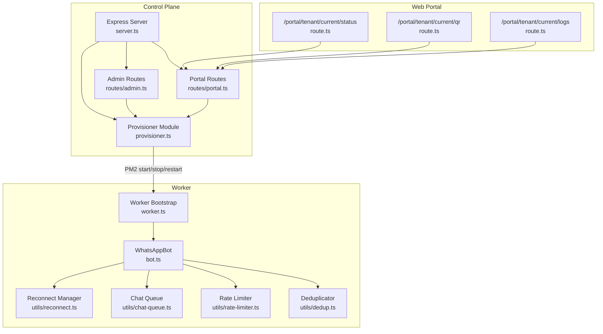
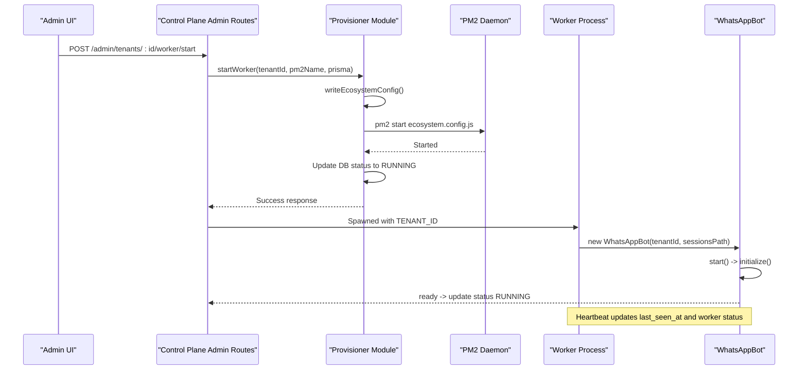
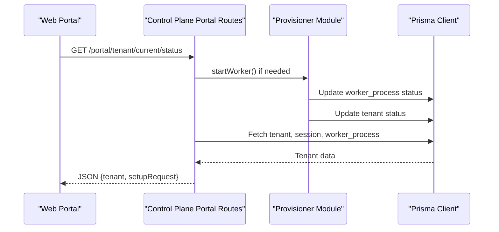
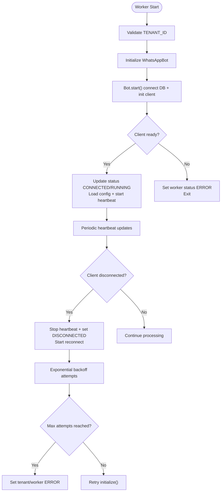
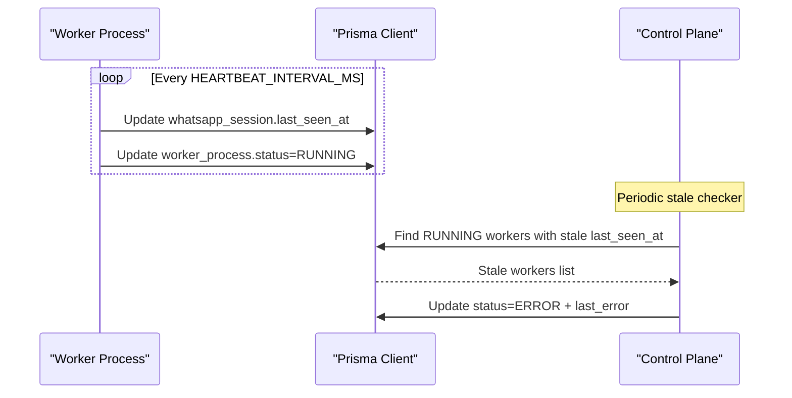
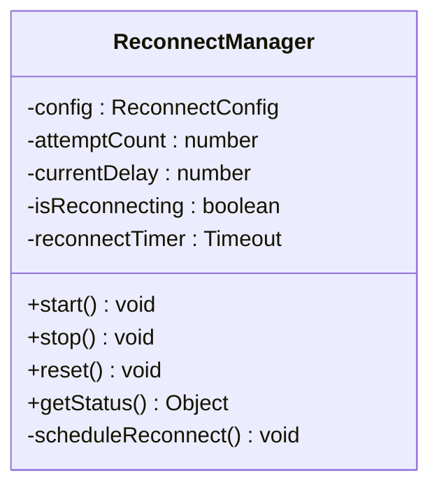
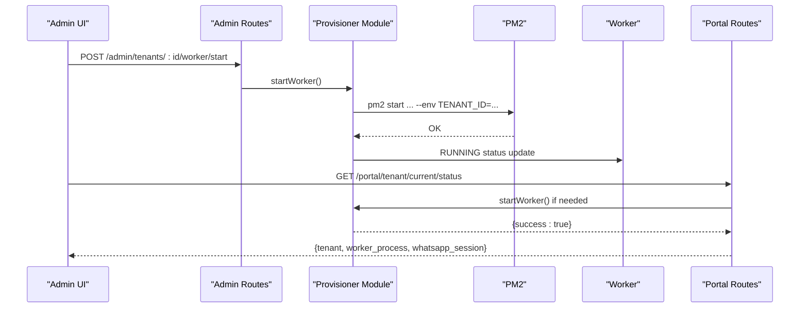
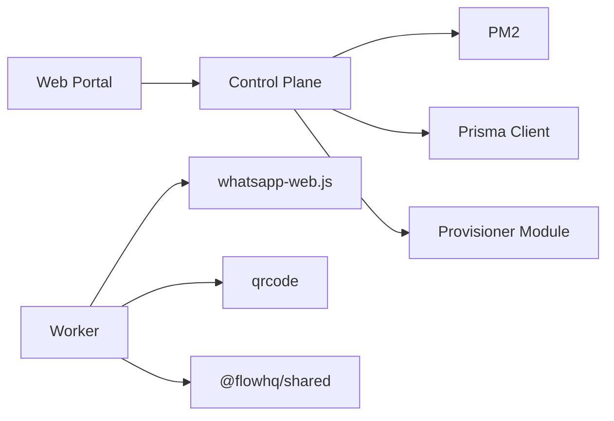

# Worker Orchestration

<cite>
**Referenced Files in This Document**
- [ecosystem.config.js](file://ecosystem.config.js)
- [apps/worker/package.json](file://apps/worker/package.json)
- [apps/control-plane/package.json](file://apps/control-plane/package.json)
- [apps/web/package.json](file://apps/web/package.json)
- [apps/worker/src/worker.ts](file://apps/worker/src/worker.ts)
- [apps/worker/src/bot.ts](file://apps/worker/src/bot.ts)
- [apps/control-plane/src/server.ts](file://apps/control-plane/src/server.ts)
- [apps/control-plane/src/routes/admin.ts](file://apps/control-plane/src/routes/admin.ts)
- [apps/control-plane/src/routes/portal.ts](file://apps/control-plane/src/routes/portal.ts)
- [apps/control-plane/src/provisioner.ts](file://apps/control-plane/src/provisioner.ts)
- [apps/web/src/app/api/portal/tenant/current/status/route.ts](file://apps/web/src/app/api/portal/tenant/current/status/route.ts)
- [apps/web/src/app/api/portal/tenant/current/qr/route.ts](file://apps/web/src/app/api/portal/tenant/current/qr/route.ts)
- [apps/web/src/app/api/portal/tenant/current/logs/route.ts](file://apps/web/src/app/api/portal/tenant/current/logs/route.ts)
- [apps/worker/src/utils/reconnect.ts](file://apps/worker/src/utils/reconnect.ts)
- [apps/worker/src/utils/chat-queue.ts](file://apps/worker/src/utils/chat-queue.ts)
- [apps/worker/src/utils/rate-limiter.ts](file://apps/worker/src/utils/rate-limiter.ts)
- [apps/worker/src/utils/dedup.ts](file://apps/worker/src/utils/dedup.ts)
</cite>

## Update Summary
**Changes Made**
- Added comprehensive documentation for the new centralized worker provisioning system
- Updated architecture diagrams to reflect the provisioner module integration
- Enhanced worker lifecycle management documentation with provisioner functions
- Added new sections covering provisioner module functionality and benefits
- Updated troubleshooting guide with provisioner-specific operational procedures

## Table of Contents
1. [Introduction](#introduction)
2. [Project Structure](#project-structure)
3. [Core Components](#core-components)
4. [Architecture Overview](#architecture-overview)
5. [Detailed Component Analysis](#detailed-component-analysis)
6. [Centralized Worker Provisioning System](#centralized-worker-provisioning-system)
7. [Dependency Analysis](#dependency-analysis)
8. [Performance Considerations](#performance-considerations)
9. [Troubleshooting Guide](#troubleshooting-guide)
10. [Conclusion](#conclusion)
11. [Appendices](#appendices)

## Introduction
This document explains how worker processes are orchestrated and managed across the system with the newly implemented centralized worker provisioning system. The system now features a dedicated provisioner module that handles tenant WhatsApp worker lifecycle management, PM2 process management, and automatic session handling. It covers PM2 integration for lifecycle management, worker creation and termination, status monitoring and health checks, automatic recovery, startup sequencing, tenant isolation, heartbeat monitoring, stale worker detection, and the relationship between control plane API endpoints and worker operations such as start/stop/restart and QR code retrieval. Practical examples and troubleshooting guidance are included for managing workers effectively.

## Project Structure
The system comprises three primary applications with a centralized provisioning system:
- Control Plane: Express server exposing administrative and portal APIs, orchestrating workers via PM2 through the provisioner module, and monitoring worker health.
- Worker: A per-tenant process built with whatsapp-web.js, handling messaging, rate limiting, deduplication, and reconnection.
- Web Portal: Next.js frontend APIs that proxy to the control plane for tenant status, QR retrieval, and logs.
- Provisioner Module: Centralized worker lifecycle management system handling PM2 process creation, configuration, and status updates.

```mermaid
graph TB
subgraph "Control Plane"
CP_Server["Express Server<br/>server.ts"]
CP_Admin["Admin Routes<br/>routes/admin.ts"]
CP_Portal["Portal Routes<br/>routes/portal.ts"]
CP_Provisioner["Provisioner Module<br/>provisioner.ts"]
end
subgraph "Worker"
W_Worker["Worker Bootstrap<br/>worker.ts"]
W_Bot["WhatsAppBot<br/>bot.ts"]
W_Reconnect["Reconnect Manager<br/>utils/reconnect.ts"]
W_Queue["Chat Queue<br/>utils/chat-queue.ts"]
W_Rate["Rate Limiter<br/>utils/rate-limiter.ts"]
W_Dedup["Deduplicator<br/>utils/dedup.ts"]
end
subgraph "Web Portal"
WP_API_Status["/portal/tenant/current/status<br/>route.ts"]
WP_API_QR["/portal/tenant/current/qr<br/>route.ts"]
WP_API_Logs["/portal/tenant/current/logs<br/>route.ts"]
end
CP_Server --> CP_Admin
CP_Server --> CP_Portal
CP_Server --> CP_Provisioner
CP_Admin --> CP_Provisioner
CP_Portal --> CP_Provisioner
CP_Provisioner --> |"PM2 start/stop/restart"| W_Worker
W_Worker --> W_Bot
W_Bot --> W_Reconnect
W_Bot --> W_Queue
W_Bot --> W_Rate
W_Bot --> W_Dedup
WP_API_Status --> CP_Portal
WP_API_QR --> CP_Portal
WP_API_Logs --> CP_Portal
```

**Diagram sources**
- [apps/control-plane/src/server.ts](file://apps/control-plane/src/server.ts#L1-L89)
- [apps/control-plane/src/routes/admin.ts](file://apps/control-plane/src/routes/admin.ts#L1-L528)
- [apps/control-plane/src/routes/portal.ts](file://apps/control-plane/src/routes/portal.ts#L1-L251)
- [apps/control-plane/src/provisioner.ts](file://apps/control-plane/src/provisioner.ts#L1-L127)
- [apps/worker/src/worker.ts](file://apps/worker/src/worker.ts#L1-L46)
- [apps/worker/src/bot.ts](file://apps/worker/src/bot.ts#L1-L411)
- [apps/worker/src/utils/reconnect.ts](file://apps/worker/src/utils/reconnect.ts#L1-L117)
- [apps/worker/src/utils/chat-queue.ts](file://apps/worker/src/utils/chat-queue.ts#L1-L140)
- [apps/worker/src/utils/rate-limiter.ts](file://apps/worker/src/utils/rate-limiter.ts#L1-L110)
- [apps/worker/src/utils/dedup.ts](file://apps/worker/src/utils/dedup.ts#L1-L93)
- [apps/web/src/app/api/portal/tenant/current/status/route.ts](file://apps/web/src/app/api/portal/tenant/current/status/route.ts#L1-L35)
- [apps/web/src/app/api/portal/tenant/current/qr/route.ts](file://apps/web/src/app/api/portal/tenant/current/qr/route.ts#L1-L35)
- [apps/web/src/app/api/portal/tenant/current/logs/route.ts](file://apps/web/src/app/api/portal/tenant/current/logs/route.ts#L1-L35)

**Section sources**
- [apps/control-plane/src/server.ts](file://apps/control-plane/src/server.ts#L1-L89)
- [apps/control-plane/src/routes/admin.ts](file://apps/control-plane/src/routes/admin.ts#L1-L528)
- [apps/control-plane/src/routes/portal.ts](file://apps/control-plane/src/routes/portal.ts#L1-L251)
- [apps/control-plane/src/provisioner.ts](file://apps/control-plane/src/provisioner.ts#L1-L127)
- [apps/worker/src/worker.ts](file://apps/worker/src/worker.ts#L1-L46)
- [apps/worker/src/bot.ts](file://apps/worker/src/bot.ts#L1-L411)
- [apps/web/src/app/api/portal/tenant/current/status/route.ts](file://apps/web/src/app/api/portal/tenant/current/status/route.ts#L1-L35)
- [apps/web/src/app/api/portal/tenant/current/qr/route.ts](file://apps/web/src/app/api/portal/tenant/current/qr/route.ts#L1-L35)
- [apps/web/src/app/api/portal/tenant/current/logs/route.ts](file://apps/web/src/app/api/portal/tenant/current/logs/route.ts#L1-L35)

## Core Components
- Control Plane Server: Validates environment, connects to the database, starts periodic stale worker checks, and exposes admin and portal endpoints through the centralized provisioning system.
- Admin Routes: Manage worker lifecycle (start/stop/restart/force-restart), QR retrieval, and logs using the provisioner module for centralized worker management.
- Portal Routes: Provide tenant-centric endpoints for status, QR, and logs, secured by an internal portal key and user identity, with auto-provisioning capabilities.
- Provisioner Module: Centralized worker lifecycle management system handling PM2 process creation, configuration, and status updates with idempotent operations.
- Worker Bootstrap: Loads environment, initializes logging, constructs WhatsAppBot, and registers graceful shutdown handlers.
- WhatsAppBot: Orchestrates WhatsApp client lifecycle, handles QR generation, readiness, message processing, rate limiting, deduplication, chat queueing, reconnect logic, and heartbeat updates.
- Hardening Utilities: ReconnectManager, ChatQueueManager, RateLimiter, MessageDeduplicator.

**Section sources**
- [apps/control-plane/src/server.ts](file://apps/control-plane/src/server.ts#L16-L83)
- [apps/control-plane/src/routes/admin.ts](file://apps/control-plane/src/routes/admin.ts#L174-L332)
- [apps/control-plane/src/routes/portal.ts](file://apps/control-plane/src/routes/portal.ts#L159-L216)
- [apps/control-plane/src/provisioner.ts](file://apps/control-plane/src/provisioner.ts#L1-L127)
- [apps/worker/src/worker.ts](file://apps/worker/src/worker.ts#L1-L46)
- [apps/worker/src/bot.ts](file://apps/worker/src/bot.ts#L1-L411)
- [apps/worker/src/utils/reconnect.ts](file://apps/worker/src/utils/reconnect.ts#L1-L117)
- [apps/worker/src/utils/chat-queue.ts](file://apps/worker/src/utils/chat-queue.ts#L1-L140)
- [apps/worker/src/utils/rate-limiter.ts](file://apps/worker/src/utils/rate-limiter.ts#L1-L110)
- [apps/worker/src/utils/dedup.ts](file://apps/worker/src/utils/dedup.ts#L1-L93)

## Architecture Overview
The control plane coordinates worker processes through a centralized provisioning system and exposes APIs consumed by the web portal. Workers are isolated per tenant and monitored via heartbeats and stale detection.

```mermaid
sequenceDiagram
participant Admin as "Admin UI"
participant CP_Admin as "Control Plane Admin Routes"
participant Provisioner as "Provisioner Module"
participant PM2 as "PM2 Daemon"
participant Worker as "Worker Process"
participant Bot as "WhatsAppBot"
Admin->>CP_Admin : POST /admin/tenants/ : id/worker/start
CP_Admin->>Provisioner : startWorker(tenantId, pm2Name, prisma)
Provisioner->>Provisioner : writeEcosystemConfig()
Provisioner->>PM2 : pm2 start ecosystem.config.js
PM2-->>Provisioner : Started
Provisioner->>Provisioner : Update DB status to RUNNING
Provisioner-->>CP_Admin : Success response
CP_Admin->>Worker : Spawned with TENANT_ID
Worker->>Bot : new WhatsAppBot(tenantId, sessionsPath)
Bot->>Bot : start() -> initialize()
Bot-->>CP_Admin : ready -> update status RUNNING
Note over Worker,Bot : Heartbeat updates last_seen_at and worker status
```

**Diagram sources**
- [apps/control-plane/src/routes/admin.ts](file://apps/control-plane/src/routes/admin.ts#L162-L184)
- [apps/control-plane/src/provisioner.ts](file://apps/control-plane/src/provisioner.ts#L53-L93)
- [apps/worker/src/worker.ts](file://apps/worker/src/worker.ts#L19-L24)
- [apps/worker/src/bot.ts](file://apps/worker/src/bot.ts#L369-L392)
- [apps/worker/src/bot.ts](file://apps/worker/src/bot.ts#L146-L151)

## Detailed Component Analysis

### Control Plane Orchestration and Monitoring
- Environment validation ensures required variables are present and warns about production Puppeteer configuration.
- Stale worker checker runs periodically to detect workers that have not sent heartbeats within a threshold and marks them ERROR.
- Admin routes now delegate worker lifecycle management to the provisioner module:
  - Start: Checks if a PM2 process is already running; otherwise uses provisioner to spawn a new worker with environment variables for tenant ID and sessions path.
  - Stop: Uses provisioner to stop the PM2 process and updates worker status to STOPPED.
  - Restart: Uses provisioner to restart the existing PM2 process and resets error state.
  - Force Restart: Uses provisioner to stop and re-spawn the worker with a clean environment.
  - QR Retrieval: Returns QR state and data URI for tenant.
- Portal routes:
  - Tenant status endpoint proxies to control plane and returns tenant, session, and worker info.
  - QR endpoint returns QR state and data URI.
  - Logs endpoint returns recent message logs.
  - Auto-provisioning: Automatically starts workers when setup requests are approved or submitted.

```mermaid
sequenceDiagram
participant Portal as "Web Portal"
participant CP_Portal as "Control Plane Portal Routes"
participant Provisioner as "Provisioner Module"
participant DB as "Prisma Client"
Portal->>CP_Portal : GET /portal/tenant/current/status
CP_Portal->>Provisioner : startWorker() if needed
Provisioner->>DB : Update worker_process status
Provisioner->>DB : Update tenant status
CP_Portal->>DB : Fetch tenant, session, worker_process
DB-->>CP_Portal : Tenant data
CP_Portal-->>Portal : JSON {tenant, setupRequest}
```

**Diagram sources**
- [apps/control-plane/src/routes/portal.ts](file://apps/control-plane/src/routes/portal.ts#L142-L157)
- [apps/control-plane/src/provisioner.ts](file://apps/control-plane/src/provisioner.ts#L53-L93)
- [apps/web/src/app/api/portal/tenant/current/status/route.ts](file://apps/web/src/app/api/portal/tenant/current/status/route.ts#L8-L29)

**Section sources**
- [apps/control-plane/src/server.ts](file://apps/control-plane/src/server.ts#L16-L83)
- [apps/control-plane/src/routes/admin.ts](file://apps/control-plane/src/routes/admin.ts#L174-L332)
- [apps/control-plane/src/routes/portal.ts](file://apps/control-plane/src/routes/portal.ts#L159-L216)
- [apps/control-plane/src/provisioner.ts](file://apps/control-plane/src/provisioner.ts#L1-L127)
- [apps/web/src/app/api/portal/tenant/current/status/route.ts](file://apps/web/src/app/api/portal/tenant/current/status/route.ts#L8-L29)
- [apps/web/src/app/api/portal/tenant/current/qr/route.ts](file://apps/web/src/app/api/portal/tenant/current/qr/route.ts#L8-L29)
- [apps/web/src/app/api/portal/tenant/current/logs/route.ts](file://apps/web/src/app/api/portal/tenant/current/logs/route.ts#L8-L29)

### Worker Startup Sequence and Lifecycle
- Worker bootstrap validates TENANT_ID, initializes logger, constructs WhatsAppBot, starts it, and registers SIGTERM/SIGINT handlers for graceful shutdown.
- WhatsAppBot.start() connects to the database, loads tenant config, and initializes the WhatsApp client.
- On ready, worker updates session state to CONNECTED, sets tenant and worker status to RUNNING, loads templates, and starts heartbeat.
- On disconnected, heartbeat stops, session state updates to DISCONNECTED, and reconnect manager initiates exponential backoff retries.
- On auth failure, tenant and worker statuses are set to ERROR.

```mermaid
flowchart TD
Start(["Worker Start"]) --> ValidateEnv["Validate TENANT_ID"]
ValidateEnv --> InitBot["Initialize WhatsAppBot"]
InitBot --> BotStart["Bot.start() connect DB + init client"]
BotStart --> Ready{"Client ready?"}
Ready --> |Yes| OnReady["Update status CONNECTED/RUNNING<br/>Load config + start heartbeat"]
Ready --> |No| FailStart["Set worker status ERROR<br/>Exit"]
OnReady --> Heartbeat["Periodic heartbeat updates"]
Heartbeat --> Disconnected{"Client disconnected?"}
Disconnected --> |Yes| OnDisconnect["Stop heartbeat + set DISCONNECTED<br/>Start reconnect"]
Disconnected --> |No| Running["Continue processing"]
OnDisconnect --> Reconnect["Exponential backoff attempts"]
Reconnect --> MaxAttempts{"Max attempts reached?"}
MaxAttempts --> |Yes| MarkError["Set tenant/worker ERROR"]
MaxAttempts --> |No| Retry["Retry initialize()"]
```

**Diagram sources**
- [apps/worker/src/worker.ts](file://apps/worker/src/worker.ts#L12-L24)
- [apps/worker/src/bot.ts](file://apps/worker/src/bot.ts#L369-L392)
- [apps/worker/src/bot.ts](file://apps/worker/src/bot.ts#L98-L151)
- [apps/worker/src/bot.ts](file://apps/worker/src/bot.ts#L185-L208)
- [apps/worker/src/utils/reconnect.ts](file://apps/worker/src/utils/reconnect.ts#L87-L115)

**Section sources**
- [apps/worker/src/worker.ts](file://apps/worker/src/worker.ts#L1-L46)
- [apps/worker/src/bot.ts](file://apps/worker/src/bot.ts#L369-L410)
- [apps/worker/src/utils/reconnect.ts](file://apps/worker/src/utils/reconnect.ts#L1-L117)

### Status Monitoring and Health Checks
- Heartbeat: Every interval, the worker updates the session's last_seen_at and worker status to RUNNING.
- Stale Detection: Control plane periodically queries RUNNING workers whose sessions have not been updated beyond a threshold and marks them ERROR.
- Session States: QR_READY, CONNECTED, DISCONNECTED are tracked in the database and surfaced via QR and status endpoints.

```mermaid
sequenceDiagram
participant Worker as "Worker Process"
participant DB as "Prisma Client"
participant CP as "Control Plane"
loop Every HEARTBEAT_INTERVAL_MS
Worker->>DB : Update whatsapp_session.last_seen_at
Worker->>DB : Update worker_process.status=RUNNING
end
Note over CP : Periodic stale checker
CP->>DB : Find RUNNING workers with stale last_seen_at
DB-->>CP : Stale workers list
CP->>DB : Update status=ERROR + last_error
```

**Diagram sources**
- [apps/worker/src/bot.ts](file://apps/worker/src/bot.ts#L333-L367)
- [apps/control-plane/src/routes/admin.ts](file://apps/control-plane/src/routes/admin.ts#L30-L80)

**Section sources**
- [apps/worker/src/bot.ts](file://apps/worker/src/bot.ts#L333-L367)
- [apps/control-plane/src/routes/admin.ts](file://apps/control-plane/src/routes/admin.ts#L30-L80)

### Automatic Recovery Mechanisms
- ReconnectManager implements exponential backoff with configurable max attempts and delays. On max attempts, it marks tenant and worker as ERROR and persists the reason.
- On successful ready, reconnect state is reset to avoid accumulating failures.

```mermaid
classDiagram
class ReconnectManager {
-config : ReconnectConfig
-attemptCount : number
-currentDelay : number
-isReconnecting : boolean
-reconnectTimer : Timeout
+start() void
+stop() void
+reset() void
+getStatus() Object
-scheduleReconnect() void
}
```

**Diagram sources**
- [apps/worker/src/utils/reconnect.ts](file://apps/worker/src/utils/reconnect.ts#L14-L116)

**Section sources**
- [apps/worker/src/utils/reconnect.ts](file://apps/worker/src/utils/reconnect.ts#L1-L117)
- [apps/worker/src/bot.ts](file://apps/worker/src/bot.ts#L37-L56)
- [apps/worker/src/bot.ts](file://apps/worker/src/bot.ts#L185-L208)

### Process Isolation Between Tenants
- Each worker process is spawned with a dedicated TENANT_ID environment variable and a tenant-specific sessions directory, ensuring process isolation and separate persistent sessions.
- Provisioner module creates tenant-specific ecosystem configurations with unique PM2 names and environment variables.

**Section sources**
- [apps/worker/src/worker.ts](file://apps/worker/src/worker.ts#L7-L10)
- [apps/control-plane/src/provisioner.ts](file://apps/control-plane/src/provisioner.ts#L15-L38)
- [apps/control-plane/src/routes/admin.ts](file://apps/control-plane/src/routes/admin.ts#L185-L200)

### Heartbeat Monitoring System
- Worker sends periodic heartbeats updating last_seen_at and status to RUNNING.
- Control plane maintains a stale worker checker that flags inactive workers and transitions them to ERROR.

**Section sources**
- [apps/worker/src/bot.ts](file://apps/worker/src/bot.ts#L333-L367)
- [apps/control-plane/src/server.ts](file://apps/control-plane/src/server.ts#L54-L63)
- [apps/control-plane/src/routes/admin.ts](file://apps/control-plane/src/routes/admin.ts#L30-L80)

### Stale Worker Detection
- The stale checker queries RUNNING workers whose last_seen_at precedes the stale threshold and updates their status to ERROR with a descriptive message.

**Section sources**
- [apps/control-plane/src/routes/admin.ts](file://apps/control-plane/src/routes/admin.ts#L30-L80)

### Relationship Between Control Plane API Endpoints and Worker Management
- Start/Stop/Restart/Force Restart: Admin routes now delegate to provisioner module which handles PM2 processes and updates worker and tenant statuses.
- QR Retrieval: Admin and portal routes return QR state and data URI for tenant onboarding.
- Status and Logs: Portal routes expose tenant status and message logs.
- Auto-Provisioning: Portal routes automatically start workers when setup requests are approved or submitted.

```mermaid
sequenceDiagram
participant Admin as "Admin UI"
participant CP_Admin as "Admin Routes"
participant Provisioner as "Provisioner Module"
participant PM2 as "PM2"
participant Worker as "Worker"
participant CP_Portal as "Portal Routes"
Admin->>CP_Admin : POST /admin/tenants/ : id/worker/start
CP_Admin->>Provisioner : startWorker()
Provisioner->>PM2 : pm2 start ... --env TENANT_ID=...
PM2-->>Provisioner : OK
Provisioner->>Worker : RUNNING status update
Admin->>CP_Portal : GET /portal/tenant/current/status
CP_Portal->>Provisioner : startWorker() if needed
Provisioner-->>CP_Portal : {success : true}
CP_Portal-->>Admin : {tenant, worker_process, whatsapp_session}
```

**Diagram sources**
- [apps/control-plane/src/routes/admin.ts](file://apps/control-plane/src/routes/admin.ts#L174-L230)
- [apps/control-plane/src/provisioner.ts](file://apps/control-plane/src/provisioner.ts#L53-L93)
- [apps/control-plane/src/routes/portal.ts](file://apps/control-plane/src/routes/portal.ts#L159-L186)

**Section sources**
- [apps/control-plane/src/routes/admin.ts](file://apps/control-plane/src/routes/admin.ts#L174-L332)
- [apps/control-plane/src/routes/portal.ts](file://apps/control-plane/src/routes/portal.ts#L159-L216)
- [apps/control-plane/src/provisioner.ts](file://apps/control-plane/src/provisioner.ts#L1-L127)

## Centralized Worker Provisioning System

### Provisioner Module Overview
The provisioner module serves as the central hub for all worker lifecycle management operations. It consolidates PM2 process management, configuration generation, and database status updates into a single, reusable system.

### Key Features
- **Idempotent Operations**: Worker start operations are safe to call multiple times without side effects.
- **Centralized Configuration**: Generates tenant-specific PM2 ecosystem configurations with proper environment variables.
- **Database Integration**: Seamlessly updates worker and tenant status in the database.
- **Error Handling**: Comprehensive error handling with detailed logging and status updates.
- **Process Isolation**: Creates unique PM2 names and tenant-specific session directories.

### Provisioner Functions

#### `isWorkerRunning(pm2Name: string)`: Process State Checking
Checks if a worker process is currently running in PM2 by querying the process description.

#### `startWorker(tenantId: string, pm2Name: string, prisma: PrismaClient)`: Worker Startup
Creates a tenant-specific ecosystem configuration, checks if the worker is already running, and starts it if necessary. Updates database status to RUNNING and tenant status to QR_PENDING.

#### `stopWorker(tenantId: string, pm2Name: string, prisma: PrismaClient)`: Worker Shutdown
Stops a running worker process and updates the database status to STOPPED.

#### `restartWorker(tenantId: string, pm2Name: string, prisma: PrismaClient)`: Worker Restart
Performs a graceful restart by stopping and then starting the worker with a small delay between operations.

### Configuration Generation
The provisioner generates dynamic PM2 ecosystem configurations with:
- Unique process names per tenant
- Tenant-specific environment variables
- Proper session path configuration
- Database connection settings
- API keys and service configurations

### Benefits of Centralization
- **Consistency**: All worker operations follow the same patterns and error handling.
- **Maintainability**: Single point of control for worker lifecycle management.
- **Reliability**: Idempotent operations prevent race conditions and inconsistent states.
- **Scalability**: Easy to extend with additional worker management features.

**Section sources**
- [apps/control-plane/src/provisioner.ts](file://apps/control-plane/src/provisioner.ts#L1-L127)

## Dependency Analysis
- Control plane depends on PM2 for process management, Prisma for persistence, and the provisioner module for centralized worker management.
- Worker depends on whatsapp-web.js, QR code generation, and shared utilities for hardening.
- Web portal depends on control plane for tenant data and QR retrieval.

```mermaid
graph LR
CP["Control Plane"] --> PM2["PM2"]
CP --> Prisma["Prisma Client"]
CP --> Provisioner["Provisioner Module"]
Worker["Worker"] --> WA["whatsapp-web.js"]
Worker --> QR["qrcode"]
Worker --> Shared["@flowhq/shared"]
Portal["Web Portal"] --> CP
```

**Diagram sources**
- [apps/control-plane/package.json](file://apps/control-plane/package.json#L9-L15)
- [apps/worker/package.json](file://apps/worker/package.json#L9-L14)
- [apps/web/package.json](file://apps/web/package.json#L10-L17)

**Section sources**
- [apps/control-plane/package.json](file://apps/control-plane/package.json#L1-L24)
- [apps/worker/package.json](file://apps/worker/package.json#L1-L22)
- [apps/web/package.json](file://apps/web/package.json#L1-L27)

## Performance Considerations
- Heartbeat Interval: Tune HEARTBEAT_INTERVAL_MS to balance responsiveness and overhead.
- Rate Limiting: Configure RATE_LIMIT_MAX_PER_MINUTE to control outgoing reply rate per tenant.
- Chat Queue Size: Adjust per-chat queue capacity to handle burst traffic without blocking.
- Sessions Path: Ensure SESSIONS_PATH points to fast storage to reduce initialization latency.
- Puppeteer Headless: Set PUPPETEER_EXECUTABLE_PATH in production for reliable browser startup.
- Memory Management: Use ecosystem.config.js to set max_memory_restart thresholds and enable autorestart.
- Provisioner Efficiency: Centralized provisioning reduces redundant operations and improves consistency.

**Section sources**
- [apps/worker/src/bot.ts](file://apps/worker/src/bot.ts#L333-L367)
- [apps/worker/src/utils/rate-limiter.ts](file://apps/worker/src/utils/rate-limiter.ts#L21-L26)
- [apps/worker/src/utils/chat-queue.ts](file://apps/worker/src/utils/chat-queue.ts#L26-L29)
- [apps/control-plane/src/server.ts](file://apps/control-plane/src/server.ts#L34-L38)
- [apps/control-plane/src/provisioner.ts](file://apps/control-plane/src/provisioner.ts#L15-L38)
- [ecosystem.config.js](file://ecosystem.config.js#L9-L16)

## Troubleshooting Guide
Common issues and resolutions:
- Worker fails to start:
  - Verify TENANT_ID is set and sessions path exists.
  - Check database connectivity and environment variables.
  - Review worker logs and control plane error updates.
  - Check provisioner logs for ecosystem configuration errors.
- Authentication failure:
  - Confirm QR was scanned and session persisted.
  - Check tenant status transitions to ERROR and inspect last_error.
- Frequent disconnections:
  - Inspect reconnect attempts and delays; consider increasing max attempts or delays.
  - Validate network stability and Puppeteer executable path.
- Stale workers:
  - Investigate heartbeat intervals and control plane stale threshold.
  - Manually restart or force-restart the worker via admin endpoints.
  - Check provisioner status and PM2 process health.
- Provisioner Issues:
  - Verify PM2 installation and permissions.
  - Check ecosystem configuration file generation.
  - Review provisioner error logs for specific failure reasons.
- Production Puppeteer:
  - Install Chrome/Chromium and set PUPPETEER_EXECUTABLE_PATH.

Operational commands (examples):
- Start worker for a tenant:
  - POST /admin/tenants/:id/worker/start
- Stop worker:
  - POST /admin/tenants/:id/worker/stop
- Restart worker:
  - POST /admin/tenants/:id/worker/restart
- Force restart worker:
  - POST /admin/tenants/:id/worker/force-restart
- Retrieve QR:
  - GET /admin/tenants/:id/qr
  - GET /portal/tenant/current/qr
- Check status:
  - GET /portal/tenant/current/status
- View logs:
  - GET /portal/tenant/current/logs
- Check provisioner status:
  - GET /admin/tenants/:id/logs (shows worker operation logs)

**Section sources**
- [apps/control-plane/src/routes/admin.ts](file://apps/control-plane/src/routes/admin.ts#L174-L332)
- [apps/control-plane/src/routes/portal.ts](file://apps/control-plane/src/routes/portal.ts#L159-L216)
- [apps/control-plane/src/server.ts](file://apps/control-plane/src/server.ts#L34-L38)
- [apps/worker/src/bot.ts](file://apps/worker/src/bot.ts#L210-L225)
- [apps/worker/src/utils/reconnect.ts](file://apps/worker/src/utils/reconnect.ts#L87-L115)
- [apps/control-plane/src/provisioner.ts](file://apps/control-plane/src/provisioner.ts#L1-L127)

## Conclusion
The system integrates PM2 for robust worker lifecycle management through a centralized provisioning system, isolates workers per tenant, and employs heartbeat and stale detection for reliability. The new provisioner module provides consistent, idempotent worker management operations that improve system reliability and maintainability. Control plane endpoints provide comprehensive operational controls and visibility, while worker-side hardening utilities ensure resilience against transient failures and traffic spikes.

## Appendices

### PM2 Configuration Reference
- Instances: Single control plane instance.
- Autorestart and memory thresholds: Automatic restart on memory pressure.
- Logging: Separate log files for control plane.

**Section sources**
- [ecosystem.config.js](file://ecosystem.config.js#L1-L19)

### Worker Scripts and Dependencies
- Worker package scripts: start, build, dev.
- Control plane dependencies: express, ejs, pm2, body-parser.
- Web package: next, react, auth integrations.

**Section sources**
- [apps/worker/package.json](file://apps/worker/package.json#L1-L22)
- [apps/control-plane/package.json](file://apps/control-plane/package.json#L1-L24)
- [apps/web/package.json](file://apps/web/package.json#L1-L27)

### Provisioner Module API Reference
- `isWorkerRunning(pm2Name: string)`: Returns boolean indicating if worker is running
- `startWorker(tenantId: string, pm2Name: string, prisma: PrismaClient)`: Starts worker and returns {success: boolean, error?: string}
- `stopWorker(tenantId: string, pm2Name: string, prisma: PrismaClient)`: Stops worker gracefully
- `restartWorker(tenantId: string, pm2Name: string, prisma: PrismaClient)`: Returns {success: boolean, error?: string}

**Section sources**
- [apps/control-plane/src/provisioner.ts](file://apps/control-plane/src/provisioner.ts#L40-L127)