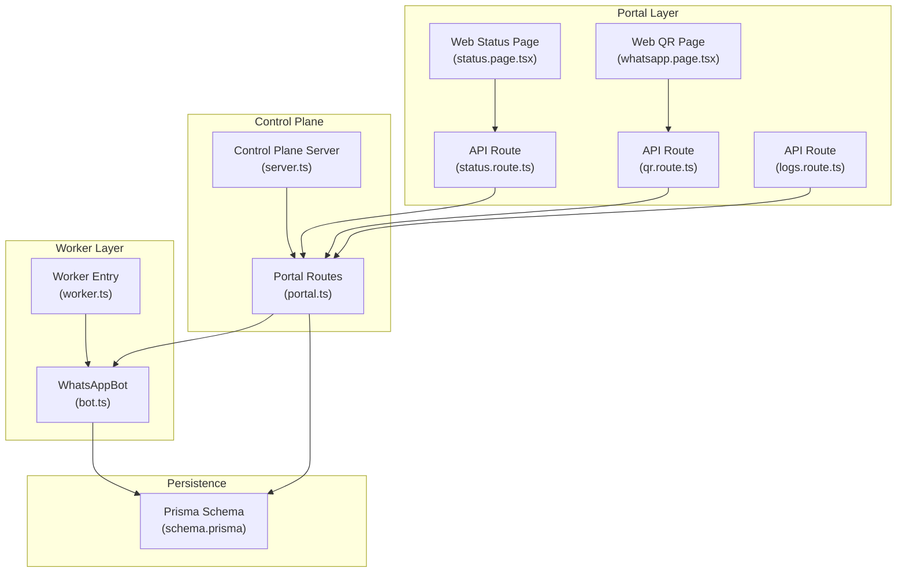
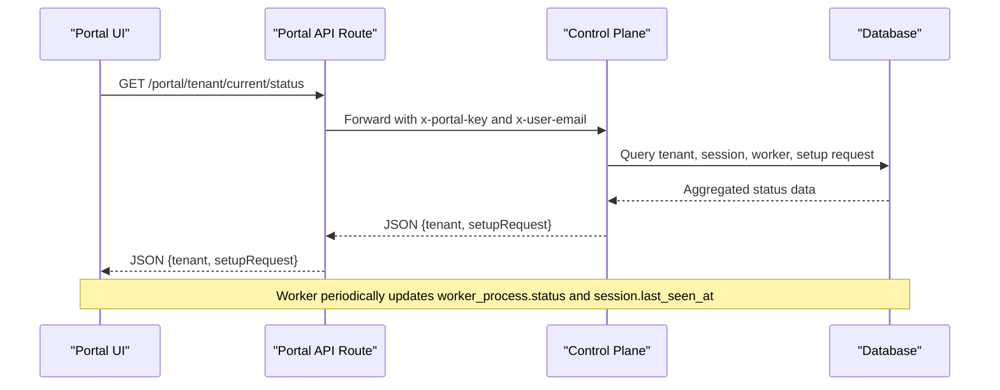
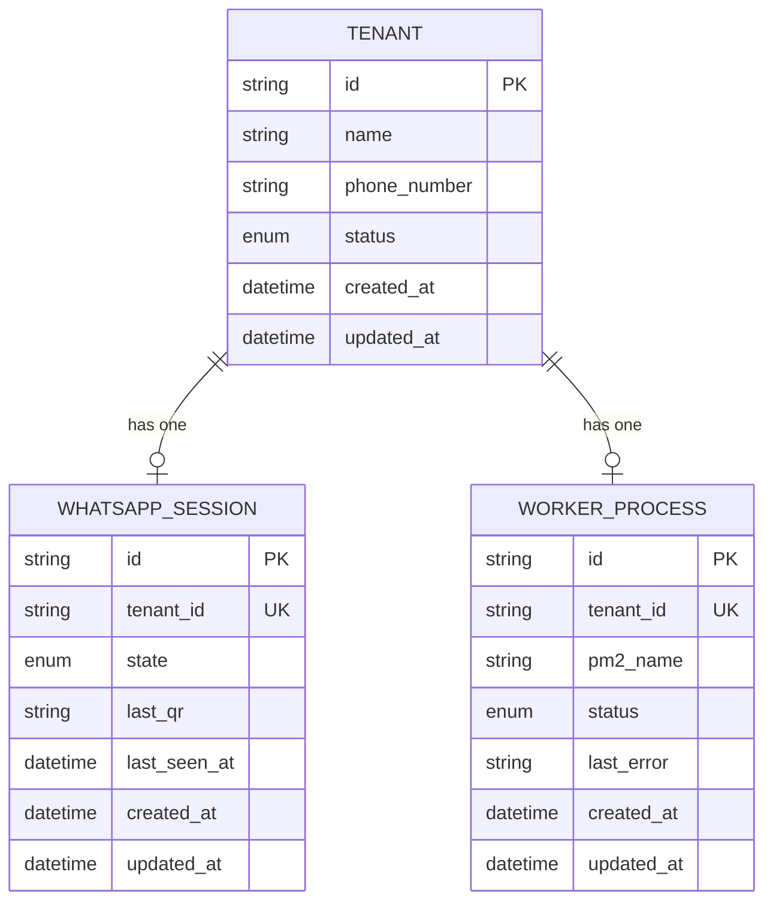
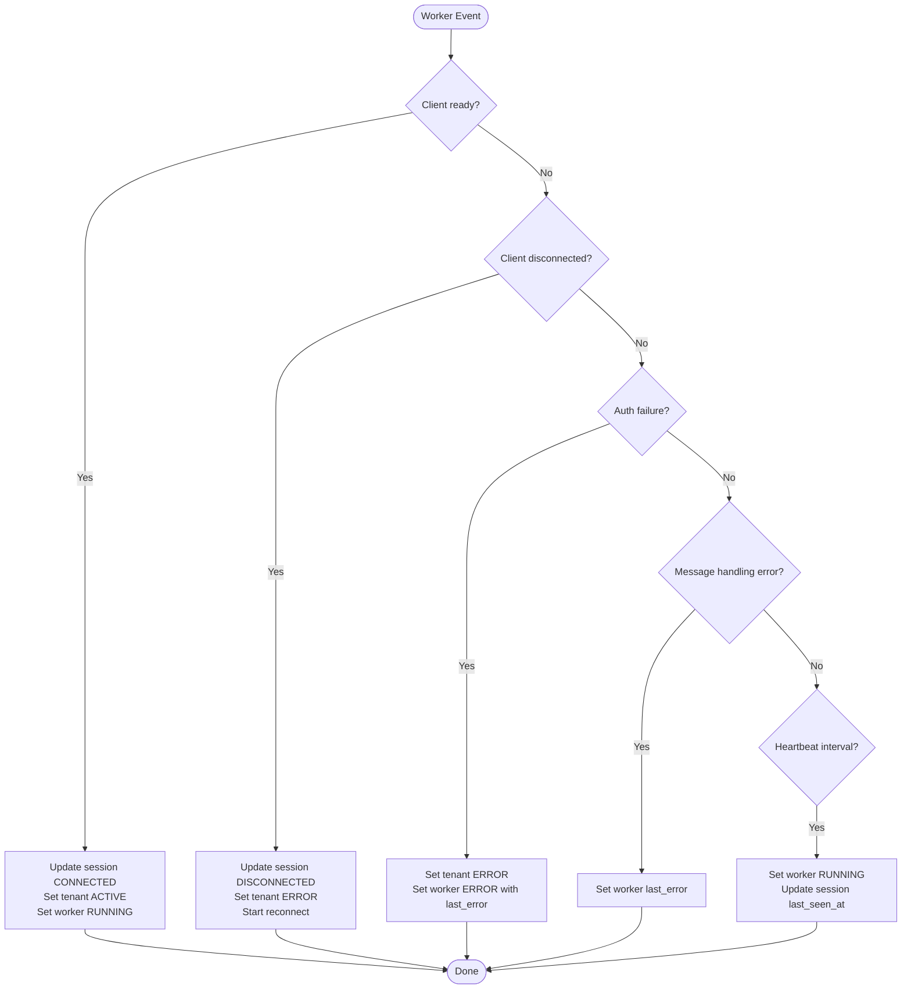
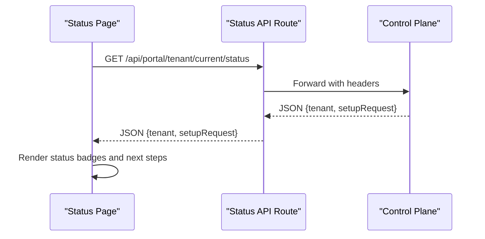
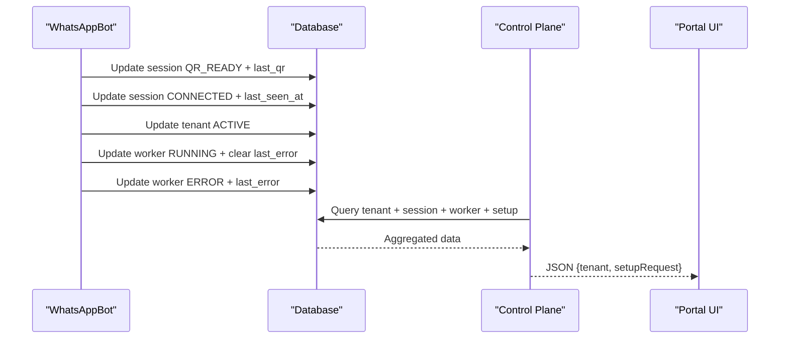
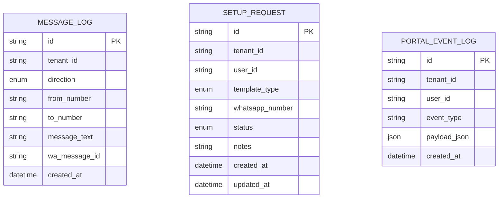
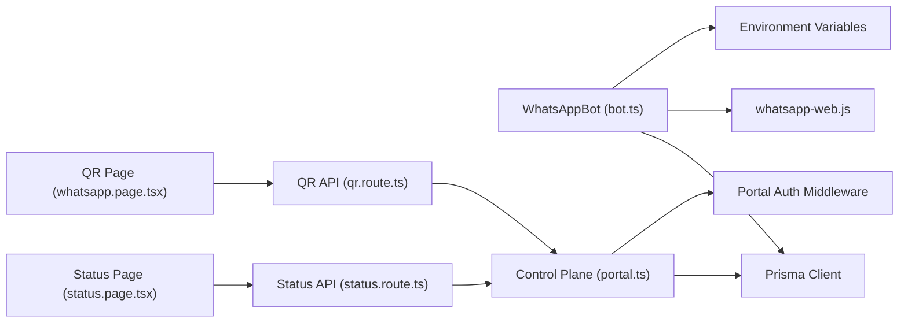

# Worker Status Management

<cite>
**Referenced Files in This Document**
- [schema.prisma](file://packages/shared/src/prisma/schema.prisma)
- [bot.ts](file://apps/worker/src/bot.ts)
- [worker.ts](file://apps/worker/src/worker.ts)
- [portal.ts](file://apps/control-plane/src/routes/portal.ts)
- [server.ts](file://apps/control-plane/src/server.ts)
- [status.route.ts](file://apps/web/src/app/api/portal/tenant/current/status/route.ts)
- [qr.route.ts](file://apps/web/src/app/api/portal/tenant/current/qr/route.ts)
- [logs.route.ts](file://apps/web/src/app/api/portal/tenant/current/logs/route.ts)
- [prisma.ts](file://apps/web/src/lib/prisma.ts)
- [status.page.tsx](file://apps/web/src/app/(portal)/app/status/page.tsx)
- [whatsapp.page.tsx](file://apps/web/src/app/(portal)/app/whatsapp/page.tsx)
</cite>

## Table of Contents
1. [Introduction](#introduction)
2. [Project Structure](#project-structure)
3. [Core Components](#core-components)
4. [Architecture Overview](#architecture-overview)
5. [Detailed Component Analysis](#detailed-component-analysis)
6. [Dependency Analysis](#dependency-analysis)
7. [Performance Considerations](#performance-considerations)
8. [Troubleshooting Guide](#troubleshooting-guide)
9. [Conclusion](#conclusion)
10. [Appendices](#appendices)

## Introduction
This document explains the worker status management and status tracking systems across the worker, control plane, and portal layers. It covers worker statuses (RUNNING, STOPPED, ERROR), status update mechanisms, persistence in the database, status polling, triggers for status changes, synchronization between components, and practical examples for status queries, routing, and status-dependent operations. It also addresses status validation, conflict resolution, and audit-ready status history via message logs.

## Project Structure
The system spans three major layers:
- Worker: Runs the WhatsApp client, updates worker and tenant statuses, and persists errors.
- Control Plane: Exposes APIs for status, QR code, and logs; orchestrates status checks and background maintenance.
- Portal: Frontend pages and API routes that poll and display status, QR state, and logs.

**Diagram sources**
- [status.page.tsx](file://apps/web/src/app/(portal)/app/status/page.tsx#L24-L44)
- [whatsapp.page.tsx](file://apps/web/src/app/(portal)/app/whatsapp/page.tsx#L11-L48)
- [status.route.ts](file://apps/web/src/app/api/portal/tenant/current/status/route.ts#L8-L29)
- [qr.route.ts](file://apps/web/src/app/api/portal/tenant/current/qr/route.ts#L8-L29)
- [logs.route.ts](file://apps/web/src/app/api/portal/tenant/current/logs/route.ts#L8-L29)
- [portal.ts](file://apps/control-plane/src/routes/portal.ts#L155-L186)
- [server.ts](file://apps/control-plane/src/server.ts#L65-L81)
- [worker.ts](file://apps/worker/src/worker.ts#L19-L24)
- [bot.ts](file://apps/worker/src/bot.ts#L12-L75)
- [schema.prisma](file://packages/shared/src/prisma/schema.prisma#L40-L44)

**Section sources**
- [status.page.tsx](file://apps/web/src/app/(portal)/app/status/page.tsx#L24-L44)
- [whatsapp.page.tsx](file://apps/web/src/app/(portal)/app/whatsapp/page.tsx#L11-L48)
- [status.route.ts](file://apps/web/src/app/api/portal/tenant/current/status/route.ts#L8-L29)
- [qr.route.ts](file://apps/web/src/app/api/portal/tenant/current/qr/route.ts#L8-L29)
- [logs.route.ts](file://apps/web/src/app/api/portal/tenant/current/logs/route.ts#L8-L29)
- [portal.ts](file://apps/control-plane/src/routes/portal.ts#L155-L186)
- [server.ts](file://apps/control-plane/src/server.ts#L65-L81)
- [worker.ts](file://apps/worker/src/worker.ts#L19-L24)
- [bot.ts](file://apps/worker/src/bot.ts#L12-L75)
- [schema.prisma](file://packages/shared/src/prisma/schema.prisma#L40-L44)

## Core Components
- Worker status model and enums:
  - WorkerStatus: RUNNING, STOPPED, ERROR
  - SessionState: DISCONNECTED, QR_READY, CONNECTED
  - TenantStatus: NEW, QR_PENDING, ACTIVE, PAUSED, ERROR
- Worker process lifecycle:
  - Starts, initializes WhatsApp client, and updates statuses upon events.
  - Heartbeat keeps worker RUNNING and updates last_seen_at.
- Control plane endpoints:
  - /portal/tenant/current/status returns tenant, session, and worker status.
  - /portal/tenant/current/qr returns QR state and data URI.
  - /portal/tenant/current/logs returns recent message logs.
- Portal UI:
  - Status page polls status every 10 seconds and renders status badges.
  - WhatsApp page polls QR every 3 seconds and auto-redirects on CONNECTED.

**Section sources**
- [schema.prisma](file://packages/shared/src/prisma/schema.prisma#L40-L44)
- [schema.prisma](file://packages/shared/src/prisma/schema.prisma#L29-L33)
- [schema.prisma](file://packages/shared/src/prisma/schema.prisma#L10-L16)
- [bot.ts](file://apps/worker/src/bot.ts#L333-L367)
- [portal.ts](file://apps/control-plane/src/routes/portal.ts#L155-L186)
- [portal.ts](file://apps/control-plane/src/routes/portal.ts#L188-L216)
- [portal.ts](file://apps/control-plane/src/routes/portal.ts#L218-L243)
- [status.page.tsx](file://apps/web/src/app/(portal)/app/status/page.tsx#L28-L44)
- [whatsapp.page.tsx](file://apps/web/src/app/(portal)/app/whatsapp/page.tsx#L17-L48)

## Architecture Overview
The worker maintains status and emits heartbeats. The control plane aggregates status from the database and exposes it to the portal. The portal polls endpoints to keep the UI synchronized.

**Diagram sources**
- [status.route.ts](file://apps/web/src/app/api/portal/tenant/current/status/route.ts#L8-L29)
- [portal.ts](file://apps/control-plane/src/routes/portal.ts#L155-L186)
- [schema.prisma](file://packages/shared/src/prisma/schema.prisma#L120-L131)
- [schema.prisma](file://packages/shared/src/prisma/schema.prisma#L92-L103)

## Detailed Component Analysis

### Worker Status Model and Persistence
- WorkerProcess model stores:
  - tenant_id (unique)
  - pm2_name
  - status (WorkerStatus: default STOPPED)
  - last_error
  - timestamps
- Updates occur on:
  - ready event: status RUNNING, last_error cleared
  - disconnected event: status ERROR, session DISCONNECTED
  - auth_failure: tenant and worker set to ERROR
  - message handling errors: last_error updated
  - heartbeat: status RUNNING and session last_seen_at refreshed
  - start/stop lifecycle: controlled by worker entry

**Diagram sources**
- [schema.prisma](file://packages/shared/src/prisma/schema.prisma#L60-L76)
- [schema.prisma](file://packages/shared/src/prisma/schema.prisma#L92-L103)
- [schema.prisma](file://packages/shared/src/prisma/schema.prisma#L120-L131)

**Section sources**
- [schema.prisma](file://packages/shared/src/prisma/schema.prisma#L40-L44)
- [schema.prisma](file://packages/shared/src/prisma/schema.prisma#L120-L131)
- [bot.ts](file://apps/worker/src/bot.ts#L105-L126)
- [bot.ts](file://apps/worker/src/bot.ts#L192-L207)
- [bot.ts](file://apps/worker/src/bot.ts#L213-L224)
- [bot.ts](file://apps/worker/src/bot.ts#L317-L330)
- [bot.ts](file://apps/worker/src/bot.ts#L346-L350)

### Status Update Mechanisms
- Ready event:
  - Session state set to CONNECTED
  - Tenant status set to ACTIVE
  - Worker status set to RUNNING
  - Setup request updated to ACTIVE if APPROVED
- Disconnected event:
  - Session state set to DISCONNECTED
  - Tenant status set to ERROR
  - Reconnect manager initiated
- Auth failure:
  - Tenant and Worker set to ERROR with last_error populated
- Message handling errors:
  - last_error stored in WorkerProcess
- Heartbeat:
  - Worker status set to RUNNING
  - Session last_seen_at updated

**Diagram sources**
- [bot.ts](file://apps/worker/src/bot.ts#L98-L151)
- [bot.ts](file://apps/worker/src/bot.ts#L185-L225)
- [bot.ts](file://apps/worker/src/bot.ts#L333-L367)

**Section sources**
- [bot.ts](file://apps/worker/src/bot.ts#L98-L151)
- [bot.ts](file://apps/worker/src/bot.ts#L185-L225)
- [bot.ts](file://apps/worker/src/bot.ts#L333-L367)

### Status Polling System
- Status page polls /api/portal/tenant/current/status every 10 seconds and renders status badges.
- WhatsApp page polls /api/portal/tenant/current/qr every 3 seconds and auto-redirects when state becomes CONNECTED.
- Control plane validates portal internal key and user identity before returning data.

**Diagram sources**
- [status.page.tsx](file://apps/web/src/app/(portal)/app/status/page.tsx#L28-L44)
- [status.route.ts](file://apps/web/src/app/api/portal/tenant/current/status/route.ts#L8-L29)
- [portal.ts](file://apps/control-plane/src/routes/portal.ts#L155-L186)

**Section sources**
- [status.page.tsx](file://apps/web/src/app/(portal)/app/status/page.tsx#L28-L44)
- [qr.route.ts](file://apps/web/src/app/api/portal/tenant/current/qr/route.ts#L8-L29)
- [portal.ts](file://apps/control-plane/src/routes/portal.ts#L155-L186)

### Status Change Triggers and Synchronization
- Triggers:
  - QR code generation sets session state to QR_READY and stores QR data URI.
  - Ready event transitions session to CONNECTED, tenant to ACTIVE, and worker to RUNNING.
  - Disconnected sets session to DISCONNECTED and tenant to ERROR.
  - Auth failure sets both tenant and worker to ERROR.
  - Heartbeat ensures worker remains RUNNING and updates last_seen_at.
- Synchronization:
  - Portal UI reflects real-time status via polling.
  - Control plane consolidates tenant, session, worker, and setup request data for display.

**Diagram sources**
- [bot.ts](file://apps/worker/src/bot.ts#L84-L126)
- [bot.ts](file://apps/worker/src/bot.ts#L192-L224)
- [portal.ts](file://apps/control-plane/src/routes/portal.ts#L155-L186)

**Section sources**
- [bot.ts](file://apps/worker/src/bot.ts#L77-L226)
- [portal.ts](file://apps/control-plane/src/routes/portal.ts#L155-L186)

### Status-Based Routing and Status-Dependent Operations
- Status-based routing:
  - Status page shows different sections depending on tenant status and session state.
  - WhatsApp page auto-redirects to status page when session reaches CONNECTED.
- Status-dependent operations:
  - On READY, worker loads configuration and starts heartbeat.
  - On DISCONNECTED, worker stops heartbeat and starts reconnect process.
  - On AUTH_FAILURE, worker marks ERROR and persists last_error.

**Section sources**
- [status.page.tsx](file://apps/web/src/app/(portal)/app/status/page.tsx#L66-L68)
- [status.page.tsx](file://apps/web/src/app/(portal)/app/status/page.tsx#L143-L156)
- [whatsapp.page.tsx](file://apps/web/src/app/(portal)/app/whatsapp/page.tsx#L24-L37)
- [bot.ts](file://apps/worker/src/bot.ts#L98-L151)
- [bot.ts](file://apps/worker/src/bot.ts#L185-L208)
- [bot.ts](file://apps/worker/src/bot.ts#L210-L225)

### Status Validation and Conflict Resolution
- Validation:
  - Control plane validates portal internal key and user identity before queries.
  - Worker validates environment variables and database connectivity during startup.
- Conflict resolution:
  - Heartbeat ensures worker RUNNING even if transient disconnections occur.
  - Reconnect manager attempts reconnection; after max attempts, worker and tenant marked ERROR.
  - Deduplication prevents duplicate processing and reduces error noise.

**Section sources**
- [portal.ts](file://apps/control-plane/src/routes/portal.ts#L12-L25)
- [server.ts](file://apps/control-plane/src/server.ts#L17-L39)
- [bot.ts](file://apps/worker/src/bot.ts#L37-L56)
- [bot.ts](file://apps/worker/src/bot.ts#L160-L164)

### Status History Tracking for Auditing
- Message logs capture inbound and outbound messages with timestamps, enabling audit trails.
- Setup requests track lifecycle stages for compliance and auditability.
- Portal event logs record significant actions for governance.

**Diagram sources**
- [schema.prisma](file://packages/shared/src/prisma/schema.prisma#L105-L118)
- [schema.prisma](file://packages/shared/src/prisma/schema.prisma#L150-L164)
- [schema.prisma](file://packages/shared/src/prisma/schema.prisma#L166-L177)

**Section sources**
- [bot.ts](file://apps/worker/src/bot.ts#L253-L305)
- [portal.ts](file://apps/control-plane/src/routes/portal.ts#L218-L243)
- [schema.prisma](file://packages/shared/src/prisma/schema.prisma#L105-L118)
- [schema.prisma](file://packages/shared/src/prisma/schema.prisma#L150-L164)
- [schema.prisma](file://packages/shared/src/prisma/schema.prisma#L166-L177)

## Dependency Analysis
- Worker depends on:
  - Prisma client for database updates
  - whatsapp-web.js for session lifecycle
  - Environment variables for configuration
- Control plane depends on:
  - Prisma client for tenant/session/worker queries
  - Authentication middleware for portal access
- Portal depends on:
  - Next.js API routes to proxy to control plane
  - React pages for polling and rendering

**Diagram sources**
- [bot.ts](file://apps/worker/src/bot.ts#L27-L75)
- [portal.ts](file://apps/control-plane/src/routes/portal.ts#L12-L25)
- [status.page.tsx](file://apps/web/src/app/(portal)/app/status/page.tsx#L28-L44)
- [whatsapp.page.tsx](file://apps/web/src/app/(portal)/app/whatsapp/page.tsx#L17-L48)
- [status.route.ts](file://apps/web/src/app/api/portal/tenant/current/status/route.ts#L8-L29)
- [qr.route.ts](file://apps/web/src/app/api/portal/tenant/current/qr/route.ts#L8-L29)

**Section sources**
- [bot.ts](file://apps/worker/src/bot.ts#L27-L75)
- [portal.ts](file://apps/control-plane/src/routes/portal.ts#L12-L25)
- [status.page.tsx](file://apps/web/src/app/(portal)/app/status/page.tsx#L28-L44)
- [whatsapp.page.tsx](file://apps/web/src/app/(portal)/app/whatsapp/page.tsx#L17-L48)
- [status.route.ts](file://apps/web/src/app/api/portal/tenant/current/status/route.ts#L8-L29)
- [qr.route.ts](file://apps/web/src/app/api/portal/tenant/current/qr/route.ts#L8-L29)

## Performance Considerations
- Heartbeat interval is configurable and ensures timely RUNNING status updates.
- Polling intervals in UI are tuned to balance freshness and load.
- Rate limiting and deduplication reduce unnecessary work and improve throughput.
- Reconnect manager prevents indefinite spin loops and caps retries.

[No sources needed since this section provides general guidance]

## Troubleshooting Guide
- Worker fails to start:
  - Check environment variables and database connectivity.
  - Verify Puppeteer executable path in production.
- Worker stuck in ERROR:
  - Inspect worker last_error for details.
  - Review reconnect attempts and session state.
- Status not updating:
  - Confirm heartbeat is running and database writes succeed.
  - Verify portal internal key and user headers are present.
- QR not appearing:
  - Ensure session state transitions to QR_READY and QR data URI is populated.

**Section sources**
- [server.ts](file://apps/control-plane/src/server.ts#L17-L39)
- [bot.ts](file://apps/worker/src/bot.ts#L37-L56)
- [bot.ts](file://apps/worker/src/bot.ts#L333-L367)
- [status.route.ts](file://apps/web/src/app/api/portal/tenant/current/status/route.ts#L8-L29)
- [qr.route.ts](file://apps/web/src/app/api/portal/tenant/current/qr/route.ts#L8-L29)

## Conclusion
The system provides robust worker status management with clear status semantics, reliable persistence, and responsive UI polling. Worker lifecycle events drive deterministic status transitions, while the control plane consolidates data for the portal. Heartbeat, reconnect, and validation mechanisms ensure resilience and observability. Audit readiness is achieved through message logs and setup request tracking.

[No sources needed since this section summarizes without analyzing specific files]

## Appendices

### Practical Examples

- Status queries
  - Portal status: GET /api/portal/tenant/current/status
  - QR state: GET /api/portal/tenant/current/qr
  - Message logs: GET /api/portal/tenant/current/logs?limit=50

- Status-based routing
  - If tenant status is ACTIVE, show “You're All Set!” CTA.
  - If session state is CONNECTED, redirect from QR page to status page.

- Status-dependent operations
  - On READY: load configuration, start heartbeat, mark setup request ACTIVE.
  - On DISCONNECTED: stop heartbeat, start reconnect, mark tenant ERROR.
  - On AUTH_FAILURE: mark tenant and worker ERROR with last_error.

**Section sources**
- [status.route.ts](file://apps/web/src/app/api/portal/tenant/current/status/route.ts#L8-L29)
- [qr.route.ts](file://apps/web/src/app/api/portal/tenant/current/qr/route.ts#L8-L29)
- [logs.route.ts](file://apps/web/src/app/api/portal/tenant/current/logs/route.ts#L8-L29)
- [status.page.tsx](file://apps/web/src/app/(portal)/app/status/page.tsx#L143-L156)
- [whatsapp.page.tsx](file://apps/web/src/app/(portal)/app/whatsapp/page.tsx#L24-L37)
- [bot.ts](file://apps/worker/src/bot.ts#L98-L151)
- [bot.ts](file://apps/worker/src/bot.ts#L185-L208)
- [bot.ts](file://apps/worker/src/bot.ts#L210-L225)