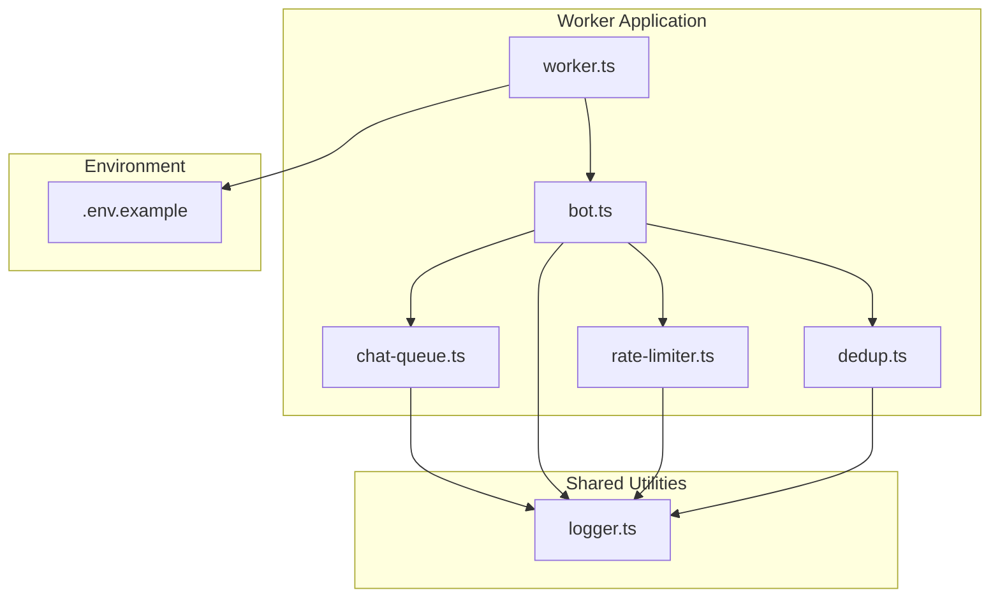
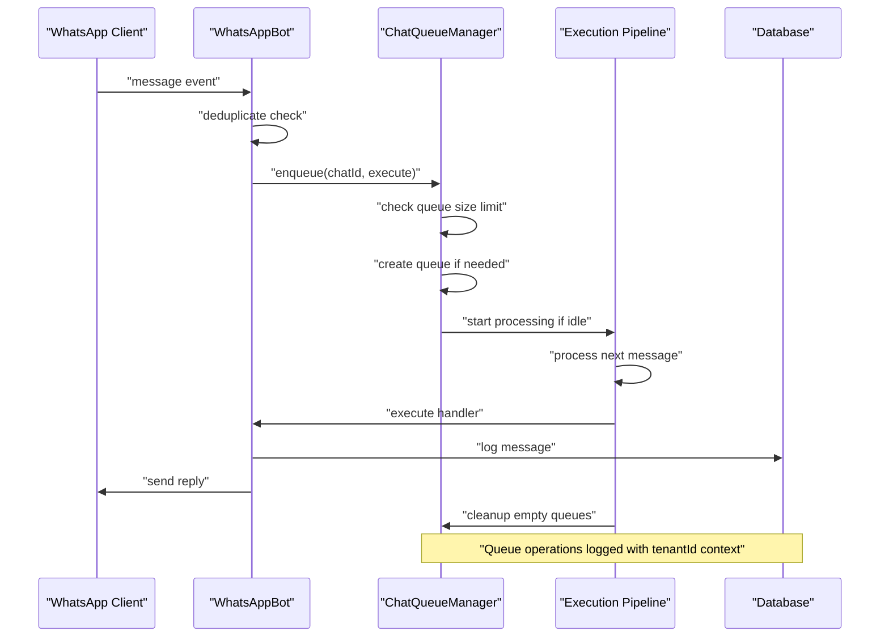
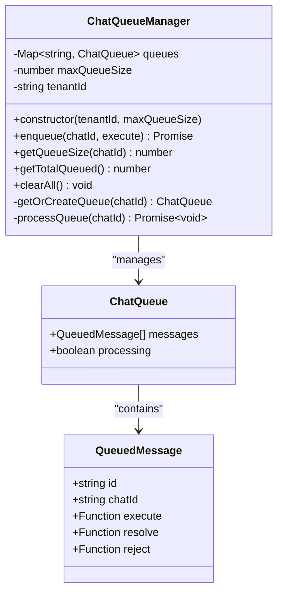
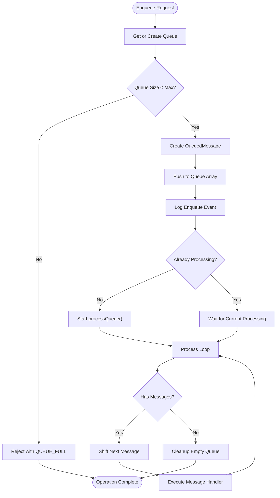
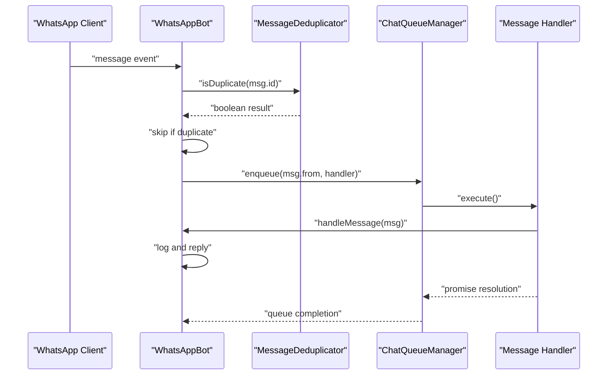
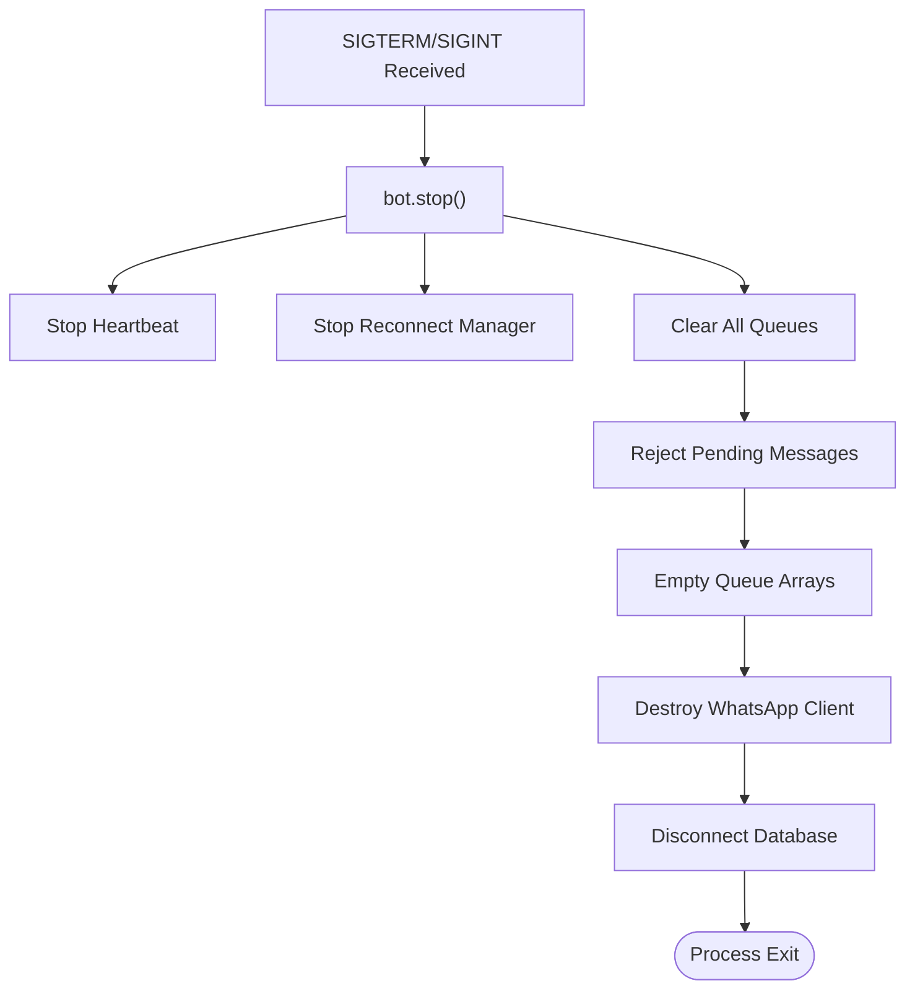
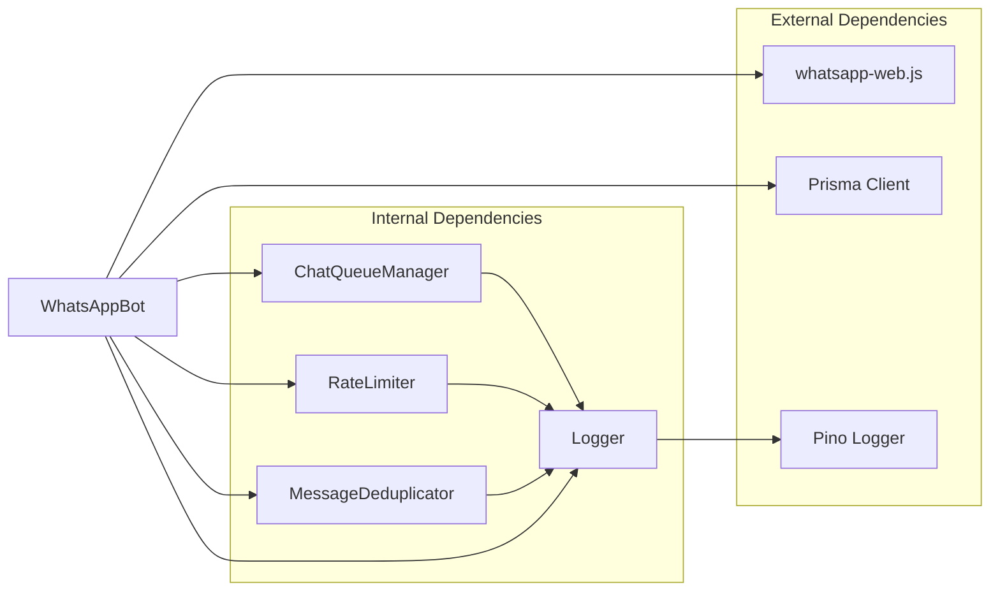

# Chat Queue Management

<cite>
**Referenced Files in This Document**
- [chat-queue.ts](file://apps/worker/src/utils/chat-queue.ts)
- [bot.ts](file://apps/worker/src/bot.ts)
- [worker.ts](file://apps/worker/src/worker.ts)
- [logger.ts](file://packages/shared/src/utils/logger.ts)
- [rate-limiter.ts](file://apps/worker/src/utils/rate-limiter.ts)
- [dedup.ts](file://apps/worker/src/utils/dedup.ts)
- [.env.example](file://.env.example)
</cite>

## Table of Contents
1. [Introduction](#introduction)
2. [Project Structure](#project-structure)
3. [Core Components](#core-components)
4. [Architecture Overview](#architecture-overview)
5. [Detailed Component Analysis](#detailed-component-analysis)
6. [Dependency Analysis](#dependency-analysis)
7. [Performance Considerations](#performance-considerations)
8. [Troubleshooting Guide](#troubleshooting-guide)
9. [Conclusion](#conclusion)

## Introduction
This document provides comprehensive documentation for the chat queue management system used in the WhatsApp worker. The system ensures sequential message processing per chat to prevent concurrency issues, implements queue size limits, and includes automatic cleanup mechanisms. It covers the promise-based execution model, error handling within queued operations, and the relationship between chatId isolation and message ordering. Configuration parameters, logging patterns, and performance considerations for high-volume scenarios are also addressed.

## Project Structure
The chat queue management system is implemented within the worker application and integrates with other hardening components such as rate limiting and message deduplication. The key files involved are:

- Chat queue manager implementation
- WhatsApp bot integration
- Worker process lifecycle
- Shared logging utilities
- Additional hardening components

**Diagram sources**
- [worker.ts](file://apps/worker/src/worker.ts#L1-L46)
- [bot.ts](file://apps/worker/src/bot.ts#L1-L411)
- [chat-queue.ts](file://apps/worker/src/utils/chat-queue.ts#L1-L140)
- [rate-limiter.ts](file://apps/worker/src/utils/rate-limiter.ts#L1-L109)
- [dedup.ts](file://apps/worker/src/utils/dedup.ts#L1-L92)
- [logger.ts](file://packages/shared/src/utils/logger.ts#L1-L33)
- [.env.example](file://.env.example#L1-L22)

**Section sources**
- [worker.ts](file://apps/worker/src/worker.ts#L1-L46)
- [bot.ts](file://apps/worker/src/bot.ts#L1-L411)
- [chat-queue.ts](file://apps/worker/src/utils/chat-queue.ts#L1-L140)
- [rate-limiter.ts](file://apps/worker/src/utils/rate-limiter.ts#L1-L109)
- [dedup.ts](file://apps/worker/src/utils/dedup.ts#L1-L92)
- [logger.ts](file://packages/shared/src/utils/logger.ts#L1-L33)
- [.env.example](file://.env.example#L1-L22)

## Core Components
The chat queue management system consists of the following core components:

- ChatQueueManager: Central orchestrator for per-chat FIFO processing
- WhatsAppBot: Integrates queue management with message handling pipeline
- RateLimiter: Controls outgoing message rate to prevent throttling
- MessageDeduplicator: Prevents processing duplicate messages
- Logger: Provides structured logging for queue operations

Key responsibilities:
- Sequential message processing per chatId
- Queue size enforcement with configurable limits
- Automatic cleanup of empty queues
- Promise-based execution model with error propagation
- Graceful shutdown with queue clearing

**Section sources**
- [chat-queue.ts](file://apps/worker/src/utils/chat-queue.ts#L21-L139)
- [bot.ts](file://apps/worker/src/bot.ts#L12-L26)
- [rate-limiter.ts](file://apps/worker/src/utils/rate-limiter.ts#L17-L26)
- [dedup.ts](file://apps/worker/src/utils/dedup.ts#L11-L22)
- [logger.ts](file://packages/shared/src/utils/logger.ts#L5-L30)

## Architecture Overview
The chat queue management system follows a layered architecture with clear separation of concerns:

**Diagram sources**
- [bot.ts](file://apps/worker/src/bot.ts#L153-L183)
- [chat-queue.ts](file://apps/worker/src/utils/chat-queue.ts#L35-L68)
- [chat-queue.ts](file://apps/worker/src/utils/chat-queue.ts#L113-L138)

The architecture ensures:
- ChatId isolation prevents cross-chat interference
- FIFO processing maintains message order within each chat
- Configurable queue limits prevent memory exhaustion
- Automatic cleanup prevents memory leaks
- Structured logging enables monitoring and debugging

## Detailed Component Analysis

### ChatQueueManager Implementation
The ChatQueueManager provides thread-safe, per-chat message queuing with the following key features:

#### Data Structures

**Diagram sources**
- [chat-queue.ts](file://apps/worker/src/utils/chat-queue.ts#L8-L29)

#### Queue Operations Flow

**Diagram sources**
- [chat-queue.ts](file://apps/worker/src/utils/chat-queue.ts#L35-L68)
- [chat-queue.ts](file://apps/worker/src/utils/chat-queue.ts#L113-L138)

#### Configuration Parameters
- `maxQueueSize`: Maximum number of pending messages per chat (default: 50)
- `tenantId`: Identifier for tenant context in logging
- Queue processing is automatically triggered when the first message arrives

#### Monitoring Methods
- `getQueueSize(chatId)`: Returns current queue length for specific chat
- `getTotalQueued()`: Returns total messages across all chats
- Both methods provide O(1) and O(n) time complexity respectively

**Section sources**
- [chat-queue.ts](file://apps/worker/src/utils/chat-queue.ts#L21-L139)

### WhatsAppBot Integration
The WhatsAppBot integrates the chat queue manager into the message handling pipeline:

#### Message Processing Pipeline

**Diagram sources**
- [bot.ts](file://apps/worker/src/bot.ts#L153-L183)
- [bot.ts](file://apps/worker/src/bot.ts#L166-L182)
- [chat-queue.ts](file://apps/worker/src/utils/chat-queue.ts#L35-L68)

#### Error Handling Strategy
- Queue overflow throws specific error with "QUEUE_FULL" message
- Duplicate detection prevents redundant processing
- Global error boundaries ensure worker stability
- Graceful degradation with wait messages during overload

**Section sources**
- [bot.ts](file://apps/worker/src/bot.ts#L153-L183)
- [bot.ts](file://apps/worker/src/bot.ts#L166-L182)
- [dedup.ts](file://apps/worker/src/utils/dedup.ts#L28-L31)

### Shutdown Procedures
The system provides comprehensive shutdown capabilities:

**Diagram sources**
- [worker.ts](file://apps/worker/src/worker.ts#L26-L36)
- [bot.ts](file://apps/worker/src/bot.ts#L394-L409)
- [chat-queue.ts](file://apps/worker/src/utils/chat-queue.ts#L92-L102)

Shutdown procedures ensure:
- All pending messages are rejected with clear error context
- Memory is properly released by clearing queues
- Resources are cleaned up in proper order
- Graceful termination without data loss

**Section sources**
- [worker.ts](file://apps/worker/src/worker.ts#L26-L36)
- [bot.ts](file://apps/worker/src/bot.ts#L394-L409)
- [chat-queue.ts](file://apps/worker/src/utils/chat-queue.ts#L92-L102)

## Dependency Analysis
The chat queue system has minimal external dependencies and integrates cleanly with the broader architecture:

**Diagram sources**
- [chat-queue.ts](file://apps/worker/src/utils/chat-queue.ts#L6)
- [bot.ts](file://apps/worker/src/bot.ts#L1-L11)
- [logger.ts](file://packages/shared/src/utils/logger.ts#L1-L3)

Key dependency characteristics:
- Internal dependencies are minimal and focused
- External dependencies are well-defined and versioned
- Logging is centralized through shared utilities
- Database operations are handled by dedicated client

**Section sources**
- [chat-queue.ts](file://apps/worker/src/utils/chat-queue.ts#L6)
- [bot.ts](file://apps/worker/src/bot.ts#L1-L11)
- [logger.ts](file://packages/shared/src/utils/logger.ts#L1-L3)

## Performance Considerations
The chat queue system is designed for high-volume scenarios with several performance optimizations:

### Memory Management
- Automatic cleanup of empty queues prevents memory leaks
- Configurable queue size limits prevent unbounded growth
- Weak references in deduplication cache prevent memory accumulation
- Periodic cleanup of deduplication entries

### Concurrency Control
- ChatId-based isolation ensures no cross-chat interference
- Single-threaded processing per chat maintains order
- Non-blocking queue operations allow continuous message ingestion
- Promise-based execution prevents blocking the event loop

### Scalability Factors
- O(1) queue operations for individual chats
- O(n) total queue monitoring across all chats
- Configurable limits allow capacity tuning per tenant
- Parallel processing across different chatIds

### Environment Configuration
- `RATE_LIMIT_MAX_PER_MINUTE`: Controls outgoing message rate (default: 10)
- `HEARTBEAT_INTERVAL_MS`: Worker health check interval (default: 30000ms)
- `MAX_QUEUE_SIZE`: Per-chat queue limit (configurable in constructor)

**Section sources**
- [chat-queue.ts](file://apps/worker/src/utils/chat-queue.ts#L26-L29)
- [bot.ts](file://apps/worker/src/bot.ts#L32-L35)
- [bot.ts](file://apps/worker/src/bot.ts#L333-L335)
- [.env.example](file://.env.example#L1-L22)

## Troubleshooting Guide

### Queue Overflow Conditions
**Symptoms:**
- Messages rejected with "QUEUE_FULL" error
- Warning logs indicating queue overflow
- Clients receiving "Please wait..." messages

**Resolution Steps:**
1. Monitor queue sizes using `getQueueSize()` and `getTotalQueued()`
2. Increase `maxQueueSize` for high-volume chats
3. Implement backpressure strategies
4. Check for stuck message handlers

**Section sources**
- [chat-queue.ts](file://apps/worker/src/utils/chat-queue.ts#L39-L42)
- [bot.ts](file://apps/worker/src/bot.ts#L172-L182)

### Memory Management Issues
**Symptoms:**
- Increasing memory usage over time
- Out-of-memory errors
- Persistent queue growth

**Resolution Steps:**
1. Verify automatic queue cleanup is functioning
2. Check for long-running message handlers
3. Monitor queue sizes with monitoring methods
4. Implement queue size limits appropriate for workload

**Section sources**
- [chat-queue.ts](file://apps/worker/src/utils/chat-queue.ts#L134-L138)

### Error Handling and Recovery
**Common Error Scenarios:**
- Individual message processing failures
- Queue overflow exceptions
- Database connectivity issues
- WhatsApp client disconnections

**Recovery Strategies:**
- Implement retry logic for transient failures
- Use graceful degradation during overload
- Monitor error rates and queue depths
- Configure appropriate logging levels

**Section sources**
- [chat-queue.ts](file://apps/worker/src/utils/chat-queue.ts#L123-L130)
- [bot.ts](file://apps/worker/src/bot.ts#L313-L331)

### Monitoring and Debugging
**Logging Patterns:**
- Enqueue events with queue size context
- Processing events with message identifiers
- Error events with tenant and chat context
- Cleanup events for empty queues

**Monitoring Metrics:**
- Queue depth per chat
- Total queued messages
- Processing throughput
- Error rates

**Section sources**
- [chat-queue.ts](file://apps/worker/src/utils/chat-queue.ts#L61)
- [chat-queue.ts](file://apps/worker/src/utils/chat-queue.ts#L124)
- [chat-queue.ts](file://apps/worker/src/utils/chat-queue.ts#L127)
- [logger.ts](file://packages/shared/src/utils/logger.ts#L26-L29)

## Conclusion
The chat queue management system provides a robust foundation for handling WhatsApp message processing at scale. Its design emphasizes:

- **Sequential Processing**: Ensures message order within chats
- **Isolation**: Prevents cross-chat interference through chatId-based separation
- **Reliability**: Handles errors gracefully and recovers from failures
- **Scalability**: Supports high-volume scenarios with configurable limits
- **Maintainability**: Clear separation of concerns and comprehensive logging

The system's promise-based execution model, combined with automatic cleanup mechanisms and comprehensive monitoring capabilities, makes it suitable for production deployment in multi-tenant environments. Proper configuration of queue limits and monitoring parameters will ensure optimal performance under various load conditions.