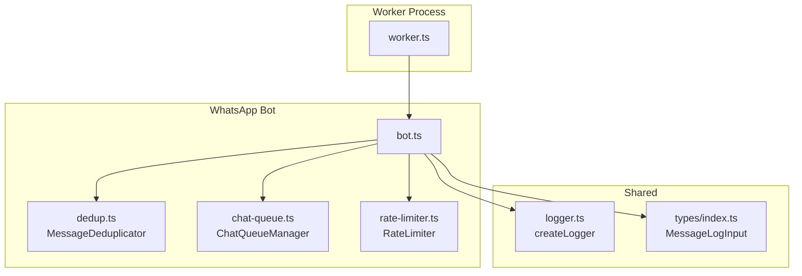
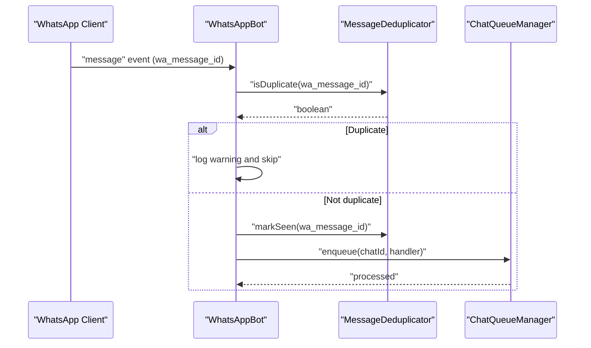
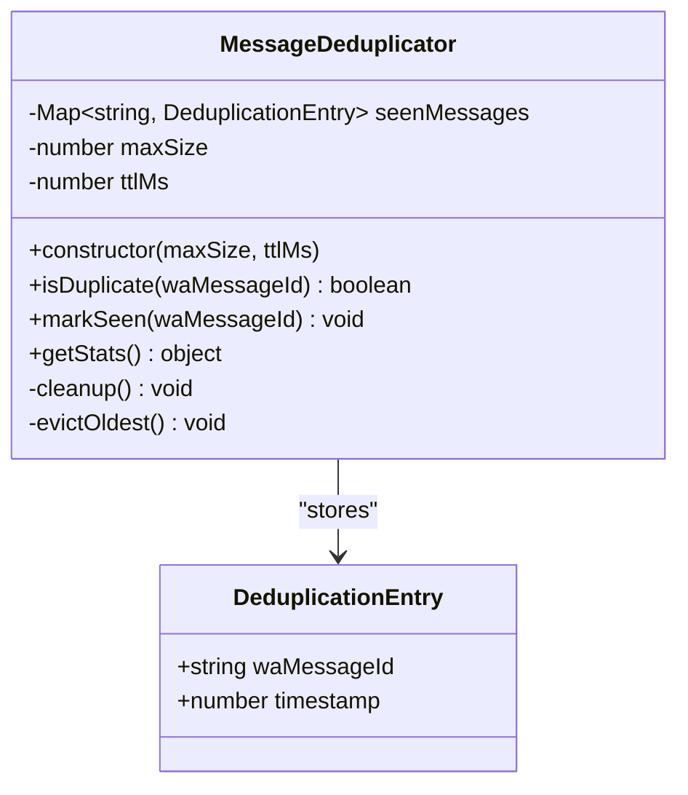
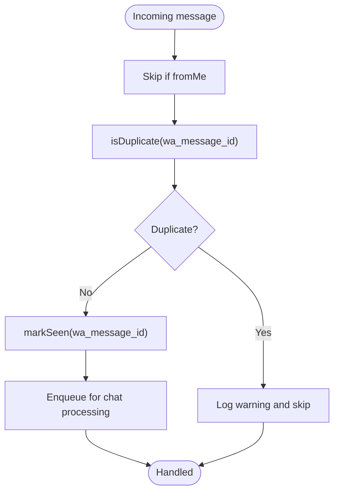
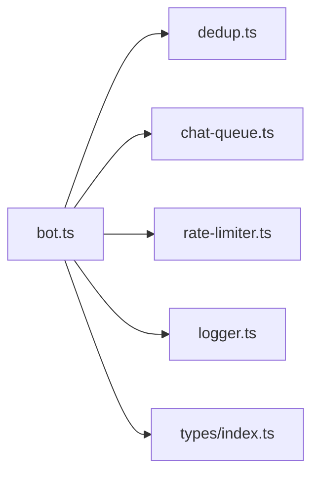

# Message Deduplication

<cite>
**Referenced Files in This Document**
- [dedup.ts](file://apps/worker/src/utils/dedup.ts)
- [bot.ts](file://apps/worker/src/bot.ts)
- [worker.ts](file://apps/worker/src/worker.ts)
- [chat-queue.ts](file://apps/worker/src/utils/chat-queue.ts)
- [rate-limiter.ts](file://apps/worker/src/utils/rate-limiter.ts)
- [.env.example](file://.env.example)
- [logger.ts](file://packages/shared/src/utils/logger.ts)
- [index.ts](file://packages/shared/src/types/index.ts)
</cite>

## Table of Contents
1. [Introduction](#introduction)
2. [Project Structure](#project-structure)
3. [Core Components](#core-components)
4. [Architecture Overview](#architecture-overview)
5. [Detailed Component Analysis](#detailed-component-analysis)
6. [Dependency Analysis](#dependency-analysis)
7. [Performance Considerations](#performance-considerations)
8. [Troubleshooting Guide](#troubleshooting-guide)
9. [Conclusion](#conclusion)
10. [Appendices](#appendices)

## Introduction
This document explains the message deduplication system used in the WhatsApp worker. It covers how duplicate detection works using message identifiers, timestamps, and internal cache management with TTL (time-to-live). It also documents cache eviction policies, memory optimization strategies, integration with the WhatsApp message processing pipeline, performance and scalability considerations, configuration options, monitoring approaches, and troubleshooting guidance.

## Project Structure
The deduplication logic is implemented as a dedicated utility and integrated into the WhatsApp bot lifecycle. The worker process initializes the bot, which sets up deduplication, rate limiting, chat queuing, and reconnection management.

**Diagram sources**
- [worker.ts](file://apps/worker/src/worker.ts#L1-L46)
- [bot.ts](file://apps/worker/src/bot.ts#L1-L411)
- [dedup.ts](file://apps/worker/src/utils/dedup.ts#L1-L93)
- [chat-queue.ts](file://apps/worker/src/utils/chat-queue.ts#L1-L140)
- [rate-limiter.ts](file://apps/worker/src/utils/rate-limiter.ts#L1-L110)
- [logger.ts](file://packages/shared/src/utils/logger.ts#L1-L33)
- [index.ts](file://packages/shared/src/types/index.ts#L1-L41)

**Section sources**
- [worker.ts](file://apps/worker/src/worker.ts#L1-L46)
- [bot.ts](file://apps/worker/src/bot.ts#L1-L411)

## Core Components
- MessageDeduplicator: Maintains a cache of seen message IDs with timestamps, supports TTL-based cleanup, and evicts the oldest entries when exceeding configured capacity.
- WhatsAppBot: Integrates deduplication into the message event flow, marks messages as seen after duplicate checks, and coordinates with chat queue and rate limiter.
- ChatQueueManager: Ensures sequential processing per chat to avoid concurrency issues.
- RateLimiter: Controls outbound reply rates to prevent throttling and manage user experience.

Key configuration defaults:
- Cache size limit: 1000 entries
- TTL: 300000 ms (5 minutes)
- Cleanup interval: 60000 ms (1 minute)

These defaults are set in the deduplication utility and consumed by the bot.

**Section sources**
- [dedup.ts](file://apps/worker/src/utils/dedup.ts#L11-L22)
- [bot.ts](file://apps/worker/src/bot.ts#L36-L36)

## Architecture Overview
The deduplication system sits in front of message processing to prevent repeated handling of the same incoming message. It leverages the WhatsApp message ID as the primary identifier and uses a timestamp to enforce TTL-based eviction.

**Diagram sources**
- [bot.ts](file://apps/worker/src/bot.ts#L153-L183)
- [dedup.ts](file://apps/worker/src/utils/dedup.ts#L28-L46)
- [chat-queue.ts](file://apps/worker/src/utils/chat-queue.ts#L35-L67)

## Detailed Component Analysis

### MessageDeduplicator
Implements a fixed-capacity cache keyed by message ID with timestamps. Provides:
- Duplicate detection via O(1) map lookup
- Timestamp-based TTL cleanup
- Oldest-entry eviction when capacity is exceeded
- Stats reporting for observability

**Diagram sources**
- [dedup.ts](file://apps/worker/src/utils/dedup.ts#L6-L89)

Operational behavior:
- On duplicate check, the cache is proactively cleaned to remove expired entries.
- On insert, if the cache exceeds capacity, the oldest entry by timestamp is evicted.
- A periodic background job runs every minute to remove expired entries.

Complexity:
- isDuplicate: O(1) average-case map lookup; cleanup scans all entries to compute expirations.
- markSeen: O(1) average-case map insert; occasional O(n) scan for eviction.
- Memory: Proportional to active unique messages within TTL window.

**Section sources**
- [dedup.ts](file://apps/worker/src/utils/dedup.ts#L11-L89)

### WhatsAppBot Integration
The bot integrates deduplication into the message event pipeline:
- Skips messages from self
- Checks for duplicates using the message ID
- Logs warnings on duplicates
- Marks messages as seen after duplicate checks
- Enqueues messages for sequential processing per chat

**Diagram sources**
- [bot.ts](file://apps/worker/src/bot.ts#L153-L183)
- [dedup.ts](file://apps/worker/src/utils/dedup.ts#L28-L46)

**Section sources**
- [bot.ts](file://apps/worker/src/bot.ts#L153-L183)

### Cache Management and Eviction Policies
- TTL enforcement: Entries older than TTL are removed during cleanup.
- Capacity enforcement: When size exceeds the maximum, the oldest entry is evicted.
- Cleanup cadence: A background interval periodically removes expired entries.

Memory optimization:
- Fixed-size cache prevents unbounded growth.
- Background cleanup keeps memory usage predictable.
- Empty queues are removed to avoid accumulation of idle structures.

**Section sources**
- [dedup.ts](file://apps/worker/src/utils/dedup.ts#L59-L88)
- [chat-queue.ts](file://apps/worker/src/utils/chat-queue.ts#L134-L138)

### Monitoring and Observability
- Logging: Duplicate detection emits a warning with the message ID.
- Stats: Deduplicator exposes cache size, max size, and TTL for monitoring.
- Heartbeat: The bot maintains periodic heartbeats to signal liveness and update status.

Recommendations:
- Expose dedup stats via health or metrics endpoints.
- Add structured logs for duplicate events with tenant context.
- Track queue depth alongside dedup stats to correlate backpressure.

**Section sources**
- [bot.ts](file://apps/worker/src/bot.ts#L160-L162)
- [dedup.ts](file://apps/worker/src/utils/dedup.ts#L51-L57)
- [bot.ts](file://apps/worker/src/bot.ts#L333-L359)
- [logger.ts](file://packages/shared/src/utils/logger.ts#L1-L33)

## Dependency Analysis
The bot composes multiple hardening utilities. Deduplication depends on the message ID and timestamp, while chat queue ensures sequential processing and rate limiter controls outbound reply frequency.

**Diagram sources**
- [bot.ts](file://apps/worker/src/bot.ts#L1-L411)
- [dedup.ts](file://apps/worker/src/utils/dedup.ts#L1-L93)
- [chat-queue.ts](file://apps/worker/src/utils/chat-queue.ts#L1-L140)
- [rate-limiter.ts](file://apps/worker/src/utils/rate-limiter.ts#L1-L110)
- [logger.ts](file://packages/shared/src/utils/logger.ts#L1-L33)
- [index.ts](file://packages/shared/src/types/index.ts#L1-L41)

**Section sources**
- [bot.ts](file://apps/worker/src/bot.ts#L20-L26)

## Performance Considerations
- Time complexity:
  - isDuplicate: O(1) average-case; cleanup is O(n) per check but amortized by periodic maintenance.
  - markSeen: O(1) average-case; occasional O(n) eviction scan.
- Memory footprint:
  - Proportional to unique messages within TTL window and cache size limit.
- Throughput:
  - Deduplication adds minimal overhead; the main cost is queue serialization and external API calls.
- Scalability:
  - Single-process design; for multi-tenant or high-volume scenarios, consider distributed caches (e.g., Redis) to share state across workers.

[No sources needed since this section provides general guidance]

## Troubleshooting Guide
Common issues and resolutions:
- Duplicate messages still being processed:
  - Verify the message ID is present and not empty.
  - Confirm dedup cache is initialized and not disabled.
  - Check logs for duplicate warnings and inspect stats.
- Messages not processed due to queue full:
  - Review chat queue size limit and adjust if needed.
  - Investigate long-running handlers blocking the queue.
- Cache grows unexpectedly:
  - Ensure TTL is sufficient for expected message latency.
  - Monitor cache stats and adjust max size if necessary.
- False negatives (missing duplicates):
  - The system relies on message IDs; ensure the underlying library provides stable IDs.
  - Validate that messages are not intentionally replayed outside the TTL window.
- Logging and visibility:
  - Use tenant-scoped logs to trace dedup behavior.
  - Add metrics for duplicate counts and cache hit ratios.

**Section sources**
- [bot.ts](file://apps/worker/src/bot.ts#L153-L183)
- [chat-queue.ts](file://apps/worker/src/utils/chat-queue.ts#L38-L42)
- [dedup.ts](file://apps/worker/src/utils/dedup.ts#L51-L57)
- [logger.ts](file://packages/shared/src/utils/logger.ts#L19-L24)

## Conclusion
The message deduplication system provides robust protection against duplicate processing using message IDs and TTL-based caching. It integrates cleanly into the WhatsApp message pipeline, with straightforward configuration and monitoring hooks. For high-volume or multi-tenant deployments, consider extending the cache to a shared store and adding metrics-driven alerting.

[No sources needed since this section summarizes without analyzing specific files]

## Appendices

### Configuration Options
- Cache size limit: Adjust via the deduplicator constructor argument.
- TTL (milliseconds): Configure via the deduplicator constructor argument.
- Cleanup interval: Controlled internally; runs every minute.

Environment variables:
- None directly for deduplication; general worker settings include stale thresholds and intervals.

**Section sources**
- [dedup.ts](file://apps/worker/src/utils/dedup.ts#L16-L22)
- [.env.example](file://.env.example#L20-L22)

### Integration Notes
- Message logging records both incoming and outgoing message IDs for auditability.
- The bot’s error boundary ensures deduplication failures do not crash the worker.

**Section sources**
- [bot.ts](file://apps/worker/src/bot.ts#L253-L305)
- [index.ts](file://packages/shared/src/types/index.ts#L33-L40)