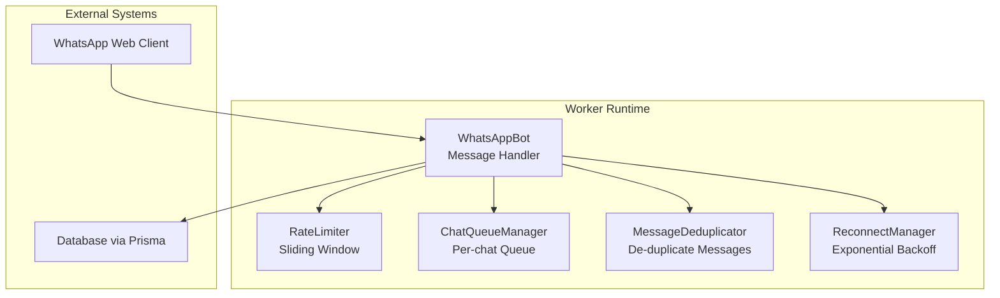
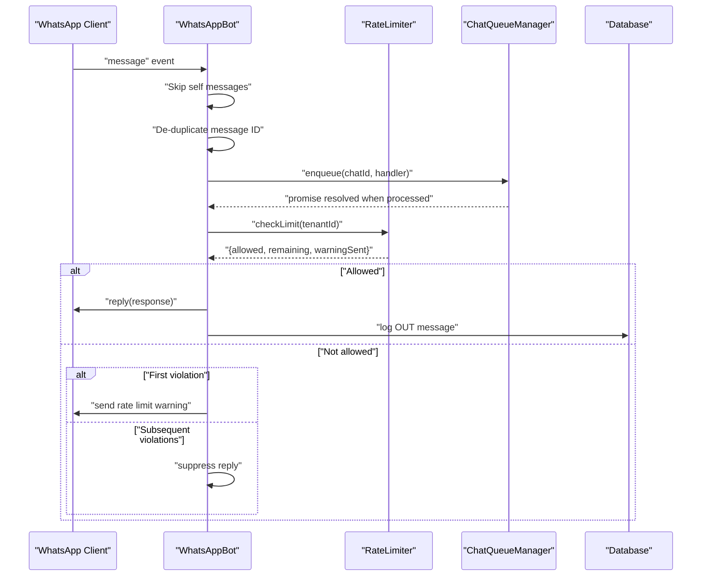
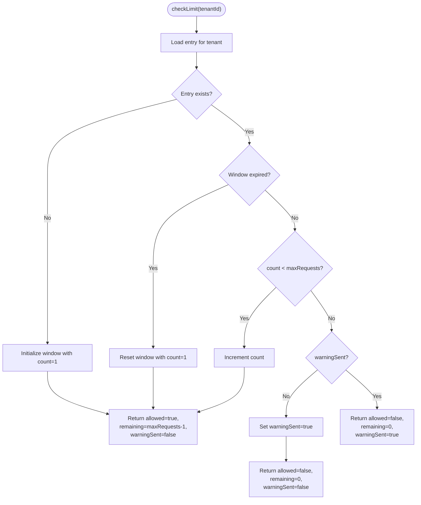
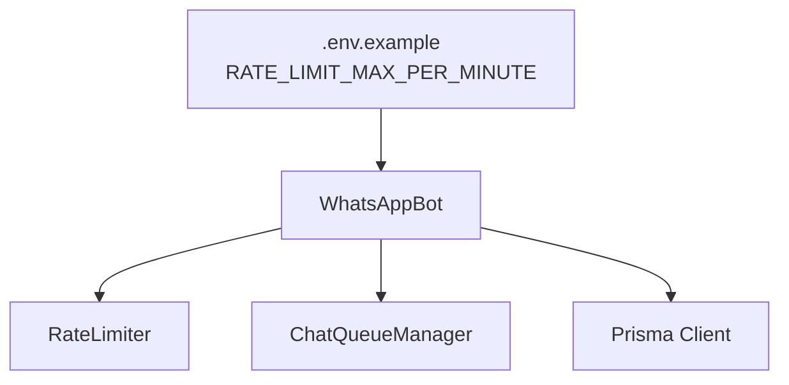

# Rate Limiting System

<cite>
**Referenced Files in This Document**
- [rate-limiter.ts](file://apps/worker/src/utils/rate-limiter.ts)
- [chat-queue.ts](file://apps/worker/src/utils/chat-queue.ts)
- [bot.ts](file://apps/worker/src/bot.ts)
- [worker.ts](file://apps/worker/src/worker.ts)
- [dedup.ts](file://apps/worker/src/utils/dedup.ts)
- [reconnect.ts](file://apps/worker/src/utils/reconnect.ts)
- [.env.example](file://.env.example)
</cite>

## Table of Contents
1. [Introduction](#introduction)
2. [Project Structure](#project-structure)
3. [Core Components](#core-components)
4. [Architecture Overview](#architecture-overview)
5. [Detailed Component Analysis](#detailed-component-analysis)
6. [Dependency Analysis](#dependency-analysis)
7. [Performance Considerations](#performance-considerations)
8. [Troubleshooting Guide](#troubleshooting-guide)
9. [Conclusion](#conclusion)
10. [Appendices](#appendices)

## Introduction
This document explains the rate limiting utility system used to control message processing rates per tenant. It focuses on the sliding window implementation, tenant-specific configurations, dynamic adjustments, and integration with the chat queue and worker lifecycle. It also covers performance implications, memory usage, monitoring, configuration examples, troubleshooting, and best practices for balancing throughput and stability.

## Project Structure
The rate limiting system resides in the worker application and integrates with the message processing pipeline:
- Rate limiter: Implements a sliding window per tenant.
- Chat queue: Ensures sequential processing per chat to avoid concurrency conflicts.
- Bot: Orchestrates message handling, applies rate limits, and coordinates auxiliary components.
- Environment: Provides runtime configuration for rate limits and other operational parameters.



**Diagram sources**
- [bot.ts](file://apps/worker/src/bot.ts#L12-L75)
- [rate-limiter.ts](file://apps/worker/src/utils/rate-limiter.ts#L17-L26)
- [chat-queue.ts](file://apps/worker/src/utils/chat-queue.ts#L21-L29)
- [dedup.ts](file://apps/worker/src/utils/dedup.ts#L11-L22)
- [reconnect.ts](file://apps/worker/src/utils/reconnect.ts#L14-L39)

**Section sources**
- [bot.ts](file://apps/worker/src/bot.ts#L12-L75)
- [rate-limiter.ts](file://apps/worker/src/utils/rate-limiter.ts#L17-L26)
- [chat-queue.ts](file://apps/worker/src/utils/chat-queue.ts#L21-L29)
- [dedup.ts](file://apps/worker/src/utils/dedup.ts#L11-L22)
- [reconnect.ts](file://apps/worker/src/utils/reconnect.ts#L14-L39)

## Core Components
- RateLimiter: Maintains per-tenant counters and windows, exposes check and status APIs, and supports dynamic configuration updates.
- ChatQueueManager: Serializes processing per chat to reduce contention and stabilize throughput.
- WhatsAppBot: Initializes rate limiter and chat queue, checks rate limits before replying, and coordinates logging and persistence.
- Environment: Supplies rate limit configuration via environment variables.

Key responsibilities:
- Enforce tenant-specific rate limits using a sliding window.
- Provide status and dynamic reconfiguration capabilities.
- Integrate with chat queue to avoid concurrent processing bottlenecks.
- Persist operational metrics and handle graceful shutdown.

**Section sources**
- [rate-limiter.ts](file://apps/worker/src/utils/rate-limiter.ts#L17-L106)
- [chat-queue.ts](file://apps/worker/src/utils/chat-queue.ts#L21-L139)
- [bot.ts](file://apps/worker/src/bot.ts#L27-L75)
- [.env.example](file://.env.example#L1-L22)

## Architecture Overview
The rate limiting system sits between incoming message events and outbound replies. It ensures that each tenant’s reply rate does not exceed configured limits within a rolling window. When limits are exceeded, the system either warns the user once or suppresses further replies until the window resets.



**Diagram sources**
- [bot.ts](file://apps/worker/src/bot.ts#L153-L183)
- [bot.ts](file://apps/worker/src/bot.ts#L248-L331)
- [rate-limiter.ts](file://apps/worker/src/utils/rate-limiter.ts#L32-L73)
- [chat-queue.ts](file://apps/worker/src/utils/chat-queue.ts#L35-L68)

## Detailed Component Analysis

### RateLimiter: Sliding Window Implementation
The rate limiter implements a sliding window per tenant:
- Configuration: maxRequests and windowMs define the limit and window duration.
- State per tenant: count, windowStart, and warningSent track usage and whether a warning was issued.
- Behavior:
  - On first request or after window expiration, reset the window and allow the request.
  - While within the window, increment the counter if under limit; otherwise deny and optionally send a warning once.
  - Provide status with current count, limit, and time until reset.

```mermaid
classDiagram
class RateLimiter {
-limits : Map~string, RateLimitEntry~
-config : RateLimitConfig
+constructor(config?)
+checkLimit(tenantId) : {allowed, remaining, warningSent}
+getStatus(tenantId) : {count, limit, windowMs, resetIn}
+updateConfig(config) : void
}
class RateLimitEntry {
+count : number
+windowStart : number
+warningSent : boolean
}
class RateLimitConfig {
+maxRequests : number
+windowMs : number
}
RateLimiter --> RateLimitEntry : "per tenant"
RateLimiter --> RateLimitConfig : "uses"
```

**Diagram sources**
- [rate-limiter.ts](file://apps/worker/src/utils/rate-limiter.ts#L6-L15)
- [rate-limiter.ts](file://apps/worker/src/utils/rate-limiter.ts#L17-L26)

Algorithm flow for checkLimit:



**Diagram sources**
- [rate-limiter.ts](file://apps/worker/src/utils/rate-limiter.ts#L32-L73)

Operational notes:
- Tenant-specific: The limiter tracks separate entries per tenantId.
- Warning suppression: After the first violation, subsequent violations suppress replies to avoid spamming the user.
- Dynamic updates: updateConfig allows changing limits at runtime.

**Section sources**
- [rate-limiter.ts](file://apps/worker/src/utils/rate-limiter.ts#L17-L106)

### ChatQueueManager: Sequential Processing
The chat queue ensures that messages from the same chat are processed sequentially, preventing race conditions and stabilizing throughput:
- Per-chat queues: Each chatId has its own queue.
- Size limit: Enforces a maximum queue length to prevent unbounded memory growth.
- Processing loop: Dequeues and executes tasks one by one, continuing on errors.
- Cleanup: Removes empty queues to prevent memory leaks.

Integration with rate limiting:
- The rate limiter is checked inside the queued handler, ensuring that rate decisions apply to each processed message independently.

**Section sources**
- [chat-queue.ts](file://apps/worker/src/utils/chat-queue.ts#L21-L139)
- [bot.ts](file://apps/worker/src/bot.ts#L166-L183)

### WhatsAppBot: Initialization and Integration
Initialization:
- Loads RATE_LIMIT_MAX_PER_MINUTE from environment to configure the rate limiter window.
- Creates ChatQueueManager with a fixed max queue size.
- Sets up de-duplication and reconnect managers.

Message handling:
- Skips self-originated messages.
- Checks for duplicates using MessageDeduplicator.
- Enqueues message processing per chat.
- Applies rate limit before replying; sends a warning once on first violation, then suppresses replies until the window resets.

Graceful shutdown:
- Stops heartbeat, halts reconnect attempts, and clears queues.

**Section sources**
- [bot.ts](file://apps/worker/src/bot.ts#L27-L75)
- [bot.ts](file://apps/worker/src/bot.ts#L153-L183)
- [bot.ts](file://apps/worker/src/bot.ts#L248-L331)
- [worker.ts](file://apps/worker/src/worker.ts#L7-L15)

### Supporting Utilities
- MessageDeduplicator: Prevents processing duplicate messages using a bounded in-memory cache with TTL and eviction.
- ReconnectManager: Manages exponential backoff for reconnection attempts to maintain resilience.

**Section sources**
- [dedup.ts](file://apps/worker/src/utils/dedup.ts#L11-L89)
- [reconnect.ts](file://apps/worker/src/utils/reconnect.ts#L14-L116)

## Dependency Analysis
The rate limiting system depends on:
- Environment configuration for rate limits.
- Chat queue for serialized processing.
- Database for logging and status updates.
- External messaging platform for inbound/outbound messages.



**Diagram sources**
- [.env.example](file://.env.example#L1-L22)
- [bot.ts](file://apps/worker/src/bot.ts#L33-L34)
- [rate-limiter.ts](file://apps/worker/src/utils/rate-limiter.ts#L17-L26)
- [chat-queue.ts](file://apps/worker/src/utils/chat-queue.ts#L21-L29)

**Section sources**
- [.env.example](file://.env.example#L1-L22)
- [bot.ts](file://apps/worker/src/bot.ts#L33-L34)
- [rate-limiter.ts](file://apps/worker/src/utils/rate-limiter.ts#L17-L26)
- [chat-queue.ts](file://apps/worker/src/utils/chat-queue.ts#L21-L29)

## Performance Considerations
- Memory footprint:
  - Rate limiter: One entry per tenant; each entry stores a small integer count, a timestamp, and a boolean flag. Memory usage scales linearly with active tenants.
  - Chat queue: One queue per chat; bounded by maxQueueSize. Memory usage scales with concurrent chats and queue depth.
  - De-duplication: Fixed-size cache with TTL; bounded memory growth.
- Throughput:
  - Sliding window ensures smooth bursts up to maxRequests per windowMs.
  - Sequential processing per chat avoids contention but may increase latency under heavy load; tune maxQueueSize accordingly.
- CPU:
  - Rate limit checks are O(1) per message.
  - Minimal overhead from queue management and de-duplication.

[No sources needed since this section provides general guidance]

## Troubleshooting Guide
Common issues and resolutions:
- Rate limit exceeded frequently:
  - Increase RATE_LIMIT_MAX_PER_MINUTE to allow higher throughput.
  - Monitor resetIn via getStatus to understand when limits reset.
- Users receive repeated warnings:
  - The system suppresses replies after the first violation; adjust expectations or inform users.
- Messages stuck in queue:
  - Verify maxQueueSize and monitor queue sizes; consider increasing capacity or reducing burstiness.
- Duplicate messages causing extra processing:
  - Confirm de-duplication is active; check logs for duplicate detection.
- Worker instability:
  - Review reconnect attempts and delays; ensure exponential backoff is functioning.

Monitoring tips:
- Use getStatus to expose current counts and reset timing.
- Log rate limit violations and warnings for observability.
- Track queue depths and error rates to detect bottlenecks.

**Section sources**
- [rate-limiter.ts](file://apps/worker/src/utils/rate-limiter.ts#L78-L93)
- [chat-queue.ts](file://apps/worker/src/utils/chat-queue.ts#L73-L87)
- [bot.ts](file://apps/worker/src/bot.ts#L264-L279)
- [dedup.ts](file://apps/worker/src/utils/dedup.ts#L28-L31)

## Conclusion
The rate limiting system uses a practical sliding window per tenant to balance responsiveness and stability. Combined with a per-chat queue and supporting utilities, it provides predictable throughput, clear violation handling, and operational visibility. Proper configuration and monitoring enable optimal performance across diverse tenant workloads.

[No sources needed since this section summarizes without analyzing specific files]

## Appendices

### Configuration Examples
- Environment variables:
  - RATE_LIMIT_MAX_PER_MINUTE: Controls max replies per minute per tenant.
  - HEARTBEAT_INTERVAL_MS: Heartbeat cadence for status updates.
  - SESSIONS_PATH: Directory for session storage.
  - LOG_LEVEL: Logging verbosity.
- Example usage:
  - Set RATE_LIMIT_MAX_PER_MINUTE to 10 for a baseline of 10 replies per minute.
  - Adjust HEARTBEAT_INTERVAL_MS to balance DB writes and liveness checks.

**Section sources**
- [.env.example](file://.env.example#L1-L22)
- [bot.ts](file://apps/worker/src/bot.ts#L33-L34)

### Best Practices for Optimal Throughput
- Start conservative: Begin with moderate limits and increase gradually based on observed traffic.
- Monitor reset cycles: Use getStatus to anticipate and align business workflows with window resets.
- Tune queue sizes: Balance maxQueueSize against memory constraints and acceptable latency.
- Combine with de-duplication: Prevent redundant processing to improve effective throughput.
- Observe and iterate: Track violations, queue depths, and error rates to refine limits.

[No sources needed since this section provides general guidance]