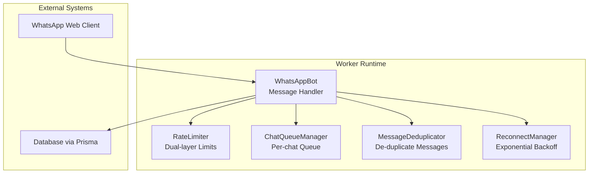
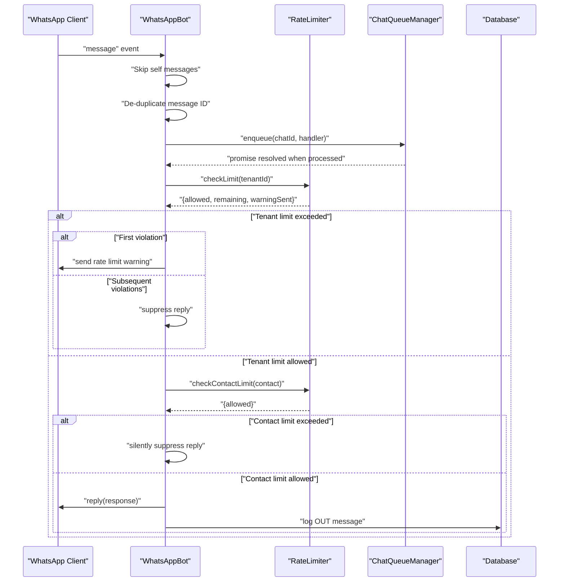
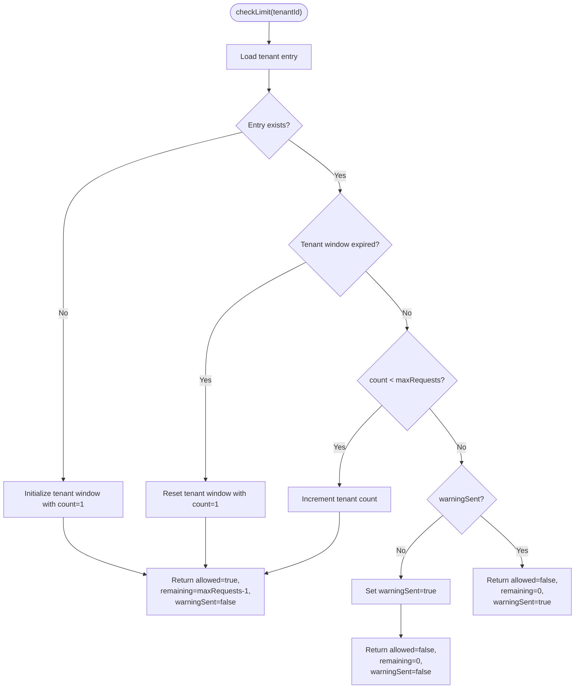
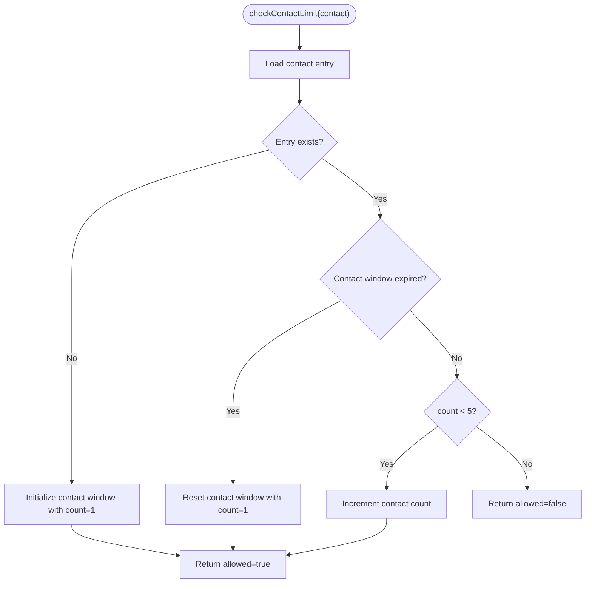
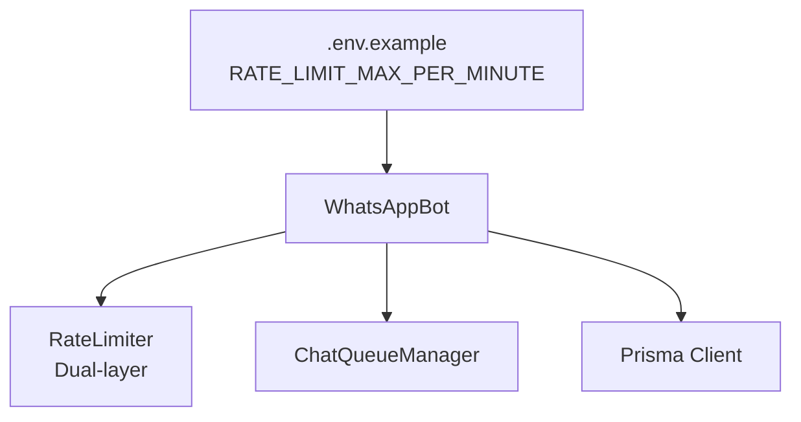

# Rate Limiting System

<cite>
**Referenced Files in This Document**
- [rate-limiter.ts](file://apps/worker/src/utils/rate-limiter.ts)
- [chat-queue.ts](file://apps/worker/src/utils/chat-queue.ts)
- [bot.ts](file://apps/worker/src/bot.ts)
- [worker.ts](file://apps/worker/src/worker.ts)
- [dedup.ts](file://apps/worker/src/utils/dedup.ts)
- [reconnect.ts](file://apps/worker/src/utils/reconnect.ts)
- [.env.example](file://.env.example)
</cite>

## Update Summary
**Changes Made**
- Enhanced RateLimiter class with per-contact rate limiting capability
- Added dual-layer rate limiting: tenant-level and contact-level limits
- Implemented silent suppression mechanism for spammy contacts
- Updated rate limiting integration in WhatsAppBot message handling
- Enhanced configuration management with separate rate limit configurations

## Table of Contents
1. [Introduction](#introduction)
2. [Project Structure](#project-structure)
3. [Core Components](#core-components)
4. [Architecture Overview](#architecture-overview)
5. [Detailed Component Analysis](#detailed-component-analysis)
6. [Dependency Analysis](#dependency-analysis)
7. [Performance Considerations](#performance-considerations)
8. [Troubleshooting Guide](#troubleshooting-guide)
9. [Conclusion](#conclusion)
10. [Appendices](#appendices)

## Introduction
This document explains the enhanced rate limiting utility system used to control message processing rates per tenant and per contact. The system now implements a dual-layer approach with both tenant-level and per-contact rate limits to prevent spam while maintaining responsive service delivery. It focuses on the sliding window implementation, tenant-specific configurations, contact-level tracking, dynamic adjustments, and integration with the chat queue and worker lifecycle. It also covers performance implications, memory usage, monitoring, configuration examples, troubleshooting, and best practices for balancing throughput and stability.

## Project Structure
The rate limiting system resides in the worker application and integrates with the message processing pipeline:
- Enhanced RateLimiter: Implements dual-layer sliding window per tenant and per contact.
- Chat queue: Ensures sequential processing per chat to avoid concurrency conflicts.
- Bot: Orchestrates message handling, applies both tenant and contact rate limits, and coordinates auxiliary components.
- Environment: Provides runtime configuration for rate limits and other operational parameters.

```mermaid
graph TB
subgraph "Worker Runtime"
BOT["WhatsAppBot<br/>Message Handler"]
RL["RateLimiter<br/>Dual-layer Limits"]
CQ["ChatQueueManager<br/>Per-chat Queue"]
DEDUP["MessageDeduplicator<br/>De-duplicate Messages"]
RC["ReconnectManager<br/>Exponential Backoff"]
end
subgraph "External Systems"
WA["WhatsApp Web Client"]
DB["Database via Prisma"]
end
WA --> BOT
BOT --> RL
BOT --> CQ
BOT --> DEDUP
BOT --> RC
BOT --> DB
```

**Diagram sources**
- [bot.ts](file://apps/worker/src/bot.ts#L12-L75)
- [rate-limiter.ts](file://apps/worker/src/utils/rate-limiter.ts#L17-L26)
- [chat-queue.ts](file://apps/worker/src/utils/chat-queue.ts#L21-L29)
- [dedup.ts](file://apps/worker/src/utils/dedup.ts#L11-L22)
- [reconnect.ts](file://apps/worker/src/utils/reconnect.ts#L14-L39)

**Section sources**
- [bot.ts](file://apps/worker/src/bot.ts#L12-L75)
- [rate-limiter.ts](file://apps/worker/src/utils/rate-limiter.ts#L17-L26)
- [chat-queue.ts](file://apps/worker/src/utils/chat-queue.ts#L21-L29)
- [dedup.ts](file://apps/worker/src/utils/dedup.ts#L11-L22)
- [reconnect.ts](file://apps/worker/src/utils/reconnect.ts#L14-L39)

## Core Components
- **Enhanced RateLimiter**: Maintains per-tenant and per-contact counters with separate sliding windows, exposes check and status APIs, and supports dynamic configuration updates.
- **ChatQueueManager**: Serializes processing per chat to reduce contention and stabilize throughput.
- **WhatsAppBot**: Initializes rate limiter with dual configurations, checks both tenant and contact limits before replying, and coordinates logging and persistence.
- **Environment**: Supplies rate limit configuration via environment variables.

Key responsibilities:
- Enforce tenant-specific rate limits using a sliding window.
- Implement per-contact rate limits with silent suppression to prevent spam.
- Provide status and dynamic reconfiguration capabilities for both layers.
- Integrate with chat queue to avoid concurrent processing bottlenecks.
- Persist operational metrics and handle graceful shutdown.

**Section sources**
- [rate-limiter.ts](file://apps/worker/src/utils/rate-limiter.ts#L17-L131)
- [chat-queue.ts](file://apps/worker/src/utils/chat-queue.ts#L21-L139)
- [bot.ts](file://apps/worker/src/bot.ts#L27-L75)
- [.env.example](file://.env.example#L1-L36)

## Architecture Overview
The enhanced rate limiting system sits between incoming message events and outbound replies, implementing a two-tier protection mechanism. It ensures that each tenant's reply rate does not exceed configured limits within a rolling window, while simultaneously preventing individual contacts from overwhelming the system with excessive replies.

```mermaid
sequenceDiagram
participant WA as "WhatsApp Client"
participant BOT as "WhatsAppBot"
participant RL as "RateLimiter"
participant CQ as "ChatQueueManager"
participant DB as "Database"
WA->>BOT : "message" event
BOT->>BOT : "Skip self messages"
BOT->>BOT : "De-duplicate message ID"
BOT->>CQ : "enqueue(chatId, handler)"
CQ-->>BOT : "promise resolved when processed"
BOT->>RL : "checkLimit(tenantId)"
RL-->>BOT : "{allowed, remaining, warningSent}"
alt "Tenant limit exceeded"
alt "First violation"
BOT->>WA : "send rate limit warning"
else "Subsequent violations"
BOT->>BOT : "suppress reply"
end
else "Tenant limit allowed"
BOT->>RL : "checkContactLimit(contact)"
RL-->>BOT : "{allowed}"
alt "Contact limit exceeded"
BOT->>BOT : "silently suppress reply"
else "Contact limit allowed"
BOT->>WA : "reply(response)"
BOT->>DB : "log OUT message"
end
end
```

**Diagram sources**
- [bot.ts](file://apps/worker/src/bot.ts#L382-L403)
- [rate-limiter.ts](file://apps/worker/src/utils/rate-limiter.ts#L35-L94)
- [chat-queue.ts](file://apps/worker/src/utils/chat-queue.ts#L35-L68)

## Detailed Component Analysis

### Enhanced RateLimiter: Dual-Layer Implementation
The rate limiter now implements a dual-layer sliding window system with both tenant-level and per-contact limits:
- **Tenant-level configuration**: maxRequests and windowMs define the primary limit and window duration.
- **Contact-level configuration**: Separate per-contact limits with 5 replies per 10 minutes.
- **State management**: Two separate maps - limits for tenant-level tracking and contactLimits for per-contact tracking.
- **Behavior**: Both layers operate independently, with tenant limits providing user-facing warnings and contact limits offering silent suppression.

```mermaid
classDiagram
class RateLimiter {
-tenantLimits : Map~string, RateLimitEntry~
-contactLimits : Map~string, RateLimitEntry~
-config : RateLimitConfig
-contactConfig : RateLimitConfig
+constructor(config?)
+checkLimit(tenantId) : {allowed, remaining, warningSent}
+checkContactLimit(contact) : {allowed}
+getStatus(tenantId) : {count, limit, windowMs, resetIn}
+updateConfig(config) : void
}
class RateLimitEntry {
+count : number
+windowStart : number
+warningSent : boolean
}
class RateLimitConfig {
+maxRequests : number
+windowMs : number
}
RateLimiter --> RateLimitEntry : "per tenant & contact"
RateLimiter --> RateLimitConfig : "tenant & contact configs"
```

**Diagram sources**
- [rate-limiter.ts](file://apps/worker/src/utils/rate-limiter.ts#L6-L29)

**Updated** Enhanced with per-contact rate limiting and dual configuration management

Algorithm flow for checkLimit (tenant-level):

```mermaid
flowchart TD
Start(["checkLimit(tenantId)"]) --> LoadEntry["Load tenant entry"]
LoadEntry --> Exists{"Entry exists?"}
Exists --> |No| InitWindow["Initialize tenant window with count=1"]
InitWindow --> Allow["Return allowed=true,<br/>remaining=maxRequests-1,<br/>warningSent=false"]
Exists --> |Yes| WindowExpired{"Tenant window expired?"}
WindowExpired --> |Yes| ResetWindow["Reset tenant window with count=1"]
ResetWindow --> Allow
WindowExpired --> |No| WithinLimit{"count < maxRequests?"}
WithinLimit --> |Yes| Inc["Increment tenant count"]
Inc --> Allow
WithinLimit --> |No| WarnSent{"warningSent?"}
WarnSent --> |No| SetWarn["Set warningSent=true"]
SetWarn --> Deny["Return allowed=false,<br/>remaining=0,<br/>warningSent=false"]
WarnSent --> |Yes| Suppress["Return allowed=false,<br/>remaining=0,<br/>warningSent=true"]
```

Algorithm flow for checkContactLimit (contact-level):

```mermaid
flowchart TD
Start(["checkContactLimit(contact)"]) --> LoadEntry["Load contact entry"]
LoadEntry --> Exists{"Entry exists?"}
Exists --> |No| InitWindow["Initialize contact window with count=1"]
InitWindow --> Allow["Return allowed=true"]
Exists --> |Yes| WindowExpired{"Contact window expired?"}
WindowExpired --> |Yes| ResetWindow["Reset contact window with count=1"]
ResetWindow --> Allow
WindowExpired --> |No| WithinLimit{"count < 5?"}
WithinLimit --> |Yes| Inc["Increment contact count"]
Inc --> Allow
WithinLimit --> |No| Deny["Return allowed=false"]
```

**Diagram sources**
- [rate-limiter.ts](file://apps/worker/src/utils/rate-limiter.ts#L35-L76)
- [rate-limiter.ts](file://apps/worker/src/utils/rate-limiter.ts#L82-L94)

Operational notes:
- **Tenant-specific**: The limiter tracks separate entries per tenantId with user-facing warnings.
- **Contact-specific**: Separate tracking per contact with silent suppression to prevent spam.
- **Warning suppression**: After the first tenant violation, subsequent violations suppress replies to avoid spamming the user.
- **Dynamic updates**: updateConfig allows changing tenant-level limits at runtime.
- **Memory efficiency**: Two separate maps prevent memory bloat from tracking both tenant and contact limits simultaneously.

**Section sources**
- [rate-limiter.ts](file://apps/worker/src/utils/rate-limiter.ts#L17-L131)

### ChatQueueManager: Sequential Processing
The chat queue ensures that messages from the same chat are processed sequentially, preventing race conditions and stabilizing throughput:
- Per-chat queues: Each chatId has its own queue.
- Size limit: Enforces a maximum queue length to prevent unbounded memory growth.
- Processing loop: Dequeues and executes tasks one by one, continuing on errors.
- Cleanup: Removes empty queues to prevent memory leaks.

Integration with enhanced rate limiting:
- The rate limiter is checked inside the queued handler, ensuring that both tenant and contact limits are enforced for each processed message independently.

**Section sources**
- [chat-queue.ts](file://apps/worker/src/utils/chat-queue.ts#L21-L139)
- [bot.ts](file://apps/worker/src/bot.ts#L166-L183)

### Enhanced WhatsAppBot: Dual-Layer Rate Limiting Integration
**Updated** Enhanced with per-contact rate limiting integration

Initialization:
- Loads RATE_LIMIT_MAX_PER_MINUTE from environment to configure the tenant-level rate limiter window.
- Creates ChatQueueManager with a fixed max queue size.
- Sets up de-duplication and reconnect managers.

Message handling:
- Skips self-originated messages.
- Checks for duplicates using MessageDeduplicator.
- Enqueues message processing per chat.
- **Enhanced**: Applies tenant-level rate limit check first, then per-contact rate limit check.
- **Enhanced**: Sends a warning once on first tenant violation, then suppresses replies until the window resets.
- **Enhanced**: Silently suppresses replies when per-contact limit is exceeded to prevent spam from individual contacts.

Graceful shutdown:
- Stops heartbeat, halts reconnect attempts, and clears queues.

**Section sources**
- [bot.ts](file://apps/worker/src/bot.ts#L27-L75)
- [bot.ts](file://apps/worker/src/bot.ts#L382-L403)
- [bot.ts](file://apps/worker/src/bot.ts#L248-L331)
- [worker.ts](file://apps/worker/src/worker.ts#L7-L15)

### Supporting Utilities
- MessageDeduplicator: Prevents processing duplicate messages using a bounded in-memory cache with TTL and eviction.
- ReconnectManager: Manages exponential backoff for reconnection attempts to maintain resilience.

**Section sources**
- [dedup.ts](file://apps/worker/src/utils/dedup.ts#L11-L89)
- [reconnect.ts](file://apps/worker/src/utils/reconnect.ts#L14-L116)

## Dependency Analysis
The enhanced rate limiting system depends on:
- Environment configuration for rate limits.
- Chat queue for serialized processing.
- Database for logging and status updates.
- External messaging platform for inbound/outbound messages.

```mermaid
graph TB
ENV[".env.example<br/>RATE_LIMIT_MAX_PER_MINUTE"]
BOT["WhatsAppBot"]
RL["RateLimiter<br/>Dual-layer"]
CQ["ChatQueueManager"]
DB["Prisma Client"]
ENV --> BOT
BOT --> RL
BOT --> CQ
BOT --> DB
```

**Diagram sources**
- [.env.example](file://.env.example#L29)
- [bot.ts](file://apps/worker/src/bot.ts#L34-L35)
- [rate-limiter.ts](file://apps/worker/src/utils/rate-limiter.ts#L17-L29)
- [chat-queue.ts](file://apps/worker/src/utils/chat-queue.ts#L21-L29)

**Section sources**
- [.env.example](file://.env.example#L29)
- [bot.ts](file://apps/worker/src/bot.ts#L34-L35)
- [rate-limiter.ts](file://apps/worker/src/utils/rate-limiter.ts#L17-L29)
- [chat-queue.ts](file://apps/worker/src/utils/chat-queue.ts#L21-L29)

## Performance Considerations
- **Memory footprint**:
  - **Enhanced**: Rate limiter now maintains two separate maps - one for tenant-level limits and one for contact-level limits. Each entry stores a small integer count, a timestamp, and a boolean flag. Memory usage scales linearly with active tenants and unique contacts.
  - Chat queue: One queue per chat; bounded by maxQueueSize. Memory usage scales with concurrent chats and queue depth.
  - De-duplication: Fixed-size cache with TTL; bounded memory growth.
- **Throughput**:
  - **Enhanced**: Dual-layer sliding window ensures smooth bursts up to maxRequests per windowMs for tenants, while per-contact limits prevent individual spam attacks.
  - Sequential processing per chat avoids contention but may increase latency under heavy load; tune maxQueueSize accordingly.
- **CPU**:
  - **Enhanced**: Rate limit checks are O(1) per message for both tenant and contact levels.
  - Minimal overhead from queue management and de-duplication.

**Updated** Enhanced with dual-layer rate limiting performance considerations

## Troubleshooting Guide
**Updated** Enhanced troubleshooting guide for dual-layer rate limiting

Common issues and resolutions:
- **Rate limit exceeded frequently**:
  - Increase RATE_LIMIT_MAX_PER_MINUTE to allow higher tenant-level throughput.
  - Monitor resetIn via getStatus to understand when tenant limits reset.
- **Users receive repeated warnings**:
  - The system suppresses replies after the first tenant violation; adjust expectations or inform users.
- **Messages stuck in queue**:
  - Verify maxQueueSize and monitor queue sizes; consider increasing capacity or reducing burstiness.
- **Duplicate messages causing extra processing**:
  - Confirm de-duplication is active; check logs for duplicate detection.
- **Worker instability**:
  - Review reconnect attempts and delays; ensure exponential backoff is functioning.
- **Individual contacts overwhelming the system**:
  - **New**: Check per-contact rate limit logs for contacts exceeding 5 replies per 10 minutes; these are silently suppressed.
- **Unexpected silence from specific contacts**:
  - **New**: Per-contact limits may be silently suppressing replies after 5 per 10 minutes; verify contact-level logs.

Monitoring tips:
- Use getStatus to expose current tenant-level counts and reset timing.
- **Enhanced**: Monitor both tenant-level and contact-level rate limit violations.
- Log rate limit violations and warnings for observability.
- Track queue depths and error rates to detect bottlenecks.
- **New**: Monitor per-contact suppression events to identify spammy contacts.

**Section sources**
- [rate-limiter.ts](file://apps/worker/src/utils/rate-limiter.ts#L99-L114)
- [chat-queue.ts](file://apps/worker/src/utils/chat-queue.ts#L73-L87)
- [bot.ts](file://apps/worker/src/bot.ts#L385-L403)
- [dedup.ts](file://apps/worker/src/utils/dedup.ts#L28-L31)

## Conclusion
The enhanced rate limiting system uses a sophisticated dual-layer approach with both tenant-level and per-contact sliding windows to balance responsiveness and stability. The tenant-level limits provide user-facing warnings and controlled throughput, while per-contact limits offer silent suppression to prevent spam from individual contacts. Combined with a per-chat queue and supporting utilities, it provides predictable throughput, clear violation handling, and operational visibility. Proper configuration and monitoring enable optimal performance across diverse tenant workloads while protecting against spam attacks.

**Updated** Enhanced conclusion reflecting dual-layer rate limiting capabilities

## Appendices

### Configuration Examples
**Updated** Enhanced configuration examples for dual-layer rate limiting

- Environment variables:
  - RATE_LIMIT_MAX_PER_MINUTE: Controls max replies per minute per tenant.
  - HEARTBEAT_INTERVAL_MS: Heartbeat cadence for status updates.
  - SESSIONS_PATH: Directory for session storage.
  - LOG_LEVEL: Logging verbosity.
- **New**: Per-contact limits are hardcoded as 5 replies per 10 minutes and cannot be configured via environment variables.
- Example usage:
  - Set RATE_LIMIT_MAX_PER_MINUTE to 10 for a baseline of 10 replies per minute per tenant.
  - Adjust HEARTBEAT_INTERVAL_MS to balance DB writes and liveness checks.

**Section sources**
- [.env.example](file://.env.example#L29-L36)
- [bot.ts](file://apps/worker/src/bot.ts#L34-L35)

### Best Practices for Optimal Throughput
**Updated** Enhanced best practices for dual-layer rate limiting

- **Start conservative**: Begin with moderate tenant-level limits and rely on per-contact limits for spam prevention.
- **Monitor reset cycles**: Use getStatus to anticipate and align business workflows with tenant-level window resets.
- **Tune queue sizes**: Balance maxQueueSize against memory constraints and acceptable latency.
- **Combine with de-duplication**: Prevent redundant processing to improve effective throughput.
- **Observe and iterate**: Track both tenant-level violations and per-contact suppression events to refine limits.
- **New**: Monitor per-contact suppression logs to identify and address spammy contacts without user notification.
- **New**: Consider contact-level analytics to understand communication patterns and adjust strategies accordingly.

**Enhanced** Added per-contact monitoring and spam prevention best practices