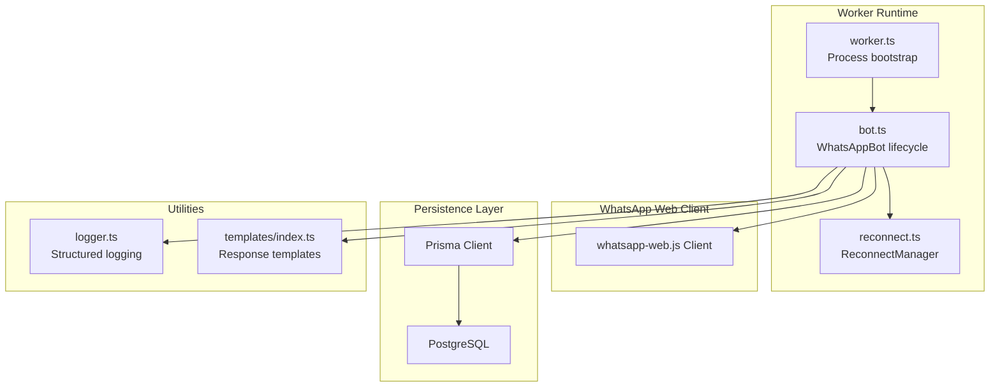
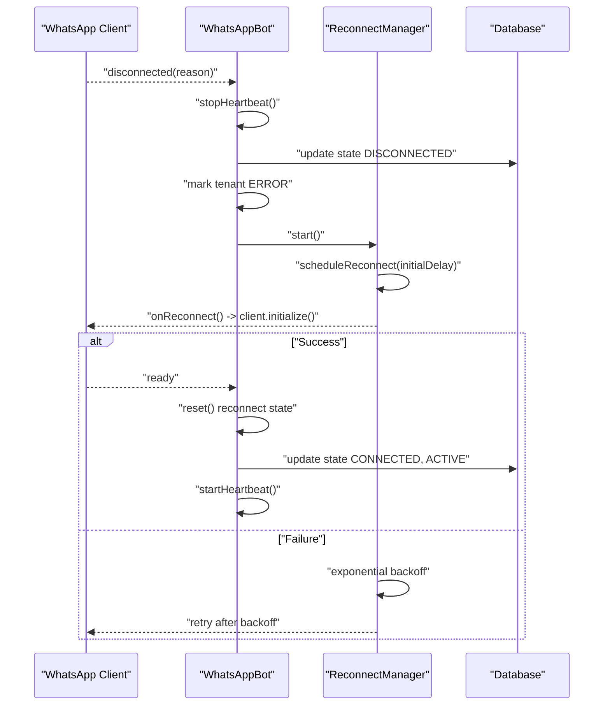
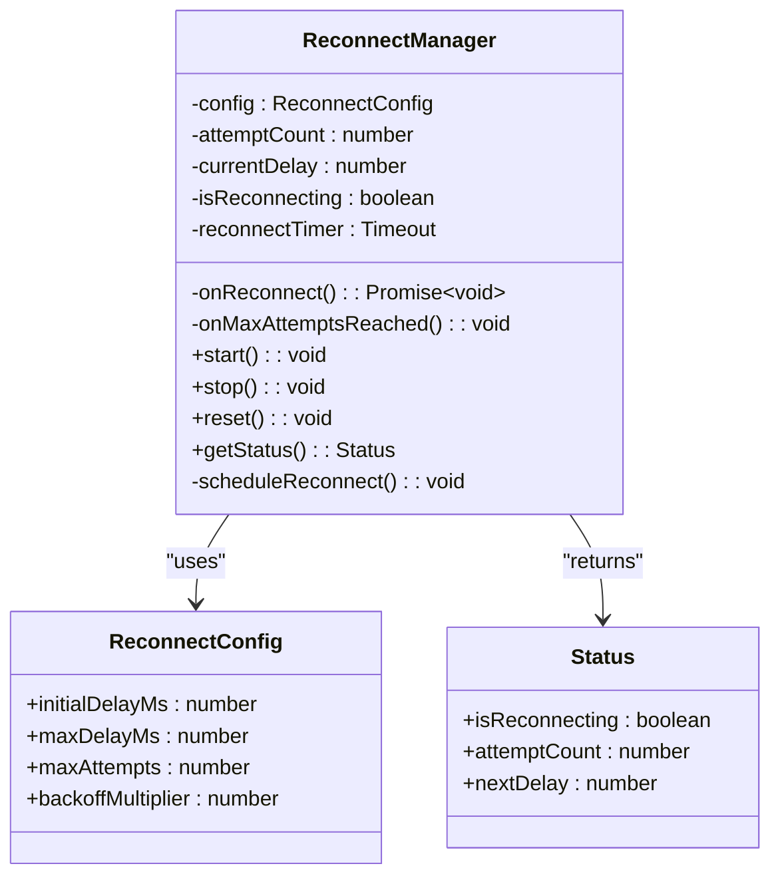
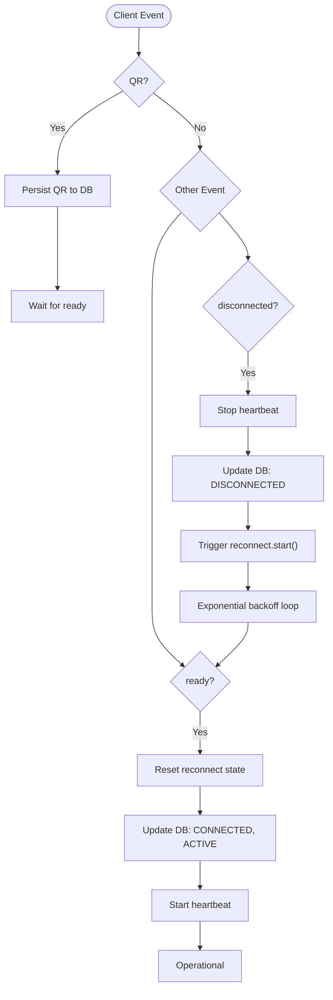
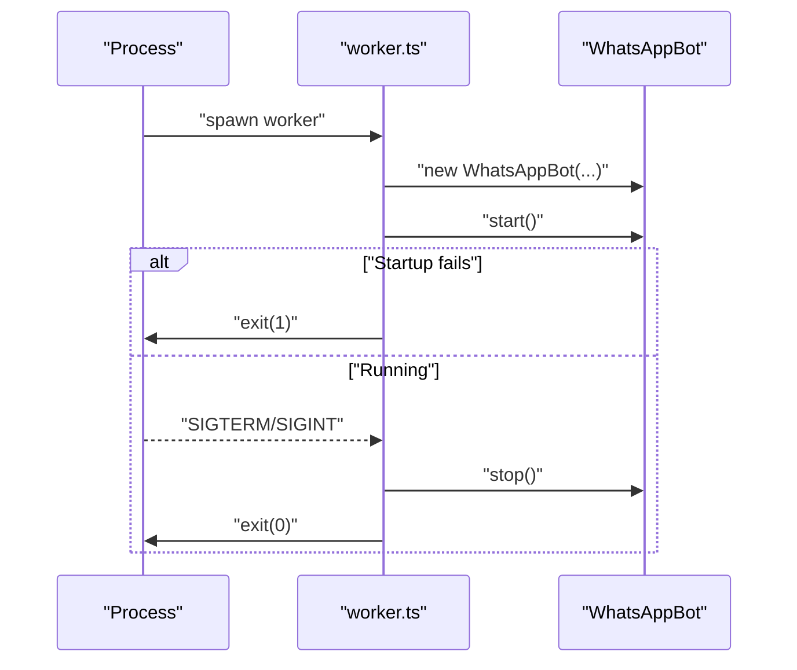
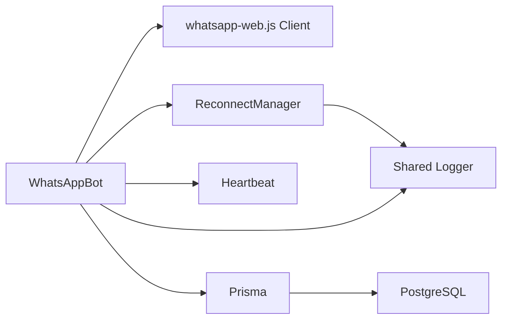

# Reconnection Handling

<cite>
**Referenced Files in This Document**
- [reconnect.ts](file://apps/worker/src/utils/reconnect.ts)
- [bot.ts](file://apps/worker/src/bot.ts)
- [worker.ts](file://apps/worker/src/worker.ts)
- [.env.example](file://.env.example)
- [logger.ts](file://packages/shared/src/utils/logger.ts)
- [index.ts](file://apps/worker/src/templates/index.ts)
- [booking.ts](file://apps/worker/src/templates/booking.ts)
</cite>

## Table of Contents
1. [Introduction](#introduction)
2. [Project Structure](#project-structure)
3. [Core Components](#core-components)
4. [Architecture Overview](#architecture-overview)
5. [Detailed Component Analysis](#detailed-component-analysis)
6. [Dependency Analysis](#dependency-analysis)
7. [Performance Considerations](#performance-considerations)
8. [Troubleshooting Guide](#troubleshooting-guide)
9. [Conclusion](#conclusion)
10. [Appendices](#appendices)

## Introduction
This document explains the reconnection handling system for the WhatsApp integration, focusing on the exponential backoff algorithm used to automatically recover from connection failures. It documents retry mechanisms, maximum retry limits, jitter absence, and graceful degradation strategies. It also covers integration with the main bot lifecycle, heartbeat monitoring for connection health, manual intervention options, configuration parameters, and monitoring approaches for success rates and stability.

## Project Structure
The reconnection system is implemented in the worker application and integrates with the main bot lifecycle and supporting utilities:
- Reconnection manager: exponential backoff logic and scheduling
- Bot lifecycle: event-driven connection state transitions and heartbeat
- Worker bootstrap: process signals and graceful shutdown
- Environment configuration: runtime tunables for heartbeat and stale checks
- Shared logger: structured logging for diagnostics

**Diagram sources**
- [worker.ts](file://apps/worker/src/worker.ts#L1-L46)
- [bot.ts](file://apps/worker/src/bot.ts#L1-L411)
- [reconnect.ts](file://apps/worker/src/utils/reconnect.ts#L1-L117)
- [logger.ts](file://packages/shared/src/utils/logger.ts#L1-L33)
- [index.ts](file://apps/worker/src/templates/index.ts#L1-L70)

**Section sources**
- [worker.ts](file://apps/worker/src/worker.ts#L1-L46)
- [bot.ts](file://apps/worker/src/bot.ts#L1-L411)
- [reconnect.ts](file://apps/worker/src/utils/reconnect.ts#L1-L117)
- [.env.example](file://.env.example#L1-L22)
- [logger.ts](file://packages/shared/src/utils/logger.ts#L1-L33)
- [index.ts](file://apps/worker/src/templates/index.ts#L1-L70)

## Core Components
- ReconnectManager: Implements exponential backoff with configurable parameters, schedules reconnect attempts, tracks attempts, and invokes callbacks on success or exhaustion.
- WhatsAppBot: Orchestrates the WhatsApp client lifecycle, updates persistent state on connection events, starts/stops heartbeat, and triggers the reconnect manager on disconnections.
- Worker bootstrap: Initializes the bot, handles process signals, and ensures graceful shutdown.
- Heartbeat: Periodically updates last_seen_at and worker status to indicate liveness and detect staleness.
- Logging: Structured logs for diagnostics, warnings, and errors across the system.

Key responsibilities:
- Detect connection failure via client events and stop heartbeat
- Schedule retries with exponential backoff and cap delays
- On success, reset reconnect state and restart heartbeat
- On max attempts, mark tenant and worker as ERROR
- Graceful degradation: queueing and deduplication reduce impact of overload

**Section sources**
- [reconnect.ts](file://apps/worker/src/utils/reconnect.ts#L14-L116)
- [bot.ts](file://apps/worker/src/bot.ts#L37-L56)
- [bot.ts](file://apps/worker/src/bot.ts#L185-L226)
- [bot.ts](file://apps/worker/src/bot.ts#L333-L367)
- [worker.ts](file://apps/worker/src/worker.ts#L26-L36)

## Architecture Overview
The system reacts to client disconnections by invoking the reconnect manager, which schedules retries with exponential backoff. On successful re-initialization, the bot resets reconnect state, updates status, and resumes heartbeat.

**Diagram sources**
- [bot.ts](file://apps/worker/src/bot.ts#L185-L226)
- [bot.ts](file://apps/worker/src/bot.ts#L98-L151)
- [bot.ts](file://apps/worker/src/bot.ts#L333-L367)
- [reconnect.ts](file://apps/worker/src/utils/reconnect.ts#L44-L115)

## Detailed Component Analysis

### ReconnectManager
Implements exponential backoff with:
- Configurable initial delay, maximum delay, maximum attempts, and backoff multiplier
- Attempt counter and current delay tracking
- Scheduling mechanism using timeouts
- Status reporting for monitoring

Behavior highlights:
- Prevents overlapping reconnection attempts
- Stops and resets state on success
- Invokes max attempts callback to mark system ERROR
- No jitter implementation

**Diagram sources**
- [reconnect.ts](file://apps/worker/src/utils/reconnect.ts#L7-L39)
- [reconnect.ts](file://apps/worker/src/utils/reconnect.ts#L14-L85)

**Section sources**
- [reconnect.ts](file://apps/worker/src/utils/reconnect.ts#L14-L116)

### WhatsAppBot Lifecycle and Heartbeat
- Event handlers:
  - QR code generation and persistence
  - Ready: reset reconnect state, update status, start heartbeat, load config
  - Disconnected: stop heartbeat, persist DISCONNECTED state, trigger reconnect
  - Auth failure: mark tenant ERROR and worker ERROR
- Heartbeat:
  - Periodic updates to last_seen_at and worker status
  - Configurable interval via environment variable
- Graceful degradation:
  - Message deduplication prevents repeated processing
  - Chat queue enforces per-chat sequential processing and queue limits

**Diagram sources**
- [bot.ts](file://apps/worker/src/bot.ts#L77-L226)
- [bot.ts](file://apps/worker/src/bot.ts#L333-L367)
- [reconnect.ts](file://apps/worker/src/utils/reconnect.ts#L87-L115)

**Section sources**
- [bot.ts](file://apps/worker/src/bot.ts#L77-L226)
- [bot.ts](file://apps/worker/src/bot.ts#L333-L367)

### Worker Bootstrap and Manual Intervention
- Starts the bot and handles SIGTERM/SIGINT for graceful shutdown
- Catches startup errors and marks worker ERROR
- Provides hooks for manual intervention (stop, reset, inspect status)

**Diagram sources**
- [worker.ts](file://apps/worker/src/worker.ts#L19-L36)
- [bot.ts](file://apps/worker/src/bot.ts#L394-L409)

**Section sources**
- [worker.ts](file://apps/worker/src/worker.ts#L1-L46)
- [bot.ts](file://apps/worker/src/bot.ts#L394-L409)

## Dependency Analysis
- WhatsAppBot depends on:
  - whatsapp-web.js client for connection lifecycle
  - Prisma for persistent state updates
  - ReconnectManager for retry orchestration
  - Heartbeat for liveness monitoring
  - Utilities for deduplication and rate limiting
- ReconnectManager depends on:
  - External onReconnect callback to initialize the client
  - External onMaxAttemptsReached callback to mark ERROR state
  - Shared logger for diagnostics

**Diagram sources**
- [bot.ts](file://apps/worker/src/bot.ts#L1-L411)
- [reconnect.ts](file://apps/worker/src/utils/reconnect.ts#L1-L117)
- [logger.ts](file://packages/shared/src/utils/logger.ts#L1-L33)

**Section sources**
- [bot.ts](file://apps/worker/src/bot.ts#L1-L411)
- [reconnect.ts](file://apps/worker/src/utils/reconnect.ts#L1-L117)
- [logger.ts](file://packages/shared/src/utils/logger.ts#L1-L33)

## Performance Considerations
- Exponential backoff reduces load on upstream systems and mitigates thundering herd effects by staggering retries.
- Current implementation does not include jitter; adding jitter would further randomize retry timing to avoid synchronized retries.
- Queue depth and rate limiting prevent overload during recovery bursts.
- Heartbeat interval should balance responsiveness with resource usage; adjust via environment configuration.

[No sources needed since this section provides general guidance]

## Troubleshooting Guide
Common scenarios and actions:
- Persistent disconnections:
  - Verify database connectivity and Prisma operations
  - Inspect logs around reconnect attempts and max attempts reached
  - Confirm client initialization completes without throwing
- Network problems:
  - Check heartbeat staleness indicators
  - Review environment variables for heartbeat interval and stale thresholds
- Recovery procedure validation:
  - Ensure reset is invoked on ready
  - Confirm heartbeat restarts after recovery
  - Validate that state transitions to CONNECTED and ACTIVE

Diagnostic tips:
- Use structured logs to trace attempt counts, delays, and errors
- Monitor database state updates for DISCONNECTED vs CONNECTED transitions
- Observe rate limiter and queue behavior under load

**Section sources**
- [bot.ts](file://apps/worker/src/bot.ts#L185-L226)
- [bot.ts](file://apps/worker/src/bot.ts#L98-L151)
- [bot.ts](file://apps/worker/src/bot.ts#L333-L367)
- [reconnect.ts](file://apps/worker/src/utils/reconnect.ts#L87-L115)
- [.env.example](file://.env.example#L20-L22)

## Conclusion
The reconnection handling system provides robust automatic recovery using exponential backoff, integrates tightly with the bot lifecycle, and maintains connection health via heartbeat. While jitter is not currently implemented, the system’s design supports straightforward extension to include jitter for improved resilience against synchronized retries. Monitoring and logging enable effective diagnosis and validation of recovery procedures.

[No sources needed since this section summarizes without analyzing specific files]

## Appendices

### Configuration Parameters
- ReconnectManager defaults:
  - Initial delay: 5 seconds
  - Maximum delay: 5 minutes
  - Maximum attempts: 10
  - Backoff multiplier: 3
- Heartbeat interval:
  - Configured via environment variable (default value present in example)
- Stale threshold and check interval:
  - Present in example environment file for staleness monitoring

**Section sources**
- [reconnect.ts](file://apps/worker/src/utils/reconnect.ts#L31-L36)
- [.env.example](file://.env.example#L20-L22)

### Retry Mechanism and Limits
- Attempts are tracked and capped by maximum attempts
- On each failure, delay increases exponentially up to the configured maximum
- On success, state is reset and heartbeat resumes

**Section sources**
- [reconnect.ts](file://apps/worker/src/utils/reconnect.ts#L87-L115)
- [bot.ts](file://apps/worker/src/bot.ts#L98-L151)

### Jitter Implementation Notes
- Not implemented in current code
- Can be added by introducing randomization around the computed delay before applying exponential backoff

**Section sources**
- [reconnect.ts](file://apps/worker/src/utils/reconnect.ts#L105-L109)

### Graceful Degradation Strategies
- Message deduplication prevents repeated processing
- Per-chat queue enforces sequential processing and rejects with queue full
- Rate limiting controls outbound reply rate

**Section sources**
- [bot.ts](file://apps/worker/src/bot.ts#L153-L183)
- [index.ts](file://apps/worker/src/templates/index.ts#L9-L23)
- [booking.ts](file://apps/worker/src/templates/booking.ts#L1-L22)

### Monitoring Approaches
- Reconnection success rates:
  - Track attempt counts and success/failure logs
  - Aggregate per time window to compute success percentage
- Connection stability metrics:
  - Heartbeat intervals and staleness thresholds
  - State transitions (DISCONNECTED vs CONNECTED) and timestamps
- Operational visibility:
  - Structured logs for each stage of reconnection
  - Database state snapshots for auditability

**Section sources**
- [bot.ts](file://apps/worker/src/bot.ts#L333-L367)
- [reconnect.ts](file://apps/worker/src/utils/reconnect.ts#L79-L85)
- [.env.example](file://.env.example#L20-L22)