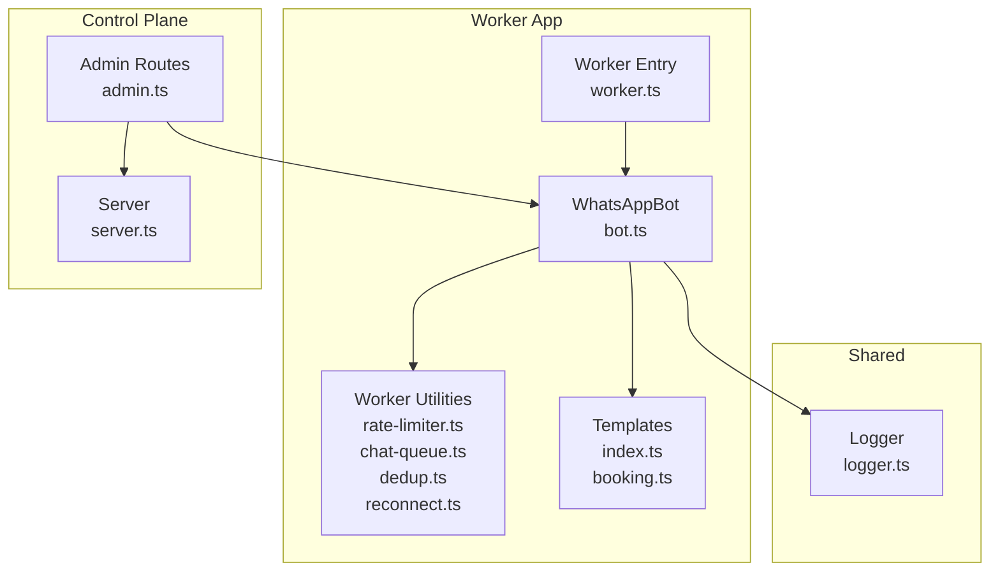
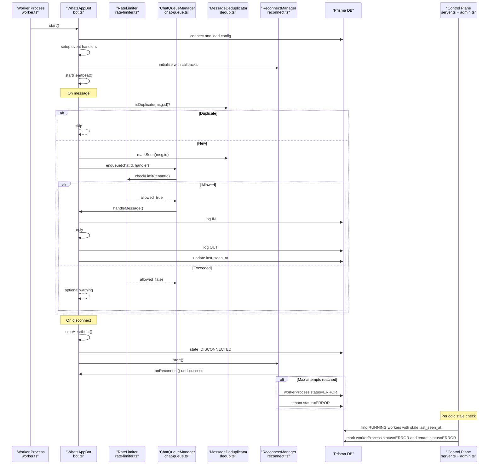
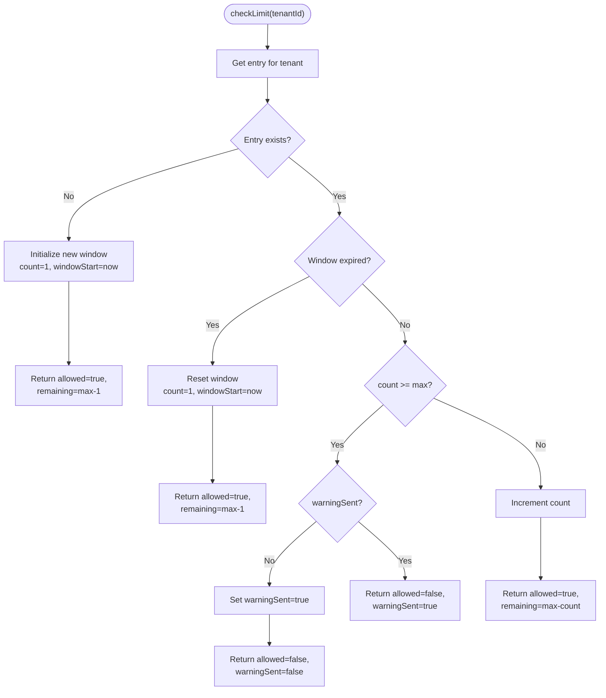
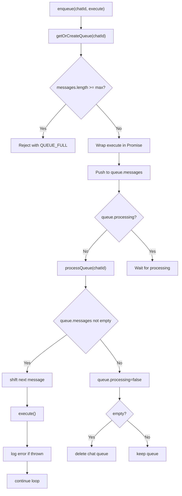
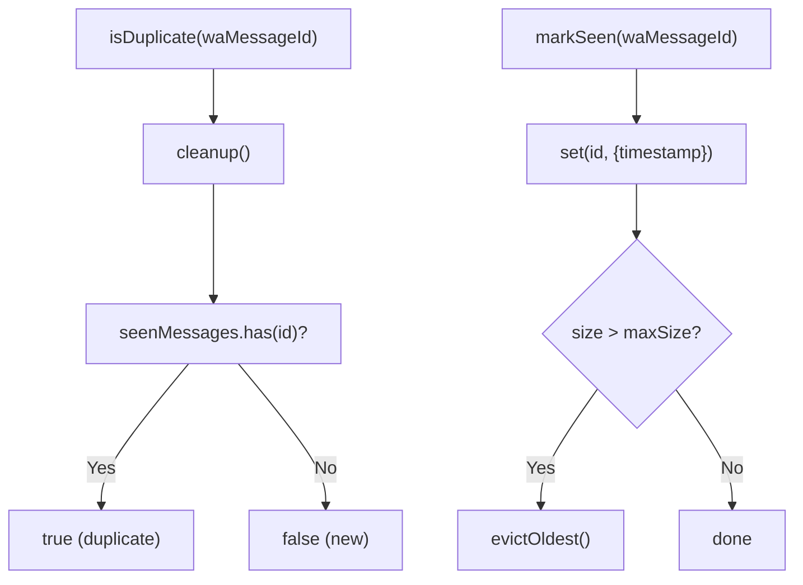
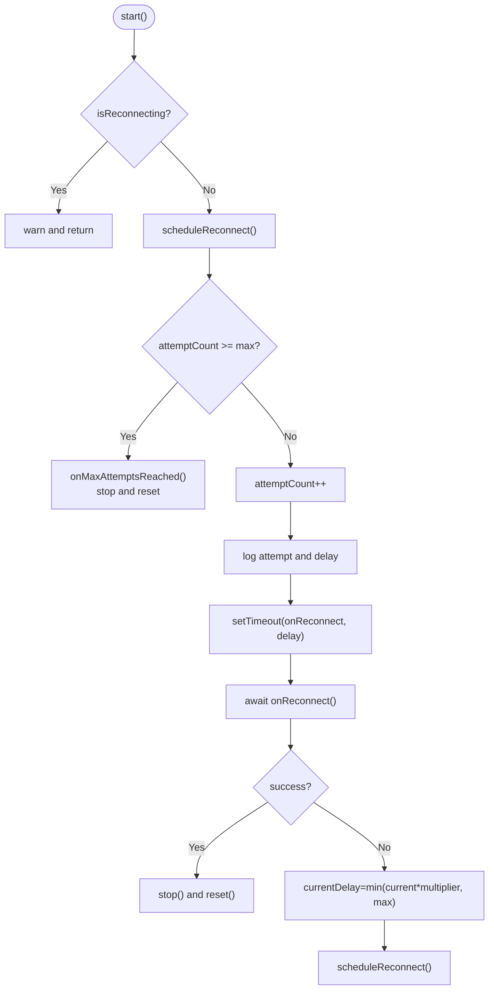
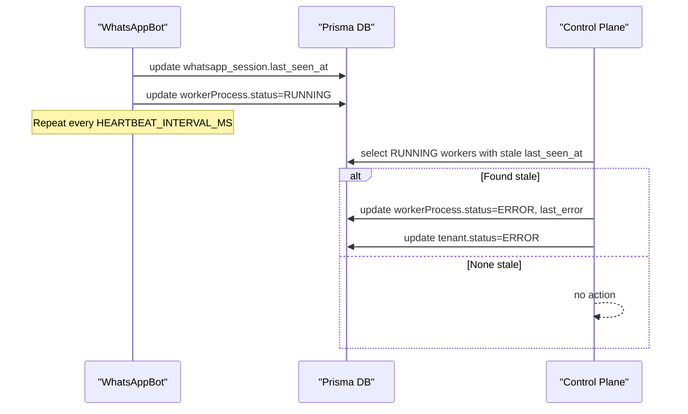
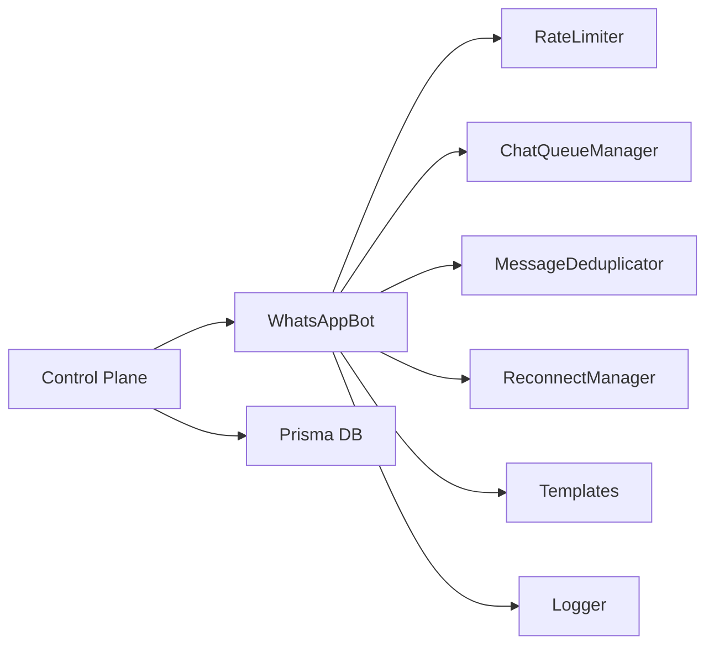

# Worker Utilities

<cite>
**Referenced Files in This Document**
- [rate-limiter.ts](file://apps/worker/src/utils/rate-limiter.ts)
- [chat-queue.ts](file://apps/worker/src/utils/chat-queue.ts)
- [dedup.ts](file://apps/worker/src/utils/dedup.ts)
- [reconnect.ts](file://apps/worker/src/utils/reconnect.ts)
- [bot.ts](file://apps/worker/src/bot.ts)
- [worker.ts](file://apps/worker/src/worker.ts)
- [logger.ts](file://packages/shared/src/utils/logger.ts)
- [index.ts](file://apps/worker/src/templates/index.ts)
- [booking.ts](file://apps/worker/src/templates/booking.ts)
- [admin.ts](file://apps/control-plane/src/routes/admin.ts)
- [server.ts](file://apps/control-plane/src/server.ts)
- [package.json](file://apps/worker/package.json)
- [ecosystem.config.js](file://ecosystem.config.js)
- [.env.example](file://.env.example)
</cite>

## Table of Contents
1. [Introduction](#introduction)
2. [Project Structure](#project-structure)
3. [Core Components](#core-components)
4. [Architecture Overview](#architecture-overview)
5. [Detailed Component Analysis](#detailed-component-analysis)
6. [Dependency Analysis](#dependency-analysis)
7. [Performance Considerations](#performance-considerations)
8. [Troubleshooting Guide](#troubleshooting-guide)
9. [Conclusion](#conclusion)
10. [Appendices](#appendices)

## Introduction
This document explains the worker utility systems and operational features that keep the WhatsApp worker stable and reliable. It covers:
- Rate limiting per tenant with configurable limits
- Chat queue management for sequential message processing
- Message deduplication to avoid duplicate processing
- Exponential backoff reconnection handling
- Heartbeat monitoring and stale worker detection with automatic recovery
- Practical configuration, performance tuning, and troubleshooting guidance

These utilities are integrated into the worker runtime and the control plane to ensure resilience, predictable throughput, and observability.

## Project Structure
The worker utilities live under the worker app and are consumed by the WhatsApp bot runtime. Shared logging utilities are provided by the shared package. The control plane performs stale worker detection and status updates.

**Diagram sources**
- [rate-limiter.ts](file://apps/worker/src/utils/rate-limiter.ts#L1-L110)
- [chat-queue.ts](file://apps/worker/src/utils/chat-queue.ts#L1-L140)
- [dedup.ts](file://apps/worker/src/utils/dedup.ts#L1-L93)
- [reconnect.ts](file://apps/worker/src/utils/reconnect.ts#L1-L117)
- [bot.ts](file://apps/worker/src/bot.ts#L1-L411)
- [worker.ts](file://apps/worker/src/worker.ts#L1-L46)
- [index.ts](file://apps/worker/src/templates/index.ts#L1-L70)
- [booking.ts](file://apps/worker/src/templates/booking.ts#L1-L22)
- [logger.ts](file://packages/shared/src/utils/logger.ts#L1-L33)
- [admin.ts](file://apps/control-plane/src/routes/admin.ts#L1-L80)
- [server.ts](file://apps/control-plane/src/server.ts#L1-L89)

**Section sources**
- [package.json](file://apps/worker/package.json#L1-L22)
- [logger.ts](file://packages/shared/src/utils/logger.ts#L1-L33)
- [server.ts](file://apps/control-plane/src/server.ts#L1-L89)

## Core Components
- Rate Limiter: Tracks per-tenant requests within a sliding window and supports dynamic configuration updates.
- Chat Queue Manager: Serializes processing per chat to prevent concurrency conflicts.
- Message Deduplicator: Prevents reprocessing of the same WhatsApp message using a time-bounded cache.
- Reconnect Manager: Implements exponential backoff with bounded retries and callbacks for success/failure.
- Heartbeat Monitoring: Periodically updates last-seen timestamps and worker status for liveness tracking.
- Stale Worker Detection: Control plane scans for workers without recent heartbeats and marks them as ERROR.

**Section sources**
- [rate-limiter.ts](file://apps/worker/src/utils/rate-limiter.ts#L1-L110)
- [chat-queue.ts](file://apps/worker/src/utils/chat-queue.ts#L1-L140)
- [dedup.ts](file://apps/worker/src/utils/dedup.ts#L1-L93)
- [reconnect.ts](file://apps/worker/src/utils/reconnect.ts#L1-L117)
- [bot.ts](file://apps/worker/src/bot.ts#L333-L367)
- [admin.ts](file://apps/control-plane/src/routes/admin.ts#L30-L80)

## Architecture Overview
The worker initializes utilities, connects to WhatsApp, and processes messages through the queue and rate limiter. Heartbeat updates keep the control plane informed. On disconnections, the reconnect manager attempts exponential backoff reconnection and updates statuses accordingly.

**Diagram sources**
- [worker.ts](file://apps/worker/src/worker.ts#L1-L46)
- [bot.ts](file://apps/worker/src/bot.ts#L1-L411)
- [rate-limiter.ts](file://apps/worker/src/utils/rate-limiter.ts#L1-L110)
- [chat-queue.ts](file://apps/worker/src/utils/chat-queue.ts#L1-L140)
- [dedup.ts](file://apps/worker/src/utils/dedup.ts#L1-L93)
- [reconnect.ts](file://apps/worker/src/utils/reconnect.ts#L1-L117)
- [admin.ts](file://apps/control-plane/src/routes/admin.ts#L30-L80)

## Detailed Component Analysis

### Rate Limiter
- Purpose: Enforce per-tenant rate limits with a sliding window.
- Key behaviors:
  - Tracks count and window start per tenant.
  - Resets window when elapsed time exceeds configured window.
  - Suppresses repeated warnings after first alert.
  - Provides status queries and dynamic config updates.
- Configuration:
  - Environment-driven default via worker initialization.
  - Tunable via constructor options for max requests and window size.
- Complexity:
  - Access/update per tenant is O(1) average with a hash map.
  - Status computation is O(1).

**Diagram sources**
- [rate-limiter.ts](file://apps/worker/src/utils/rate-limiter.ts#L32-L73)

**Section sources**
- [rate-limiter.ts](file://apps/worker/src/utils/rate-limiter.ts#L17-L106)
- [bot.ts](file://apps/worker/src/bot.ts#L264-L279)

### Chat Queue Manager
- Purpose: Serialize processing per chat to avoid race conditions and inconsistent state.
- Key behaviors:
  - Maintains separate queues per chatId.
  - Enforces a maximum queue size per tenant.
  - Logs debug info and warns on queue full.
  - Processes messages sequentially and continues on errors.
  - Cleans up empty queues to prevent memory leaks.
- Configuration:
  - Tenant-scoped max queue size (default 50).
- Complexity:
  - Enqueue is O(1).
  - Dequeue loop is O(n) per chat, but n is bounded by max queue size.

**Diagram sources**
- [chat-queue.ts](file://apps/worker/src/utils/chat-queue.ts#L35-L138)

**Section sources**
- [chat-queue.ts](file://apps/worker/src/utils/chat-queue.ts#L21-L139)
- [bot.ts](file://apps/worker/src/bot.ts#L166-L182)

### Message Deduplicator
- Purpose: Prevent duplicate processing of the same WhatsApp message using wa_message_id.
- Key behaviors:
  - Stores seen message IDs with timestamps.
  - Periodic cleanup removes expired entries.
  - Evicts oldest entry when capacity is exceeded.
  - Provides stats for diagnostics.
- Configuration:
  - Max cache size and TTL (default ~5 minutes).
- Complexity:
  - Lookup and insert are O(1) average.
  - Cleanup runs every minute and removes expired entries.

**Diagram sources**
- [dedup.ts](file://apps/worker/src/utils/dedup.ts#L28-L88)

**Section sources**
- [dedup.ts](file://apps/worker/src/utils/dedup.ts#L11-L89)
- [bot.ts](file://apps/worker/src/bot.ts#L159-L164)

### Reconnect Manager
- Purpose: Robustly reconnect to WhatsApp with exponential backoff and bounded retries.
- Key behaviors:
  - Starts/stops/schedules reconnect attempts.
  - Computes next delay using multiplier and caps at max delay.
  - Invokes onReconnect callback and onMaxAttemptsReached callback.
  - Tracks attempt count and current delay.
- Configuration:
  - Initial delay, max delay, max attempts, and backoff multiplier.
- Complexity:
  - Scheduling and timers are O(1); callbacks depend on underlying client.

**Diagram sources**
- [reconnect.ts](file://apps/worker/src/utils/reconnect.ts#L44-L115)

**Section sources**
- [reconnect.ts](file://apps/worker/src/utils/reconnect.ts#L14-L116)
- [bot.ts](file://apps/worker/src/bot.ts#L185-L208)

### Heartbeat Monitoring and Stale Worker Detection
- Worker heartbeat:
  - Periodically updates last_seen_at and worker status.
  - Controlled by HEARTBEAT_INTERVAL_MS environment variable.
- Control plane stale detection:
  - Periodically checks RUNNING workers whose last_seen_at is older than STALE_THRESHOLD_MINUTES.
  - Marks workerProcess and tenant as ERROR and logs the reason.
- Recovery:
  - Disconnection triggers reconnect manager.
  - Successful ready event resets reconnect state and updates statuses.

**Diagram sources**
- [bot.ts](file://apps/worker/src/bot.ts#L333-L367)
- [admin.ts](file://apps/control-plane/src/routes/admin.ts#L30-L80)
- [server.ts](file://apps/control-plane/src/server.ts#L54-L63)

**Section sources**
- [bot.ts](file://apps/worker/src/bot.ts#L333-L367)
- [admin.ts](file://apps/control-plane/src/routes/admin.ts#L30-L80)
- [server.ts](file://apps/control-plane/src/server.ts#L54-L63)

## Dependency Analysis
- Worker runtime depends on:
  - Rate limiter, chat queue, deduplicator, and reconnect manager for operational stability.
  - Templates for response generation.
  - Shared logger for structured logs.
- Control plane depends on Prisma to query and update worker status and tenant status.
- Logging uses pino with pretty printing and optional per-tenant file transport.

**Diagram sources**
- [bot.ts](file://apps/worker/src/bot.ts#L1-L411)
- [logger.ts](file://packages/shared/src/utils/logger.ts#L1-L33)
- [admin.ts](file://apps/control-plane/src/routes/admin.ts#L1-L80)

**Section sources**
- [package.json](file://apps/worker/package.json#L9-L14)
- [logger.ts](file://packages/shared/src/utils/logger.ts#L1-L33)

## Performance Considerations
- Rate limiting:
  - Increase maxRequests per minute for high-volume tenants; tune windowMs for desired granularity.
  - Monitor remaining counts via status queries to anticipate throttling.
- Chat queue:
  - Adjust maxQueueSize per tenant to balance responsiveness and memory usage.
  - Long queues indicate downstream bottlenecks or slow reply generation.
- Deduplication:
  - Increase maxSize and TTL if experiencing high message volume spikes.
  - Monitor eviction frequency to ensure adequate capacity.
- Reconnection:
  - Tune initialDelayMs, backoffMultiplier, and maxDelayMs to match network stability.
  - Set maxAttempts to bound retry duration and resource usage.
- Heartbeat:
  - Lower HEARTBEAT_INTERVAL_MS for stricter liveness checks; higher values reduce DB load.
  - Align STALE_THRESHOLD_MINUTES with expected downtime and network variability.

[No sources needed since this section provides general guidance]

## Troubleshooting Guide
- Symptom: Messages not being replied to
  - Check rate limiter status and remaining tokens; adjust maxRequests if needed.
  - Verify chat queue size and processing backlog.
- Symptom: Duplicate replies or inconsistent state
  - Confirm deduplicator is active and not evicting too aggressively.
- Symptom: Frequent disconnections
  - Inspect reconnect logs and delays; increase maxAttempts or adjust backoff parameters.
- Symptom: Worker marked as ERROR by control plane
  - Investigate stale threshold and heartbeat intervals.
  - Review worker logs for disconnection reasons and auth failures.
- Logging patterns:
  - Use tenantId in logs for multi-tenant isolation.
  - Leverage structured fields (e.g., chatId, messageId) for correlation.

**Section sources**
- [rate-limiter.ts](file://apps/worker/src/utils/rate-limiter.ts#L78-L93)
- [chat-queue.ts](file://apps/worker/src/utils/chat-queue.ts#L39-L42)
- [dedup.ts](file://apps/worker/src/utils/dedup.ts#L51-L57)
- [reconnect.ts](file://apps/worker/src/utils/reconnect.ts#L87-L115)
- [bot.ts](file://apps/worker/src/bot.ts#L185-L225)
- [admin.ts](file://apps/control-plane/src/routes/admin.ts#L30-L80)
- [logger.ts](file://packages/shared/src/utils/logger.ts#L5-L29)

## Conclusion
The worker utilities provide a robust foundation for stable, scalable WhatsApp messaging:
- Rate limiting protects upstream APIs and ensures fair usage.
- Chat queues serialize per-conversation processing for consistency.
- Deduplication prevents redundant work and improves reliability.
- Exponential backoff reconnects improve resilience after transient failures.
- Heartbeat monitoring and stale worker detection enable automated recovery and observability.

Together, these components form a resilient system that can handle varying loads, recover from failures, and remain observable and manageable.

[No sources needed since this section summarizes without analyzing specific files]

## Appendices

### Configuration Parameters
- Worker runtime
  - RATE_LIMIT_MAX_PER_MINUTE: Requests per minute per tenant (default 10).
  - HEARTBEAT_INTERVAL_MS: Interval for heartbeat updates (default 30000 ms).
  - SESSIONS_PATH: Directory for WhatsApp session storage (default ./sessions).
  - LOG_LEVEL: Logging verbosity (default info).
- Control plane
  - STALE_THRESHOLD_MINUTES: Threshold to mark workers as stale (default 2).
  - STALE_CHECK_INTERVAL_MS: Interval for stale worker checks (default 60000 ms).

**Section sources**
- [.env.example](file://.env.example#L19-L22)
- [bot.ts](file://apps/worker/src/bot.ts#L33-L34)
- [server.ts](file://apps/control-plane/src/server.ts#L54-L63)

### Monitoring and Observability
- Logs:
  - Console output with pino-pretty.
  - Optional per-tenant log files for tenantId-scoped logs.
- Database:
  - workerProcess and tenant status updates for liveness and error tracking.
  - messageLog for audit trails of incoming and outgoing messages.
- Templates:
  - Response generation is configurable by tenant template_type and language.

**Section sources**
- [logger.ts](file://packages/shared/src/utils/logger.ts#L1-L33)
- [bot.ts](file://apps/worker/src/bot.ts#L253-L311)
- [index.ts](file://apps/worker/src/templates/index.ts#L3-L23)
- [booking.ts](file://apps/worker/src/templates/booking.ts#L1-L22)

### Deployment Notes
- The worker is designed to run as a long-lived process with graceful shutdown hooks.
- The control plane runs as a separate service and coordinates monitoring and recovery.

**Section sources**
- [worker.ts](file://apps/worker/src/worker.ts#L26-L45)
- [ecosystem.config.js](file://ecosystem.config.js#L1-L19)